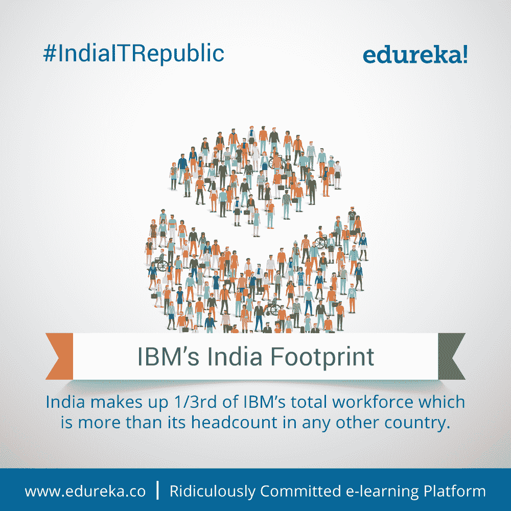
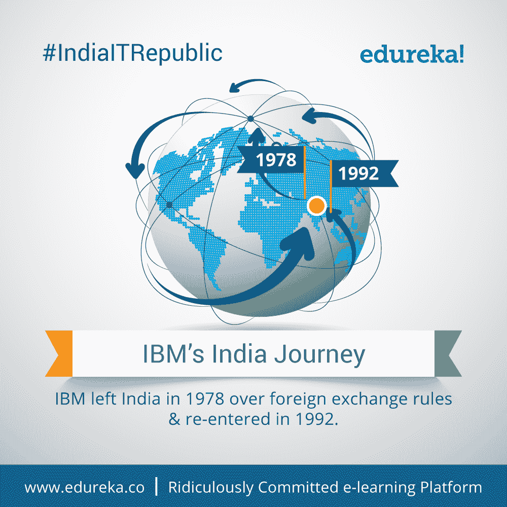
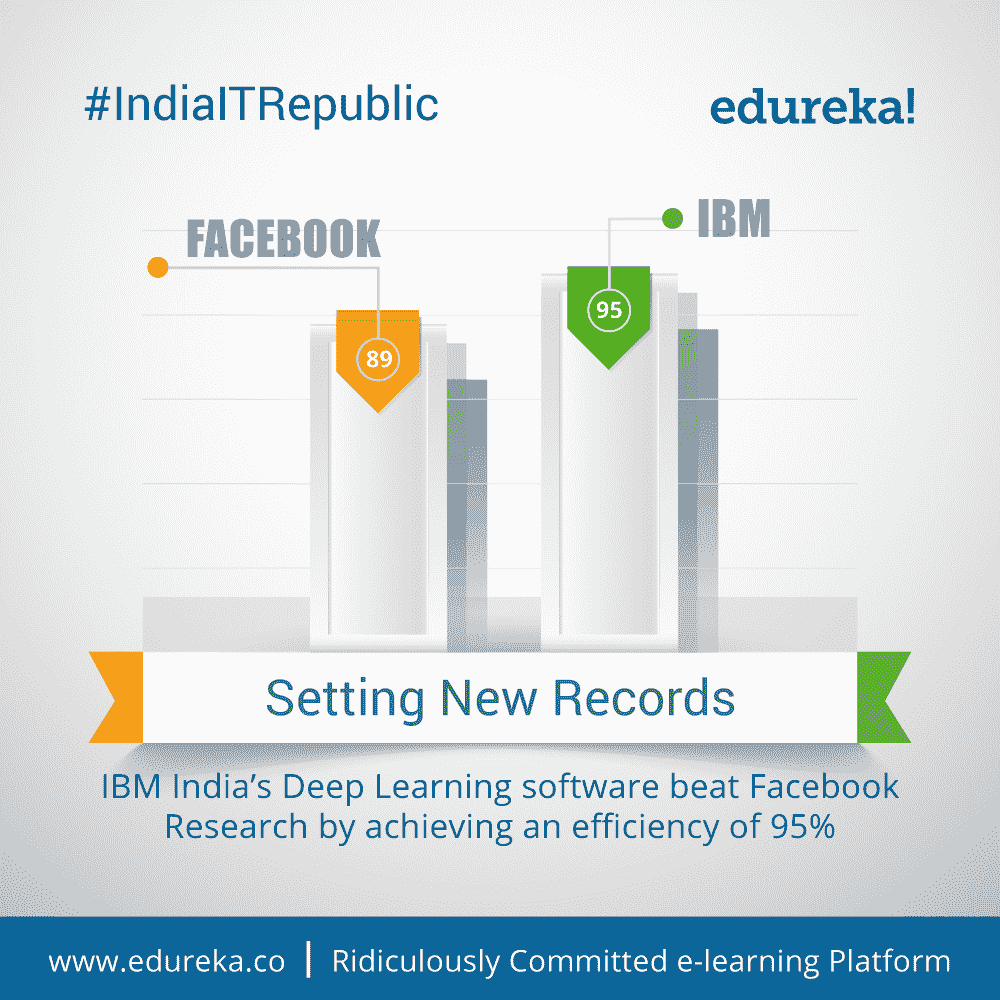
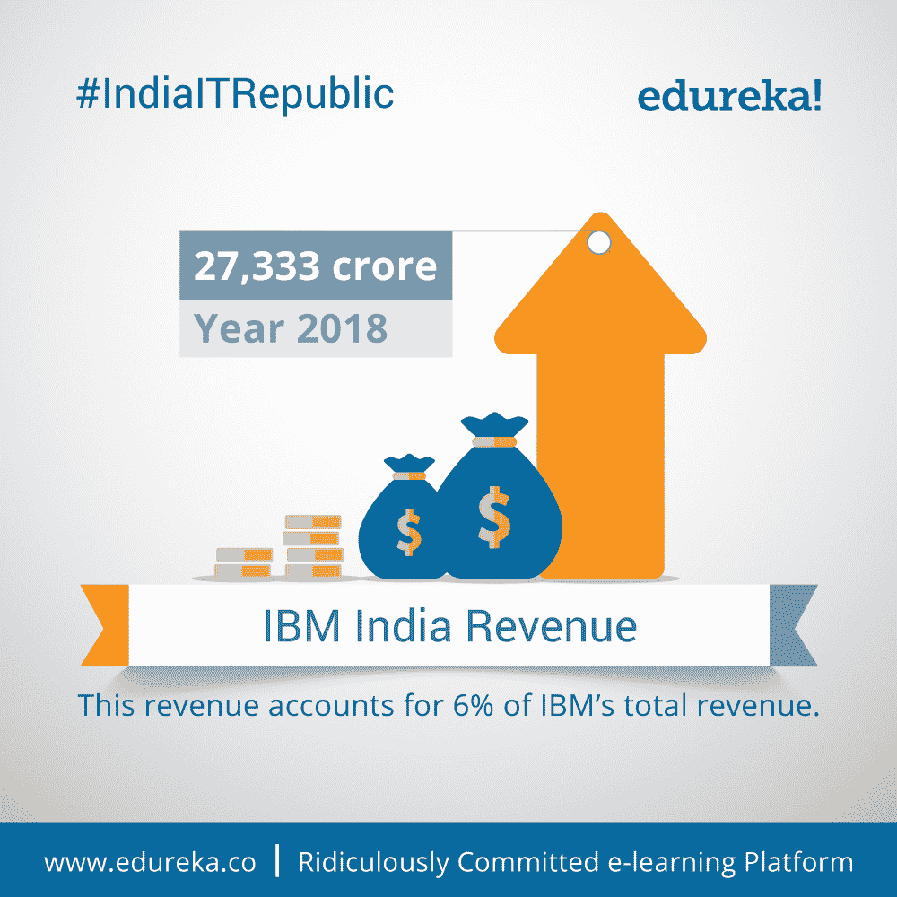
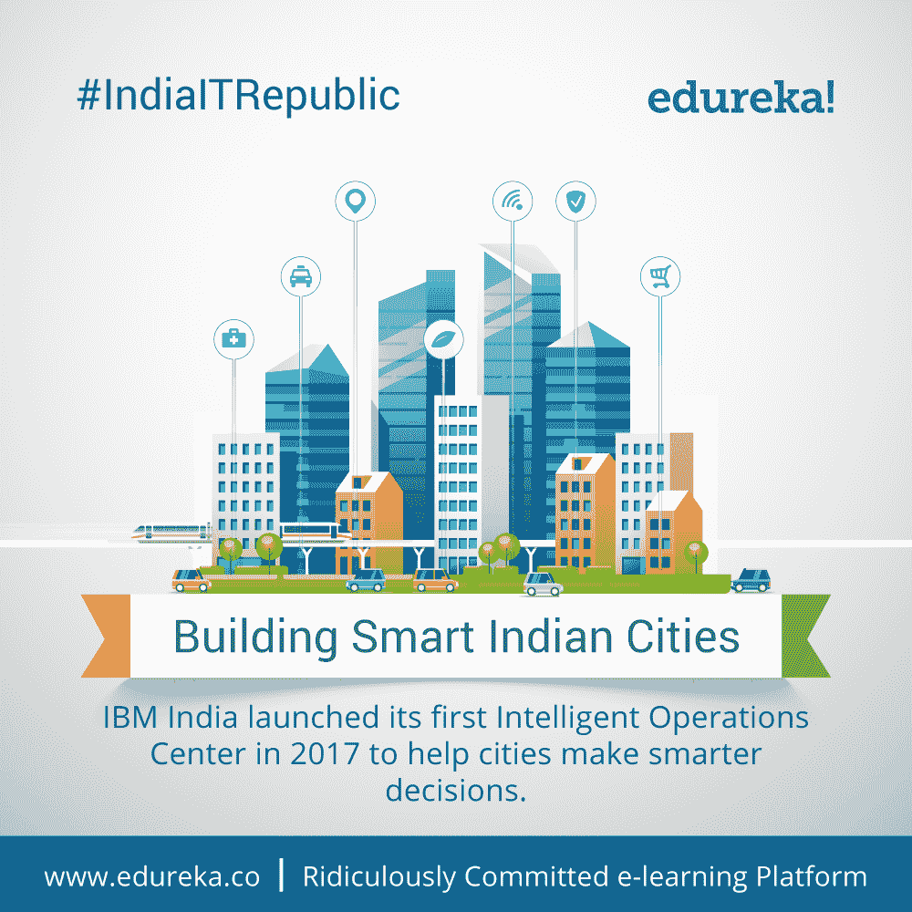
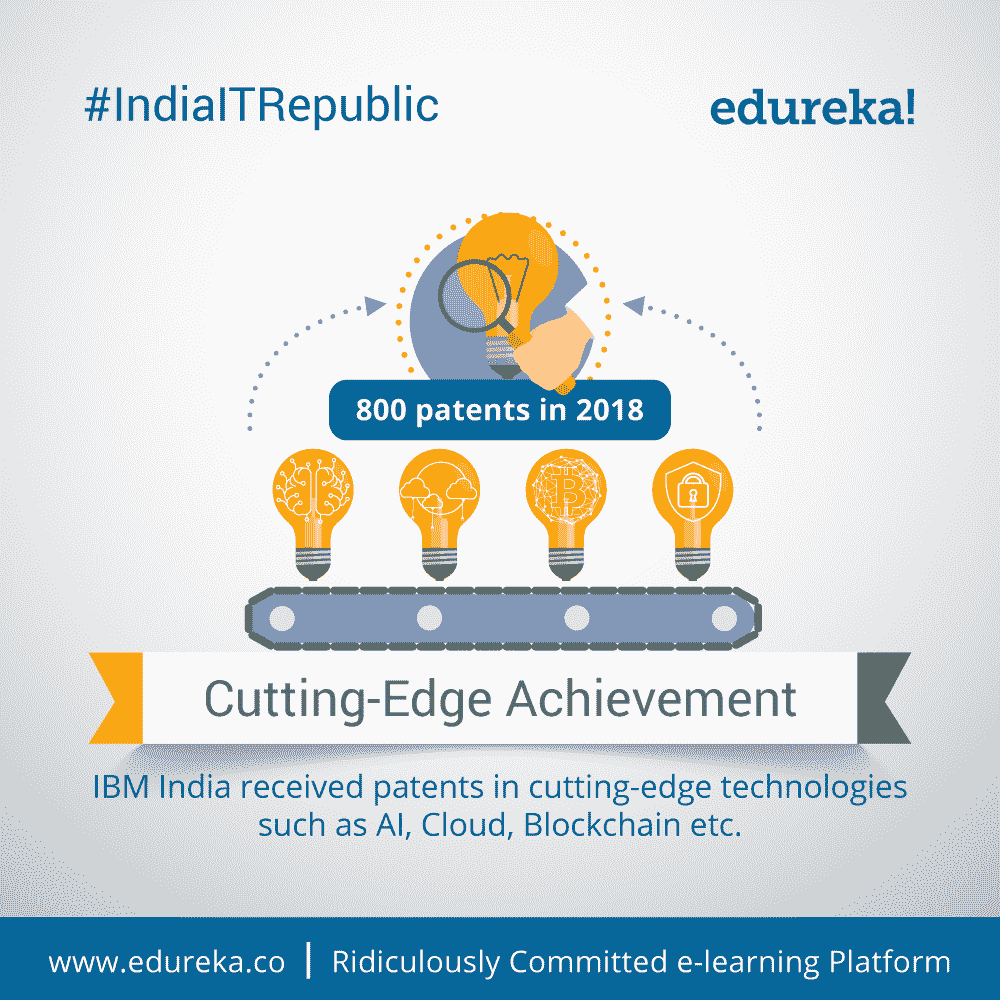
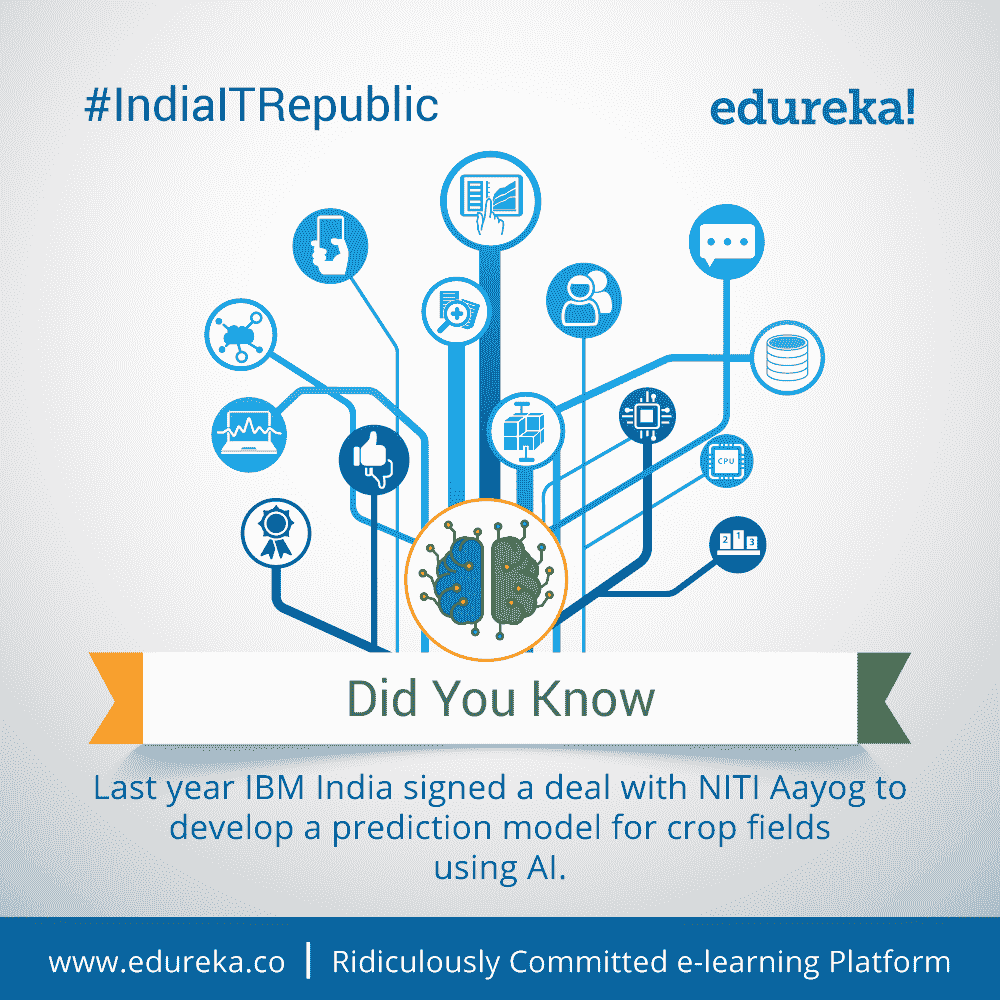
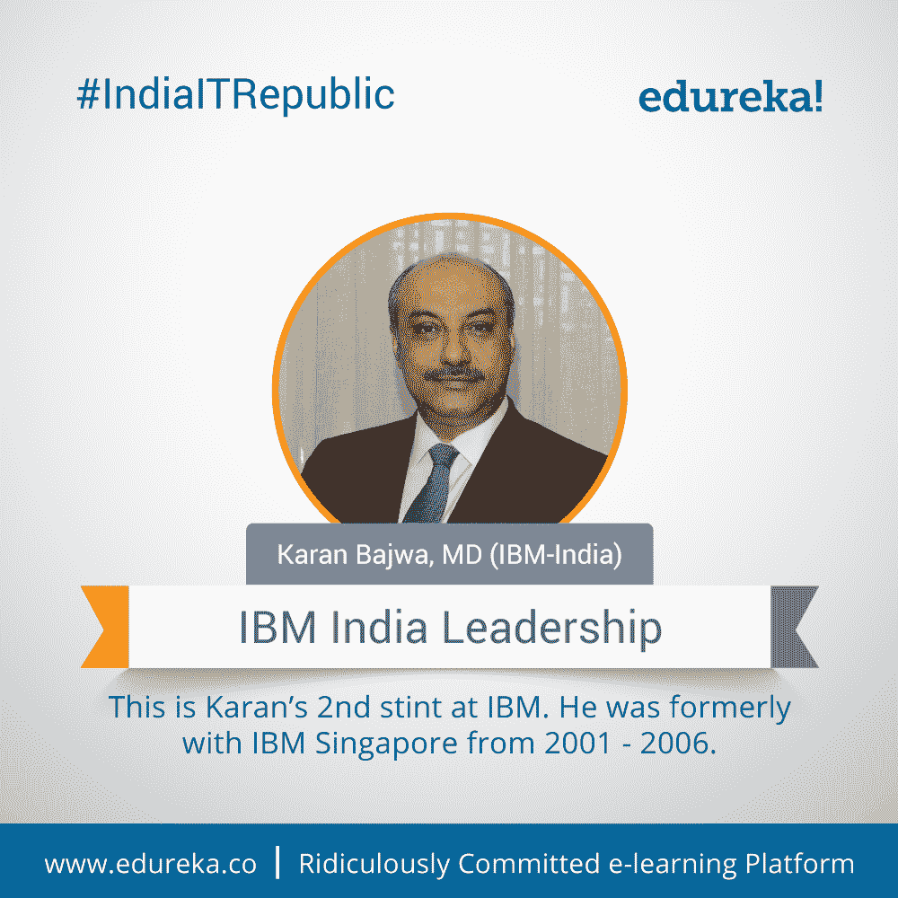
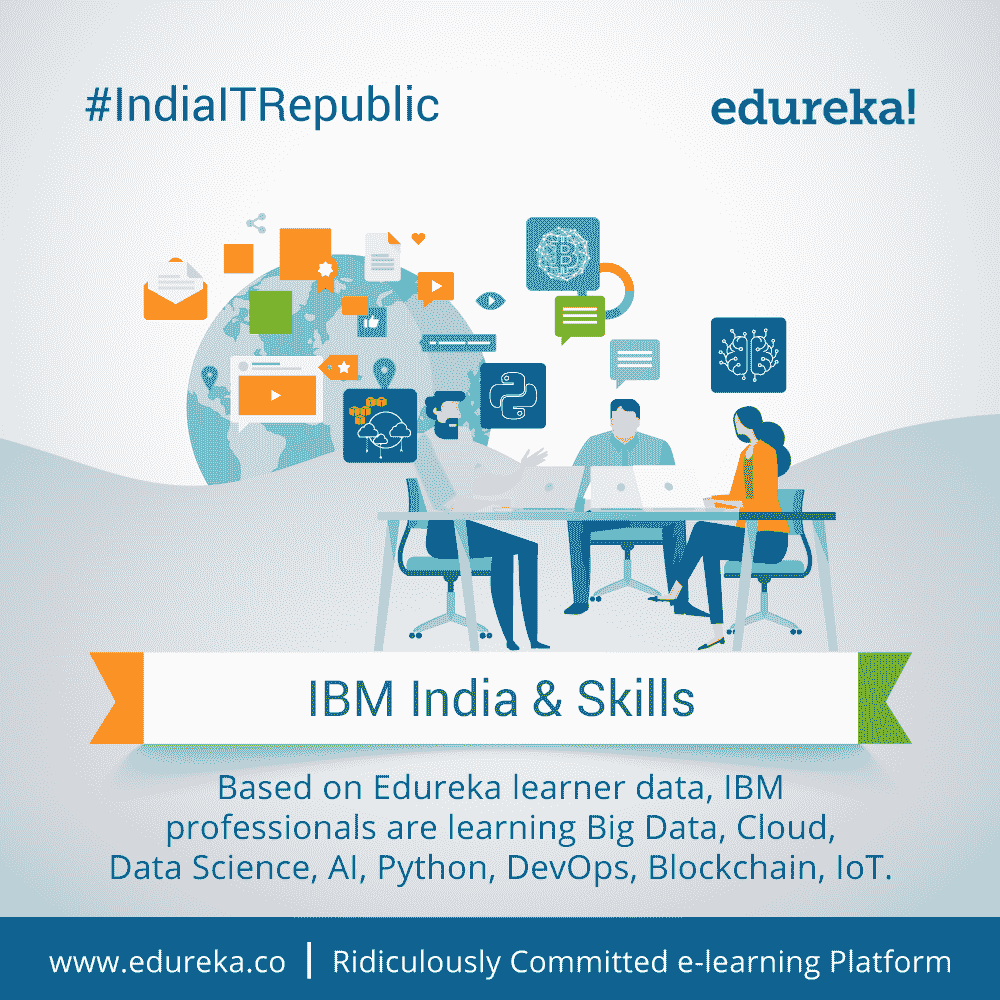
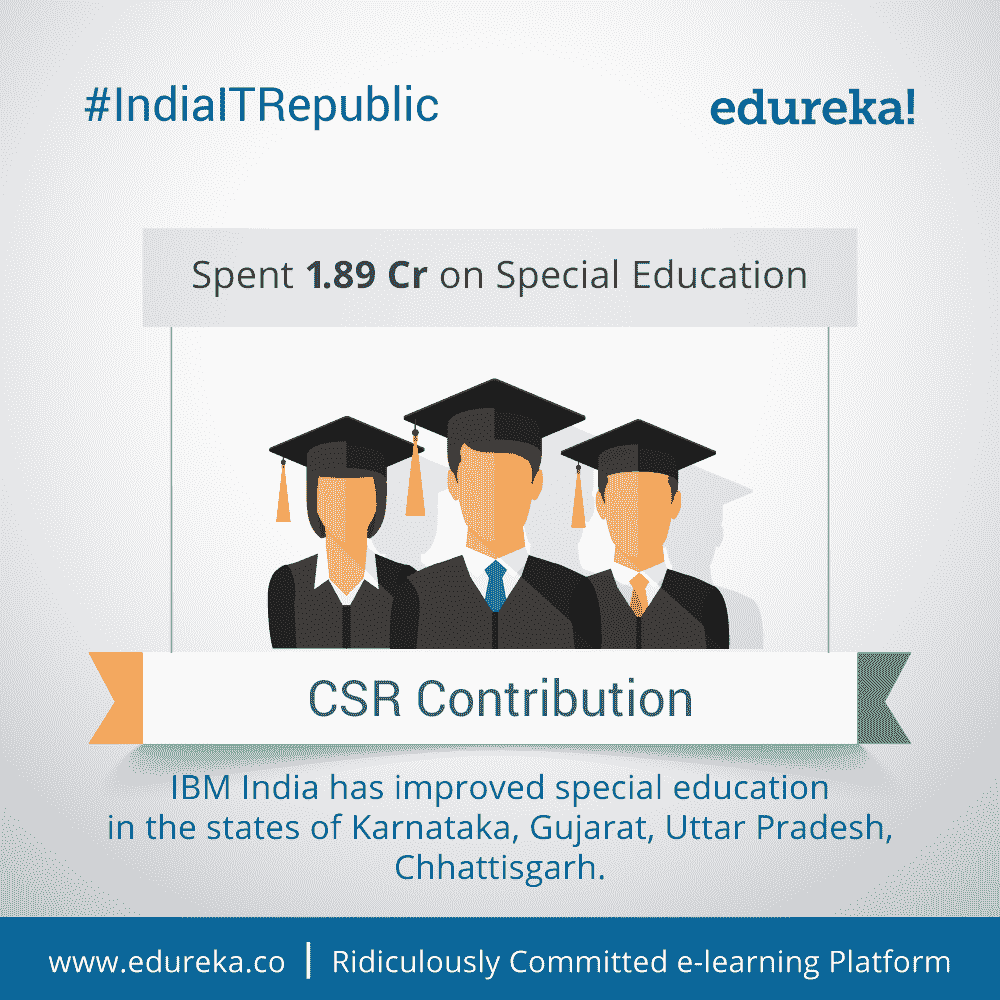

# # IndiaITRepublic–关于 IBM 的十大事实–印度

> 原文：<https://www.edureka.co/blog/india-it-republic-top-10-facts-ibm/>

## **# IndiaITRepublic–IBM 十大事实–印度**

自从印度在 1950 年 1 月 26 日成为独立共和国以来，它一直是一个快速发展和现代化的国家。印度次大陆的 IT 业受到了业内每个大公司的信任和尊重。正因为如此，一些国际 IT 公司已经把印度作为他们的运营基地。除此之外，还有其他几家诞生于印度的公司，现在已经成为国际 IT 领域举足轻重的名字。值此第 70 个共和国日之际，为了庆祝增长和卓越，Edureka 为您带来了该国领先技术巨头的 70 个独特事实。

Edureka 名单上的第一个名字是“蓝色巨人”作为科技行业最大的参与者之一，IBM 有几个并不为人所知的事实。因此，让我们深入研究一下我们为您策划的关于 IBM 的 10 大事实。

## **1。IBM 的印度足迹:**

*改变印度 IT 格局的足迹。*

## **2。IBM 的印度之旅:**

你知道这是 IBM 第二次进入印度吗？谈第二次幸运！

## **3。**设定新纪录:

*说说打人记录！IBM 印度公司甚至打败了脸书研究公司。*

## **4。IBM 印度收入:**

*IBM 印度公司在 IBM 的成长过程中功不可没。数字说明了一切！*

## **5。建设智能印度城市:**

多亏了 IBM，智能城市将很快在印度成为现实。

## **6。尖端成就:**

*IBM 印度的发明家们交付了又如何！*

## **7。你知道:**T3 吗

*应用人工智能智能农业，创造更美好的明天。*

## **8。IBM 印度领导层:**

看来第二次是卡兰和 IBM 的魅力所在。

## **9。IBM 印度&技能:**

比尔在 IBM 工作。比尔相信不断提高技能。像比尔一样。

## **10。**对社会的贡献:

*IBM 的贡献不仅限于此。他们在社区中也很活跃。*

这些是你可能不知道的关于 IBM 的十大事实。知道我们可能忽略的事实吗？请在下面的评论区联系我们，让我们知道。

充分利用 *Edureka 在教育和职业咨询领域的*专业知识。请立即与我们的课程顾问联系，以更清晰地了解您的职业道路及更多信息。**拨打:*IND:[+91-960-605-8406](tel:9606058406)*/*US:[1-833-855-5775](tel:18338555775)(免费电话)*。**

<article class="maincontentblog">

这些是关于 IBM 的十大事实，你可能知道也可能不知道。如果你有任何问题，建议或者你想让我们报道的任何特定话题，请在下面的评论区联系我们。我们明天将带着关于另一个科技巨头埃森哲的 10 个事实回来。所以，请确保您通过下面的订阅框订阅了我们的博客，千万不要错过这些重要的更新。

</article>

<article class="maincontentblog"></article>