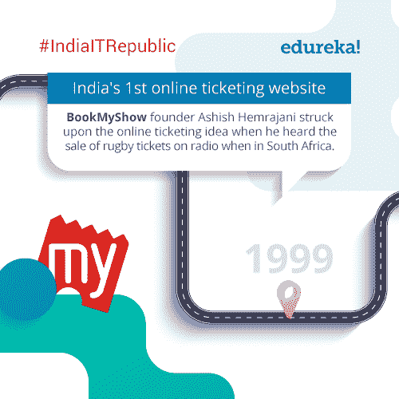
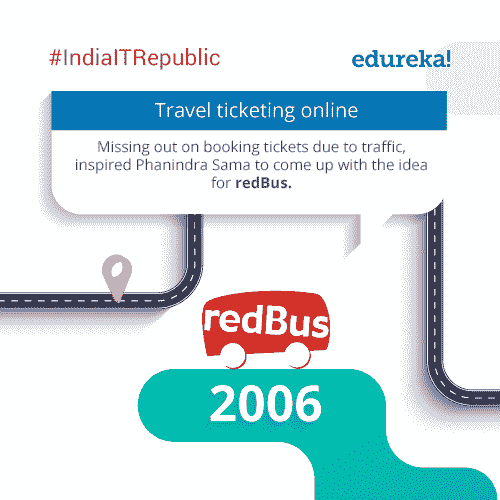
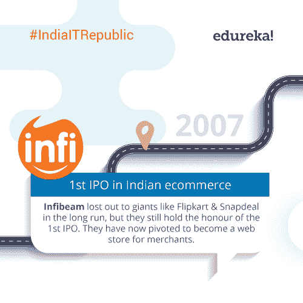
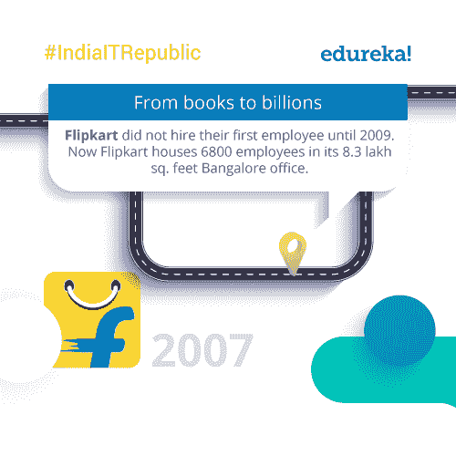
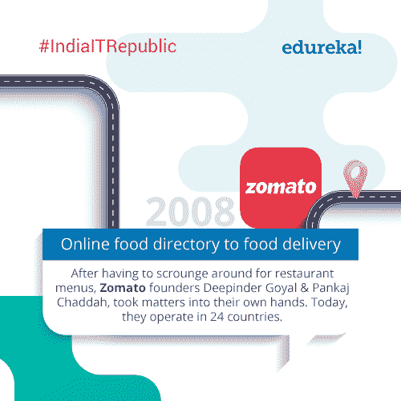
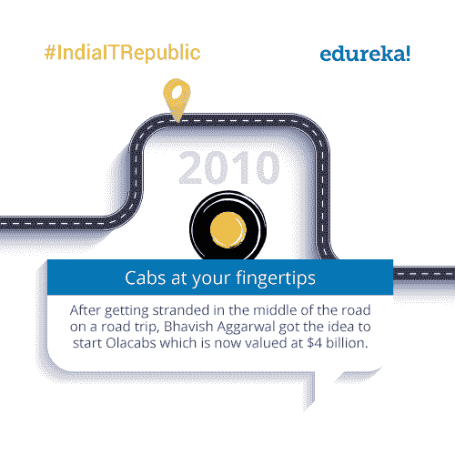
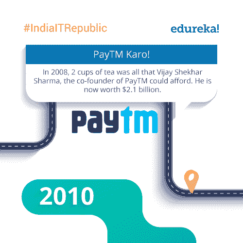
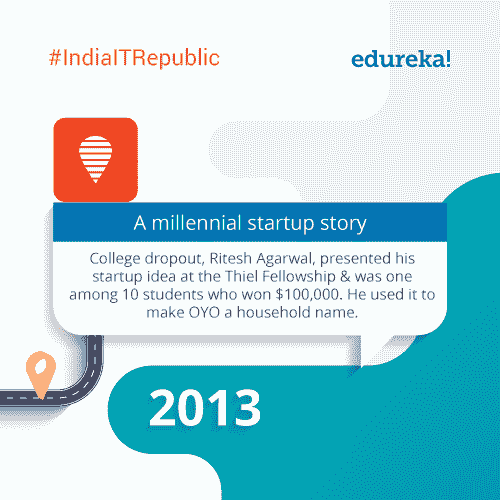

# # IndiaITRepublic–IT 初创公司的十大事实

> 原文：<https://www.edureka.co/blog/indiaitrepublic-top-10-facts-it-startups/>

## **# IndiaITRepublic–IT 创业十大事实**

印度的 IT 领域是成千上万家创业公司的所在地。这些公司不仅代表了创新，也代表了“印度梦”。每年，我们都会看到数以千计更新更大胆的创业公司涌现出来，其中许多公司实现了连成熟的跨国公司都想不到的目标。

今天的# IndiaITRepublic 集中在这些流行的，有时令人难以置信的初创公司，他们称印度的 IT 空间为家。这个博客将更像是一个时间线，突出印度 IT 领域一些最具颠覆性的初创公司，而不是一个列表。所以，不用多说，我们来看看关于印度 IT 初创公司的十大事实，您可能知道也可能不知道。

## **1996:**

**

这是印度创业浪潮开始的一年！ **Zoho** 已经崛起成为今天的全球玩家。

## **1999:**

**

下次你想要一个成功的商业点子，就坐在树下吧！

## **2000:**

**

*从没有工作到差点倒闭再到成为印度排名第一的旅游网站。 **MakeMyTrip** 确实走了很长的路。*

## **2006:**

**

*听说过流量有用吗？T2 red bus T3 创始人 Phanindra 就是这种情况。*

## **2007:**

**

*Infibeam 被称为没有放弃的创业公司。在 **BuildBazar** 的羽翼下， **Infibeam** 今天开始了它的第二次生命。*

## **2007:**

******

Flipkart 创始人走过了漫长的道路，从卖书发展成为印度最大的电子商务网站，产品一应俱全。

## **2008:**

**

食物能对你做的事真是疯狂。对食物的巨大热爱&提供最好的食物的热情是创办**佐马托**公司的创始人 Deepinder & Pankaj 所需要的。

## **2010:**

******

***奥拉**早在优步进入印度之前，就在印度的地铁中创造了一个按需出租车生态系统。他们甚至在 2014 年收购了竞争对手 **TaxiForSure** 。*

## **2010:**

******

***PayTM** 创始人维杰在创建 **One97** 即现在的 PayTM 时，曾担任多家公司的首席执行官。他这样做是为了让他的父母高兴。*

## **2013:**

**

*你知道吗， **OYO** 是印度最大的连锁酒店，而且没有一家酒店。*

这些是你可能不知道的关于印度 IT 创业公司的十大事实。知道我们可能忽略的事实吗？请在下面的评论区联系我们，让我们知道。我们知道这只是冰山一角，肯定还有数百家其他创业公司有着有趣的背景和方面，我们都可以从中获得灵感。

充分利用 *Edureka 在教育和职业咨询领域的*专业知识。请立即与我们的课程顾问联系，以更清晰地了解您的职业道路及更多信息。**拨打:*IND:[+91-960-605-8406](tel:9606058406)*/*US:[1-833-855-5775](tel:18338555775)(免费电话)*。**

<article class="maincontentblog">

这些是关于 IT 创业公司的十大事实，你可能知道也可能不知道。如果你有任何问题，建议或者你想让我们报道的任何特定话题，请在下面的评论区联系我们。我们将一如既往地带来更多内容。所以，确保你通过下面的订阅框订阅了我们的博客，千万不要错过这些重要的更新，祝大家共和国日快乐！

</article>

<article class="maincontentblog"></article>