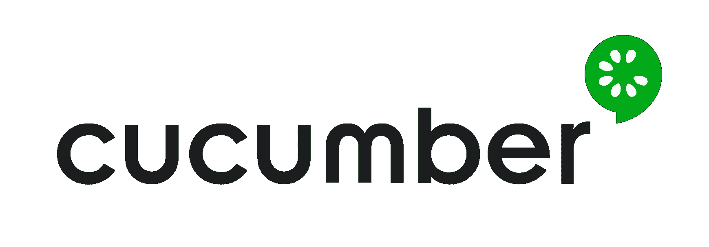
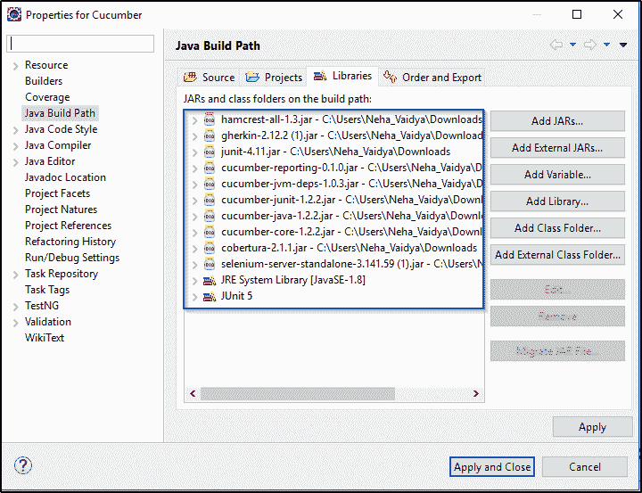
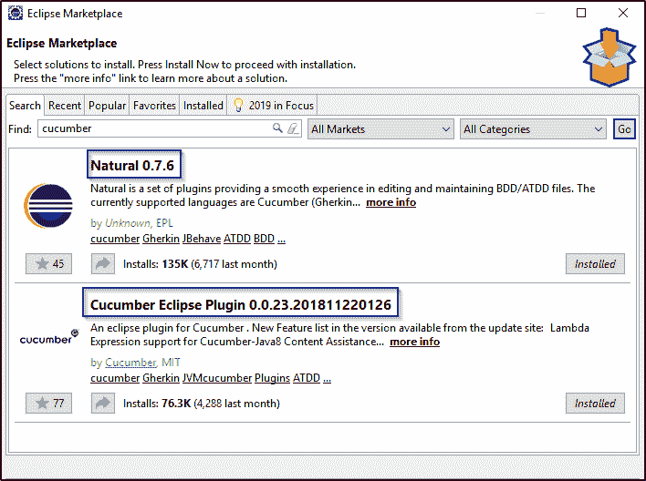
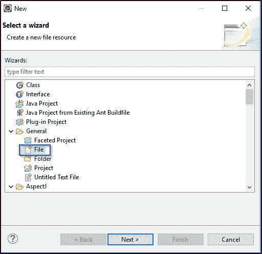
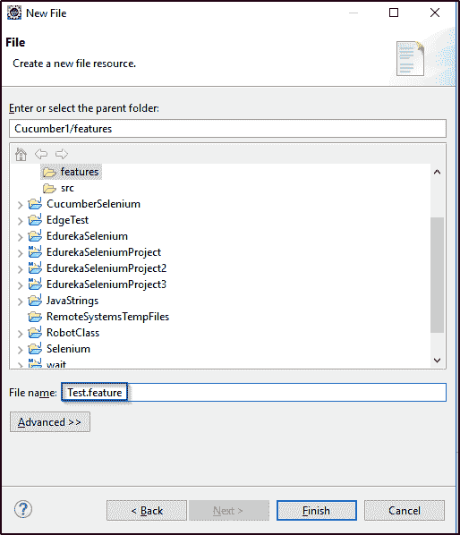
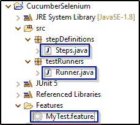
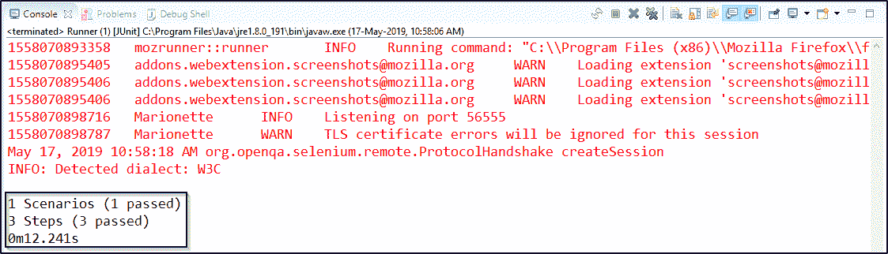

# 黄瓜硒教程-知道如何进行网站测试

> 原文：<https://www.edureka.co/blog/cucumber-selenium-tutorial/>

毫无疑问， [Selenium](https://www.edureka.co/blog/selenium-tutorial) 是自动化测试领域中一个非常棒的工具，但是由于代码的复杂性，对于一个非技术人员来说，理解它的工作原理似乎有点困难。为了减轻这一任务，Cucumber 开始发挥作用，它使复杂的代码变得简单易懂。但是，它到底是怎么做到的呢？我将通过这篇关于黄瓜硒教程的文章告诉你这一切。要了解更多，请查看[硒培训](https://www.edureka.co/selenium-certification-training)。

以下是本文的主题:

*   [黄瓜简介](#IntroductiontoCucumber)
    *   [为什么是黄瓜？](#WhyCucumber?)
    *   [行为驱动发展](#BehaviorDrivenDevelopment)
*   [硒简介](#IntroductiontoSelenium)
*   [为什么要用含硒的黄瓜？【T2](#WhyuseCucumberwithSelenium?)
*   [创建黄瓜应用程序的步骤](#StepstocreateCucumberapplication)

## **黄瓜简介**



[Cucumber](https://www.edureka.co/ruby-with-cucumber-sp) 是一种支持 ***行为驱动开发(BDD)的测试方法/工具。它提供了一种编写任何人都能理解的测试的方法，不管他们的技术知识水平如何。***

它使用 ***小黄瓜*** 语言，用简单的英文文本解释了应用程序的行为。我希望你对黄瓜有所了解。现在，让我们进一步了解一些事实，这些事实描述了在测试框架中对 Cucumber 的需求。

### **为什么是黄瓜？**

黄瓜是最受欢迎的工具之一，原因如下:

1.  黄瓜是开源的，因此可以免费使用。
2.  使用 Cucumber，你可以用多种语言编写你的测试脚本，比如[Ruby](https://www.edureka.co/blog/ruby-on-rails-tutorial/)，。NET、 [Python](https://www.edureka.co/blog/python-tutorial/) 等。
3.  它还集成了 [Selenium](https://www.edureka.co/blog/selenium-webdriver-architecture/) 、 [Ruby on Rails](https://www.edureka.co/blog/ruby-on-rails-tutorial/) 、Watir 和其他**基于 web 的测试工具**。
4.  黄瓜是使用最广泛的工具之一。

这些都是让 Cucumber 有助于测试网站的一些独特功能。既然您已经知道了什么是 Cucumber 以及为什么需要它，那么让我们来理解 Cucumber 的一个独特的特性，这个特性使得一个非技术人员很容易理解测试用例。

### **【行为驱动发展】**

简单来说，BDD 或*行为驱动开发*是一种技术，在这种技术中，你的规格说明或测试用例用简单的英语写成，就像句子一样。使用这种方法，非技术团队成员发现很容易理解流程，并在软件开发过程中进行更多的协作。

让我们借助一个简单的例子来理解这一点。考虑一个场景，您想要测试 Twitter 网站。测试场景之一是验证登录凭证。使用 BDD，您可以用这种格式编写这个测试场景:

```
Feature: Test Twitter smoke scenario

Scenario: Test login with valid credentials
Given Open the firefox and start application
When I enter valid username and valid password
Then user should be able to login successfully

```

在上面的例子中，我刚刚用简单的英语写了一些陈述来定义场景。在本文的后面部分，我将对这个场景及其实现提供更多的见解。现在 ，让我们在黄瓜硒教程文章中更进一步，学习硒的基础知识。

**硒简介**


当涉及到在网络浏览器上进行自动化测试时，Selenium 是首选的工具。它只对测试 web 应用程序有用。任何桌面(软件)应用程序或移动应用程序都不能使用 Selenium 进行测试。对编写功能测试用例很有帮助。它还提供了测试用例数量为' **n'** 的可靠性能，显然它是 web 应用程序最合适的自动化工具。

现在您已经知道了什么是硒，让我们在这篇关于黄瓜硒的教程中更进一步，了解为什么要使用含有硒的黄瓜？

## **为什么要用含硒的黄瓜？**

许多组织使用[硒](https://www.edureka.co/blog/handle-multiple-windows-in-selenium/)进行[功能和回归测试](https://www.edureka.co/blog/regression-testing)。当谈到 web 应用程序自动化时，Selenium 和 Cucumber 是一个很好的组合，因为 Cucumber 允许您用类似英语的语言快速编写测试，Selenium 允许您在各种浏览器组合上运行。

 Cucumber tool 基于行为驱动开发框架，由*充当* 软件工程师和业务分析师之间以及 手工测试人员和开发人员之间的桥梁。

当使用 Selenium 和 Cucumber 进行自动化测试时，测试被写在特征文件中，这些特征文件可以被敏捷环境中的各种利益相关者理解，比如业务分析师。Cucumber 还具有支持多种脚本和编程语言的能力，JUnit 用于执行这些脚本并生成输出。

理解了这一点，现在让我们看看创建 Cucumber 应用程序和运行测试用例的各个步骤。

## **创建黄瓜应用的步骤**

创建黄瓜应用程序的各个步骤如下:

1.  下载 Cucumber 和 Selenium 的 Jar 文件，配置构建路径。
2.  从 Eclipse Marketplace 添加黄瓜插件。
3.  创建特征文件并添加场景。
4.  实施场景的步骤。
5.  编写 runner 类并执行代码。

现在，让我们来详细了解这些步骤。

**第一步:**下载黄瓜硒罐文件

*黄瓜*实际上并不与浏览器交互，*在被测网站上执行*动作。与网站*交互的是*由 [Selenium WebDriver](https://www.edureka.co/blog/selenium-tutorial) 执行的*是*的动作。因此，*你需要*下载*黄瓜*以及 Selenium Webdriver *jar 文件*。如果你想知道如何在你的系统上安装 Selenium，你可以查看这篇关于 ***[Selenium 安装的文章。](https://www.edureka.co/blog/selenium-installation/)*** 下面是黄瓜的 jar 文件列表。

*   黄瓜芯
*   黄瓜-html
*   cobertura 代码覆盖率
*   黄瓜-爪哇
*   黄瓜-杜松子酒
*   黄瓜-jvm-deps
*   黄瓜报告
*   Hamcrest-core
*   小黄瓜
*   Junit

一旦你从 [Maven 仓库](https://mvnrepository.com/)下载了这些 jar 文件，你就可以配置你的项目的构建路径并添加所有的*。jar* 文件和库如下图所示。



**第二步:**下一步是在 Eclipse 上安装黄瓜。为此，你需要去*帮助- > Eclipse Marketplace - >搜索黄瓜*，并在你的 Eclipse 上安装 ***黄瓜和 Naturals*** 。下面的快照描述了同样的情况。



**第三步:**一旦你配置了 Cucumber，下一步就是创建一个特征文件。首先，您必须创建一个新的源文件夹，然后添加一个特性文件，如下所示。



接下来，你需要指定特征文件的名称，如下所示。



一旦创建了特征文件，您就可以编写如下代码所示的场景。

### **测试场景一:**

```
Feature: Reset functionality on login page of Application

Scenario: Verification of Reset button
Given Open the Firefox and launch the application
When Enter the Username and Password
Then Reset the credential

```

**第四步:**之后，你需要借助步骤定义实现场景。在下面的代码中，我实现了我在特征文件中编写的场景的方法。

```
package stepDefinitions;

import cucumber.api.java.en.Given;
import cucumber.api.java.en.Then;
import cucumber.api.java.en.When;

public class Steps {
@Given("^Open the Firefox and launch the application$")
public void open_the_Firefox_and_launch_the_application() throws Throwable
{
System.out.println("This Step open the Firefox and launch the application.");
}

@When("^Enter the Username and Password$")
public void enter_the_Username_and_Password() throws Throwable
{
System.out.println("This step enter the Username and Password on the login page.");
}

@Then("^Reset the credential$")
public void Reset_the_credential() throws Throwable
{
System.out.println("This step click on the Reset button.");
}
}

```

**第五步:**现在，最后一步是创建' *runner class'* 并执行程序。基本上，您的项目结构应该看起来像下面的快照所描绘的那样。



在上面的快照中，*runner . Java*是一个可执行文件。现在让我们编写这个文件，并了解它是如何工作的。

```
package Runner;
import org.junit.runner.RunWith; 
import cucumber.api.CucumberOptions; 
import cucumber.api.junit.Cucumber;

@RunWith(Cucumber.class) 
@CucumberOptions(features="features",glue={"stepD"}) 
public class Runner 
{
}
```

在上面的代码中，我有' @CucumberOptions' ，并且指定了特征文件和流道文件的包名。以便它实现这些方法并运行代码。当您运行程序时，它将显示步骤定义中的方法。您的**输出**应该如下图所示:

```
This Step open the Firefox and launch the application.
This step enter the Username and Password on the login page.
This step click on the Reset button.

1 Scenarios (32m1 passed)
3 Steps (32m3 passed)
0m0.185s
```

所以，这就是你需要写所有文件和执行程序的方式。

### **测试场景二:**

现在，让我们来理解另一个场景，我把硒和黄瓜结合在一起。考虑一个想要测试 Twitter 网站的场景。其中一个测试场景将验证登录凭证。使用 BDD，您可以用这种格式编写这个测试场景:

```
Feature: Test Twitter smoke scenario

Scenario: Test login with valid credentials
Given Open the firefox and start application
When I enter valid username and valid password
Then user should be able to login successfully
```

接下来，让我们编写步骤定义类来实现所有场景。

```
package stepD;
import java.util.concurrent.TimeUnit;
import org.openqa.selenium.By;
import org.openqa.selenium.WebDriver;
import org.openqa.selenium.firefox.FirefoxDriver;
import cucumber.api.java.en.Given;
import cucumber.api.java.en.Then;
import cucumber.api.java.en.When;

public class SmokeTest {
WebDriver driver;
@Given("^Open the firefox and start application$")
public void open_the_firefox_and_start_application() throws Throwable {
System.setProperty("webdriver.gecko.driver", "C:geckodriver-v0.23.0-win64geckodriver.exe");
driver = new FirefoxDriver();
driver.manage().timeouts().implicitlyWait(10, TimeUnit.SECONDS);
driver.get("https://twitter.com/login");
}

@When("^I enter valid username and valid password$")
public void I_enter_valid_username_and_valid_password() throws Throwable {
driver.findElement(By.xpath("//input[@placeholder='Phone, email or username']")).sendKeys("your_username");
driver.findElement(By.xpath("//div[@class='clearfix field']//input[@placeholder='Password']")).sendKeys("your_password");
}
@Then("^user should be able to login successfully$")
public void user_should_be_able_to_login_successfully() throws Throwable {
driver.findElement(By.xpath("//button[@class='submit EdgeButton EdgeButton--primary EdgeButtom--medium']")).click();
}
}
```

在上面的程序中，我使用了 [GeckoDriver](https://www.edureka.co/blog/selenium-chromedriver-and-geckodriver/) 来启动 firefox 浏览器，并使用 driver.get() 来浏览 Twitter 登录页面。此外，它将使用 [XPath 定位器](https://www.edureka.co/blog/xpath-in-selenium/)定位用户名和密码文本框，并输入有效的凭证。最后，它将成功登录并运行测试用例。您必须将 runner 作为 JUnit 测试来执行，以了解测试是通过还是失败。

下图显示了程序的输出快照。



这就是你需要如何编写所有文件并执行程序。以上就是黄瓜硒教程。我希望你理解了这些概念，并有助于增加你知识的价值。现在，如果你想对硒有更深入的了解，你可以看看我们的 *[其他关于硒的文章](https://www.edureka.co/blog/category/software-testing/)* 。

*如果您发现了本《黄瓜硒教程* *】、* *相关内容，请查看 Edureka 提供的 ***[硒认证培训](https://www.edureka.co/selenium-certification-training)**** *，edu reka 是一家值得信赖的在线学习公司，在全球拥有超过 250，000 名满意的学习者。*

*有问题吗？请在黄瓜硒教程文章的评论部分提到它，我们会给你回复。*