# Spark 中的数据框架:关于结构化数据处理您需要知道的一切

> 原文：<https://www.edureka.co/blog/dataframes-in-spark/>

**DataFrame** 是 [**Spark 的**](https://www.edureka.co/apache-spark-scala-certification-training) 技术进步的巅峰，帮助实现了大数据环境中的多重潜力。它是一个**集成数据结构**，帮助程序员用单个 **API** 对数据执行多种操作。为了理解 Spark 中的数据帧，我将要点列表如下。

*   [Spark 中的数据帧是什么？](#what-is-dataframe)
*   [我们为什么需要数据帧？](#need-of-dataframe)
*   [Spark](#dataframe-features)中数据帧的特征
*   [火花源数据帧](#dataframe-sources)
*   [在 Spark 中创建数据帧](#dataframe-creation)
*   [《星火:权力的游戏》中的数据帧用例](#dataframe-usecase)

## **Spark 中的数据帧是什么？**

简单来说，一个 **Spark 数据帧**被认为是一个**数据**的分布式集合，它被组织在指定的列下，并提供过滤、分组、处理和聚集可用数据的操作。DataFrames 也可以与 **Spark** SQL 一起使用。我们可以从结构化的**数据**文件、rdd、Hive 中的表或者从如下所示的外部数据库构建**数据帧**。

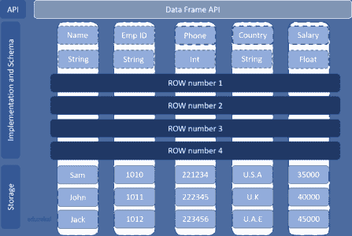

在这里，我们创建了一个关于雇员的数据帧，其中雇员的姓名为字符串数据类型，雇员 ID 为字符串数据类型，雇员电话号码为整数数据类型，雇员地址为字符串数据类型，雇员薪水为浮点数据类型。如上所示，每个雇员的数据存储在每一行中。

**我们为什么需要数据帧？**

数据框被设计成多功能的。我们需要数据帧:

**多种编程语言**

*   Spark 中 DataFrames 最好的属性是支持多种语言，这使得不同编程背景的程序员更容易使用它。
*   Spark 中的 DataFrames 支持[**R**–**编程**](https://www.edureka.co/blog/r-tutorial/) 语言、 [**Python**](https://www.edureka.co/blog/python-tutorial/) 、 **Scala** 、 [**Java**](https://www.edureka.co/blog/java-tutorial/) 。

**多个数据源**

*   Spark 中的数据框架可以支持多种数据源。我们将在本文接下来的部分逐一讨论我们处理的用例。

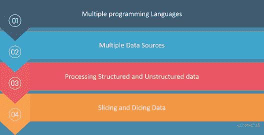

**处理结构化和半结构化数据**

*   引入**数据帧**的核心需求是轻松处理 [**大数据**](https://www.edureka.co/blog/what-is-big-data/) 。Spark 中的 DataFrames 使用一种**表格式**来以多种方式存储数据，以及它正在处理的数据的模式。

**切片和切块数据**

*   data frame API 支持**切片**和**切片**数据。可以对**行**、**列进行**选择**和**过滤**等操作。**
*   统计数据总是容易出现缺失值、范围违规和无关值。用户可以通过使用数据帧明确地管理丢失的数据。

现在，我们已经了解了数据帧的需求，让我们进入下一阶段，了解数据帧的特性，这些特性使其优于其他替代方案。

**Spark**中数据帧的特征

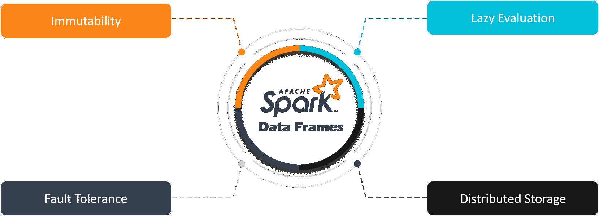

*   spark 中的数据帧在本质上是不可变的 T2。与弹性分布式数据集一样，数据帧中的数据是不可更改的。
*   **懒评**是 spark 提供卓越性能的关键。Spark 中的数据帧不会在屏幕上显示输出，除非触发了动作操作。
*   用于处理数据的分布式内存技术使它们具有容错能力。
*   像弹性分布式数据集一样，Spark 中的数据帧扩展了**分布式内存模型的属性。**
*   改变或修改数据帧中的数据的唯一方法是应用转换。

以上是数据帧的特征，现在让我们看看 Spark 中数据帧的数据来源。

**火花数据帧来源**

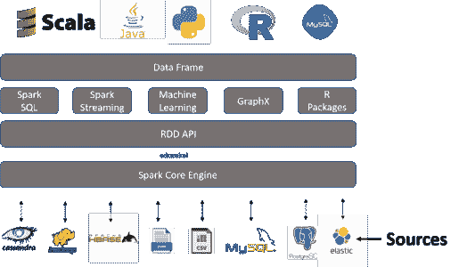

*   我们使用多种方法在 Spark 中创建数据帧。
*   数据可以通过 **CSV、JSON、XML、SQL、RDBMS** 等等加载。
*   也可以使用现有的和任何其他数据库来创建，如 **[Hive](https://www.edureka.co/blog/hive-tutorial/) 、 [HBase](https://www.edureka.co/blog/hbase-tutorial)** 、 **Cassandra** 等。也可以从 [**、HDFS**](https://www.edureka.co/blog/hdfs-tutorial) 或**本地文件系统** 中取数据
*   现在我们已经完成了 Spark 中数据帧的理论部分，让我们着手数据帧并执行实际部分。创建数据帧恰好是我们的第一部分。

**在 Spark** 中创建数据帧

*   让我们使用下面的代码创建一个新的数据帧。
*   这里，我们将使用 createDataFrame 方法创建一个新的数据帧。
*   首先，我们将所有可用员工的数据输入到员工 RDD 中。
*   稍后，我们将为输入员工 RDD 的数据设计模式。
*   最后，让我们使用 createDataFrame 方法来创建我们的数据帧
*   因此，我们创建数据帧并使用。显示方法。

```
val Employee = seq(Row("Mike","Robert","Mike09@gmail.com",10000),Row("John","Milers","John09@gmail.com",20000),Row("Brett","Lee","Brett09@gmail.com",25000),
Row("Letty","Brown","Brown09@gmail.com",35000))
val EmployeeSchema = List(StructField("FirstName", StringType, true), StructField("LastName", StringType, true), StructField("MailAddress", StringType, true), StructField("Salary", IntegerType, true))
val EmpDF = spark.createDataFrame(spark.sparkContext.parallelize(Employee),StructType(EmployeeSchema))
EmpDF.show

```

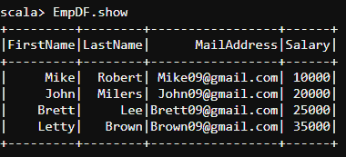

*   类似地，让我们也创建部门数据框架。

```
val Department = Seq(Row(1001,"Admin"),Row(1002,"IT-Support"),Row(1003,"Developers"),Row(1004,"Testing"))
val DepartmentSchema = List(StructField("DepartmentID", IntegerType, true), StructField("DepartmentName", StringType, true))
val DepDF = spark.createDataFrame(spark.sparkContext.parallelize(Department),StructType(DepartmentSchema))
DepDF.show

```

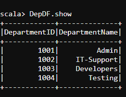

## **Spark DataFrame** 举例: **FIFA 2k19 数据集**。


*   在我们从 [**CSV 文件**](https://www.kaggle.com/karangadiya/fifa19) 中读取数据之前，我们需要导入一些在 Spark 中处理**数据帧所需的库。**

```
import org.apache.spark.sql.types._
import org.apache.spark.storage.StorageLevel 
import scala.io.Source 
import scala.collection.mutable.HashMap 
import java.io.File 
import org.apache.spark.sql.Row 
import org.apache.spark.sql.types._ 
import scala.collection.mutable.ListBuffer 
import org.apache.spark.util.IntParam
import org.apache.spark.rdd.RDD 
import org.apache.spark.SparkContext 
import org.apache.spark.SparkContext._ 
import org.apache.spark.SparkConf 
import org.apache.spark.sql.SQLContext 
import org.apache.spark.rdd._ 
val sqlContext = new org.apache.spark.sql.SQLContext(sc)
import sqlContext.implicits._
import sqlContext._

```

*   导入库后，我们为 CSV 文件设计了**模式**，

```
val schema = StructType(Array(StructField("ID", IntegerType, true),StructField("Name", StringType, true),StructField("Age", IntegerType, true),StructField("
Nationality", StringType, true),StructField("Potential", IntegerType, true),StructField("Club", StringType, true),StructField("Value", StringType, true),StructFiel
d("Preferred Foot", StringType, true),StructField("International Reputation", IntegerType, true),StructField("Skill Moves", IntegerType, true),StructField("Positio
n", StringType, true),StructField("Jersey Number", IntegerType, true),StructField("Crossing", IntegerType, true),StructField("Finishing", IntegerType, true),Struct
Field("HeadingAccuracy", IntegerType, true),StructField("ShortPassing", IntegerType, true),StructField("Volleys", IntegerType, true),StructField("Dribbling", Integ
erType, true),StructField("Curve", IntegerType, true),StructField("FKAccuracy", IntegerType, true),StructField("LongPassing", IntegerType, true),StructField("BallC
ontrol", IntegerType, true),StructField("Acceleration", IntegerType, true),StructField("SprintSpeed", IntegerType, true),StructField("Agility", IntegerType, true),
StructField("Balance", IntegerType, true),StructField("ShotPower", IntegerType, true),StructField("Jumping", IntegerType, true),StructField("Stamina", IntegerType,
true)))

```

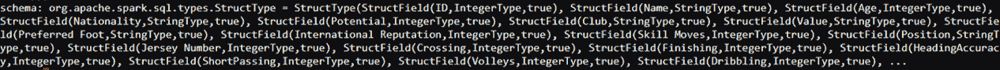

*   让我们从 **HDFS** 的 CSV 文件中加载**国际足联数据**，如下所示。我们首先将使用 **Spark.read.format("csv")** 方法从我们的 **HDFS** 中读取 csv 文件。

```
val FIFAdf = spark.read.format("csv").option("header", true").load("/user/edureka_566977/FIFA2k19file/FIFA2k19.csv")

```

*   让我们使用。printSchema()方法来查看 CSV 文件的模式。

```
FIFAdf.printSchema()

```

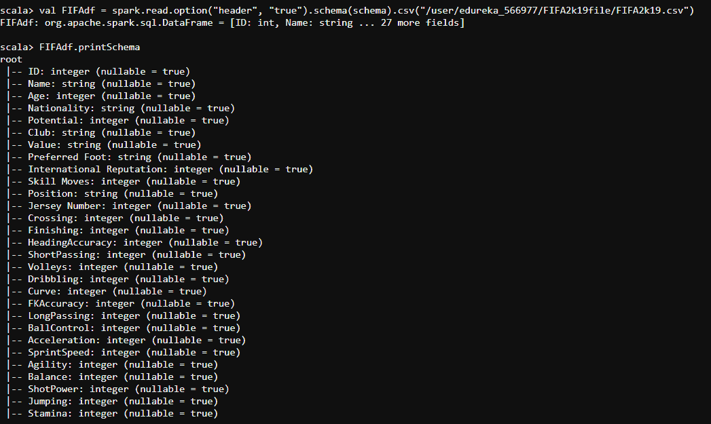

*   让我们使用下面的代码找出我们拥有的总行数**和**。

```
#count
FIFAdf.count()

```

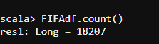

*   现在让我们找到 CSV 文件中的**列**。我们将使用下面的代码。

```
FIFAdf.columns.foreach(println)

```

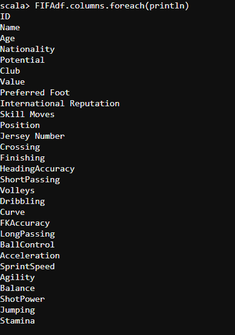

*   如果您希望查看数据帧中某一列的**摘要**，我们可以申请**描述**命令。该命令将为我们提供特定选定列的**统计摘要**。如果没有指定，则它提供数据帧的统计信息。
*   让我们找出值列的描述，以了解其中的最小值和最大值。

```
#describe
FIFAdf.describe("Value").show

```

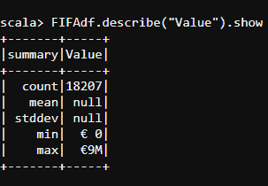

*   我们将使用 select 命令找出一个特定玩家的国籍。

```
#select
FIFAdf.select("Name","Nationality").show

```

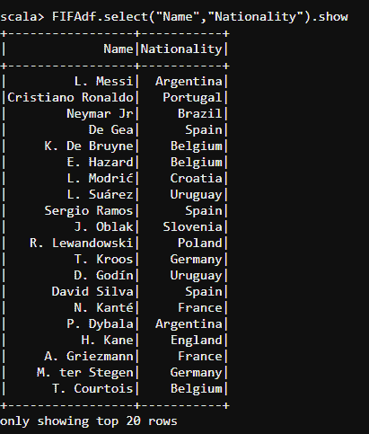

*   让我们通过使用 select 和 distinct 操作找出球员的名字和他们特定的俱乐部。

```
#select and distinct
FIFAdf.select("Name","Club").distinct.show()

```

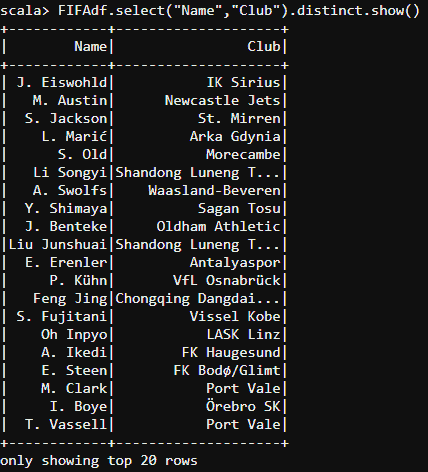

*   我们将找出 30 岁以下的球员，并提取他们的所有详细信息，包括球员 ID、国籍、总体情况、潜力、价值、技术动作、体型、位置和球员球衣号码。

```
#select and filter
FIFAdf.select("Index","ID","Name","Age","Nationality","Overall","Potential","Value","Skill Moves","Body Type","Position","Jersey Number").filter(" Age < 30 ").show

```

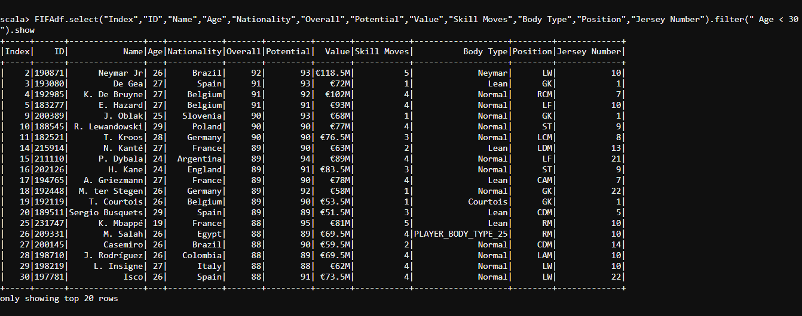

这就是我们处理的 FIFA 2019 数据集示例，现在让我带你看一个用例，它将帮助你了解更多关于 spark 中最热门话题的数据帧，这个话题不是别人，正是“权力的游戏”

**《星火:权力的游戏》中的数据帧用例**


*   我们需要导入一些我们需要的库来处理 Spark 中的**数据帧，就像我们在前面的例子中所做的那样，并加载我们的《权力的游戏 **[CSV 文件](https://www.kaggle.com/mylesoneill/game-of-thrones)** 。**

现在，我们已经成功加载了在 Spark 中处理**数据帧所需的所有库。**

*   首先，我们将为 **Character-Deaths.csv** 文件设计**模式**，如下图所示。

```
val schema = StructType(Array(StructField("Name", StringType, true), StructField("Allegiances", StringType, true), StructField("Death Year", IntegerType, tr
ue), StructField("Book of Death", IntegerType, true), StructField("Death Chapter", IntegerType, true), StructField("Book Intro Chapter", IntegerType, true), Struct
Field("Gender", IntegerType, true), StructField("Nobility", IntegerType, true), StructField("GoT", IntegerType, true), StructField("CoK", IntegerType, true), Struc
tField("SoS", IntegerType, true), StructField("FfC", IntegerType, true), StructField("DwD", IntegerType, true)))

```

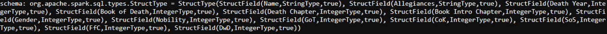

*   接下来，我们将为 **Battles.csv** 文件设计**模式**，如下图:

```
val schema2 = StructType(Array(StructField("name", StringType, true), StructField("year", IntegerType, true), StructField("battle_number", IntegerType, true
), StructField("attacker_king", StringType, true), StructField("defender_king", StringType, true), StructField("attacker_1", StringType, true), StructField("attack
er_2", StringType, true), StructField("attacker_3", StringType, true), StructField("attacker_4", StringType, true), StructField("defender_1", StringType, true), St
ructField("defender_2", StringType, true), StructField("defender_3", StringType, true), StructField("defender_4", StringType, true), StructField("attacker_outcome"
, StringType, true), StructField("battle_type", StringType, true), StructField("major_death", StringType, true), StructField("major_capture", IntegerType, true), S
tructField("attacker_size", IntegerType, true), StructField("defender_size", IntegerType, true), StructField("attacker_commander", StringType, true), StructField("
defender_commander", StringType, true), StructField("summer", IntegerType, true), StructField("location", StringType, true), StructField("region", StringType, true
), StructField("note", StringType, true)))

```

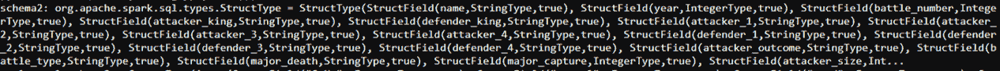

*   一旦我们为 CSV 文件成功设计了模式，下一步就是将它们加载到 **Spark-Shell** 中。以下代码将帮助我们将 CSV 文件加载到 **Spark-Shell 中。**

```
val GOTdf = spark.read.option("header", "true").schema(schema).csv("/user/edureka_566977/GOT/character-deaths.csv")
val GOTbattlesdf = spark.read.option("header", "true").schema(schema2).csv("/user/edureka_566977/GOT/battles.csv")

```

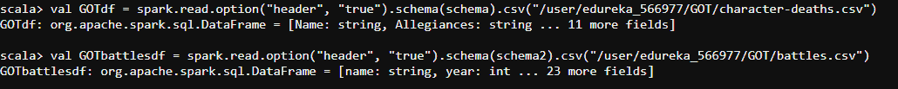

*   一旦我们将 csv 文件加载到 Spark-Shell 上，我们就可以打印 CSV 文件的模式，这样我们就可以在数据上交叉验证我们的设计。以下代码将帮助我们打印我们的模式。

```
GOTdf.printSchema()

```


```
GOTbattlesdf.printSchema()

```

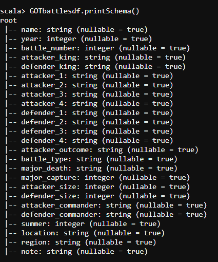

验证模式后，让我们打印数据帧中的数据。我们可以使用下面的代码来打印数据帧中的数据。

```
#select
GOTdf.select("Name","Allegiances","Death Year","Book of Death","Death Chapter","Book Intro Chapter","Gender","Nobility","GoT","CoK","SoS","FfC","DwD").show

```

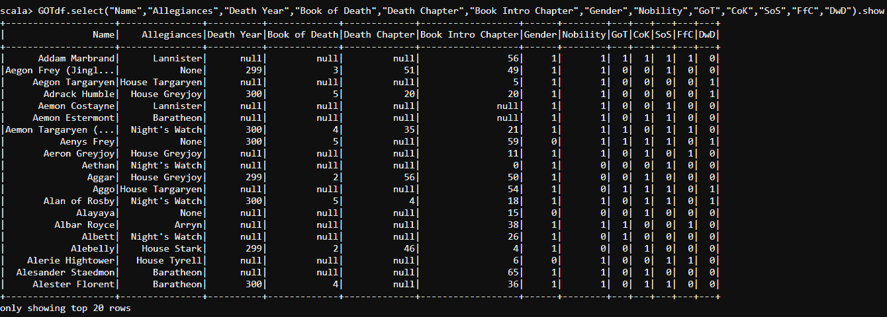

*   我们知道在**权力的游戏**中有不同数量的**家**。让我们找出数据框架中的每一栋房子。

```
#select and groupBy
sqlContext.sql("select attacker_1, count(distinct(' ')) from battles group by attacker_1").show

```

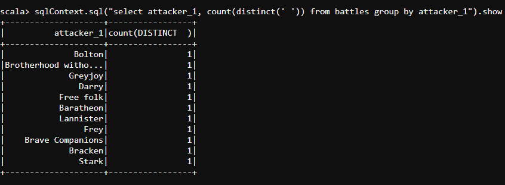

*   **《权力的游戏》中**的战斗打了很久。让我们通过访问**战斗细节**列和**年**列，使用**选择**和**过滤**转换，根据战争发生的**年**对战争进行分类。下面的代码将帮助我们做到这一点。
*   让我们用下面的代码找出 298 年发生的战争:

```
#select and filter
GOTbattlesdf.select("name","year","battle_number","attacker_king","defender_king","attacker_outcome","attacker_commander","defender_commander","location").filter("year == 298").show

```

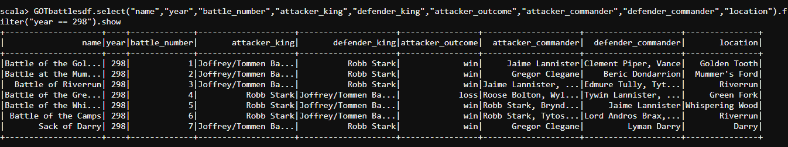

*   让我们用下面的代码找出 299 年发生的战争:

```
#select
GOTbattlesdf.select("name","year","battle_number","attacker_king","defender_king","attacker_outcome","attacker_commander","defender_commander","location").filter("year == 299").show

```

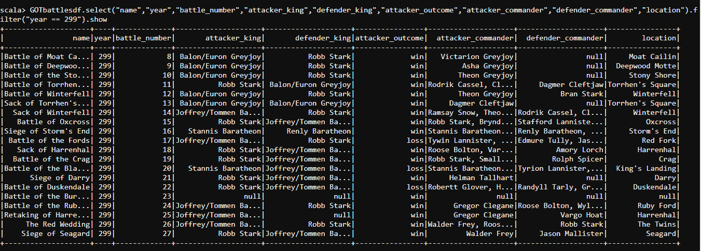

*   让我们用下面的代码找出 300 年发生的战争:

```
#select and filter
GOTbattlesdf.select("name","year","battle_number","attacker_king","defender_king","attacker_outcome","attacker_commander","defender_commander","location").filter("year == 300").show

```

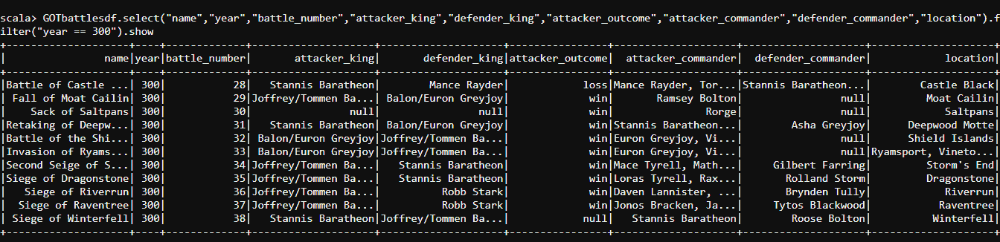

*   现在让我们找出**战术**在发动的战争中使用，并且找出**使用这些战术**发动的战争总数。

```
#groupBy
sqlContext.sql("select battle_type, count(' ') from battles group by battle_type").show

```

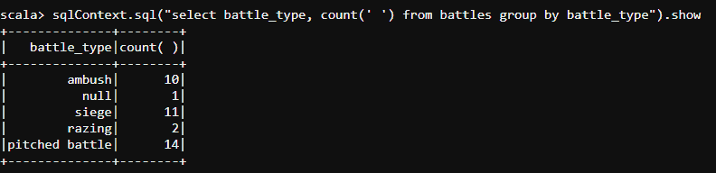

*   战斗中的**伏击式**是最致命的，在这里敌人永远不会有任何攻击的线索。让我们找出**国王**对**敌人**进行伏击式战斗的年份细节，以及**王国**和**攻击者的**指挥官**的细节。**
*   下面的代码可以帮助我们找到这些细节。

```
#and
sqlContext.sql("select year, attacker_king, defender_king, attacker_outcome, battle_type, attacker_commander, defender_commander from battles where attacker_outcome == 'win' and battle_type =='ambush'").show

```

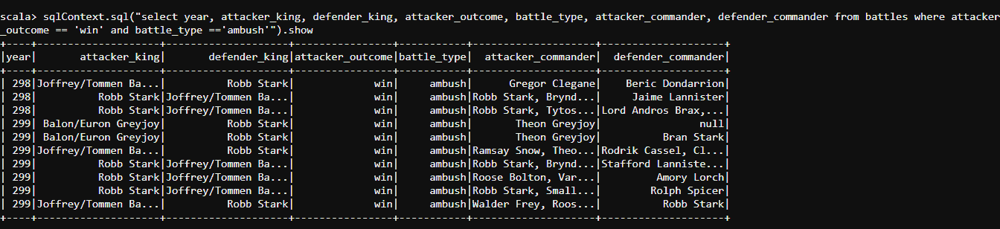

*   现在让我们把注意力集中在的**房子上，从其余的房子中挑出**最致命的**房子。下面的代码将帮助我们找出**房子的细节**和**他们进行的战斗**。**

```
#groupBy
sqlContext.sql("select attacker_1, count(' ') from battles group by attacker_1").show

```

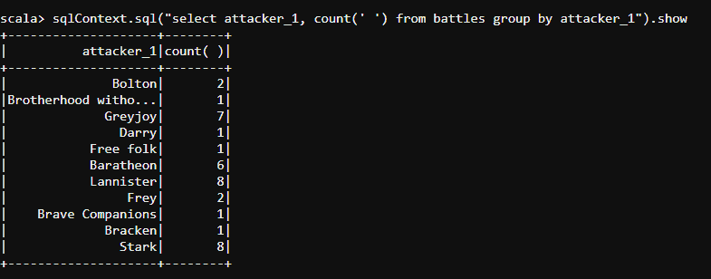

*   现在，我们将找出**位国王**和**位国王参加的**战役总数的详细信息，以直观显示参加过最高战役的国王。

```
#select
sqlContext.sql("select attacker_king, count(' ') from battles group by attacker_king").show

```

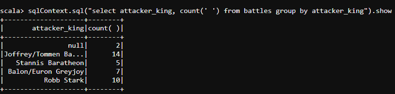

*   让我们找出在**保卫**的战斗中成功的家族，以及他们必须**保卫**他们的**王国**的战争总数。下面的代码可以帮助我们找到这些细节。

```
#count
sqlContext.sql("select defender_1, count(' ') from battles group by defender_1").show

```

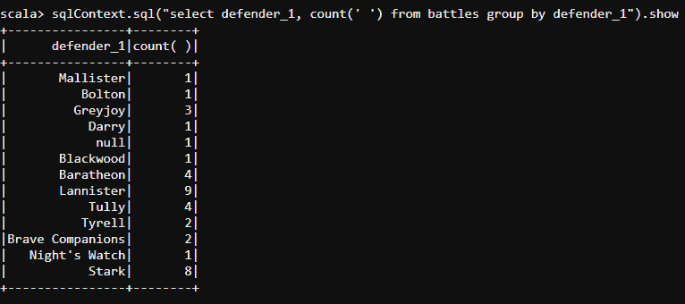

*   让我们找出**国王**的细节，以及他们成功**保卫**王国免受**敌人**攻击的战争次数。下面的代码可以提取这些细节。

```
#groupBy
sqlContext.sql("select defender_king, count(' ') from battles group by defender_king").show

```

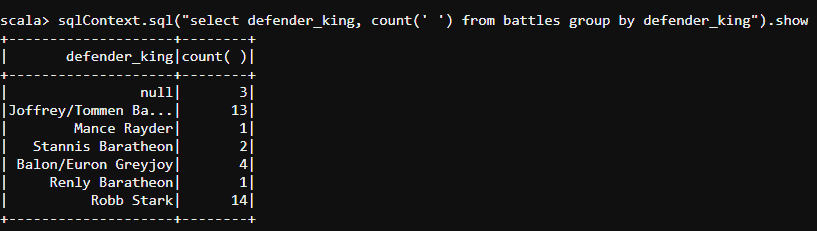

*   既然**兰尼斯特**府是我个人最喜欢的，那就让我找出**兰尼斯特**府中人物的详细情况，其中会描述他们的**名字**和**性别** (1 - >男，0 - >女)以及他们各自的**人口**。下面的代码将获取我们在**兰尼斯特**家族**中所有**男性角色**的详细信息。**

```
#select
val df1 = sqlContext.sql("select Name, Allegiances, Gender from deaths where Allegiances == 'Lannister' and Gender == '1'")

```

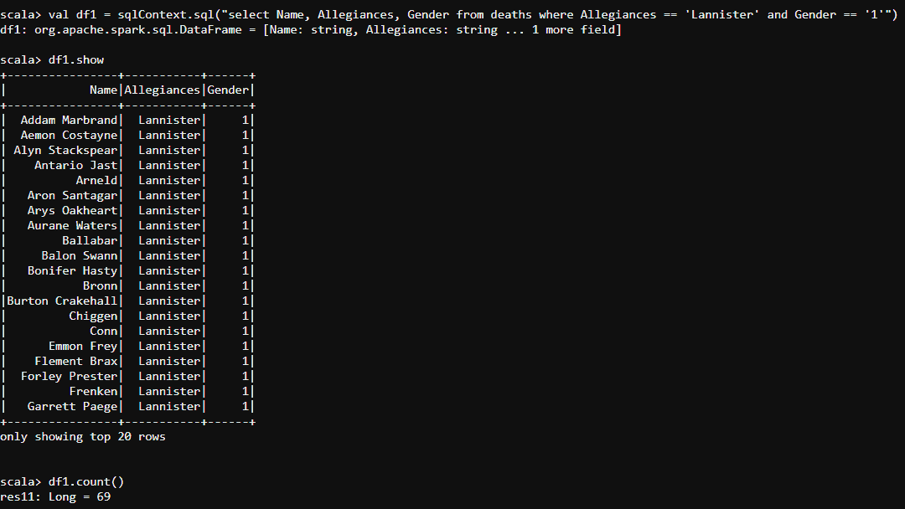

*   下面的代码将获取我们在**兰尼斯特**宫中所有**女**角色的详细信息。

```
#Select 
val df2 = sqlContext.sql("select Name, Allegiances, Gender from deaths where Allegiances == 'Lannister' and Gender == '0'")

```

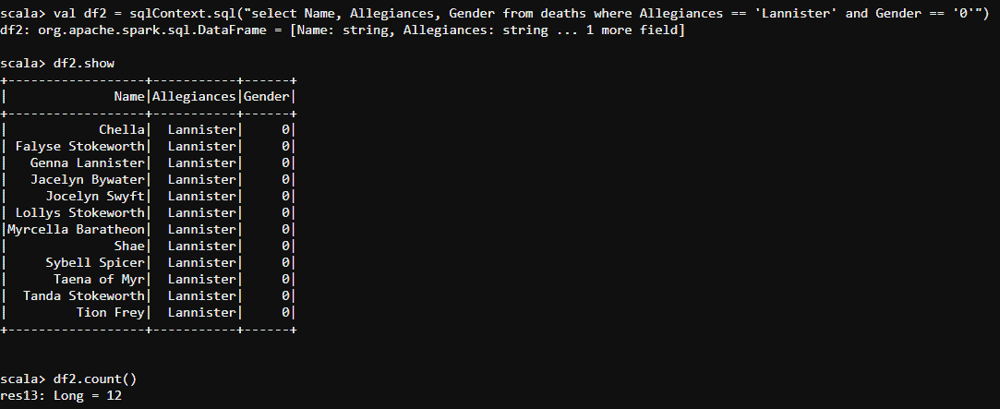

*   说到底，《权力的游戏》每一集都有一个**贵族**角色。现在让我们在 GameOfThrones.csv 文件中找出所有**房屋**中的所有**贵族角色**。

```
#where
val df4 = sqlContext.sql("select Name, Allegiances, Gender from deaths where Nobility == '1'")

```

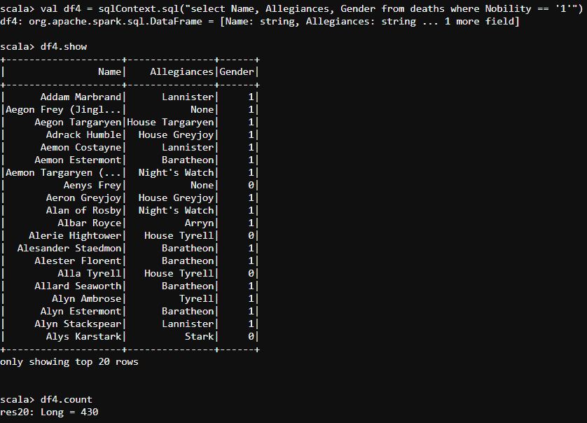

*   尽管如此，还是有一些**平民**在《权力的游戏》中扮演了特殊的角色。让我们找出每一集里极具励志意义的**平民**的细节。

```
#select and where
val df5 = sqlContext.sql("select Name, Allegiances, Gender from deaths where Nobility == '0'")

```

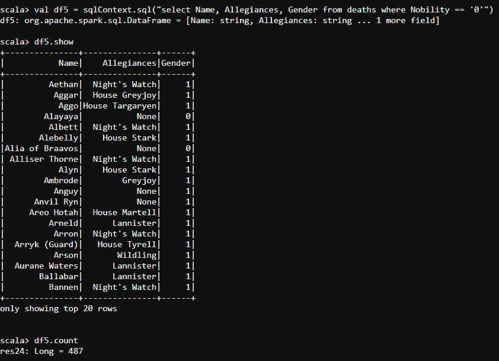

*   我们认为一些角色是重要的，同样高贵的。让编剧把人物演到**最后一本书**。让我们过滤掉那些**人物**来寻找他们每个人的细节。

```
#and
val df6 = sqlContext.sql("select Name, Allegiances, Gender from deaths where GoT == '1' and Cok == '1' and SoS == '1' and FfC == '1' and DwD == '1' and Nobility == '1'")

```

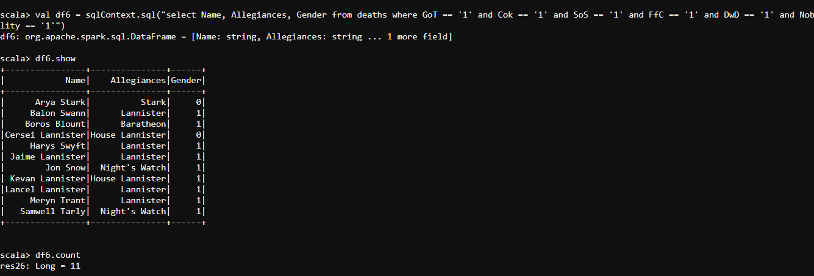

*   在所有的**战斗**中，我发现最后几本书的战斗在**读者**中产生了更多的**肾上腺素**。
*   让我们通过使用下面的代码来找出那些最终战斗的细节。

```
#OrderBy
val dat = GOTbattlesdf.select("name","year","battle_number","attacker_king","defender_king","attacker_outcome","attacker_commander","defender_commander","location")orderBy(desc("battle_number"))
dat.show

```

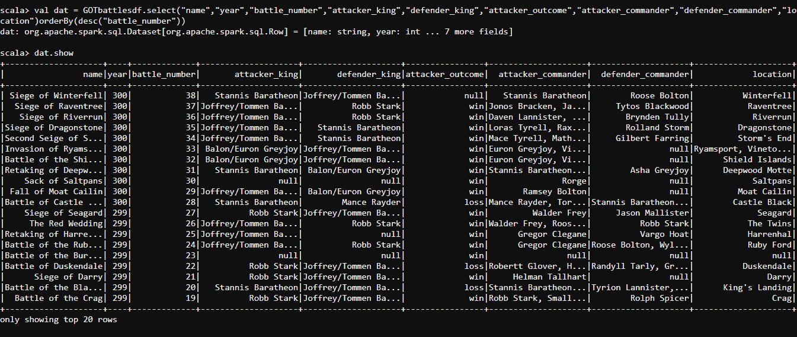

*   让我们使用下面的代码来删除所有的**副本** **细节**我们已经知道的关于进攻者国王和他们各自的国王在最后战斗中的情况。

```
#DropDuplicates
GOTbattlesdf.select("attacker_king","defender_king").dropDuplicates().show()

```

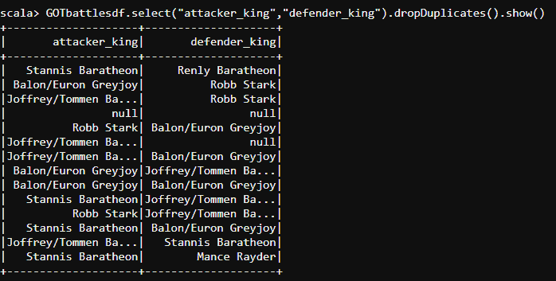

至此，我们结束了 Spark 文章中的数据框架。我希望我们对您关于数据帧、它们的特性以及可以在其上执行的各种类型的操作的知识有所启发。

*本文基于 [**Apache Spark 和 Scala 认证培训**](https://www.edureka.co/apache-spark-scala-certification-training) 为您准备 Cloudera Hadoop 和 Spark 开发者认证考试(CCA175)。您将深入了解 Apache Spark 和 Spark 生态系统，包括 Spark 数据帧、Spark SQL、Spark MLlib 和 Spark 流。您将获得关于 Scala 编程语言、HDFS、Sqoop、Flume、Spark GraphX 和 Kafka 等消息系统的全面知识。*