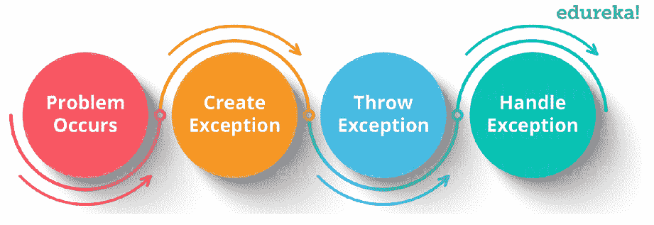

# Selenium 中的异常——知道如何处理异常

> 原文：<https://www.edureka.co/blog/exceptions-in-selenium/>

随着世界朝着软件开发的方向发展，测试在消除过程缺陷方面扮演着至关重要的角色。 ***Selenium*** 就是这样一个帮助发现并解决 bug 的工具。[硒认证](https://www.edureka.co/selenium-certification-training)可以帮助你了解关于例外的一切。Selenium 中的异常是一个重要的概念，它有助于我们处理错误和避免软件故障。通过这篇关于 [Selenium](https://www.edureka.co/blog/selenium-tutorial) 中异常的文章，我将让您全面了解处理异常的基础和各种方法。

在这篇文章中，我将涉及以下主题。

*   [异常处理简介](#IntroductiontoExceptionHandling)
*   [已检查 vs 未检查异常](#CheckedvsUncheckedException)
*   [异常的基本例子](#BasicExampleofException)
*   [异常类型](#TypesofExceptions)
*   [处理异常的方法](#Methodsofhandlingexceptions)

*您也可以通过我们的专家对 [Selenium](https://www.edureka.co/blog/what-is-selenium/) 中的例外情况进行记录，您可以通过示例详细了解这些主题。*

**在 Selenium Webdriver 中处理异常|流行的 Selenium 异常| edu reka**


[https://www.youtube.com/embed/brdWtaytcsA?rel=0&controls=0&showinfo=0](https://www.youtube.com/embed/brdWtaytcsA?rel=0&controls=0&showinfo=0)

本视频将讲述 selenium 中的异常处理。它还将告诉您各种类型的异常，以及如何使用各种方法处理它们。

## **异常介绍**

异常是程序执行过程中出现的事件或问题。 当[异常](https://www.edureka.co/blog/java-exception-handling)发生时，正常的程序流程停止，并创建一个异常对象。然后，程序试图找到能够处理这个异常的人。异常对象包含很多调试信息，比如方法层次结构、异常发生的行号、异常的类型等。

当你开始使用 [Selenium webdriver](https://www.edureka.co/blog/selenium-webdriver-tutorial) 时，你会根据你写的代码遇到不同的异常。相同的代码有时能正常工作，有时却不能。无论何时开发任何脚本，您都试图给出工作良好的最佳质量的代码。但不幸的是，有时异常是我们开发的脚本的副作用，往往会失败。这就是处理异常非常重要的原因。

 异常处理机制遵循上图所示的流程。但是如果不处理异常，可能会导致系统故障。这就是处理异常非常重要的原因。现在让我们进一步了解异常的各种类别。

## **已检查 vs 未检查异常**

基本上，在 Selenium 中有两种类型的异常，它们如下:

*   检查异常
*   未检查的异常

让我们深入了解这两个例外。

*   **检查异常** 它是发生在编译时的异常，也叫编译时异常。如果一个方法中的一些代码抛出了一个检查过的异常，那么这个方法要么必须处理这个异常，要么必须使用 *throws* 关键字指定这个异常。
*   **未检查异常** 它是发生在执行时的异常，称为*运行时异常。*在 C++中，所有的异常都是不检查的，但是在 [Java](https://www.edureka.co/blog/java-exception-handling) 中，异常既可以检查也可以不检查。因此，编译器不会强制处理或指定异常。由程序员来指定或捕捉异常。

## **异常的基本例子**

```

class Exception{
public static void main(String args[]){
try{
//code that may raise an exception</span>
}
catch(Exception e){
// rest of the program
}
}
}

```

上面的代码代表一个异常，我们将在 try 块中编写一个可能引发异常的代码，然后在 catch 块中处理这个异常。理解了这一点之后，让我们进一步看看不同类型的异常，这些异常导致程序正常执行流程的中断。

## **异常类型**

*   **web driver exception**

当我们试图对不存在的驱动程序执行任何操作时，WebDriver 异常出现。

```
WebDriver driver = new InternetExplorerDriver();
driver.get("http://google.com");
driver.close();
driver.quit();

```

*   **【no lertpractexception】**

当我们试图在一个要求的地方执行一个不需要的动作时，即接受()或驳回()。给了我们这个例外。

```
try{
driver.switchTo().alert().accept();
}
catch (NoAlertPresentException E){
E.printStackTrace();
}

```

*   **NoSuchWindowException**

当我们试图切换到一个不存在的窗口时，会出现这个异常:

```
WebDriver driver = new InternetExplorerDriver();
driver.get("http://google.com");
driver.switchTo().window("Yup_Fail");
driver.close();

```

在上面的代码片段中，第 3 行抛出了一个异常，因为我们试图切换到一个不存在的窗口。

*   **NoSuchFrameException**

与窗口异常类似，帧异常主要发生在帧间切换时。

```
WebDriver driver = new InternetExplorerDriver();
driver.get("http://google.com");
driver.switchTo().frame("F_fail");
driver.close();

```

在上面的代码片段中，第 3 行抛出了一个异常，因为我们试图切换到一个不存在的帧。

*   **【no uche element exception】**

当 WebDriver 在 DOM 中找不到 web 元素时，就会抛出这个异常。

```
WebDriver driver = new InternetExplorerDriver();
driver.get("http://google.com");
driver.findElement(By.name("fake")).click();

```

现在请参阅 [Selenium](https://www.edureka.co/blog/10-reasons-to-learn-selenium/) 文章中的异常部分，了解用于处理异常的各种方法。

## **处理异常的方法**

1.  **Try:** try 块用于封闭可能抛出异常的代码。
2.  **Catch:** catch 块用于处理异常。它必须仅在 try 块之后使用
3.  **Finally:** finally 块是用于*执行重要代码*如关闭连接、流等的块。无论异常是否被处理，它总是被执行。
4.  **抛出:**“抛出”关键字用于抛出异常。
5.  **抛出:**“抛出”关键字用于声明异常。它不会抛出异常。它指定方法中可能会出现异常。它总是与方法签名一起使用。

让我们看一个小例子来理解如何使用异常方法处理抛出的异常。让我们看一下代码。

```
package Edureka;
import java.util.concurrent.TimeUnit;
import java.util.concurrent.TimeoutException;
import org.openqa.selenium.By;
import org.openqa.selenium.NoAlertPresentException;
import org.openqa.selenium.NoSuchElementException;
import org.openqa.selenium.WebDriver;
import org.openqa.selenium.chrome.ChromeDriver;
import org.openqa.selenium.firefox.FirefoxDriver;
import org.openqa.selenium.support.ui.ExpectedConditions;
import org.openqa.selenium.support.ui.Wait;
import org.openqa.selenium.support.ui.WebDriverWait;
public class Exceptionhandling {
public static void main(String[] args) throws InterruptedException, TimeoutException{
System.setProperty("webdriver.firefox.driver", "C:Selenium-java-edurekachromedriver_win32chromedriver.exe");
WebDriver driver = new FirefoxDriver();
WebDriverWait wait = new WebDriverWait(driver, 10);
driver.get("https://www.google.com");
try{
driver.findElement(By.xpath("//*[@id='register']")).click();
}catch (Exception e) {
System.out.println("Register element is not found.");
throw(e);
}
System.out.println("Hello");
}
}

```

让我们深入了解每种方法的功能。

#### **试法**

在上面的代码中，我使用了一个 try 块来输入抛出异常的语句。这里，这个语句driver . find element(by . XPath("//*[@ id = ' register ']")。单击()；抛出异常，因为 Selenium 在 Google 搜索页面中找不到特定的元素。所以，一旦抛出异常，程序的正常执行就会被中断。现在，让我们看看它在 catch 块中是如何处理的。

#### **抓法**

这里的任务是处理这个异常并继续程序的执行。为此，我编写了一个 catch 块来处理抛出的异常。它应该总是写在 try 块之后。所以当你执行程序时，它会打印出剩下的语句。

#### **扔法**

众所周知*t*hrow 是一个用来传递异常的关键字。但是，有趣的是，不管 catch 块是否已经处理了异常，*【throw()*仍然会引发异常。这导致中断了程序的正常执行流程。在上面的代码中，catch 块处理完异常后，我写了一个语句*throw(e)；* 抛出异常。

#### **摔投法**

Throws 声明用于声明一个异常。例如，它可以声明中断异常、超时异常等。这就是如何使用各种方法来处理程序中出现的异常。

至此，我们结束了这篇关于 [Selenium](https://www.edureka.co/blog/what-is-selenium/) 中异常的文章。我希望你理解了这些概念，并有助于增加你知识的价值。

*如果您希望学习 Selenium 并在测试领域建立自己的事业，那么请查看我们的交互式在线直播 **[Selenium 认证](https://www.edureka.co/selenium-certification-training)，**，它提供 24*7 支持，在整个学习期间为您提供指导。*

*有问题吗？请在 Selenium 文章中异常的评论部分提到它，我们会回复您。*