# 弹性负载平衡器教程——不确定性的一步解决方案

> 原文：<https://www.edureka.co/blog/elastic-load-balancer-tutorial-application-load-balancer>

在小说中，我们发现可预见的无聊。在现实生活中，我们觉得不可预测的事情很可怕。最好的选择是为不确定性做好准备。在这个弹性负载平衡器教程中，我将讨论负载平衡器如何在这种脆弱和不确定的情况下提供帮助。

议程本弹性负载均衡器教程:

*   [什么是负载均衡？](#What-Is-Load-Balancing)
*   [](#NeedforLoadBalancing)需要进行负载均衡
*   [用于负载均衡的算法](#AlgorithmsUsedForLoadBalancing)
*   [演示:创建负载均衡器](#Create-A-Load-Balancer)

还有，t 看看 edu reka提供的 ***[课程。](https://www.edureka.co/cloud-computing-certification-courses)***

## **什么是负载均衡？**

亚马逊提供了自己的负载均衡服务，名为“”。在深入学习弹性负载均衡器教程之前，我们先来谈谈什么是负载均衡。

假设您有一个部署在 EC2 实例上的应用程序，它的流量有限，因此您只为它分配了有限的资源。

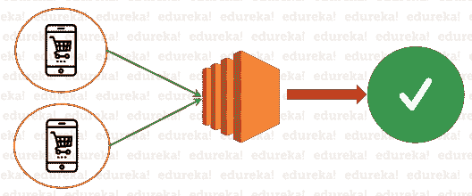

图 1–弹性负载平衡器教程

但是，如果有一天你醒来，发现风水轮流转。如果您的应用程序开始收到大量意外流量，该怎么办？这太神奇了，不是吗？ 但是你的应用程序准备好了吗？它能承受这么大的流量吗？


图 2–弹性负载平衡器教程

有了负载均衡机制，**是**！


图 3–弹性负载平衡器教程

负载均衡器意识到一个服务上的流量太大，应用程序可能会崩溃。AWS 具有放大或缩小资源的特性。负载平衡器自动扩展您的资源，使其足以处理大量的传入流量。

负载平衡是指以提高速度和性能的方式，在一组后端服务器之间高效地分配传入的网络流量。

弹性负载平衡器与所有其他负载平衡器相似。它基本上为客户提供了单一联系点。简单来说，客户端向负载平衡器发送一个请求，然后它将这些请求分发到不同可用性区域中的目标，如 EC2、lambda function 等。

有三种类型的弹性负载平衡器可供选择。你可以使用最适合你工作的。

### **【经典负载均衡器(CLB)**

这是负载平衡器的最基本形式，最初用于经典 EC2 实例。它在连接级别和请求级别上操作。这种负载平衡器的主要缺点是，它不支持基于主机的路由或基于路径的路由等功能。一旦配置了负载平衡器，它就会在服务器之间平衡负载，而不管服务器上有什么，这在某些情况下可能会降低效率和性能。

### **应用负载均衡器**

当存在 HTTP 和 HTTPS 流量路由时，使用这种类型的负载平衡器。我相信你们都知道 OSI 模型。这个负载平衡器工作在 OSI 模型的应用层。它提供高级路由功能，如基于主机和基于路径的路由。它还可以很好地处理容器和微服务。在这个弹性负载平衡器教程中，我将演示如何创建一个应用负载平衡器，并演示流量如何在可用的服务器之间路由。

### **网络负载平衡器**

网络负载平衡器工作在 OSI 模型的第 4 层(连接层)。它主要用于 TCP 流量的负载平衡。这种负载平衡器可以处理数百万的流量，最适合保持低延迟。它能够处理不确定的流量，同时保持静态 IP 地址。

现在你知道了什么是负载均衡器，让我们来了解一下为什么我们需要它。

## **需要进行负载均衡**

弹性负载平衡器的主要用途是让您的资源高度可用。有四种类型的转发规则可供用户分配给负载平衡器，它们可以细分如下:

*   **HTTP** 它是基于 HTTP 机制的标准均衡请求。它将流量定向到原始请求的后端信息。
*   它与 HTTP 转发规则相同，但具有额外的加密功能。这里的加密以两种方式之一处理:SSL 直通(加密一直到后端)和 SSL 终止(加密由负载平衡器完成)。在 SSL 终止中，流量以不加密的方式发送到后端。
*   **UDP**UDP 负载平衡器使用用户数据报协议，为应用程序提供低延迟。
*   **TCP** TCP 用于负载平衡所有不使用 HTTP 和 HTTPScing 等协议的应用程序。

现在你已经了解了负载均衡器的工作原理，让我们来学习管理负载均衡的算法。让我来引导您了解用于负载平衡的每一种算法。

## **用于负载均衡的算法**

*   **循环调度** 它是用于在一组服务器上分发客户端请求的最简单算法。循环法将首先遍历组中的服务器列表，然后将客户端请求逐个转发到每个服务器，一旦到达列表的末尾，它将再次从列表的顶部开始。循环算法有两种变体:
    *   **加权循环法:**根据某些标准为每个服务器分配权重，并相应地选择服务器。
    *   **动态循环:**根据当前负载和空闲容量等实时数据动态分配权重。
*   **最少连接数** 当负载均衡器被配置为使用最少连接算法时，它选择具有最少连接数的服务器来服务请求。这样可以确保服务器之间的负载均衡。
*   **源** 这种算法基本上是基于源 IP 请求的散列来选择服务器，例如客户端的 IP 地址。这样，源算法确保来自特定 IP 的请求仅由特定服务器提供服务。

很有趣，不是吗？这些是在后端工作的不同算法，使您的服务可用。

让我们进一步创建一个网页，并使用负载均衡器使其高度可用。

## **演示:创建一个应用负载均衡器**

在这个演示中，我将创建 2 个 EC2 实例，并让它们像服务器一样工作。然后，我将为他们每个人创建一个网页。通过使用负载平衡器，我将处理对我的网页的请求。所以，让我们深入研究这个负载平衡器教程，并找出如何实现上述场景。

**第一步:** [创建一个 EC2 实例。](https://www.edureka.co/community/37968/how-to-create-an-ec2-instance-in-aws-console)

在 AWS 控制台中选择 ***EC2*** ，如下图所示。

**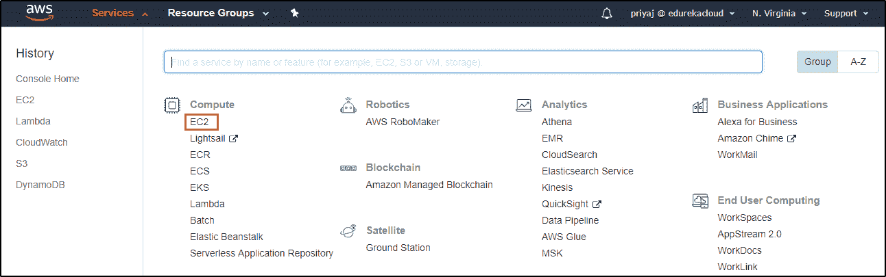**

点击 ***启动实例*** 来启动一个实例。

**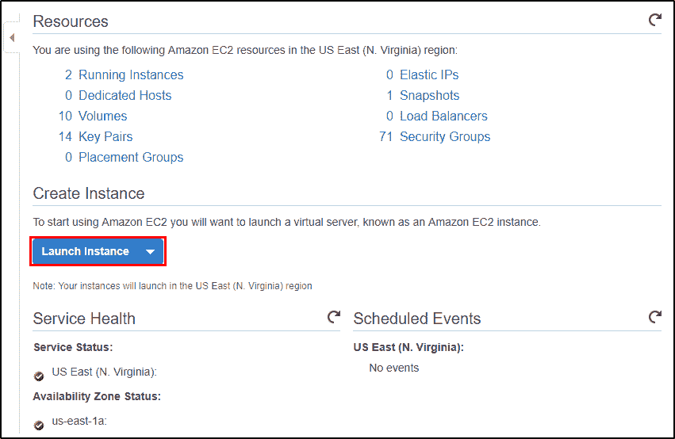**

选择 ***亚马逊*** 最适合你的机器形象。对于这个演示，我使用了 Amazon Linux 2 映像，如下图中突出显示的那样。

**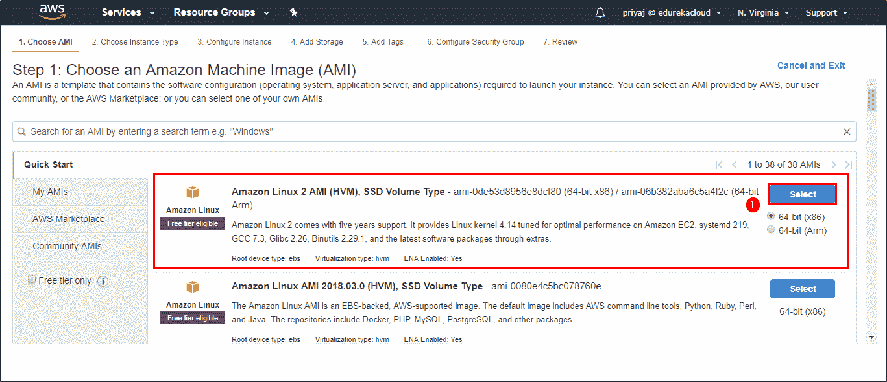**

选择 ***类型的实例*** 。在本例中，我使用了 t2.micro.

**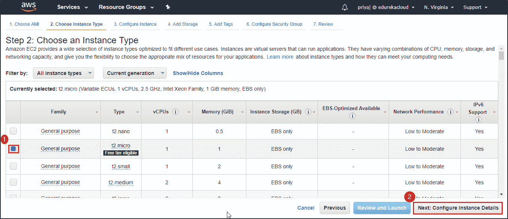**

配置 ***实例详细信息*** 。添加您希望创建的实例数量，并选择您希望使用的网络和子网。

**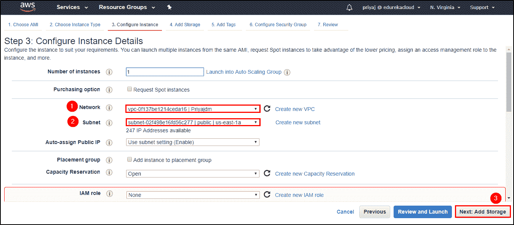**

现在的 ***加储*** 。本演示不需要超过 8GB 的内存。

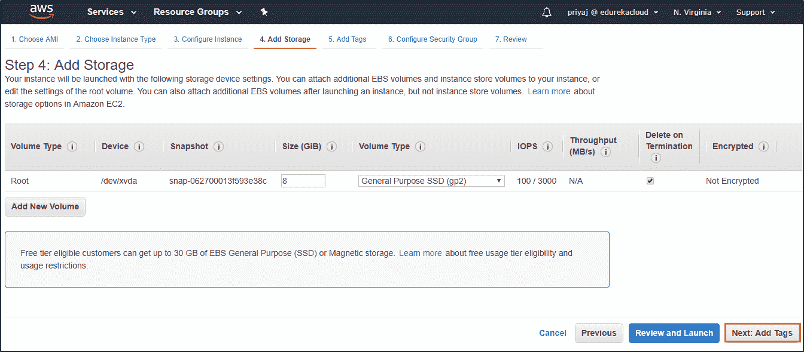

你可以通过 ***添加标签*** 来标识你的实例。这一步是可选的。

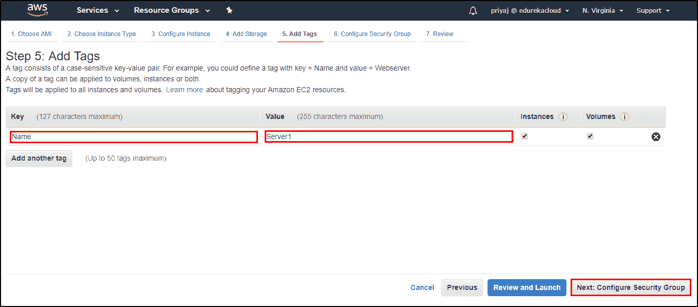

你必须" ***配置安全组*** ，并确保你有权限 **SSH，TCP & HTTP。**

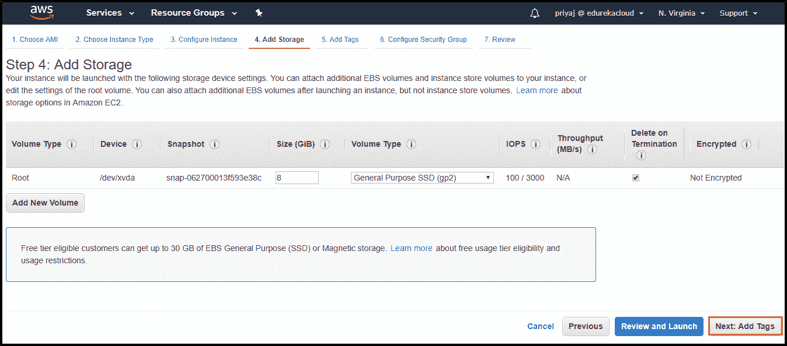

点击 ***审核实例启动*** 启动实例。

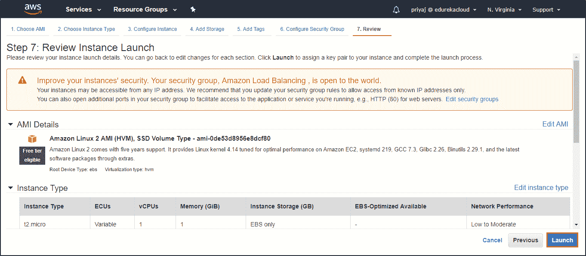

最后一步 ***选择一个密钥对或者创建一个新的密钥对*** 。您可以从现有的密钥对中进行选择，也可以创建创建实例所需的新密钥对。

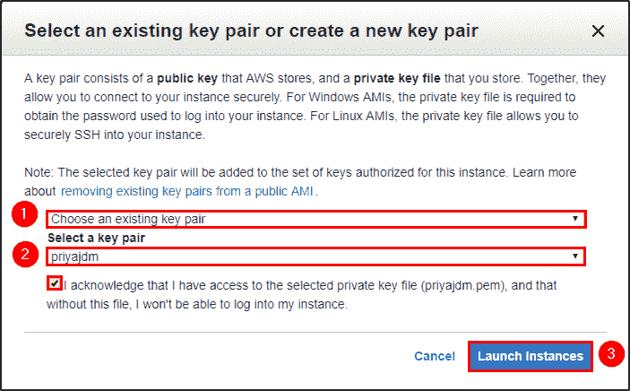

**第二步:**访问你的实例。

点击查看如何使用 Putty [访问 EC2 实例。](https://www.edureka.co/community/30960/access-ec2-instance-using-putty)

**第三步:**在你的实例中安装 **HTTPD** 。以下是您需要运行的命令。

```
$ sudo yum install httpd
$ sudo service httpd start
$ sudo chkconfig httpd on
$ sudo service httpd status
```

**第四步:**创建一个名为“*index . HTML”*的 HTML 文件

下面是我使用的代码。

```
<html>
<head>
<h1>Hello Community!</h1>
<h2>This is our First Server</h2></head>
<body bgcolor="#98fb98">
<a href="https://www.edureka.co/community/"&amp;gt;Visit Edureka | Community /a>
</body>
</html>

```

```
<html>
<head>
<h1>Hello Community!</h1>
<h2>This is our Second Server</h2></head>
<body bgcolor="#5DBCD2">
<a href="https://www.edureka.co/community/" Visit Edureka | Community /a>
</body>
</html>

```

使用同一个文件，只需改变服务器的编号，这样你就可以了解你的请求是如何被服务的。

**第五步:**创建一个*负载均衡器*。

导航到 ***负载均衡*** ，点击 ***创建负载均衡器*** 。

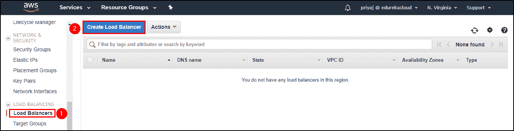

选择 ***负载平衡器类型*** 。在本例中，我使用了 HTTP/HTTPS。

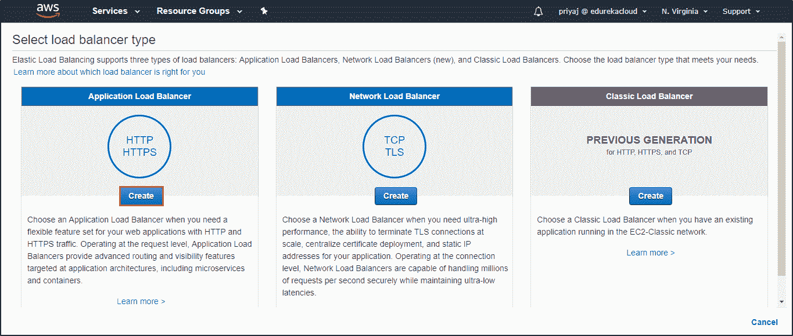

你必须 ***配置你的负载均衡器*** 。在这种情况下，添加名称、模式和 IP 地址类型(IPV4)。

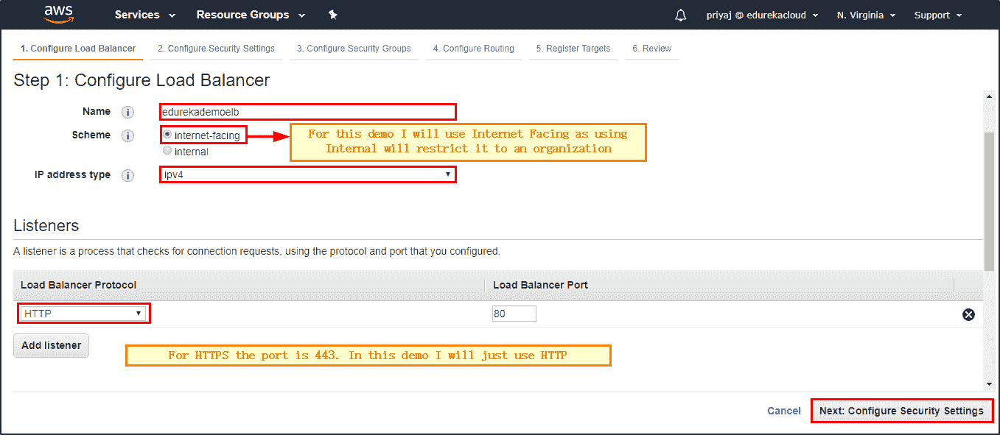

选择您的 VPC 为 ***配置负载均衡器*** 。添加您的 VPC 和可用性区域。

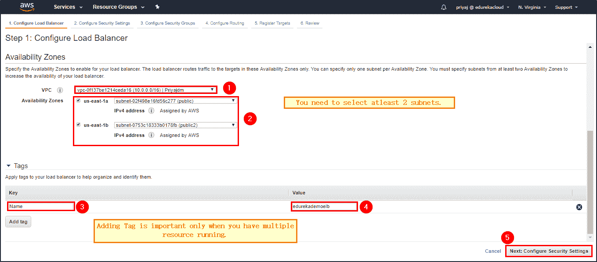

现在你必须对 ***配置安全设置*** 。你会得到一个警告提示，如下图所示。这个警告只是让你知道你应该使用 HTTPS 而不是 HTTP。

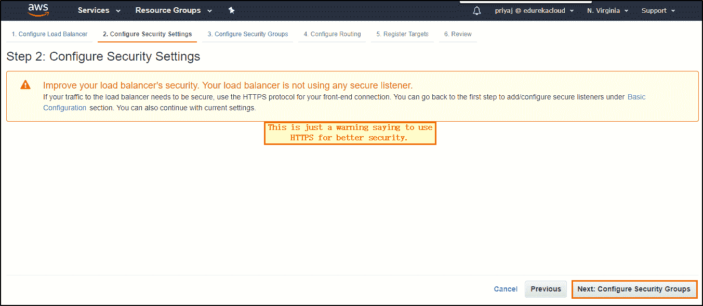

要配置安全组，首先要分配一个安全组。

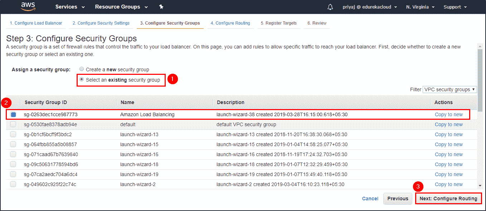

现在主要部分， ***配置路由*** 。如下图所示配置路由。

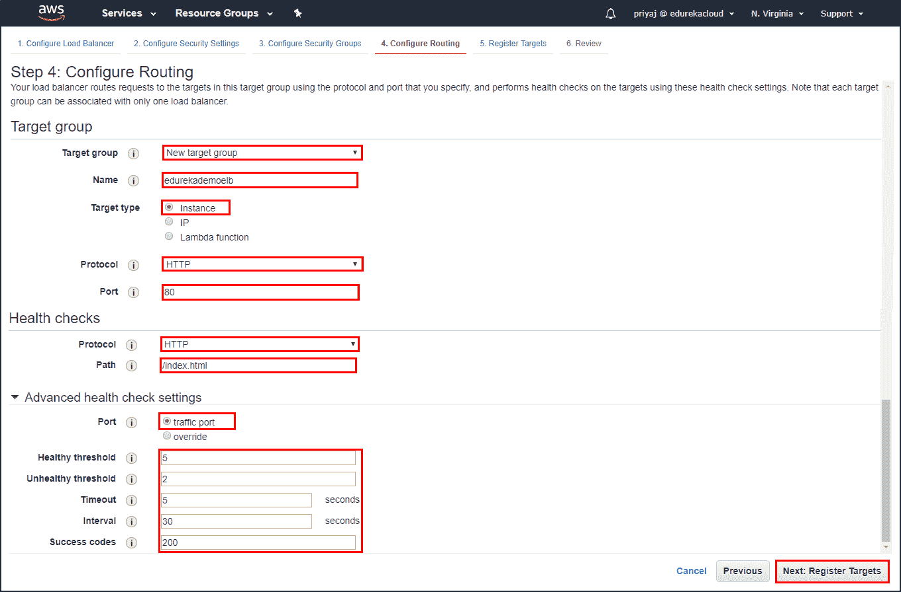

现在，只需添加您的实例，即 ***注册目标*** 。


最后一步 ***复习*** “所有的设置都没问题。

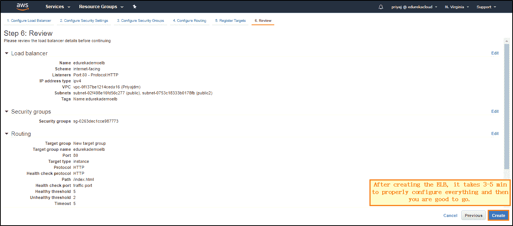

现在，等待 3-5 分钟，让负载平衡器进行配置。

**第六步:**从描述中选择 DNS。将其作为 URL 粘贴到您的浏览器中。

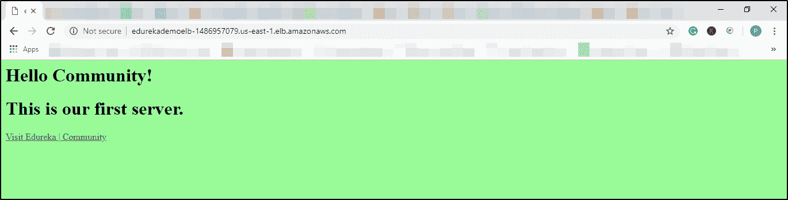

你应该会看到类似上图的东西。上面写着“这是我们的第一台服务器”，表明网页是在第一台服务器上部署的。点击“*刷新*”，你会发现另一个页面(如下图所示)正在显示，显示该网页已经部署在第二台服务器上。

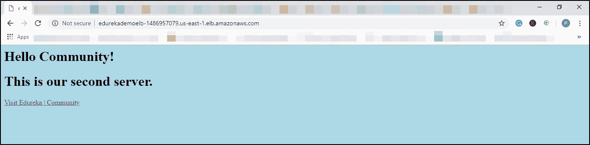

您可以看到负载均衡器如何将流量分流到不同的服务器，以满足用户的请求。我希望你喜欢这篇关于“弹性负载平衡器教程”的博客。更多此类博客，请访问“**[【edu reka |博客](https://www.edureka.co/blog/)** ”。

*如果您希望了解更多关于云计算的知识，并在云计算领域建立自己的事业，请查看我们的[云计算课程](https://www.edureka.co/cloud-computing-certification-courses)，该课程提供有讲师指导的现场培训和真实项目体验。本培训将帮助您深入了解云计算，并帮助您掌握这门学科。*

*有问题吗？请在评论区提及，我们会回复您**或**在[**edu reka | Community**](https://www.edureka.co/community)发布您的问题。在 Edureka 社区，我们有超过 100，000 名技术狂热分子随时准备提供帮助。*