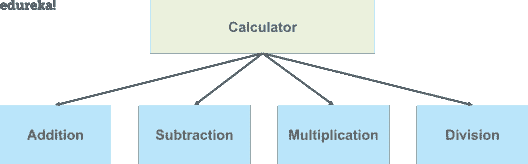
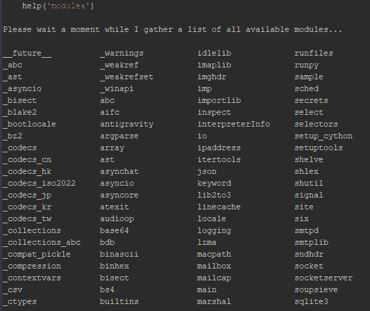
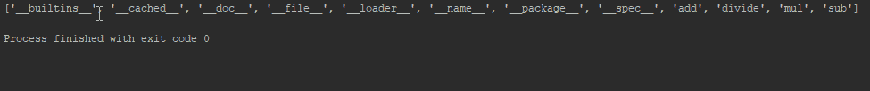

# Python 模块——您需要知道的一切

> 原文：<https://www.edureka.co/blog/python-modules/>

Python 编程语言是当今最流行的语言之一。它有许多应用程序，开发人员正在转向 python 来实现它提供给我们的功能。模块化编程方法将代码分解成独立的部分，这就是 python 模块的用武之地。本文将帮助您详细了解上述主题。

以下是本博客将涉及的主题:

*   [什么是 Python 模块？](#1)
*   [如何创建 Python 模块？](#2)
*   [如何使用 Python 模块？](#3)
*   [Python 内置模块](#4)

## **什么是 Python 模块？**

模块只是一个“程序逻辑”或“python 脚本”,可用于各种应用程序或[功能](https://www.edureka.co/blog/python-functions)。我们可以在一个模块中声明函数、类等。

重点是将代码分解成不同的模块，这样就不会有或最少的相互依赖。在代码中使用模块有助于编写更少的代码行，这是为重用代码而开发的单一过程。它还消除了反复编写相同逻辑的需要。

使用模块的另一个优势是程序可以很容易地设计，因为整个团队只在整个代码的一个部分或模块上工作。

让我们试着用一个例子来理解这一点:

假设你想为计算器编写一个程序。会有加、减、乘、除等运算。

我们将把代码分成单独的部分，我们可以简单地为所有这些操作创建一个模块，或者为每个操作创建单独的模块。然后我们可以在主程序逻辑中调用这些模块。

这个想法是为了最小化代码，如果我们创建模块，并不意味着我们只能为这个程序使用它，我们甚至可以为其他程序调用这些模块。



现在我们已经理解了模块的概念，让我们试着理解如何在 python 中创建一个模块。

## **如何用 Python 创建模块？**

用 python 创建一个模块类似于使用**编写一个简单的 python 脚本。py** 分机。对于上面的例子，让我们试着为各种操作制作一个模块。

```
def add(x,y):
     return x + y

def sub(x, y):
     return x - y

def prod(x, y):
    return x * y

def div(x, y):
    return x / y

```

将上述代码保存在文件 **Calc.py** 中。这就是我们如何在 python 中创建一个模块。我们在本模块中创建了不同的功能。我们可以在主文件中使用这些模块，让我们看看如何在程序中使用它们。

## **如何使用 Python 模块？**

我们将使用 **import** 关键字将模块合并到我们的程序中， **from** 关键字用于从一个模块中获取一些或特定的方法或函数。让我们看看在你的程序中使用一个模块有哪些不同的方法。

假设我们有一个名为**main . py .**的文件

```

import calc as a
a = 10
b = 20

addition = a.add(a,b)
print(addition)

```

在上面的代码中，我们使用**作为**关键字创建了一个别名。使用 calc.py 模块中 add 函数指定的逻辑，上述代码的输出将是两个数字 a 和 b 的相加。

让我们来看看另一种方法。

```

from calc import *
a = 20
b = 30

print(add(a,b))

```

在上面的代码中，我们已经使用星号导入了所有的函数，我们可以简单地提到函数名来获得结果。

#### **Python 模块路径**

当我们导入一个模块时，解释器在 sys.path 中的内置模块目录中查找该模块，如果没有找到，它将按以下顺序查找该模块:

1.  当前目录
2.  PYTHONPATH
3.  默认目录

```

import sys

print(sys.path)

```

运行上面的代码，就会得到目录列表。您可以在列表中进行更改以创建自己的路径。

## **Python 内置模块**

内置模块用 C 编写，集成 python 解释器。每个内置模块都包含用于某些特定功能的资源，如操作系统管理、磁盘输入/输出等。

标准库也有许多包含有用工具的 python 脚本。python 中有几个内置模块供我们使用，我们可以随时使用。

要获得 python 中所有模块的列表，您可以在 python 控制台中编写以下命令。

```

help('modules')

```

你将得到 python 中所有模块的列表。下面是 python 中的几个模块。

****

**dir()内置函数**

它返回一个包含模块中定义的名字的字符串的[排序列表。该列表包含所有变量、函数、类等的名称。](https://www.edureka.co/blog/variables-and-data-types-in-python/)

```

import calc

print(dir(calc))

```

您将得到如下的列表输出:



类似地，你可以使用 dir()函数获得任何模块中定义的名字。

在这篇博客中，我们学习了 python 中的模块，以及如何创建模块并在程序中使用它。我们还学习了 python 中的内置模块。 [Python 编程语言](https://www.edureka.co/blog/introduction-to-python/)有着巨大的应用，通过使用模块，任务变得更容易、可维护和高效。如果你想掌握 python 编程语言的技能，你可以报名参加 [python 认证课程](https://www.edureka.co/data-science-python-certification-course)，开始你的学习，成为一名 python 开发者。

*如有疑问？在评论中提到他们，我们会回复你。*