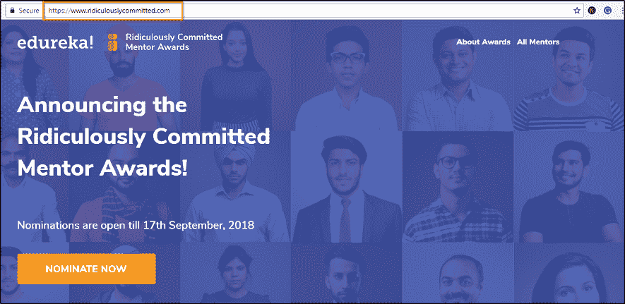

# 宣布荒谬承诺导师奖

> 原文：<https://www.edureka.co/blog/ridiculously-committed-mentors/>

**庆祝荒唐地委身导师**

成功是努力和坚持的结合。然而，一个不可忽视的成功要素是导师的适当指导和支持。无论是 Dronacharya 塑造 Arjun 的决心，还是 Savitri Bai Phule 在独立前提升印度教育体系的奉献精神，都是杰出导师的典范。

今天的印度是一个知识超级大国，这要归功于我们聪明勤奋的 it 专业人士，**像你们这样的人！**而每一个成功的 IT 专业人士背后都是一个忠诚的，不， **可笑的忠诚导师** 。无论是总是有时间陪你的同事，帮助你在工作中学习的经理，借给你攀爬绳索的团队领导，确保你在新办公室不会感到被冷落的人力资源经理；总会有人支持和帮助你的职业发展。

事实是，没有他们，你不会有今天！

我们在T2【edu reka！ 一直信奉荒谬的承诺。今年，我们希望向导师和让他们荒谬地投入其中的疯狂动力致敬。

## ***令人兴奋，不是吗？***

我们需要你的帮助，来认可你那可笑的忠诚导师对你成功的贡献。提名你的导师获得荒谬承诺导师奖，你可以帮助他们赢得以下奖项:

但这还没完！只需提名一位导师，你也将赢得 Rs。1500 美元的 Edureka 现金，可用于提升 2018 年最热门技术的技能。

* *更新-结果出来了** [<button>看看你的导师是不是赢了！</button>](https://www.edureka.co)

## **那么，如何参与呢？**

您只需点击“立即提名”按钮并填写详细信息。一旦你这样做了，给我们一些时间来验证你的提名和…就是这样！

附注:提名截止到 2018 年 9 月 17 日。

**那么你还在等什么？ 快点……**