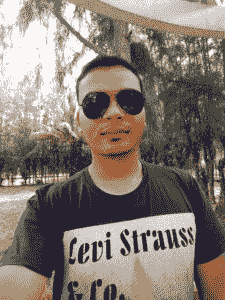
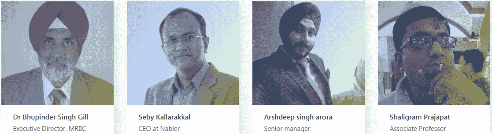
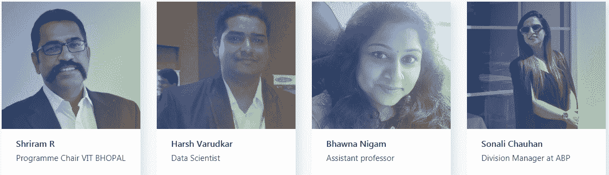
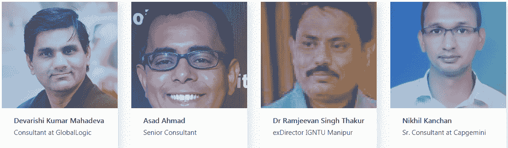

# 以下是 2018 年荒谬承诺的导师

> 原文：<https://www.edureka.co/blog/ridiculously-committed-mentors-2018>

*“More than mere teachers, mentors are often emancipators, freeing artists from poor technique, clouded vision, and personal uncertainty.” – Paul Soderberg*

**导师是每个人生活中非常重要的一部分，包括 IT 专业人士。事实上，一个好的导师可以建立或破坏一个年轻学徒的整个职业生涯。幸运的是，或者不幸的是，你的导师从不要求或期待你的任何回报。他们只是给予，给予，给予，甚至更多，将你定义为艺术家、内省企业家、企业家和专业人士。**

**几周前，Edureka 试图通过引入“荒谬承诺导师奖”来改变这一切这个想法是为了奖励这些呆在暗处的可笑的忠诚的人，让他们的天才发光。在接下来的几周里，来自不同领域的几位成功的专业人士提名了他们出色的导师，并尽最大努力确保他们获胜。但是，只能有少数赢家。**

## **筛选过程**

**2018 年*9 月 5 日*，我们在印度庆祝教师节的这一天，Edureka 宣布了**荒谬承诺导师奖 2018** ，以奖励那些致力于以自己的形象创造惊人领导者的杰出专业人士和领导者。该奖项向所有希望提名导师角逐终极大奖的专业人士开放。竞赛一宣布，我们就收到了来自全国各地的热烈响应。数百名专业人士在几周内提名了他们的导师。**

**随后，每位提名者都宣传了他们导师的个人资料，以获得尽可能多的选票。**大众投票**是我们评选获奖者的标准之一。另一个更重要的因素是由内部专家团队对所有被提名的导师进行的**密集面试**。**

**在所有这些评估完成后，每位导师都得到了一个**的最终分数，满分为 10 分**，该分数由不同部分组成，包括大众投票、面试环节和故事的强度，得分最高的导师成为我们光荣的获奖者。有趣的是，荒谬承诺导师奖的结果于 2018 年 10 月 5 日公布，这一天恰好是国际教师节。**

**话不多说，让我们来认识一下 Edureka 荒谬承诺导师奖的获奖者，以及为什么这些令人惊叹的专业人士应该获得这一荣誉的原因:**

## **一等奖:酒窝·朱妮佳·古普塔博士**

******

***斋浦尔普尔尼马大学院长(研究&发展)***

***“Dr. Juneja is one of the most versatile people I have ever met. She’s not just another Research Guide who makes students run around for time. Her suggestions & insights are valuable, to say the least. I’m grateful to her.” – Atul S, mentee of Dr. Juneja.***

****酒窝博士 Juneja Gupta 赢得一张**苹果 MacBook Pro&5000****edu reka现金。******

## ****二等奖:拉维·兰詹****

*****分析师*****

*****“Ravi is ridiculously committed to my learning and growth. He gives time for me for an hour every week to understand what new things I have learned and what I will learn the next week. He tries to get the solution out of me every time there is a problem rather than instructing me to solve it in a particular way.” – Mahesh Chandan, mentee of Mr. Ranjan.*****

## ******二等奖:Saumya Saxena******

*******高级通信工程师*******

*******“Technically, professionally and mentally, Saumya helped me with what would have been a tremendous ask working in a customer service based environment. She made me stand on my feet making me resolve my issues while always keeping me feel that she is there for me.” – Animesh Lochan, mentee of Ms. Saxena*******

******Ravi Ranjan & Saumya Saxena 赢得一个**苹果 MacBook Air&5000****edu reka****现金各一份。********

## ******亚军:******

|  |
|  |
|  |
|  |
|  |

******以上 20 位导师每人赢得**亚马逊 Kindle 电子书阅读器&5000 edu reka 现金。********

******为了激励所有被提名的导师，Edureka 还向每位参赛导师颁发了**感谢证书&5000 edu reka 现金。********

******那么，你的导师是否名列前茅？点击查看[完整的获奖者名单并找出答案。](https://www.ridiculouslycommitted.com/winners)******

******我们希望这个为期一个月的比赛能够激励所有这些优秀的导师继续为印度新兴的 IT 和服务行业做出贡献，并激励新的和有抱负的导师跟随这些被证明是荒谬的忠诚的人的脚步。******