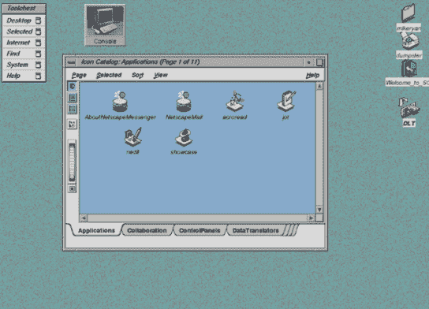
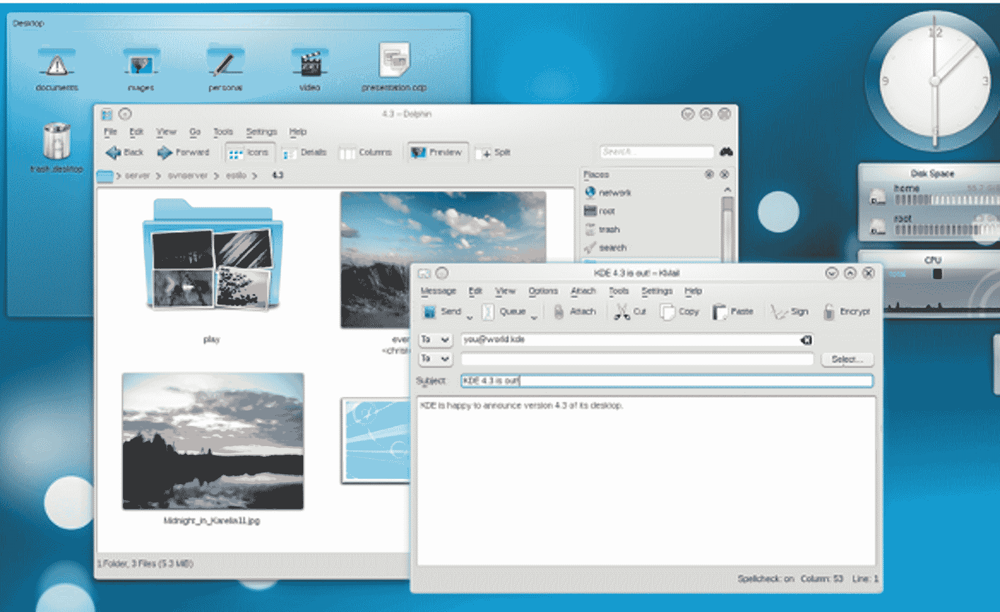
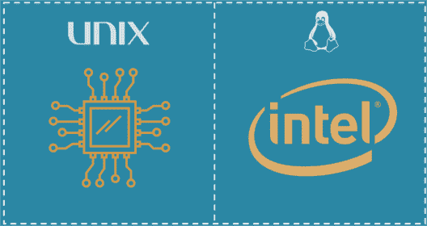

# Unix 与 Linux:差异与比较

> 原文：<https://www.edureka.co/blog/unix-vs-linux/>

Linux 是从零开始编写的 Unix 克隆。但这就是全部吗？在这篇 ***Unix vs Linux*** 的文章中，我们将揭示这两种操作系统的相似之处和不同之处。

微小的复杂性让人们在这两者之间做出选择，虽然 Unix 在历史上一直主导着市场，但在过去几年里，对经过认证的专业人员的需求一直在全速增长。

*   [**什么是 Unix？**](#whatisunix)
*   [**什么是 Linux？**](#whatislinux)
*   [**Unix 和 Linux 的区别**](#unixvslinux)
*   [**Unix 的局限性**](#limitationsofunix)
*   [**Linux 的局限性**](#limitationsoflinux)

## **Unix vs Linux:Unix 是什么？**

**Unix** 是一个专有操作系统。这是一个稳定的多用户、多任务系统，适用于服务器、台式机和笔记本电脑。Unix 是一种在公司、大学、大企业等中流行的操作系统。

这种操作系统诞生于 20 世纪 60 年代末的 AT & T 贝尔实验室，被称为 Unix。用 C 语言编写，它允许更快的修改、接受和移植。

在贝尔实验室的 Ken Thompson 领导下的一个人项目开始成为最广泛使用的操作系统之一。

Unix 操作系统最初在命令行界面上工作，但是最近，在 Unix 系统上已经有了 GUI 的发展。

## **Unix vs Linux:****什么是 Linux？**

**Linux** 是一个开源、免费使用的操作系统，广泛用于计算机软硬件、游戏开发、平板电脑、大型机等。

Linux 是由 Linus Torvalds 于 1991 年在赫尔辛基大学创建的，它的名字来源于 Linux 内核。

让它脱颖而出的是它可以安装在各种类型的电脑、手机、平板电脑、视频游戏机等设备上。

Linux 的发展是自由和开源软件合作最突出的例子之一。今天，许多公司和类似数量的个人已经发布了他们自己的基于 Linux 内核的操作系统版本，例如苹果的 iOS。

## ****

## **Unix vs Linux**

### **用法**

Unix 主要用于互联网服务器和工作站，而 Linux 可以被任何人使用，从初学者到开发人员到纯粹的爱好者。

### **发展&发行**

Unix 发行版主要是由 AT & T 和各种商业供应商以及非盈利组织开发的。另一方面，Linux 是由开源开发团队开发的，并且由不同的供应商发布。

### **处理器**

在支持 x86/x64、Sparc、Power、Itanium、PA-RISC、PowerPC 等处理器的 PA-RISC 和安腾机器上可以使用 Unix。

最初为英特尔 x86 硬件开发的 Linux 使用的处理器数量更多，端口可用于几种不同的 CPU 类型。

### **文件系统支持**

Unix 支持 jfs、gpfs、hfs、hfs+、ufs、xfs、zfs 格式，而 Linux 支持 Ext2、Ext3、Ext4、Jfs、ReiserFS、Xfs、Btrfs、FAT、NTFS 等等。

### **外壳接口**

起初，Bourne Shell 是 Unix 的默认设置。现在它可以兼容很多其他的 shell，包括 BASH，Korn&c . BASH(Bourne SHell)是 Linux 默认的 SHell。它可以支持多个命令解释器。

### **图形用户界面**

最初，Unix 是一个基于命令的操作系统，但后来创建了一个 GUI，称为 ***通用桌面环境*** 。大多数发行版现在都附带了 Gnome。

Linux 通常提供两种 GUI，&Gnome。但是有数以百万计的替代品如 LXDE、Xfce、Unity、Mate、、T5 等。

### **便携性**

虽然 Unix 是不可移植的，但 Linux 是可移植的，并且可以使用 u 盘启动。

由于原始 Unix 的专有性质，用户必须等待一段时间，才能获得正确的错误修复补丁。但这些并不常见。到目前为止，Unix 中已报告了 80 到 120 种病毒。

威胁检测和解决非常快，因为 Linux 主要是由社区驱动的，每当任何 Linux 用户发布任何类型的威胁，世界各地的几个开发人员就开始着手处理。到目前为止，Linux 已经列出了大约 60-100 种病毒，这些病毒目前还没有传播。

### **源代码**

虽然 Unix 树的发行版是开源的，如 NetBSD、OpenBSD 和 FreeBSD，但 Unix 是由不同的供应商开发的，如 IBM、HP 等。满足他们的业务需求。他们不会向公众发布源代码。 于是，Linux 被开发出来了，源代码也在 GNU 许可下向公众发布了。

### **牌照**

不同版本的 Unix 根据各自的供应商有不同的成本结构。

Linux 可以通过杂志、书籍、网站等免费分发和下载。也有付费版本，但老实说，除了支持合同，付费和免费发行版之间几乎没有区别。

## **Unix vs Linux | Linux 管理员认证培训| Edureka**

[https://www.youtube.com/embed/7L5JMj82vYU?rel=0&controls=0&showinfo=0](https://www.youtube.com/embed/7L5JMj82vYU?rel=0&controls=0&showinfo=0)*This Unix vs Linux Tutorial video will help you understand the basic differences between both of these operating systems while giving you an idea about each of the Operating Systems.*

## **Unix 的局限性**

*   至少可以说，Unix 的界面不友好、简洁、不一致，而且不容易记忆。
*   Unix 操作系统并不是为快速性能而设计的。
*   Shell 界面可能很危险，因为输入错误可能会破坏文件。
*   Unix 的版本缺乏整体的一致性，因为它因机器而异。
*   Unix 不提供任何有保证的硬件中断响应时间，所以它不支持实时响应系统。

## **Linux 的局限性**

*   Linux 没有任何标准版本
*   Linux 对驱动程序的支持不全面，这可能会导致整个系统无法正常工作。
*   很多 Windows 专属的程序只有借助复杂的仿真器才能在 Linux 上运行。比如说。微软 Office。【T2

*Edureka 的 [**Linux 培训**](https://www.edureka.co/linux-admin) 帮助你从零开始获得强大的 Linux 基础。该培训旨在培养您成为一名 Linux 专业人员&通过帮助您掌握重要的 Linux 概念，如 Linux 安装、软件包、架构、文件系统、用户管理、脚本数据&各种有用的命令和实用程序，帮助您运行应用程序、在系统和网络上执行所需的功能、创建网络配置并维护安全管理。*