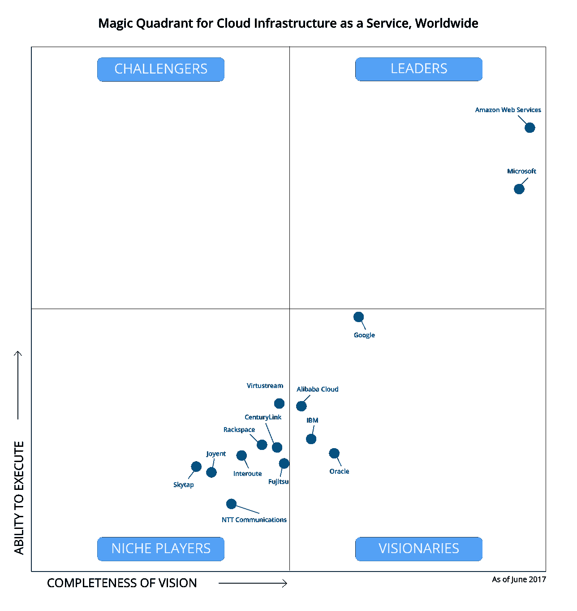

# 学习 AWS 的十大理由

> 原文：<https://www.edureka.co/blog/10-reasons-to-learn-aws/>

AWS 是所有云服务平台中的全球领导者。仍然想知道 AWS 是否适合你？通过这个博客，我将给出学习 AWS 的 10 大理由，并在你的架构中阐明它。想知道今年你应该掌握哪些技能？

本博客将重点阐述以下原因:

1.  [定价](#Pricing)
2.  [灵活性&扩展性](#Flexibility&Scalability)
3.  [全球架构](#GlobalArchitecture)
4.  [PaaS 祭](#PaaSOfferings)
5.  [一致性&可靠性](#Consistency&Reliability)

7.  [定制](#Customization)
8.  [恢复](#Recovery)

10.  [API](#API)

在我开始之前，我想让你看看 Gartner 的这份报告，它比较了领先的云服务提供商:

****

你甚至可以通过 [AWS 云迁移认证](https://www.edureka.co/migrating-to-aws)查看迁移到 AWS 的细节。

让我们逐一看看这些原因:

## **10。API**

AWS 为您提供各种编程语言的 API，帮助您以编程方式管理基础设施。API 帮你:

*   启动一个新实例
*   进行备份

API 帮助您利用 AWS 的所有节省时间和成本的功能。有一些第三方 API 可以很好地满足您的需求。

## **9。安全**

云安全一直是争论的话题。但是 AWS 在这方面做得很好。AWS 为小型和大型公司确保最高级别的安全性。最好的事情是，由于 AWS 为你做了这些，你作为一个企业主不必担心它。 AWS 还通过广泛的安全支持网络提供各种合规计划，提供对可疑活动和潜在漏洞的实时洞察。

## **8。恢复**

对于一些企业来说，即使是少量的停机或数据丢失也会带来灾难。对于其他人来说,(有限的)停机时间/数据丢失的成本不会超过维护多站点/热备用恢复方法的成本。但是无论**您的企业对停机/数据丢失的容忍度有多高**，AWS 的多功能平台都能为您的灾难恢复计划提供合适的工具。

**查看我们在顶级城市的 AWS 认证培训**

| 印度 | 美国 | 其他国家 |
| [在海德拉巴的 AWS 培训](https://www.edureka.co/aws-certification-training-hyderabad) | [亚特兰大 AWS 培训](https://www.edureka.co/aws-certification-training-atlanta) | [AWS 伦敦培训](https://www.edureka.co/aws-certification-training-london) |
| [班加罗尔的 AWS 培训](https://www.edureka.co/aws-certification-training-bangalore) | [波士顿 AWS 培训](https://www.edureka.co/aws-certification-training-boston) | [阿德莱德的 AWS 培训](https://www.edureka.co/aws-certification-training-adelaide) |
| [钦奈的 AWS 培训](https://www.edureka.co/aws-certification-training-chennai) | [纽约市的 AWS 培训](https://www.edureka.co/aws-certification-training-new-york-city) | [新加坡 AWS 培训](https://www.edureka.co/aws-certification-training-singapore) |

## **7。定制**

但是 AWS 的灵活性并不止于此。该平台还允许高度定制，以满足个别企业的需求。例如，客户定义的标记允许用户轻松监控和管理资源。从成本跟踪和安全到组织和自动化，几乎没有限制如何或为什么可以使用可定制的 AWS 标签。

## **6。调度**

选择 AWS 的另一个原因是能够在预定的时间启动和停止各种实例。例如，安排弹性计算云(EC2)和关系数据库服务(RDS)等服务的能力意味着它们不必在非工作时间或周末运行。在 CloudRanger 等第三方工具的帮助下，不需要编写脚本。这就引出了我们的下一点。

## **5。一致性&可靠性**

虽然 AWS 是一个非常有用的备份和灾难恢复平台，但它也非常可靠。尽管今年早些时候发生了一次高调的停机事件，**的一项独立审查**发现，自 2015 年以来，AWS“在保持其公共云服务的运行方面远远好于微软或谷歌。”它还发现，在同一时间段内，平台总停机时间的 40%与一次停机有关。

## **4。PaaS 祭**

我们知道 AWS 是高度可扩展的。它在数据库、缓存、数据仓库、代码转换、存储、备份、基础设施管理&应用管理的托管服务中复制了类似的方法。这有助于减少花费在设置&管理基础设施上的总时间&。这有助于降低整体上市成本。

## **3。全球建筑**

在您决定为您的服务器选择一个位置之前，位置起着非常重要的作用。当我们谈论云服务提供商时，AWS 是全球领导者。它为其数据中心使用“区域”和“可用区域”等标签。 AWS 在全球 16 个地理区域拥有 44 个可用性区域。更多可用性区域正在开发中。

## **2。灵活性&可扩展性**

既然我已经提到了可伸缩性，让我们先来讨论一下。从一开始，亚马逊就一直关注可扩展性。这种灵活性意味着企业可以轻松地扩大或缩小规模，以满足业务需求。AWS 也采用了同样的哲学，这极大地帮助了用户。这个极其灵活的系统现在是 AWS 的标志，也是选择 AWS 的主要原因之一。因此，按需可伸缩性和灵活性在学习和使用 AWS 的十大理由中找到了自己的位置。

## **1。学习 AWS 的 10 大理由:定价**

这可能是学习和使用 AWS 的十大理由中最受欢迎的。对于新手和想了解技术的人来说，AWS 有一个**免费层**可供访问一年。这足以让一个人开始。AWS 非常灵活，并提供**现收现付方式**，可以极大地帮助满足您的业务需求。灵活的定价极大地支持根据需要扩展或缩减体系结构。

## AWS 云从业者| AWS 认证云从业者–完整课程| AWS 培训| Edureka

[https://www.youtube.com/embed/XjPUyGKRjZs?rel=0&showinfo=0](https://www.youtube.com/embed/XjPUyGKRjZs?rel=0&showinfo=0)This ‘AWS Cloud Practitioner’ tutorial video will give you a complete understanding of the AWS Cloud platform and help you prepare for the AWS Certified Cloud Practitioner Examination.

这篇关于学习 AWS 的 10 大理由的博客到此结束。我们推出了一套课程，涵盖了您通过解决方案架构师考试所需的全部内容！可以看看 ***[AWS 认证培训](https://www.edureka.co/aws-certification-training)*** 的课程详情。

将您的所有疑问放在评论区，这样我们可以在第一时间回复您。