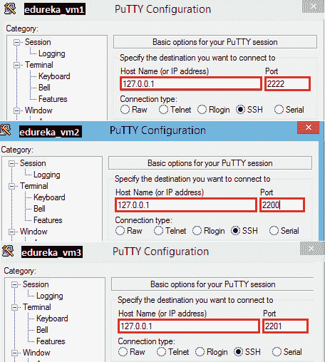

# 使用 vagger 创建多个虚拟机的 10 个步骤

> 原文：<https://www.edureka.co/blog/10-steps-to-create-multiple-vms-using-vagrant/>

到目前为止，您一定已经看到了如何使用 vagger 安装单个开发环境(VM)。如果你还没有看完这篇文章，请参考我之前的博客[](https://www.edureka.co/blog/development-environment-using-vagrant/)。

在这篇博客中，我们将会看到如何使用 vagger 创建多个虚拟机。但是在开始之前，我们必须了解创建相同配置的多个虚拟机的要求。

**需求 1:** Hadoop 是当今最前沿的技术之一，可以通过创建 Hadoop 集群来使用。有时，您不需要一个完全成熟的集群，只需两台服务器即可。但是，您至少需要三个 datanodes。在这种情况下，您可以使用一台服务器作为 namenode(因为 Namenode 是一台高端机器),在另一台服务器上，您可以创建 3 个虚拟机并将它们用作 3 个 datanodes。

**要求 2:** 你在一个生产环境中工作，你正在处理一个大项目。众所周知，在我们将项目部署到活动服务器之前，项目必须在开发服务器上开发，并在测试服务器上测试。这些服务器具有相同的配置。因此，我们可以使用 vagrant 一起创建这些服务器，而不是单独构建它们。

可能还有许多其他需求可以利用这个特性。我鼓励你在这个博客上评论你的需求，这样它也能帮助其他人。

假设你已经安装了流浪者和虚拟盒子。现在，让我们来看看如何使用 vagrant 创建多个虚拟机:

**第一步:**打开终端(Linux 或 Mac)或命令提示符(Windows)

**第二步:**为流浪者创建一个新的目录:

```
$ mkdir vagrant_multi_edureka
$ cd vagrant_multi_edureka
```

**第三步:**初始化一个新的流浪文件。

```
$ vagrant init
```

**第四步:**安装流浪箱。我们在这个博客中使用“chef/centos-6.5”。你可以在这里看到[](https://atlas.hashicorp.com/boxes/search?.com&vagrantcloud=1 "List of Boxes")的箱子列表。

```
$ vagrant box add chef/centos-6.5
```

**第五步:**更新游民档案如下:

```
# This defines the version of vagrant
Vagrant.configure(2) do |config|
	# Specifying the box we wish to use
	config.vm.box = "chef/centos-6.5"
	# Adding Bridged Network Adapter
	config.vm.network "public_network"
	# Iterating the loop for three times
	(1..3).each do |i|
		# Defining VM properties
		config.vm.define "edureka_vm#{i}" do |node|
			# Specifying the provider as VirtualBox and naming the VM's
			config.vm.provider "virtualbox" do |node|
				# The VM will be named as edureka_vm{i}
				node.name = "edureka_vm#{i}"  
			end
		end
	end
end
```

**步骤 6:** 让我们启动爱德华卡 _vms，即:**爱德华卡 _vm1，爱德华卡 _vm2** 和**爱德华卡 _vm3** :

```
$ vagrant up
```

恭喜你！您已经使用单个浮动文件创建了三个虚拟机。你一定想知道如何使用它。您可以使用 ssh 来访问它。您可以使用以下主机和端口号连接虚拟机:**edu reka _ vm1**–>主机:127.0.0.1 **|** **端口:**2222**edu reka _ vm2**–>主机:127 . 0 . 1***|***【T19

**第七步:**从[这里](http://the.earth.li/~sgtatham/putty/latest/x86/putty.exe "Putty Download")下载 putty (windows shh 客户端)。运行应用程序并连接到虚拟机。

[](https://www.edureka.co/blog/wp-content/uploads/2015/01/putty__.png)

**第 8 步:**您需要输入用户名和密码登录虚拟机。这对于所有三台虚拟机都是一样的。请使用以下凭据:

**用户名:**流浪者 **|密码:**流浪者

**步骤 9:** 您需要使用 putty 分别登录每个虚拟机，以便访问它们。

**第十步:**最后，你需要明白这是否符合你的要求。因此，你会明白如何使用流浪者获得最大的利益。

有问题要问我们吗？请在评论区提到它，我们会给你回复。

**相关帖子:**

[](https://www.edureka.co/blog/mystery-of-devops/ "Mystery Of Devops")

[devo PS——重新定义你的 It 战略](https://www.edureka.co/blog/videos/devops-redefining-your-it-strategy/ "Devops-Redefining-your-It-Strategy")

[上手 devo PS](https://www.edureka.co/devops)