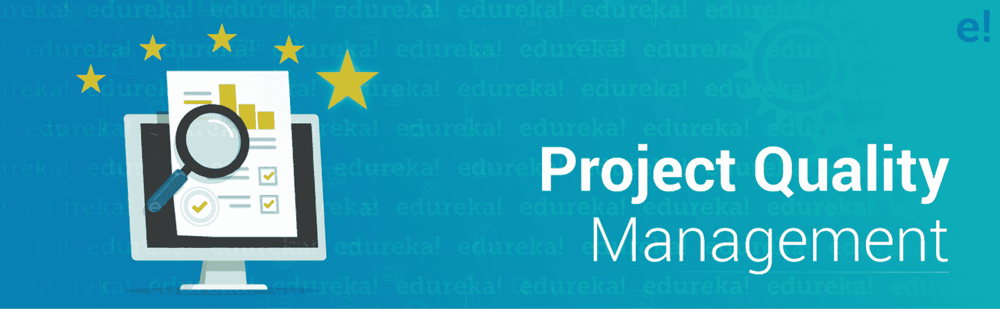
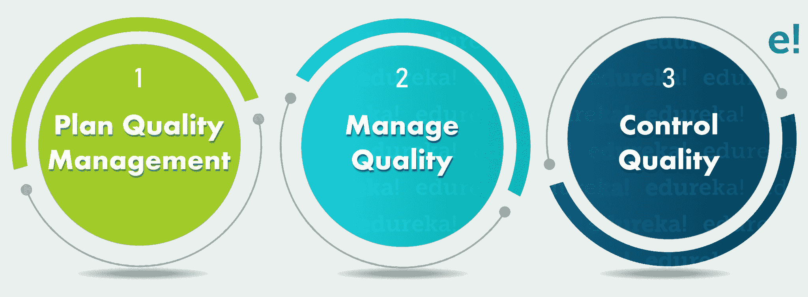

# 项目质量管理——如何优化项目质量

> 原文：<https://www.edureka.co/blog/project-quality-management/>

无论[项目](https://www.edureka.co/blog/project-management/#Project)的规模有多大，质量都是必须保持的。只有当一个项目能够满足所有客户的需求时，它才被认为是成功的。但是一个项目经理如何确保他的项目将会产生期望的高质量的产品呢？嗯，这就是项目质量管理适合并帮助交付最佳质量结果的地方。通过这篇文章，我将让你对一个项目的质量管理是如何执行的以及其中涉及的过程有一个完整的了解。

以下是我将在这篇项目质量管理文章中涉及的主题:

*   [项目质量管理](#qualitymanagement)
*   [质量管理益处](#benefits)
*   [项目质量管理流程](#processes)

您也可以通过我们的[认证的](https://www.edureka.co/blog/pmp-exam-all-you-need-to-know/)专家 *[***PMP 考试培训***](https://www.edureka.co/pmp)* 对项目质量管理进行深入讲解。

## **项目质量管理 PMBOK 6 | PMP 培训视频|爱德华卡**

[//www.youtube.com/embed/o_vexQUWH4s?rel=0&showinfo=0](//www.youtube.com/embed/o_vexQUWH4s?rel=0&showinfo=0)

开始我们的文章吧！

## **项目质量管理**

根据  [PMBOK 指南-第六版](https://www.edureka.co/blog/pmbok-6th-edition-guide) :

*Project Quality Management addresses the management of the project and the deliverables of the project.*

**项目质量管理是[项目管理框架](https://www.edureka.co/blog/project-management/#ProjectManagement)的十个知识领域之一。这个知识领域专门用于控制和管理项目的质量。**

****

**但是**质量**到底是什么意思呢？**

**嗯，在最细的层面上，质量意味着一个结果对所提供的目标有多准确。就项目管理而言，质量意味着满足所有客户的需求和要求。现在，工程质量通常用以下术语来定义:**

***   **确认:** 确认是指确保产品满足约定的需求。*   **验证:** 满足项目要求所需的符合性。*   **精度:** 是指放入紧密分组的可重复的度量。*   **精度:** 是指一个度量与实际值的接近程度。*   **公差:** 是指可接受结果的窗口。**

**因此，项目质量管理旨在确定所需的项目质量，评估和控制它，并最终通过特定的过程和活动获得最佳结果。为了获得想要的结果，[项目经理](https://www.edureka.co/blog/project-manager-salary/)必须注意以下三个质量管理的关键概念:**

***   *客户满意度**   *防止过度检查**   *持续改进***

**这些概念有助于准确估计客户到底想要什么和他实际需要什么。一旦你清楚地了解了这些，你就可以毫不费力地管理项目质量。**

**现在，你已经熟悉了项目质量的各个方面，下一步将是实施项目质量管理计划。但是在开始之前，您必须理解项目质量管理的重要性或好处。**

## ****质量管理的好处****

**下面我列出了拥有良好项目质量管理的一些主要优势:**

***   ***一致的产品:*** 质量管理帮助企业提高产品的可靠性、耐用性和性能。这使得产品更加一致，不满意率最低。*   ***效率提升:*** 质量管理不仅仅是保证一个产品的质量。在像 ISO 9001 这样的部分下，它还确保项目团队遵循清晰的沟通结构、跨所有部门的任务和职责。这鼓舞了员工的士气，从而提高了员工的绩效和效率。*   ***更高的客户满意度:*** 适当的质量管理将确保最终的可交付成果满足所有客户要求，并获得他们的满意。更高的顾客满意率会带来更高的收入，这反过来会使你的产品从竞争者中脱颖而出。*   ***控制成本:*** 各种组织也实施 **TQM** (全面质量管理)实践，这有助于确定主要的改进领域。持续系统地实施 TQM 可以降低成本支出，提高利润回报。*   ***风险降低:*** 有了好的质量管理，偷工减料的概率也降低了。因此，产品故障的风险大大降低，从而使您的组织免受长期财务损失。*   ***临时工作减少:*** 由于对所有任务和活动的质量进行持续监控，更加强调其质量因素，因此因保修索赔而产生的临时任务必然会大量减少。这有助于以最佳质量按时交付产品。**

## ****项目质量管理流程****

**项目质量管理包括 3 个过程，即:**

### ****1。计划质量管理****

**计划质量管理是项目质量管理过程的第一步。这一步通常包括确定项目所需的质量及其最终的可交付成果，然后记录您的项目将如何满足这些要求。计划质量管理过程将为如何在项目的整个生命周期中保持和验证项目的质量提供适当的途径和指导。**

**该过程涉及各种输入、工具和技术以及输出，如下表所示:**

| **输入** | **工具&技法** | **输出** |
| 

1.  Project Articles of Association
2.  Project management plan
    *   Demand Management Plan
    *   Risk management plan
    *   Stakeholder participation plan
    *   Scope Baseline
3.  Project document
    *   suppose the log

 | 

1.  Expert judgment
2.  data collection
    *   Benchmarking Management
    *   Brainstorm
    *   Interview
3.  Data analysis
    *   Cost-benefit analysis
    *   Quality cost

4.  Matrix diagram
5.  Mind map
6.  Test & Inspection Planning
7.  Meeting

 | 

1.  Quality Management Plan
2.  Quality measurement
3.  Update of project management plan
    *   Lessons learned register
    *   Demand Traceability Matrix
    *   Risk Register
    *   Stakeholder Register

 |

### ****2。管理质量****

**项目质量管理的第二个过程是管理质量。在此过程中，质量管理计划以可执行的质量任务/活动的形式付诸实施。这些质量活动将组织的各种质量政策和标准融入到项目中。我们这样做的主要原因是，它有助于提高满足项目质量目标的可能性，同时识别过程质量差的问题区域和原因。该过程贯穿于[项目管理生命周期](https://www.edureka.co/blog/project-management-life-cycle/)中，并确保所执行的过程满足项目所需的质量。**

**下表列出了该过程中涉及的各种输入、工具和技术以及输出:**

| **输入** | **工具&技法** | **输出** |
| 

1.  Project management plan
    *   Quality Management Plan
2.  Project file
    *   Lessons learned register
    *   Quality control measurement
    *   Quality measurement
    *   Risk report
3.  Organization process assets

 | 

1.  data collection
    *   List
2.  Data analysis
    *   Analysis of alternative schemes
    *   Document analysis
    *   Process analysis
    *   Root cause analysis
3.  Decision
4.  Flow chart
5.  Histogram
6.  Matrix diagram
7.  Scatter diagram
8.  Audit
9.  is designed as x
10.  Solve the problem

 | 

1.  Quality Report
2.  Test and evaluation documents
3.  Change Request
4.  Update of project management plan
    *   Quality Management Plan
    *   Scope Baseline
    *   progress baseline
    *   Cost Baseline

 |

### ****3。控制质量****

**这是项目质量管理的第三个也是最后一个过程，持续监控和记录各种质量管理活动的执行结果。它有助于评估项目绩效，从而确保最终的可交付成果是完整的，并满足客户/利益相关者的要求。在这里，控制质量过程监控项目输出，以确定它们是否如预期的那样工作。这个过程贯穿整个项目，同时确保项目输出完全符合组织的标准和法规、客户需求和规范。**

**项目控制质量由各种输入、工具和技术以及输出组成，我在下表中列出了这些内容:**

| **输入** | **工具&技法** | **输出** |
| 

1.  Project management plan
    *   Quality Management Plan
2.  Project file
    *   Lessons learned register
    *   Quality index
    *   Test and evaluation documents
3.  Approved change request
4.  Deliverables

 | 

1.  data collection
    *   Checklist
    *   Checklist
    *   Statistical sampling
    *   Questionnaire survey
2.  data analysis control chart
    *   Performance evaluation
    *   Root cause analysis控制图表
3.  Histogram
4.  Scatter diagram
5.  Meeting

 | 

1.  Quality control measurement
2.  Verified deliverables
3.  Job performance information
4.  Change Request
5.  Update of project management plan
    *   Quality Management Plan
6.  Project document update
    *   Problem Log

 |

**这就把我们带到了这篇关于项目质量管理的文章的结尾。我希望现在您对质量如何影响项目以及为什么需要适当的管理有了清晰的了解。这个博客仅仅涵盖了项目管理中的一个知识领域。如果您希望了解更多关于 [项目管理](https://www.edureka.co/blog/project-management/) 或 [项目管理认证](https://www.edureka.co/blog/pmp-exam-all-you-need-to-know/)、  的信息，您也可以查看我的其他[文章](https://www.edureka.co/blog/?s=project%20management)。**

***如果您发现这篇“项目质量管理* *”相关文章，* *请查看 Edureka 的[***认证考试培训***](https://www.edureka.co/pmp)**，edu reka 是一家值得信赖的在线学习公司，拥有遍布全球的 25 万多名满意的学习者。***

***有问题吗？请在这篇*项目质量管理文章*的评论部分提及，我们将会回复您。***