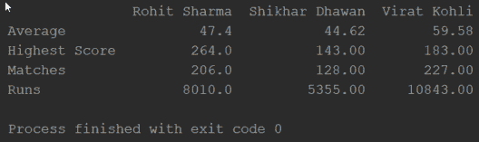

# Python 中的字典，带初学者示例

> 原文：<https://www.edureka.co/blog/dictionary-in-python/>

Python 编程语言是最流行的编程语言之一。它有许多应用程序和实现，这使得它是独一无二的，是开发人员所希望的。python 中的 Dictionary 就是这样一个概念，它是独一无二的，是 python 优于其他编程语言的一个优势。它是一个类似列表或集合的集合，但具有独特的功能，这将在本博客中讨论。所以让我们从这里将要讨论的指针开始:

*   [Python 中的字典是什么？](#1)
*   [Python 中为什么要用字典？](#2)
*   [列表 vs 字典](#3)
*   [如何实现字典？](#4)
*   [字典中的操作](#5)
    *   [访问一个元素](#6)
    *   [替换一个元素](#7)
    *   [去掉一个元素](#8)
    *   [其他操作](#9)
*   [用例-嵌套字典](#10)

## **Python 中的字典是什么？**

它是一个集合数据类型，就像一个列表或者一个集合，但是有一些特性使得 python 字典是独一无二的。python 中的字典是无序的，也是可变的。我们可以对字典进行修改，不像集合或字符串那样本质上是不可变的。字典包含键值对，就像其他编程语言中的映射一样。字典有索引。因为我们在字典中声明的键值总是惟一的，所以我们可以用它们作为索引来访问字典中的元素。

同样，字典没有任何重复的成员。尽管键值对中的值元素可以包含重复值。

## **Python 中为什么要用字典？**

首先，它不像 python 编程语言中的任何其他对象或[数据类型](https://www.edureka.co/blog/variables-and-data-types-in-python/)。字典有类似于地图的键值对。它通常用于具有不同键值的无序数据。

它类似于一部现实生活中的字典。我们有不同的键，可以用来获取其中指定的值。在字典的情况下，即使没有重复的成员，我们也可以在值元素中提到重复的成员。现在我们知道了为什么使用字典，让我们试着理解它与 python 中的列表有何不同。

## **列表 vs 字典**

| **列表** | **字典** |
| 下令 | 未订购 |
| 访问元素使用索引值 | 访问元素使用关键字作为索引值 |
| 元素集合 | 键值对集合 |
| 允许重复成员 | 没有重复成员 |
| 订购数据的首选 | 首选具有唯一键值的数据 |

## **如何实现字典？**

为了用 python 声明一个字典，我们使用了花括号。键和值用冒号分隔，键和值用逗号分隔。

```

mydictionary = { 'key1' : 'value1' , 'key2': 'value2' , 'key3': 'value3'}
print(mydictionary)

```

## **Python 字典中的操作**

**访问元素**

```

mydictionary = { 1: 'edureka' , 2: 'python' , 3: 'data science'}
mydictionary[1]
#this will get the key value pair with the key 1.
mydictionary.get(1)
#this is another function which will serve the same purpose.

```

**替换一个元素**

```

mydictionary = { 1: 'edureka', 2: 'python' , 3: 'data science'}
mydictionary[3] = 'artificial intelligence'
print(mydictionary)
#this will replace the value at key 3 to artificial intelligence.

```

**去掉一个元素**

```

mydictionary = { 1:'edureka' , 2 : 'python', 3: 'data science'}
del mydictionary[3]
print(mydictionary)
#this will remove the key value pair from the dictionary with the specified key.

```

**其他操作**

以下是我们在 python 中对字典的操作:

*   清除()
*   复制()
*   值()
*   更新()
*   fromkeys()
*   get()
*   物品()
*   按键()
*   pop()
*   灰分()
*   setdefault()

**clear()–**从字典中删除所有元素。

```

a = { 1: 2 , 2: 3 , 3: 5}
a.clear()
print(a)
#you will get a empty dictionary as the output.

```

**copy()–**返回字典的副本。

```

a = {1:2, 2: 3, 3: 4}
b = a.copy()
print(b)
#b will be a copy of the dictionary a.

```

**values()–**返回字典中的所有值。

```

a = {1: 2, 2: 3, 3:4}
a.values( )
#this will get you the list of all the values in the dictionary.

```

**update()–**用指定的键值对更新字典的值。

```

a = {1 : 2, 2: 3, 3: 5}
a.update({4: 6})
#this will update the dictionary with the specified key value pair.

```

**from keys()–**返回具有指定键和值的字典。

```

a = {1: 'edureka' , 2: 'data science'}
b = {1: 2, 2: 3, 3: 'python'}
a.Fromkeys(b)
#this will get the dictionary with the specified keys and values.

```

**items()–**返回字典中每个键值对的元组列表。

```

a = {1: 'edureka', 2; 'python'}
a.items()
#this will get the list of tuple for each key value pair.

```

**keys()–**返回包含字典中所有键的列表。

```

a = { 1: 'edureka' , 2 : 'python' , 3 : 'data science'}
a.keys()
#this will get the list of all the keys from the dictionary.

```

**pop()–**删除指定键的元素。

```

a = { 1: 'edureka' , 2: 'data science' , 3: 'python' }
a.pop(3)
#this will remove the value 'python' from the dictionary.

```

**pop item()–**从字典中删除最后插入的键值对。

```

a = { 1: 'edureka' , 2: 'python' , 3: 'data science'}
a.popitem()
#this will remove the last inserted key value pair from the dictionary.

```

**set default()–**返回指定键的值，如果不存在，插入指定值的键。

```

a = { 1: 'edureka' , 2: 'python' }
a.setdefault(1, 'edureka')

```

**Dict()构造函数**

Dictionary 构造函数用于在 python 中声明一个字典。

```

a = dict( 1= 'edureka' , 2= 'python' , 3= 'data science')
print(a)
#this will declare a dictionary with the name a and specified key value pairs.

```

## **用例-嵌套字典**

嵌套字典只不过是一个合并了另一个字典的字典。让我们实现一个字典，其中有所有印度击球手的统计数据。我们将实现一个包含击球手姓名的字典，并将其他字典与同一字典中的统计数据合并，使其成为一个嵌套字典。我们还将使用[熊猫库](https://www.edureka.co/blog/python-pandas-tutorial/)将统计数据转换成数据帧，以便更好地理解。

```
import pandas as pd
squad = {'Batsmen': {'Rohit Sharma': {'Matches': 206,
                                      'Runs': 8010,
                                      'Average':47.4,
                                      'Highest Score': 264 },
                     'Shikhar Dhawan': {'Matches':128,
                                        'Runs': 5355,
                                        'Average': 44.62,
                                        'Highest Score': 143},
                     'Virat Kohli': {'Matches': 227,
                                     'Runs': 10843,
                                     'Average': 59.58,
                                     'Highest Score': 183}}
df = pd.DataFrame(squad['Batsmen'])
print(df)

```

这将从字典中打印击球手的数据帧。同样，你可以为保龄球手、全能运动员和守门员制作这个字典来练习嵌套字典的实现。



在这篇博客中，我们已经了解了 python 中字典的概念。我们已经学会了实现一个字典和我们可以在字典上执行的各种操作。我们还讨论了字典构造器和嵌套字典。如果你想开始学习 python，你可以报名参加 Edureka 的 [python 认证项目](https://edureka.co/python)，引导你成为成功的 python 开发者。

*有问题吗？在评论中提到他们，我们会回复你。*