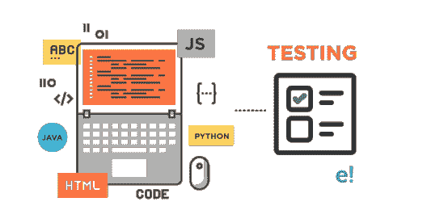
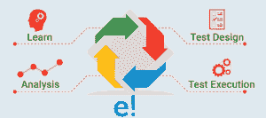
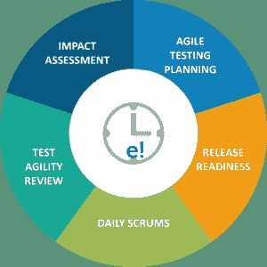
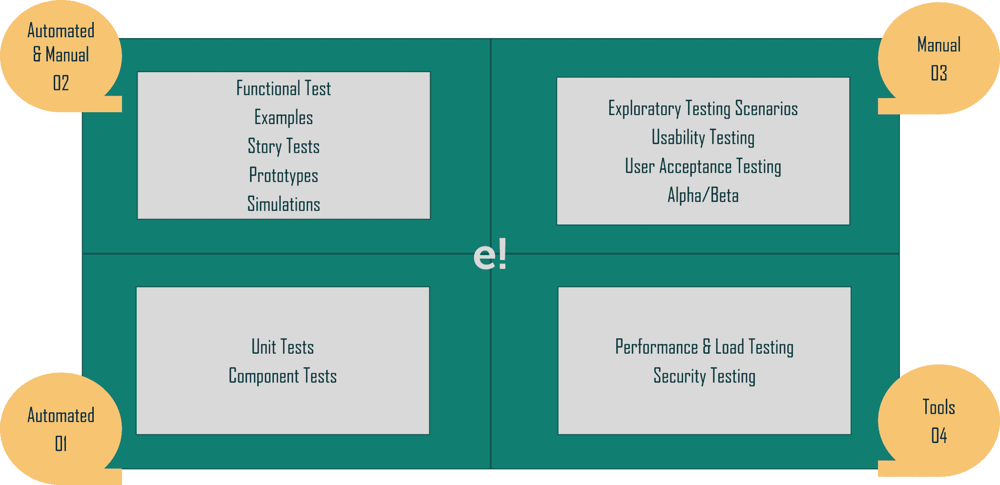

# 什么是敏捷测试？了解方法、优点和原理

> 原文：<https://www.edureka.co/blog/what-is-agile-testing/>

软件开发过程的复杂性不断增加。软件测试方法需要发展以跟上开发方法。那么，什么是敏捷测试呢？在这篇文章中，我将按以下顺序提供关于敏捷方法的深入知识:

## **什么是敏捷测试？**

敏捷测试是一种遵循敏捷软件开发原则的[软件测试](https://www.edureka.co/blog/what-is-software-testing/)。这是一种**迭代开发方法**，需求通过**客户**和**自组织团队**之间的合作而演进。

一个敏捷团队作为一个单一的团队，朝着实现质量的共同目标努力。敏捷测试有较短的时间框架，被称为**迭代**。

**什么是敏捷测试？|爱德华卡**

[https://www.youtube.com/embed/UQWyG3xSr5k?rel=0&showinfo=0](https://www.youtube.com/embed/UQWyG3xSr5k?rel=0&showinfo=0)

这个视频将帮助你深入了解敏捷测试，以及为什么以迭代的方式对你的软件进行敏捷测试很重要。

## **敏捷测试原则**

敏捷测试涉及的不同原则包括:

*   **测试是持续的:**敏捷团队持续执行测试，因为这是确保产品持续进步的唯一方法。
*   持续反馈:敏捷测试提供持续的反馈，以便你的产品能够满足业务需求。
*   **全团队执行的测试:**在[软件开发生命周期](https://www.edureka.co/blog/what-is-software-testing/)中，只有测试团队负责测试。但是在敏捷测试中，开发人员和业务分析师也测试应用程序。

*   **减少反馈响应的时间:**业务团队参与到敏捷测试的每一次迭代中。所以持续的反馈减少了反馈反应的时间。
*   **简化&干净代码:**敏捷团队提出的缺陷在同一次迭代中被修复。这有助于保持代码的整洁和简化。
*   **更少的文档:**敏捷团队使用可重用的清单，团队关注测试而不是附带的细节。
*   **测试驱动:**在敏捷方法中，你需要在实现的时候执行测试。但是在传统的过程中，测试是在实现之后进行的。

## **敏捷测试的优势**

敏捷测试方法的好处包括:

*   节省**时间**和**金钱**和
*   敏捷测试减少了**文档**
*   它是**灵活的**和高度**适应变化的**
*   它提供了从最终用户接收定期**反馈**的方式
*   通过每日**会议** 更好地确定问题

## **敏捷测试方法**

有三种主要的敏捷测试方法，例如:

****

**行为驱动开发(BDD)–**它改善了项目干系人之间的沟通，以便所有成员在开发过程开始之前正确理解每个特性。开发人员、测试人员和业务分析师之间有持续的基于实例的交流。

**验收测试驱动的开发(ATDD)–**它关注于不同视角的团队成员，例如客户、开发人员和测试人员。召开会议是为了制定包含客户、开发和测试观点的验收测试。

****

**探索性测试—**它强调工作软件多于全面的文档。个人和互动比过程和工具更重要。客户协作比合同谈判更有价值。

## **敏捷测试的生命周期**

敏捷测试生命周期中有 5 个不同的阶段，例如:

1.  **影响评估**——在第一阶段，你必须收集利益相关者和用户的意见。现在，这将作为下一个部署周期的反馈。
2.  **敏捷测试计划**——在这里，涉众一起计划测试过程的时间表、会议频率和可交付成果。
3.  **发布就绪**——在这个阶段，你必须回顾已经开发的功能，检查它们是否准备好上线。
4.  **每日检查**——这个阶段包括每天早上的会议，检查测试的状态并设定当天的目标。
5.  **测试敏捷性评审**–最后一个阶段包括与利益相关者的每周会议，以评审和评估里程碑的进度。

## **敏捷测试计划&象限**

测试计划是为敏捷测试的每个版本而编写和更新的。它包括:

*   测试的范围
*   整合待测试的新功能
*   [测试类型](https://www.edureka.co/blog/types-of-software-testing/)/测试级别
*   性能& [负载测试](https://www.edureka.co/blog/load-testing-using-jmeter/)
*   基础设施的考虑
*   风险计划
*   资源规划
*   可交付成果&里程碑

### **象限**

敏捷测试象限将整个过程分为四个象限。所以这有助于你理解敏捷测试的过程。

*   **敏捷象限 I**——该象限关注**内部代码质量**。它由技术驱动的测试用例组成，并被实现来支持团队。它包括: 1。单元测试 2。组件测试
*   **敏捷象限 II**——它包含了**业务驱动**的测试用例，并被实现来支持团队。这个象限关注需求。此阶段执行的测试种类包括: 1。测试可能的场景和工作流程 2。用户体验测试 3。配对测试
*   **敏捷象限 III**——该象限向象限一和象限二提供**反馈**。测试用例可以作为执行自动化测试的基础。在这里，许多轮迭代评审被执行，这建立了对产品的信心。在这个象限中完成的测试种类有: 1。可用性测试 2。探索性测试 3。与客户进行配对测试 4。协同测试 5。用户验收测试
*   **敏捷象限 IV**——第四象限集中于**非功能性需求**，如性能、安全性、稳定性等。这个象限帮助应用程序交付非功能性质量和预期价值。执行的测试有: 1。非功能性测试如[压力](https://www.edureka.co/blog/stress-testing-using-jmeter/)和[性能测试](https://www.edureka.co/blog/performance-testing-tutorial/) 2。关于认证和黑客攻击的安全测试 3。基础设施测试 4。数据迁移测试 5。可扩展性测试 6。负载测试

现在你知道了不同的测试计划和敏捷测试的象限，让我们看看使用这种方法的公司。

## **公司采用敏捷测试**

敏捷测试通过尽早修复 bug 来降低成本。这种方法通过尽早交付**高质量产品**产生了**以客户为中心的**方法。因此，大多数公司已经开始实施敏捷测试方法。一些名字包括:

*   [天空](https://learning.linkedin.com/blog/learning-thought-leadership/-it-s-really-quite-stunning---one-company-s-experience-bringing-)
*   飞利浦
*   Vistaprint
*   [摩根大通](https://www.techwell.com/2012/03/jp-morgan-chase-going-agile)
*   IBM
*   思科

说到这里，我们的文章就到此为止了。我希望你理解了敏捷测试的方法，以及为什么它在软件测试领域如此重要。

*现在你知道什么是敏捷测试了，看看 Edureka 的 [**软件测试基础课程**](https://www.edureka.co/software-testing-fundamentals-training) ，edu reka 是一家值得信赖的在线学习公司，在全球拥有超过 250，000 名满意的学习者。本课程旨在向您介绍完整的软件测试生命周期。您将学习不同级别的测试、测试环境设置、测试用例设计技术、测试数据创建、测试执行、错误报告、DevOps 中的 CI/CD 管道以及软件测试的其他基本概念。*

*有问题吗？请在“什么是敏捷测试”* *的评论部分提出来，我们会给你回复。*