# Spark Java 教程:用 Java 实现 Spark 的一站式解决方案

> 原文：<https://www.edureka.co/blog/spark-java-tutorial/>

**Java** 是软件开发中有效的编程语言，Scala 是大数据开发中使用的主流编程。两者的合作可以产生一个强大的组合。在这个 **[Spark Java](https://www.edureka.co/apache-spark-scala-certification-training) 教程中，**我们将在 Java 环境中使用 Spark 程序。我已经把我们的主题列表如下。

*   [什么是 Spark-Java？](#spark-java)
*   [对 Spark-Java 的需求](#need-spark-java)
*   [设置 Spark-Java 环境](#spark-java-set)
*   [Spark-Java 中的例子](#spark-java-ex)
*   [学生在考试中的表现:用例](#usecase)

## **什么是 Spark-Java？**


简单来说，Spark-Java 是解决 [**大数据**](https://www.edureka.co/blog/big-data-tutorial) 问题的组合编程方法。 [**Spark**](https://www.edureka.co/blog/spark-tutorial/) 用 [**Java**](https://www.edureka.co/blog/java-tutorial/) 和[**Scala**](https://www.edureka.co/blog/what-is-scala/)用 JVM 编译 Scala 写的代码。Spark 支持许多编程语言，如[**Pig**](https://www.edureka.co/blog/pig-tutorial/)[**Hive**](https://www.edureka.co/blog/videos/hive-tutorial/)Scala 等等。Scala 是为 Spark 应用程序构建的最杰出的编程语言之一。

## **对 Spark-Java 的需求**

 大多数软件开发人员在企业级使用 **Java** 感到很舒服，他们很少喜欢 Scala 或任何其他类型的语言。Spark-Java 就是这样一种方法，软件开发人员可以在 Java 环境中轻松运行所有的 Scala 程序和应用程序。

现在我们对 Spark Java 有了一个简单的了解，现在让我们进入下一阶段，我们将学习为 Spark Java 设置环境。我已经以步骤的形式排列了程序。

## **设置 Spark-Java 环境**

第一步:

*   安装最新版本的[](https://www.oracle.com/technetwork/java/javase/downloads/jdk8-downloads-2133151.html)[**JRE**](https://www.oracle.com/technetwork/java/javase/downloads/jre8-downloads-2133155.html)。

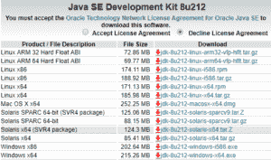

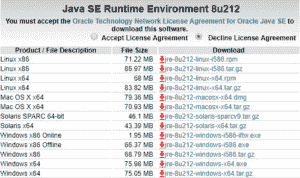

第二步:

*   安装最新版本的【WinUtils.exe】[](https://github.com/steveloughran/winutils/blob/master/hadoop-2.7.1/bin/winutils.exe)

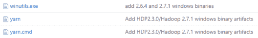

第三步:

*   安装最新版本的 [**阿帕奇 Spark。**](https://spark.apache.org/downloads.html)

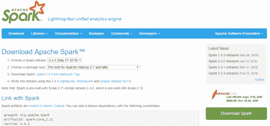

第四步:

*   安装最新版本的 [**阿帕奇 Maven**](https://maven.apache.org/download.cgi) 。

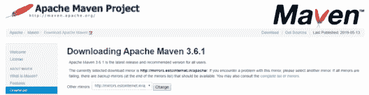

第五步:

*   安装最新版本的 [**Eclipse 安装程序**](https://www.eclipse.org/downloads/download.php?file=/oomph/epp/2019-03/R/eclipse-inst-win64.exe) 。

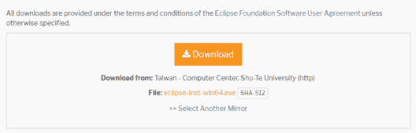

第六步:

*   安装最新版本的 [**Scala IDE**](http://scala-ide.org/) 。

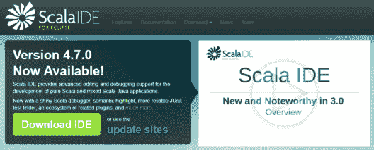

第七步:

*   设置以下项目的起始位置和路径:
    *   Java
    *   如下所示设置一个新的 Java_Home。

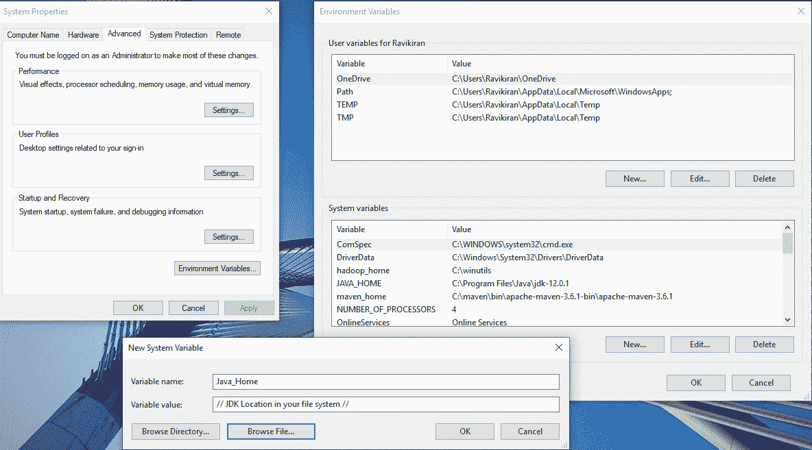


现在您已经具备了在 Java 上运行 Apache Spark 的所有要求。让我们用 Java 尝试一个 Spark 程序的例子。

**Spark-Java 中的例子**

在我们开始在 Java 环境中实际执行 Spark 示例程序之前，我们需要满足一些先决条件，我将在下面提到这些步骤，以便更好地理解这个过程。

第一步:

*   打开命令提示符，以主人身份在命令提示符下启动 Spark。

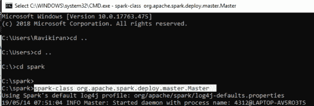

第二步:

*   打开一个新的命令提示符，并在命令提示符下再次启动 Spark，这次是作为一个 Worker 和 master 的 IP 地址。

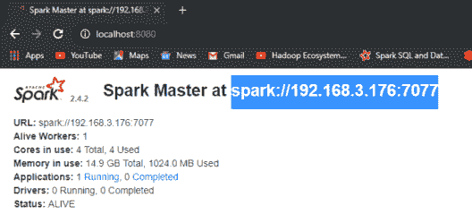

*   IP 地址可以在本地主机上找到:8080。

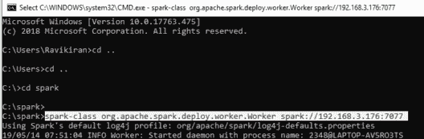

第三步:

*   打开一个新的命令提示符，现在你可以用主机的 IP 地址启动 Spark shell 了。

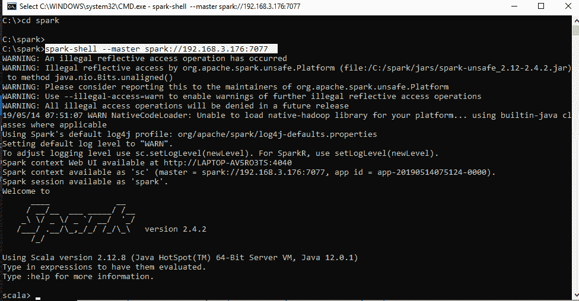

第四步:

*   现在您可以打开 Eclipse Enterprise IDE，设置您的工作场所，并开始您的项目。

第五步:

*   在 Eclipse IDE 上设置 Scala nature，并创建一个新的 maven 项目。
*   首先，我们将从 POM 开始。XML
*   下面的代码是 pom.xml 文件

```
<project  xmlns:xsi="http://www.w3.org/2001/XMLSchema-instance" xsi:schemaLocation="http://maven.apache.org/POM/4.0.0 http://maven.apache.org/xsd/maven-4.0.0.xsd">
<modelVersion>4.0.0</modelVersion>
<groupId>Edureka</groupId>
<artifactId>ScalaExample</artifactId>
<version>0.0.1-SNAPSHOT</version>
    <dependencies>
              <!-- https://mvnrepository.com/artifact/org.apache.spark/spark-core -->
              <dependency>
              <groupId>org.apache.spark</groupId>
              <artifactId>spark-core_2.12</artifactId>
              <version>2.4.2</version>
              </dependency>
    </dependencies>
</project>

```

第六步:

*   从你的 Scala 应用开始。
*   以下代码是针对 Scala 应用文件的。

```

package ScalaExample

import org.apache.spark.SparkConf
import org.apache.spark.SparkContext
import org.apache.spark.SparkContext._
import org.apache.spark.sql.SparkSession
import org.apache.spark.sql.SQLContext
import org.apache.spark.sql._
import org.apache.spark.sql.types.{StructType, StructField, StringType, IntegerType};

object EdurekaApp {
    def main(args: Array[String]) {
         val logFile = "C:/spark/README.md" // Should be some file on your system
         val conf = new SparkConf().setAppName("EdurekaApp").setMaster("local[*]")
         val sc = new SparkContext(conf)
         val spark = SparkSession.builder.appName("Simple Application").getOrCreate()
         val logData = spark.read.textFile(logFile).cache()
         val numAs = logData.filter(line => line.contains("a")).count()
         val numBs = logData.filter(line => line.contains("b")).count()
         println(s"Lines with a: $numAs, Lines with b: $numBs")
    spark.stop()
   }
}

```

输出:

**a 行:62，b 行:31**

现在我们已经对 Spark Java 有了一个简单的了解，让我们进入学生学习成绩的使用案例，以便更好地学习 Spark Java。

## **学生在考试中的表现:** **用例**

类似于我们之前的例子，让我们设置我们的先决条件，然后，我们将从我们的**用例**开始。我们的用例将讲述 [**学生在几门重要科目的考试中的表现**](https://www.kaggle.com/spscientist/students-performance-in-exams) 。


这就是我们的代码看起来的样子，现在让我们对我们的用例执行一个接一个的操作。

*   下面的代码是 pom.xml 文件

```
<project  xmlns:xsi="http://www.w3.org/2001/XMLSchema-instance" xsi:schemaLocation="http://maven.apache.org/POM/4.0.0 http://maven.apache.org/xsd/maven-4.0.0.xsd">
<modelVersion>4.0.0</modelVersion>
<groupId>ScalaExample3</groupId>
<artifactId>Edureka3</artifactId>
<version>0.0.1-SNAPSHOT</version>
    <dependencies>
                 <!-- https://mvnrepository.com/artifact/org.apache.spark/spark-core -->
                 <dependency>
                          <groupId>org.apache.spark</groupId>
                          <artifactId>spark-core_2.12</artifactId>
                          <version>2.4.3</version>
                 </dependency>
                 <!-- https://mvnrepository.com/artifact/org.apache.spark/spark-sql -->
                 <dependency>
                         <groupId>org.apache.spark</groupId>
                         <artifactId>spark-sql_2.12</artifactId>
                         <version>2.4.3</version>
                 </dependency>
                 <!-- https://mvnrepository.com/artifact/com.databricks/spark-csv -->
                 <dependency>
                         <groupId>com.databricks</groupId>
                         <artifactId>spark-csv_2.11</artifactId>
                         <version>1.5.0</version>
                 </dependency>
      </dependencies>
</project>

```

*   以下代码是针对 Scala 应用文件的。

```

package ScalaExample

import org.apache.spark.SparkConf
import org.apache.spark.SparkContext
import org.apache.spark.SparkContext._
import org.apache.spark.sql.SparkSession
import org.apache.spark.sql.SQLContext
import org.apache.spark.sql._
import org.apache.spark.sql.types.{StructType, StructField, StringType, IntegerType};

object EdurekaApp {
         def main(args: Array[String]) {
              val conf = new SparkConf().setAppName("EdurekaApp3").setMaster("local[*]")
              val sc = new SparkContext(conf)</pre>

              val sqlContext = new SQLContext(sc)
              val spark = SparkSession.builder.appName("Simple Application").getOrCreate()
              val customizedSchema = StructType(Array(StructField("gender", StringType, true),StructField("race", StringType, true),StructField("parentalLevelOfEducation", StringType, true),StructField("lunch", StringType, true),StructField("testPreparationCourse", StringType, true),StructField("mathScore", IntegerType, true),StructField("readingScore", IntegerType, true),StructField("writingScore", IntegerType, true)))
              val pathToFile = "C:/Users/Ravikiran/Downloads/students-performance-in-exams/StudentsPerformance.csv"
              val DF = sqlContext.read.format("com.databricks.spark.csv").option("header", "true").schema(customizedSchema).load(pathToFile)
              print("We are starting from here...!")
              DF.rdd.cache()
              DF.rdd.foreach(println)
              println(DF.printSchema)
              DF.registerTempTable("Student")
              sqlContext.sql("SELECT * FROM Student").show()
              sqlContext.sql("SELECT gender, race, parentalLevelOfEducation, mathScore FROM Student WHERE mathScore > 75").show()
              sqlContext.sql("SELECT race, count(race) FROM Student GROUP BY race").show()
              sqlContext.sql("SELECT gender, race, parentalLevelOfEducation, mathScore, readingScore FROM Student").filter("readingScore>90").show()
              sqlContext.sql("SELECT race, parentalLevelOfEducation FROM Student").distinct.show()
              sqlContext.sql("SELECT gender, race, parentalLevelOfEducation, mathScore, readingScore FROM Student WHERE mathScore> 75 and readingScore>90").show()
              sqlContext<span>("SELECT gender, race, parentalLevelOfEducation, mathScore, readingScore").dropDuplicates().show()</span>
              println("We have finished here...!")
       spark.stop()
    }
}

```

上面执行的 SparkSQL 语句的输出如下:

*   使用 println 功能打印出数据。
*   ```
    DF.rdd.foreach(println)
    ```

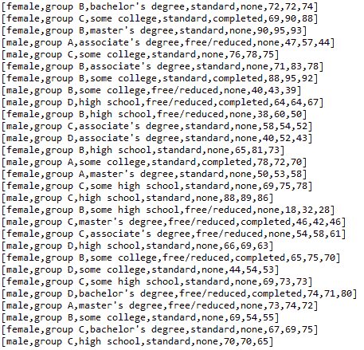

*   打印我们为数据设计的模式。
*   ```
    println(DF.printSchema)
    ```

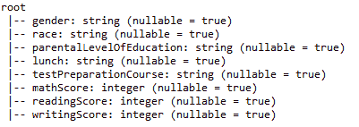

*   使用选择命令打印我们的数据帧。
*   ```
    sqlContext.sql("SELECT * FROM Student").show()
    ```

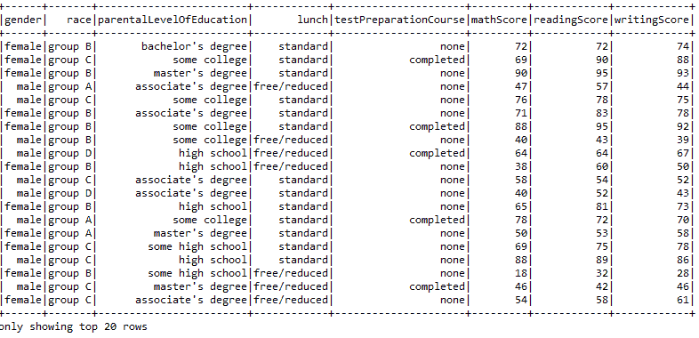

*   应用 WHERE 函数打印数学成绩在 75 分以上的学生的数据。
*   ```
    sqlContext.sql("SELECT gender, race, parentalLevelOfEducation, mathScore FROM Student WHERE mathScore > 75").show()
    ```

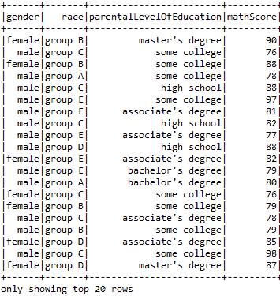

*   使用 Group By 和 Count 运算找出每组的学生人数。
*   ```
    sqlContext.sql("SELECT race, count(race) FROM Student GROUP BY race").show()
    ```

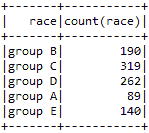

*   使用过滤操作找出在阅读方面被证明是最好的学生。
*   ```
    sqlContext.sql("SELECT gender, race, parentalLevelOfEducation, mathScore, readingScore FROM Student").filter("readingScore>90").show()
    ```

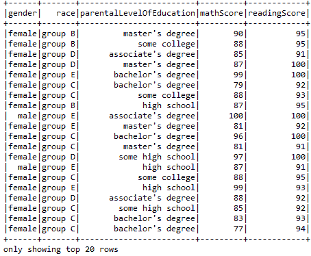

*   使用 Distinct 函数找出数据中的不同值。
*   ```
    sqlContext.sql("SELECT race, parentalLevelOfEducation FROM Student").distinct.show()
    ```

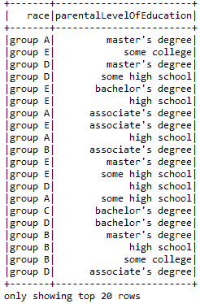

*   使用 And 函数比较多个实体。
*   ```
    sqlContext.sql("SELECT gender, race, parentalLevelOfEducation, mathScore, readingScore FROM Student WHERE mathScore> 75 and readingScore>90").show()
    ```

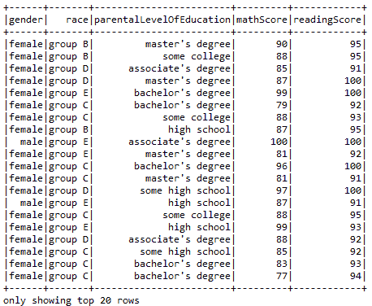

*   使用 DropDuplicates 功能删除重复条目。
*   ```
    sqlContext("SELECT gender, race, parentalLevelOfEducation, mathScore, readingScore").dropDuplicates().show()
    ```

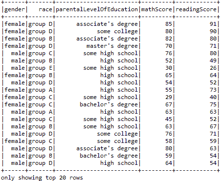

就这样，我们结束了这篇 Spark Java 教程文章。我希望我们对你关于 Spark、Java 和 Eclipse 的知识有所启发，它们的特性以及使用它们可以执行的各种类型的操作。

*本文基于 [**Apache Spark 和 Scala 认证培训**](https://www.edureka.co/apache-spark-scala-certification-training) 旨在为您准备 Cloudera Hadoop 和 Spark 开发者认证考试(CCA175)。您将深入了解 Apache Spark 和 Spark 生态系统，包括 Spark RDD、Spark SQL、Spark MLlib 和 Spark Streaming。您将获得关于 Scala 编程语言、HDFS、Sqoop、Flume、Spark GraphX 和 Kafka 等消息系统的全面知识。*