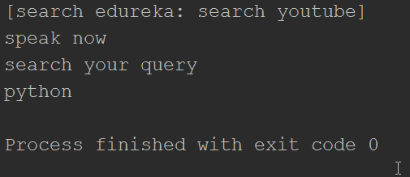

# 语音识别 Python:如何将语音翻译成文本？

> 原文：<https://www.edureka.co/blog/speech-recognition-python/>

言语是世界上最常见的交流方式。世界上大部分人口依靠语言相互交流。假设我们正在建立一个模型，而不是一个书面的方法，我们希望我们的系统能够响应语音，这变得相当困难，需要处理大量的数据。语音识别系统通过将语音翻译成文本来克服这一障碍。在这篇博客中，我们将介绍 python 中的语音识别[模块。以下是相同的列表:](https://www.edureka.co/blog/python-modules/)

*   语音识别是如何工作的？
*   [如何在 Python 中安装语音识别？](#2)
*   [从麦克风获取输入](#3)
*   [如何在 Python 中安装 Pyaudio？](#4)
*   [用例](#5)

## **语音识别是如何工作的？**

语音识别系统基本上将口头话语翻译成文本。有各种语音识别系统的实际例子。比如——Siri，它把语音作为输入，翻译成文本。

使用语音识别系统的优点是它克服了识字的障碍。语音识别模型既可以服务于有文化的观众，也可以服务于文盲观众，因为它侧重于口语话语。

我们还可以使用语音识别系统，列出世界上所有濒危语言的清单。虽然它看起来非常有趣，一点也不复杂，但语音识别系统在开发过程中面临着许多挑战。

**语音识别** **系统面临的挑战**

语音识别系统变得很难制造，因为当涉及到语音时，我们有如此多的可变性来源。

### **说话风格**

每个人都有不同的说话风格，包括口音。众所周知，我们说英语也有不同的口音。说到说世界上最通用的语言，有美国英语、英国英语和许多其他口音。发音也使得语音识别系统很难完全翻译语音。

### **环境**

环境也给系统增加了许多背景噪声。与礼堂相比，一个孤立的房间在背景噪音上有很大的可变性。即使是回声也会给系统增加很多噪声。

### **扬声器特性**

老年人的声音可能和婴儿的不一样。一个人讲话的特点取决于许多因素，包括刺耳和清晰。

### **语言限制**

有些口语表达在翻译时可能没有实际意义。

在克服了这些挑战之后，对于任何语音识别系统来说，将语音翻译成文本都是相当容易实现的。现在我们知道了语音识别是如何工作的，让我们看看 python 中可用于语音识别的不同的[包](https://www.edureka.co/blog/python-libraries/)。

**python 中可用于语音识别的包**

*   阿皮亚伊

*   语音识别

*   谷歌 _ 语音 _ 云

*   组装

*   Pocketsphinx

*   沃森 _ 开发者 _ 云

*   才智

我们将在本博客中详细介绍 SpeechRecognition 软件包，同时让我们回顾一下过去，了解语音识别系统这些年来是如何发展的。

语音识别的第一个原型实际上是一个玩具，名为**radio rex**，出现在 20 世纪 20 年代。它有一只坐在狗屋里的狗，只要有人说出 rex 这个词，它就会跳出来。

该模型的唯一问题是弹簧连接到电磁体上，电磁体对 500 赫兹左右的能量非常敏感。作为一个纯粹的频率检测器，它可以被称为语音识别模型。

1962 年，IBM 推出了一个鞋盒模型，它能够识别孤立的单词，还能进行一些算术运算。

接下来是来自 CMU 的哈比(HARPY)能够从 1000 个单词的词汇表中识别连接的语音。大约在 20 世纪 80 年代，人们开始使用统计模型，最常用的机器学习范例之一是隐马尔可夫模型。

在引入深度神经网络之后，大部分语音识别模型都工作在神经网络上。有了神经网络，可能性是不可想象的，词汇量可以达到一万个单词甚至更多。

## **如何在 Python 中安装 SpeechRecognition？**

要安装 speech recognition package is python，请在终端中运行以下命令，它将安装在您的系统上。


另一种方法是从项目解释器添加包，如果你使用的是 pycharm。

这个包有一个识别器类，它基本上是魔法发生的地方。它基本上是一个用来识别语音的类。下面是七种使用不同 API 读取不同音频源的方法。

*   识别 _bing()
*   识别 _ 谷歌( )
*   识别 _ 谷歌 _ 云( )
*   recognize_houndify()
*   recognize_ibm()
*   认可 _ 机智( )
*   recognize_sphinx()

现在，recognize_sphinx 也可以用来离线运行语音识别系统。它需要安装 Pocketsphinx。

```

import speechrecognition as sr

#instance of recognizer class
r = sr.Recognizer()

```

## **从麦克风获取输入**

要使用麦克风，我们还必须安装 pyaudio 模块。我们使用 microphone 类从麦克风获取输入语音，而不是像音频文件这样的任何其他输入方法。

对于大多数项目，我们可以使用默认麦克风。但是如果您不希望使用默认麦克风，您可以使用 list_microphone_names 方法获得麦克风名称列表。

为了捕捉来自麦克风的输入，我们使用 listen 方法。

```

import speechrecognition as sr

r = sr.Recognizer()

with sr.Microphone() as source:
      audio = sr.listen(source)

```

## **如何在 Python 中安装 Pyaudio？**

要在 python 中安装 Pyaudio，请在终端中运行以下命令，或者如果您使用的是 pycharm，请在设置中添加来自项目解释器的包。

## ****

## **用例**

我们将使用 python 中的 speechrecognition 模块编写一个程序来识别语音并执行以下操作:

1.  将演讲转换成文本
2.  使用 webbrowser 模块打开 URL
3.  使用语音识别传递查询以在 url 中进行搜索

以下是上述问题陈述的程序:

```
import  speech_recognition  as  sr
import  webbrowser  as wb

r1 = sr.Recognizer()
r2 = sr.Recognizer()
r3 = sr.Recognizer()

with  sr.Microphone()  as  source:
    print('[search edureka: search youtube]')
    print('speak now')
    audio = r3.listen(source)

if  'edureka'  in r2.recognize_google(audio):
    r2 = sr.Recognizer()
    url = 'https://www.edureka.co/'
    with  sr.Microphone()  as source:
        print('search your query')
        audio = r2.listen(source)

         try:
            get = r2.recognize_google(audio)
            print(get)
            wb.get().open_new(url+get)
        except  sr.UnknownValueError:
            print('error')
        except  sr.RequestError  as e:
            print('failed'.format(e))

if  'video' in r1.recognize_google(audio):
    r1 = sr.Recognizer()
    url = 'https://www.youtube.com/results?search_query='
    with  sr.Microphone() as source:
        print('search for a video')
        audio = r2.listen(source)

        try:
            get = r1.recognize_google(audio)
            print(get)
            wb.get().open_new(url+get)

        except sr.UnknownValueError:
            print('could not understand')
        except sr.RequestError as e:
            print(failed to get results'.format(e))

```



您将得到如图所示的输出。如果你说 edureka，它会提示你说出你想在我们写在 url 变量中的 edureka url 中搜索的查询。如果您说 python，您将在浏览器中打开以下网页。


在这篇博客中，我们讨论了如何在 python 中使用语音识别，通过 speech recognition 包将语音翻译成文本。[人工智能](https://www.edureka.co/blog/artificial-intelligence-with-python/)已经成为语音识别或物体沮丧等概念的当务之急，[深度神经网络](https://www.edureka.co/blog/pytorch-tutorial/)为语音识别系统提供了难以想象的可能性，我们可以在其中训练和测试大量语音数据来构建系统。您可以报名参加深度神经网络的 [Python 在线课程认证](https://www.edureka.co/python-programming-certification-training)，掌握您的技能，开始您的学习。

*有任何疑问吗？在评论中提到他们，我们会回复你。*