# 2021 年你必须练习的顶级 RPA 项目

> 原文：<https://www.edureka.co/blog/rpa-projects>

自动化自 20 世纪 50 年代初就已存在，但直到最近才开始得到认可。随着[机器人流程自动化](https://www.edureka.co/blog/robotic-process-automation/)成为 it 的主要领导者，毫无疑问，在 [RPA 熟练专业人员](https://www.edureka.co/robotic-process-automation-certification-courses)的帮助下，各种组织正在自动化他们的日常事务。因此，在这篇关于 RPA 项目的文章中，我将谈论一些顶级的 RPA 项目，你可以通过练习来提高自己在这一领域的技能。

本文将讨论 RPA 项目的以下主题:

*   [RPA 是什么？](#What%20is%20RPA?)
*   [RPA 工具](#RPA%20Tools)
*   [RPA 热门项目](#Top%20Projects%20of%20RPA)
    1.  [网页抓取](#Web%20Scraping)
    2.  [数据迁移&入口](#Data%20Migration%20and%20Entry)
    3.  [邮件查询处理](#Email%20Query%20Processing)
    4.  [发票处理](#Invoice%20Processing)
    5.  [客户支持邮件](#Customer%20Support%20Emails)

在我讨论顶级 RPA 项目之前，让我告诉你什么是 RPA。

## **什么是 RPA？**

在机器人/软件的帮助下自动化工作流程以减少人工参与的过程被称为 [**机器人流程自动化。**](https://www.edureka.co/blog/what-is-robotic-process-automation/)

在这里，你主要需要了解三个术语:*机器人、过程*和*自动化。*让我给你逐一解释这些术语。

*   **机器人:**模仿人类行为的实体称为机器人。
*   **过程:**导致有意义活动的一系列步骤。比如泡茶的过程或者你喜欢的菜等等。
*   **自动化:**任何由机器人完成的没有人为干预的过程。

如果我们将所有术语总结在一起，那么，在没有任何人类干预的情况下，模仿人类的行动来执行一系列步骤，从而导致有意义的活动，这被称为 [**机器人过程自动化**。](https://www.edureka.co/blog/rpa-tutorial/)

现在，由于在 RPA 行业中，物理机器人不起作用，我们需要市场上可用的工具，让我们配置自动化工作流来自动化您的业务运营。因此，接下来在这篇关于 RPA 项目的文章中，让我们讨论一下 RPA 工具。

## **RPA 工具**

[RPA 工具/供应商](https://www.edureka.co/blog/rpa-tools-list-and-comparison/)是一种软件，通过它您可以配置任务以实现自动化。在今天的市场上，有 RPA 供应商，如[蓝棱镜](https://www.edureka.co/blog/rpa-blue-prism/)、[自动化无处不在](https://www.edureka.co/blog/rpa-automation-anywhere/)、 [UiPath](https://www.edureka.co/blog/uipath-tutorial/) 、WorkFusion、Pega Systems 等等。但是，市场的领导者是三人组( ***UiPath*** ， ***蓝棱镜*** & ***自动化无处不在*** )。

那么，让我们来比较一下工具。

| **标准** | **ui path** | **蓝色棱镜** | **自动化随处可见** |
| **有试用版吗？** | 社区版/免费版可用 | 没有试用版 | 社区版/免费版可用 |
| **是否人性化？** | 提供了人性化的视觉设计器 | 提供了一个用户友好的可视化设计器，比任何地方的自动化都容易 | 开发者友好但对编程技能要求高。 |
| **人气** | 最流行的工具 | 比自动化更受欢迎 | 三人组中最不受欢迎的工具 |

表 1:RPA 工具之间的比较–RPA 项目

现在，您已经对 RPA 及其工具有了一个概念，让我们来看看最重要的 RPA 项目。如果你想要一个同样的视频讲座，请参考下面的视频:

## ui path 和 Automation Anywhere 中的顶级 RPA 项目|真实 RPA 项目

[https://www.youtube.com/embed/OJ-XuKiOoPc?rel=0&controls=0&showinfo=0](https://www.youtube.com/embed/OJ-XuKiOoPc?rel=0&controls=0&showinfo=0)This session on RPA Projects will help you understand the top RPA Projects in today’s industry with hands-on in UiPath and Automation Anywhere.

## **RPA 热门项目**

许多行业都在使用 RPA 来根据组织的要求从简单到复杂地实现自动化。RPA 最常用于客户服务、会计、金融服务、医疗保健、人力资源和供应链管理等行业。

那么，现在让我们逐一看看 RPA 中的前 5 个项目。我将展示在 UiPath 或 Automation Anywhere 中自动化任务的一步一步的过程。

### **RPA 项目:网页抓取**

Web 抓取是机器人流程自动化的一种应用，几乎应用于所有行业。无论是股票交易网站，电子商务网站，商品交易网站等，你可以根据自己的兴趣从其中任何一个网站抓取数据。

现在，手动执行网页抓取的问题是，它很容易出错，并且花费大量时间。此外，网站上的数据从来都不是静态的。它更新得非常频繁。因此，存储在某个实例点的数据可能并不总是准确的。

因此，工业可以简单地自动化这项任务。在这篇文章的下面，我将向你展示如何使用 UiPath 来自动完成这个任务。

#### **问题陈述:任务是为当今市场上的顶尖技术搜集 GitHub 库的数量。**

**How will you automate this task?**

#### **解:**

**步骤 1:** 将技术列表存储在一个 excel 表中，其中*列名为技术，存储库数量为*，如下所示。

**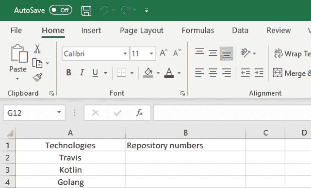第二步:**打开 **UiPath Studio** ，创建一个**空白项目**。提及项目名称、位置和描述。然后点击**创建**。参考下文。

**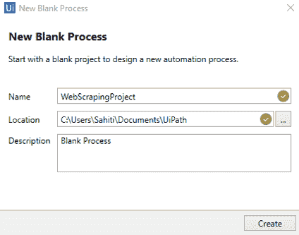第三步:**一旦您的仪表板打开，在**活动窗格**中搜索**流程图活动**，并将其拖动到工作区。*我们正在绘制流程图，以确保完全自动化的正确工作流程*。参考下文。

**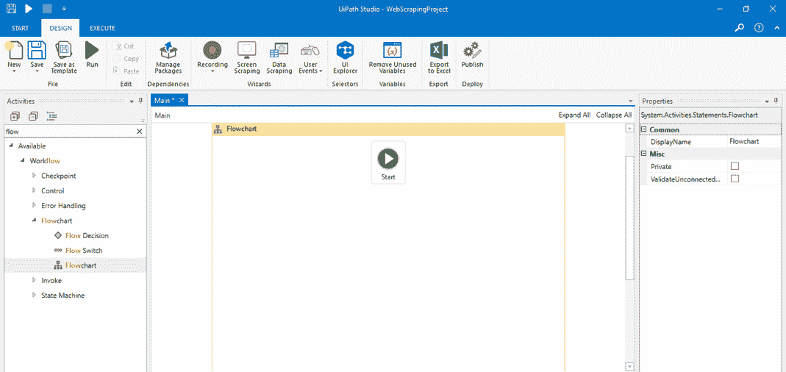第四步:**现在，从**活动窗格**中拖动一个**构建数据表**活动。将它与流程图的起点连接起来。

**步骤 4.1:** 双击活动，点击**数据表**选项。然后你必须提到列名。由于我们在 excel 表中只有两列，我们将在数据表中提到相同的列名。为此**点击编辑栏选项**并提及细节。参考下文。

**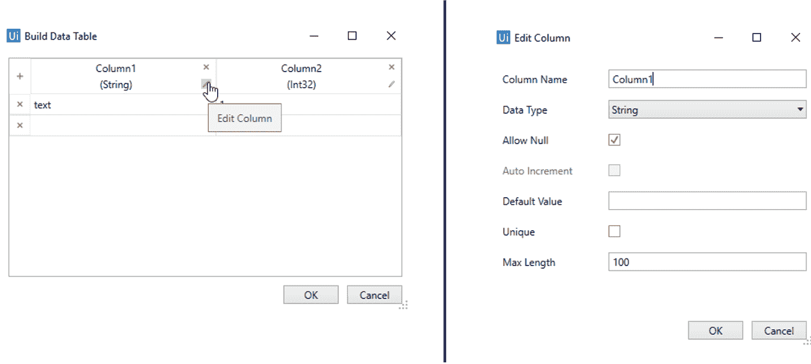第 4.2 步:**填写完详细信息后点击**确定。**这将创建一个数据表。数据表是一个表，UiPath 将使用它来读取 excel 文件中的数据，并将检索到的数据存储在 excel 文件中。参考下文。

**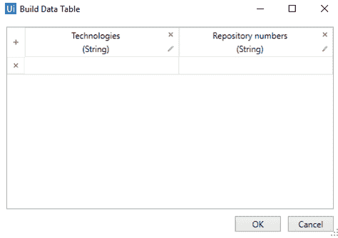步骤 4.3:** 接下来，在数据表活动**的输出部分提到一个变量来存储数据表的输出**。在这里，我把它称为*技术列表。*参考下文。

**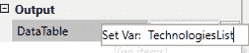第五步:**现在回到**流程图**，从**活动窗格**添加 **Excel 应用范围活动**，执行与 Excel 文件相关的动作。然后将**构建数据表**活动连接到流程图中的这个活动。

**步骤 5.1:** 双击 **Excel 应用范围活动**和**提及** excel 工作表的路径。然后，在该活动的 **Do 部分**中，从活动窗格中拖动**读取范围**活动，并提及**工作表名称和范围。**同样，在**读取范围活动**的**输出部分**中，提及您之前创建的数据表变量的**名称，即*技术列表*。参考下文。**

**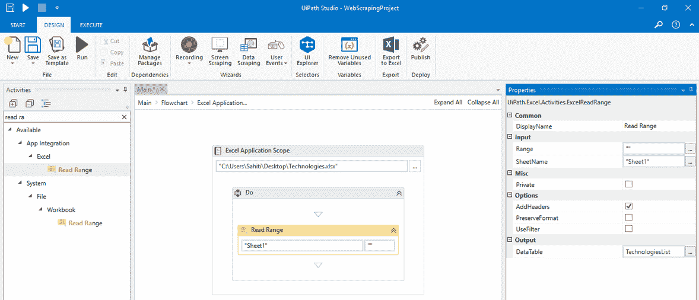第六步:**现在我们的下一步是从网页中提取元素。为此，**返回流程图**并从**活动窗格**中拖动一个**序列**。然后，将 **Excel 应用范围活动**连接到流程图中的这个序列，并将该序列重命名为 **Web Scrape** 以便于理解，如下图所示。

**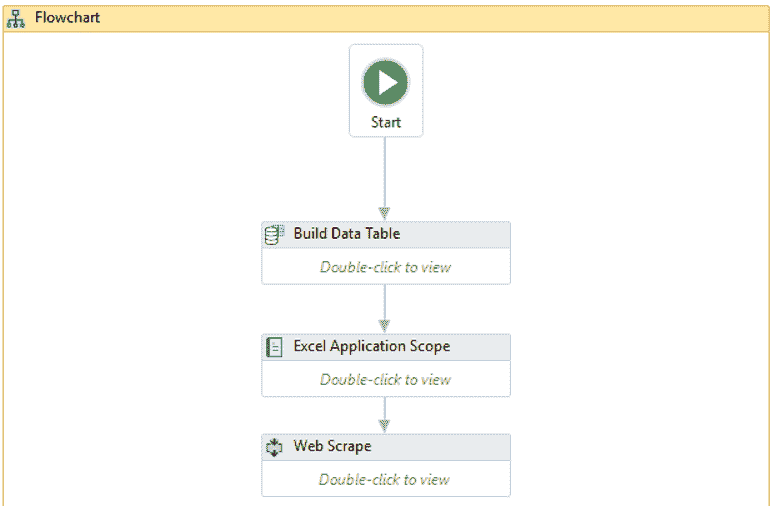步骤 6.1:** 现在双击网页抓取序列，拖动**打开浏览器活动**。在本活动中，提及您希望收集数据的 URL。我将在下面的双引号中提到 *** [ GitHub 搜索 URL ](https://github.com/search?utf8=%E2%9C%93&q=&type=) *** 。

**步骤 6.2:** 在此活动的 **Do 部分，将**附加浏览器活动**从活动窗格中拖动出来。然后只需在浏览器或屏幕上指示即可。这是为了确保所有的活动都必须发生在这个特定的网页上。**

**步骤 6.3:** 现在，**附加浏览器活动**的**做段**拖动**为每行活动**。在本练习中，提及**数据表变量**，即*技术列表*，为数据表中的每一行值启动一个循环。参考下文。

**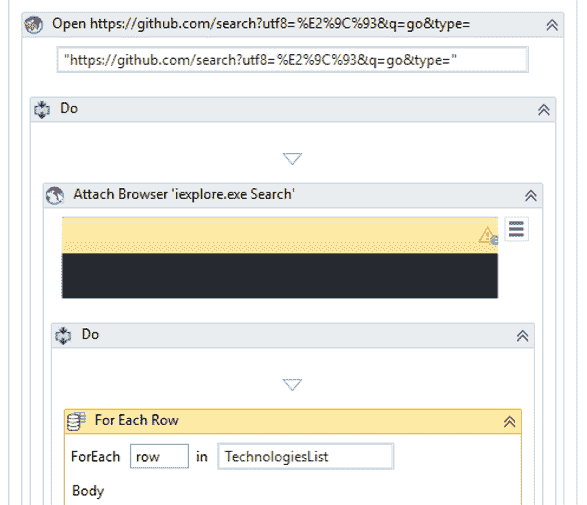第 6.4 步:**在上述活动的**主体部分**中，拖动**分配活动**并将**中的 **Techname 变量**提到部分**和**行(0)。将**值段**中的**串成如下图。这是从 excel 表中取出每个技术名称，并将其存储在变量 Techname 中。

**步骤 6.5:** 然后拖一个**延时活动**，提一个*左右的延时 10-30 秒。*

**步骤 6.6:** 现在，我们的下一个任务是自动键入技术名称。要做到这一点，你必须从活动窗格中**设置文本活动**。然后你必须在屏幕上指出文本应该自动输入的位置。在这里，我将在搜索栏中指明它。在本活动的文本部分，我将提到 *Techname 变量。*参考下文。

**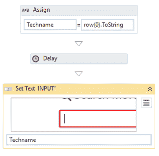步骤 6.7:** 然后拖一个**延迟活动**，提一个*左右的延迟 5-10 秒。*

**步骤 6.8:** 下一步，拖动**发送热键活动**，提键待**进入。**这将帮助你在网页上自动点击回车。

**步骤 6.9:** 现在，借助**延迟活动，再次添加延迟以避免 10-30 秒左右的任何误差。**参考下文。

**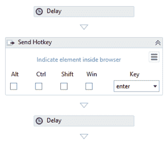步骤 6.10:** 完成上述步骤后，接下来您需要从活动窗格中拖动**获取文本活动**，并在浏览器上指示您希望提取数据的位置。在这里，我将在屏幕上指出存储库显示在哪里。此外，您必须在该活动的属性窗格的输出部分提到一个输出变量。这里我将提到变量 RepName。参考下文。

**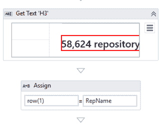步骤 6.11:** 最后，您必须拖动一个**分配活动**，并在 to 部分中提到行(1)和一个变量来存储存储库计数。即 RepName。参考上图。

**第七步:**现在，你要把数值存回 excel 文件。为此，**返回流程图**并从活动窗格添加**写范围活动**。将网页抓取序列连接到此活动，如下所示。

**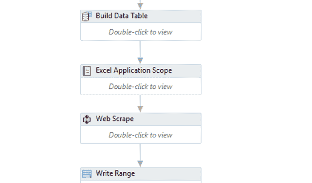第 7.1 步:**然后，**用引号提到 excel 表的路径**。另外**提及数据表的名称、工作表编号和单元格值**，它必须从该处开始写入数据。此处数据表名称为*工艺列表，*表号为*表 2* ，单元格值为 *AI* 。参考下文。

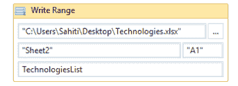

**第八步:**保存并执行设计好的自动化。

您将看到下面的输出。

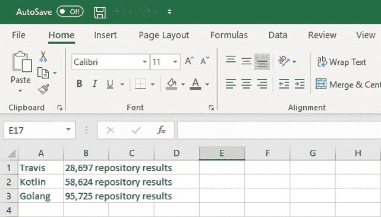现在，您已经知道如何自动执行 web 抓取任务，接下来，在这篇关于 RPA 项目的文章中，让我们来看看数据迁移&条目。

### **RPA 项目:** **数据迁移&录入**

在各种组织中，遗留系统每天都在执行重要的功能。现在，这些系统在从 API 中提取所需数据时可能存在依赖性问题。此外，您不能每天手动迁移和输入数据，因为每天都会生成海量数据。

这不仅乏味，而且容易出错，耗费时间。

嗯，您可以根据某些条件自动将数据从一个 excel 迁移到另一个 excel。在这篇文章的下面，我将向您展示如何使用 Automation Anywhere 来自动化这项任务。

#### **问题陈述:T** **问是从一个 excel 文件中提取数据，根据特定条件将其存储在另一个 excel 文件中。**

**How will you automate this task?**

#### **解:**

**第一步:**打开 Automation Anywhere 工作台。

在我继续这些步骤之前，让我展示一下我们要从中提取数据的文件。

**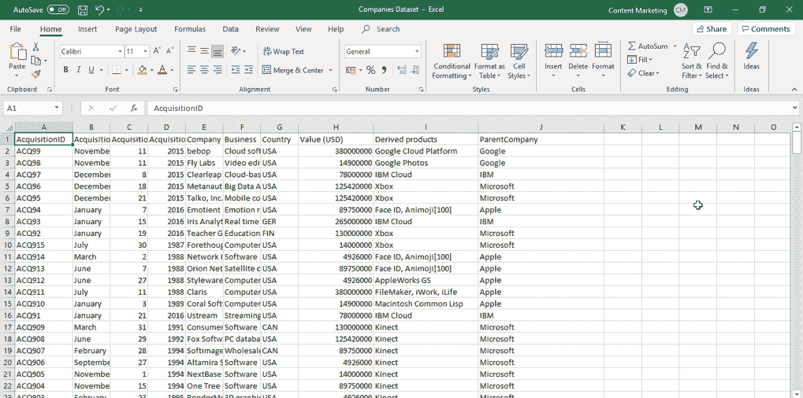第二步:**现在，下一步是打开两个电子表格。为此，**从 Excel 部分拖动打开电子表格命令**。参考下文。

**第三步:**提及第一张电子表格(你要从中提取数据)的**路径，点击**保存**。参考下文。**

****

**步骤 4:** 对第二个电子表格和**重复上述两个步骤，将会话名称更改为 Default1** ，这样就不会与第一个电子表格的会话名称冲突。参考下文。

**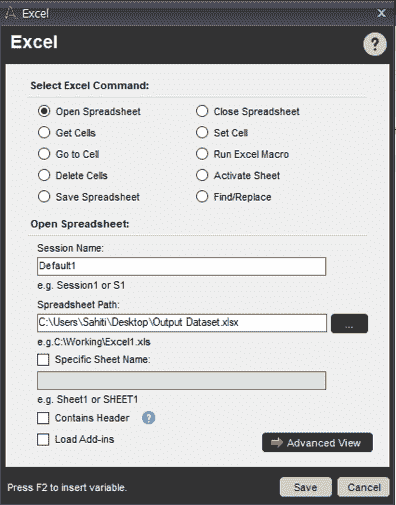第五步:**现在，**拖动获取单元格命令**和**选择获取所有单元格选项。**然后，将会话名称设为**默认的**(这是第一个电子表格的会话名称)。然后点击**保存。**参考下文。

**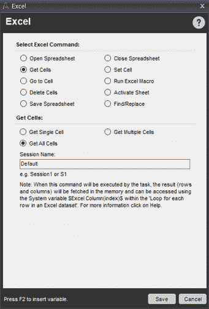第六步:**在打开两个电子表格的动作之间拖动**获取所有单元格动作**。这一步将帮助您从第一个电子表格的所有单元格中获取数据。

您的任务窗格应该如下图所示:

**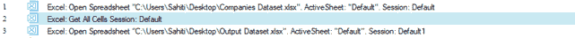第七步:**现在，你要开始一个循环。为此，**从循环部分拖动 Excel 数据集中的每一行命令**。提及会话名称作为**默认值。然后，点击**保存**。参考下文。**

**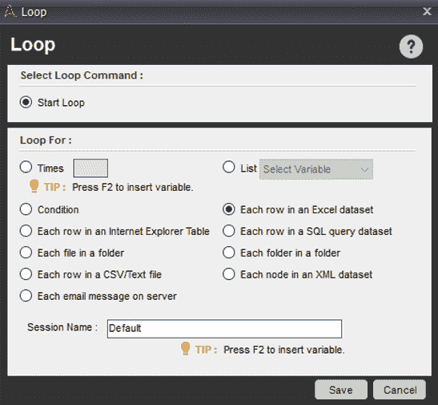第八步:**现在，你要提到你希望提取数据的条件。

***条件是提取值> 20000000 的所有行的数据，这些行属于美国，并且它们的母公司是 Apple 或 IBM。***

要做到这一点，请遵循以下步骤。

**步骤 8.1:** 从 **If 段拖拽**变量命令**。**

**步骤 8.2:** 现在点击**编辑选项**，使用以下步骤设置条件:

**步骤 8.2.1:** 通过按下 **CTRL + F2** 将**变量作为 Excel 列**，然后点击 **Insert** 。之后提到值 **8** ，因为我们想要在数据集的第 **8 列设置一个条件。按下**确定。****

***注:这里数据集的第 8 个列是值列。***

**步骤 8.2.2:** 现在，**选择操作员。**这里我将选择**大于(>)的运算符。**

**步骤 8 . 2 . 3:**值部分的**提及**值 **20000000 *，*** 点击**保存**。参考下文。

**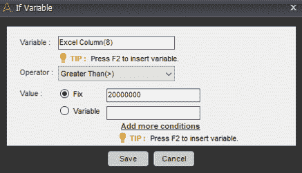第九步:**现在，从 **If 段拖拽**变量命令**。**

**步骤 9.1:** 现在点击**编辑选项**，使用以下步骤设置条件:

**步骤 9.1.1:** 通过按下 **CTRL + F2** 将**变量作为 Excel 列**，然后点击 **Insert** 。之后提到值 **7** ，因为我们想要在数据集的第 **7 列设置一个条件。按下**确定。****

***注:此处数据集中第 7 列为国家列。***

**步骤 9.1.2:** 现在，**选择操作员。**这里我将选择**等于运算符。**

**步骤 9 . 1 . 3:**值部分的**提及**值**美国*、*** ，点击**保存**。参考下文。

**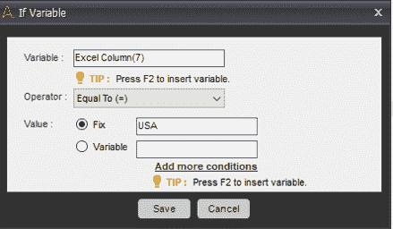第十步:**现在，再次从 **If 部分拖拽**变量命令**。**

**步骤 10.1:** 现在点击**编辑选项**，使用以下步骤设置条件:

**步骤 10.1.1:** 通过按下 **CTRL + F2** 将**变量作为 Excel 列**，然后点击 **Insert** 。之后提到值 **10** ，因为我们想要在数据集的第 **10 列设置一个条件。按下**确定。****

***注:此处数据集中第 10 列为父国家列。***

**步骤 10.1.2:** 现在，在继续下一步之前，创建两个变量，其中将存储 Apple 和 IBM 的值。为此，进入工作台右侧的**变量管理器**，添加变量。

**步骤 10.1.2.1:** 点击**添加选项**。在打开的对话框中，在**名称字段**中输入变量的名称，并点击**保存**。

**步骤 10.1.3:** 在值部分，**选择变量**和**点击添加更多条件**。参考下文。

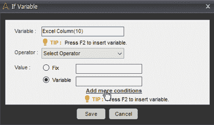

*这里，我创建了两个变量(var1 & var2)，var1 =苹果，var2 = IBM。*

**步骤 10.1.4:** 现在，在 value 部分，选择变量的选项，并点击添加更多条件。参考下文。

**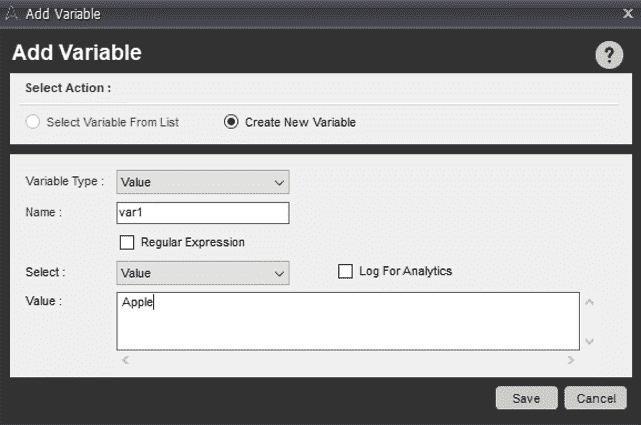步骤 10.1.5:** 接下来，选择匹配任意选项，并提及变量和等于运算符。然后点击**保存。**参考下文。

**第 11 步:**接下来，您必须针对数据集中存在的列数迭代填充数据的循环。由于数据集中有 10 列，您必须**迭代循环 16 次**。为此，从循环部分拖动**时间命令**，并在时间部分提及 **10。然后点击**保存**。参考下文。**

**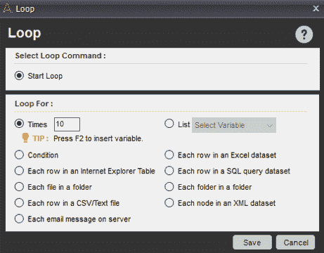第十二步:**现在，你要将数据填入特定的单元格。为此，你必须如下设置单元格:

**第 12.1 步:**从 **Excel 命令**中拖动**设置单元格命令**，在**单元格值部分**提及变量 **ExcelColumn** ，点击**插入。**然后按下 **CTRL + F2** 提及**计数器变量**。最后，点击**保存。**

**第十三步:**接下来，你要去活动单元格右边的一个单元格，存储下一个提取的数据。因此，要做到这一点，**从 **Excel 部分**中拖动** **转到单元格命令**，并**选择一个单元格右**。参考下文。

**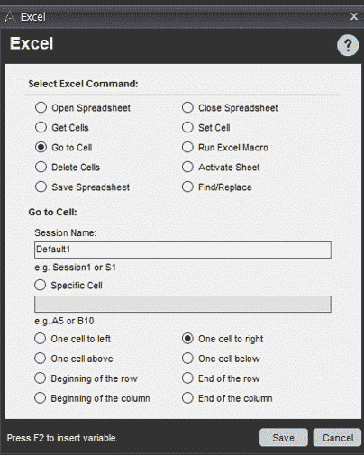第 14 步:**一旦存储了特定行的数据，就要去下一行存储下一组数据。为此，你必须

转到行首，从当前单元格向下一个单元格。

**步骤 14.1:** 为此，**从 Excel 部分拖动“转到单元格”命令**，然后**选择行的开头。**参考下文。

**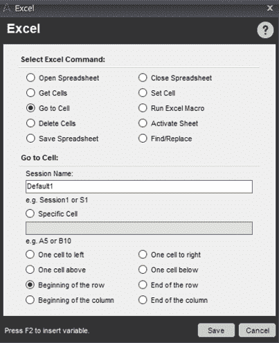**

**步骤 14.2:** 再次**拖动 Excel 部分的【转到单元格】命令**和**选择下面一个单元格** **。**参考下文。

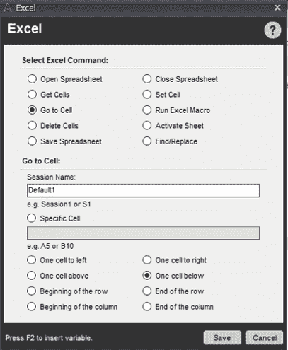

你最终的任务清单应该如下所示:

**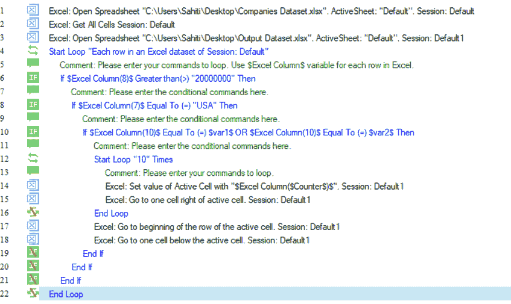第十五步:**现在，点击**保存**按钮，保存您的任务，并通过点击**运行**按钮执行任务。

您会看到下面的输出。

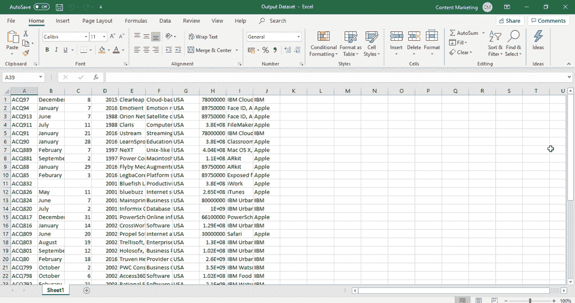

现在，您已经知道如何自动化数据迁移和输入任务，接下来，在这篇关于 RPA 项目的文章中，让我们来看看:电子邮件查询处理。

### **RPA 项目:** **邮件查询处理**

每天都会产生数以千计的电子邮件，需要对它们进行分类，以确保将正确的回复发送给组织中的所有发件人。

现在的问题是，由于每天都有大量的电子邮件生成，人工团队无法坐下来将每一封邮件分开。除此之外，这是一项相当累人的工作，不可能由一个员工或一个团队来完成。

因此，各行业可以通过将常见问题或电子邮件隔离到特定文件夹中来实现这项任务的自动化。在这篇文章的下面，我将向您展示如何使用 UiPath 自动完成这项任务。

#### **问题陈述:任务是根据 Outlook 文件夹中相应文件夹中的电子邮件 ID 来分离电子邮件。**

**How will you automate this task?**

#### **解:**

**第一步:**打开 **UiPath 工作室**，创建**空白项目**。提及项目名称、位置和描述。然后点击**创建**。参考下文。

**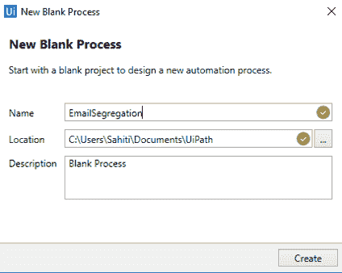第二步:**一旦您的仪表板打开，在**活动窗格**中搜索**流程图活动**，并将其拖动到工作区。我们正在绘制流程图，以确保完全自动化的正确工作流程。参考下文。

**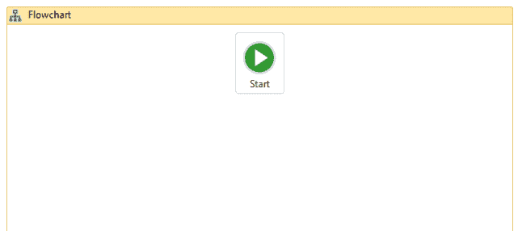第三步:**现在，从**活动窗格**中拖动一个**序列**活动，并将其重命名为隔离邮件。把它和流程图的起点连接起来。

**步骤 3.1:** 现在双击序列，拖动**得到 Outlook 邮件消息**活动。在此活动中，转到**属性窗格**并提及您希望阅读的电子邮件数量。这里我想读 30。所以，我会在上面提到 30。此外，您还必须在此活动的输出部分提到一个输出变量。变量的数据类型应为列表<邮件消息>。参考下文。

**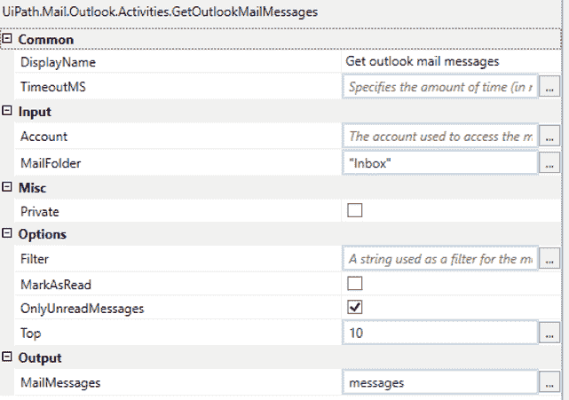第四步:**下一步是识别电子邮件地址，并相应地对其进行隔离。为此，从活动窗格中拖动每个活动。然后，在该活动的**属性窗格**中，将**类型参数**更改为**system . net . mail . mail message .**

**步骤 4.1:** 然后你必须在 item 部分提到 mail，在 value 部分提到 messages 变量，如下所示。

**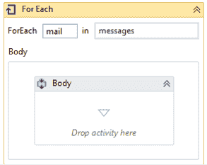步骤 4.2:** 现在，既然你希望识别每一封邮件，你就要拆分地址。

例如，如果发件人的电子邮件地址如下:

*   abc@edureka.co
*   example@sample.com
*   sample@demo.com

***现在，我们的任务是将所有地址为“edureka.co”的电子邮件放入 edureka 文件夹的电子邮件地址中。***

同样，sample.com 和 demo.com 也要重复同样的动作

**第 4.3 步:**要做到这一点，你首先要把电子邮件地址分成以下两部分:

*   1——ABC 或发送者姓名或任何提及的名称
*   2———-edureka.co【基本上是电子邮件来源的域名】

因此，将 Assign 活动拖到 For Each 活动的 Body 部分，并最初将发件人地址分配给 mail。发件人地址如下。

**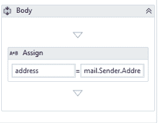步骤 4.4:** 同理，拖动另一个 Assign 活动，将 **Split(address)、“@”**赋值给 **Splitaddress** 变量。这里 address 是存储发送者地址的变量，Splitaddress 应该是一个字符串数组。

**第五步:**接下来，您必须根据您希望隔离多少个地址来拖放 If-Else 条件。在这里，我想分离 3 个电子邮件地址，所以我将拖放，然后从活动窗格的活动三次。

**步骤 5.1:** 最初我会拖动一次 If 活动，并在条件选项卡中提到以下条件:

**split address 1(1)= " edu reka . co "**

所以，如果我们的任何一个发件人的电子邮件地址最后都有 Edureka，那么所有那些邮件都会自动被移到 Edureka 文件夹中。

**步骤 5.2:** 现在，在这个 If 活动的 Then 部分，拖动**移动 Outlook 邮件消息**活动。在 MailMessage 部分提到“mail”变量，在 MailFolder 部分提到文件夹名。(用引号提及文件夹名称)。参考下文。

**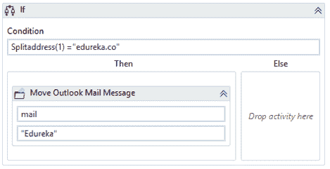步骤 5.3:** 同样重复上述步骤，其他邮箱地址如 sample.com 和 demo.com。参考下文。

**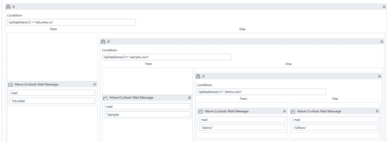第六步:**保存并执行设计好的自动化。

一旦你执行自动化，你会看到所有的电子邮件将自动被隔离到特定的文件夹。

现在，您已经知道如何隔离电子邮件，让我们来看看下一个实际操作:发票处理。

### **RPA 项目:** **发票处理**

从跨国公司到小型创业公司，他们每天都要处理成千上万张发票。这些发票可以用于各种目的，如汽车租赁协议、订单、收据等等。

现在，几乎不可能在更短的时间内从这些发票中提取数据并将它们无误地存储在数据库中。

因此，你可以自动完成这项任务。在下面这篇关于 RPA 项目的文章中，我将向您展示如何使用 Automation Anywhere 来自动化这项任务。

#### **问题陈述:任务是从各种发票中提取数据，存储在 excel 文件中。之后，一封电子邮件应该会自动发送到提到的电子邮件地址。**

#### 你将如何自动完成这项任务？

#### **解:**

**第一步:**登录控制室，打开 Automation Anywhere 企业客户端。

**第二步:**现在，点击 ***新建*** 选项，选择**工作台**。这将把您重定向到这个客户端的工作台。参考下文。

**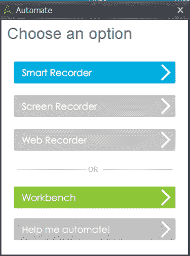第三步:**现在**选择您想要从中提取数据的 PDF** ，同时记下您想要提取数据的所有字段。下面的快照显示了我想要从中提取数据的文档。在这里，我要提取日期、接收人、收据号、金额、付款方式和接收人。

**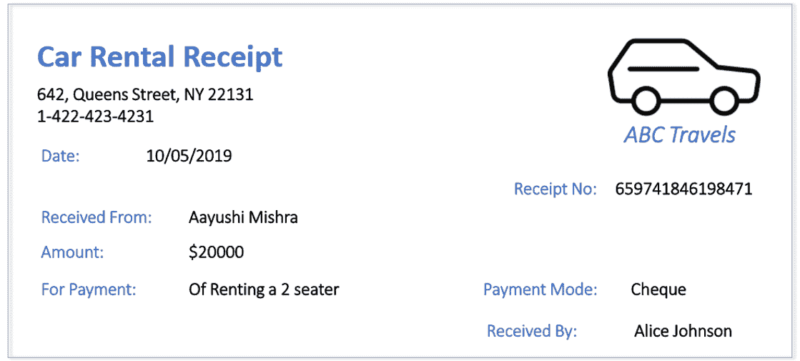第四步:**现在，转到工作台右侧的**变量管理器**，为您想要提取数据的所有字段添加变量。这里你必须创建 7 个变量。让我向您展示如何创建单个变量。

**步骤 4.1:** 点击添加选项。在打开的对话框中，在**名称字段**中提及变量的名称，并点击**保存**。参考下文。

**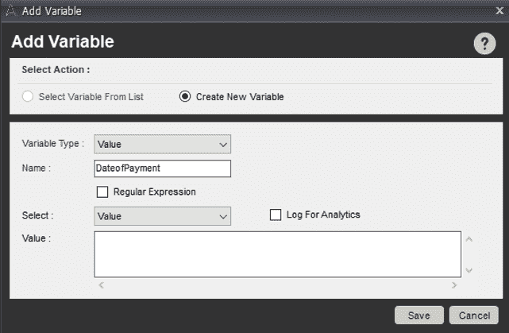**

**步骤 4.2:** 重复上述步骤，创建另外 6 个变量。

**第五步:**现在点击左边面板的 **Excel** 命令，双击**打开电子表格**子命令。这将打开一个对话框。

**步骤 5.1:** 现在转到**省略号按钮**和**提及 Excel 文件的路径**应提及提取的数据。然后，点击**保存**。这一步将设计打开 Excel 文件的任务。参考下文。

**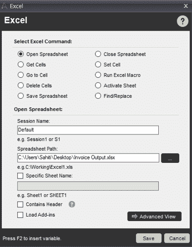第六步:**现在，你必须确保你的数据是从 A2 单元格自动填充的。要为这个**创建一个动作，双击 Go-to-cell** 子命令，在**特定单元格部分**输入 A2 。之后点击**保存**。参考下文。

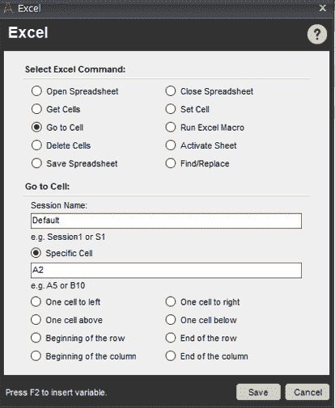

这一步将设计一个打开电子表格的任务，并将光标放在 A2 单元格上。

**第七步:**现在，你要开始从 PDF 文件中提取数据了。为此，请遵循以下步骤。

**步骤 7.1:** 点击 **PDF-Integration** 命令，双击**提取表单字段**子命令。

**步骤 7.2:** 现在点击省略号按钮，选择你要从中提取数据的 PDF 文件。

**第 7.3 步:**之后，从**插入字段**部分，选择**添加**选项，并将鼠标拖动到所需字段上。

**第 7.4 步:**现在，右击选中的字段，选择**添加**字段如下图。

**步骤 7.5:** 在提取文本窗口中，选择合适的变量名，输入字段名。然后点击**确定**。

这将存储指定变量和字段名的提取数据。

**步骤 7.6:** 类似地，对其他 6 个字段/变量重复上述步骤。

**第 7.7 步:**最后点击**保存**。

**第八步:**现在，你要将提取的数据存储在 Excel 文件中各自的单元格内。为此，请遵循以下步骤。

**步骤 8.1:** 点击 **Excel** 命令，双击**设置单元格**子命令。

**步骤 8.2:** 在打开的对话框中，转到单元格数值部分，**按 F2** ，选择你想选择的变量名。然后点击**插入**。在这里，我将选择付款日期。

该操作将使您将数据存储在 **A2 单元格**中。现在，下一个提取的数据应该存储在下一个 B2 单元中。为此，双击**转到单元格**子命令，选择**向右一个单元格** ***。**之后点击*保存。

**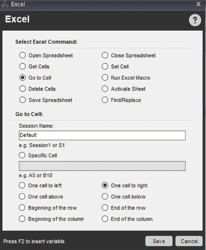**

**步骤 8.3:** 现在，要将值插入到 B2 单元格中，再次双击 ***设置单元格*** 子命令并按 F2。选择变量名并点击插入。

**第 8.4 步:**现在，向 C2 单元格插入下一个值。为此，重复上述步骤。

现在，您已经提取了单个 PDF 的数据，如果您想从各种其他 PDF 中提取数据。你必须把数据存储在下一行，对吗？

**第 9 步:**要这样做，双击**转到单元格**子命令并选择下面一个单元格的**。**参考下文。

**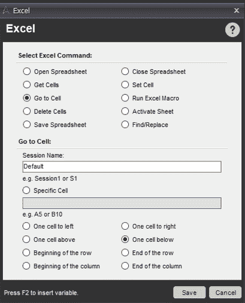步骤 10:** 要转到起始单元格，即该行的第一个单元格，选择**转到单元格**子命令，并选择**该行的开头**。参考下文。

**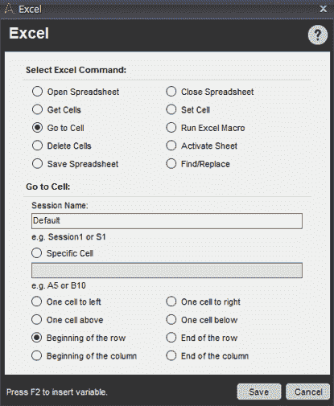步骤 11:** 现在，以上所有操作都是从单个 PDF 文件中提取数据。要从多个 PDF 文件中提取数据，请遵循以下步骤。

**步骤 11.1:** 点击任务窗格中的部分动作，然后**双击左侧面板中的循环**命令。

**步骤 11.2:** 在这里选择双击**文件夹中的每个文件**命令，从**浏览**选项中提到包含所有 PDF 文件的文件夹的路径。然后点击**保存**。参考下文。

**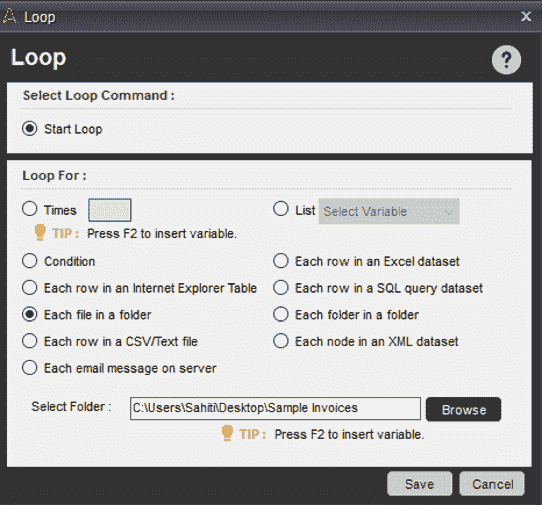步骤 11.3:** 将**结束循环**命令移动到动作列表最后一行的下方。

**步骤 11.4:** 双击 **PDF 整合**命令，在 **PDF 名称部分插入所需变量( **$FileName$** )。**

**第十二步:**现在，你要保存电子表格。为此，从 Excel 命令中拖动保存电子表格子命令。参考下文。

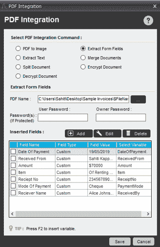

该命令将保存电子表格中的数据。

第十三步:接下来，你必须关闭电子表格。为此，从 Excel 命令中拖动**关闭电子表格**子命令。参考下文。

**第十四步:**现在，要发送邮件，通过附加这个文件，你要拖动**发送邮件**命令。在这种情况下，你必须提及收件人和发件人地址，并提及主题。在那之后提及附件的路径。参考下文。

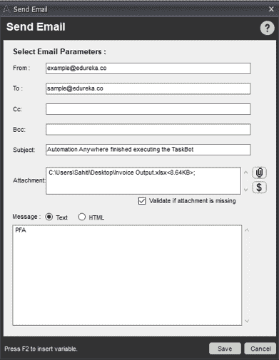

这就是你最终任务清单的样子。

**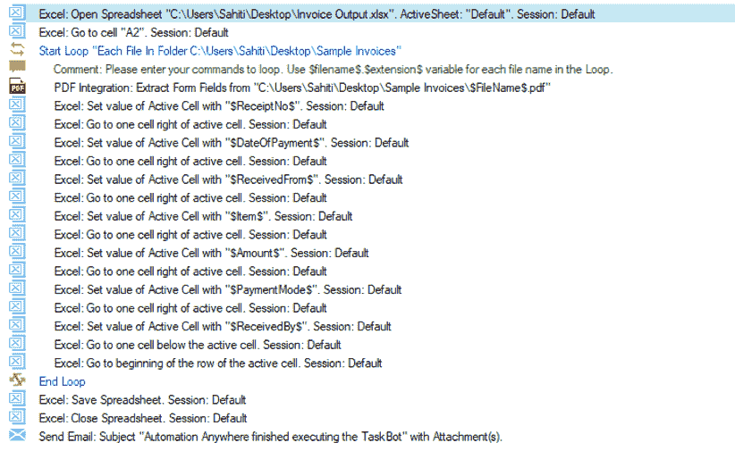第十五步:**保存并执行设计好的自动化。

一旦您执行了自动化，您将会看到所有的数据都是从 PDF 文件中提取出来的，并且存储在 Excel 文件中。参考下文。

现在，您已经知道如何自动化处理大量发票的任务，接下来，在这篇关于 RPA 项目的文章中，让我们来看看下一个实践:客户支持电子邮件

### **RPA 项目:** **客户支持邮件**

在任何组织中，支持团队都必须处理每天生成的海量票证。这些罚单可以在各种问题上提出。现在，每一张罚单都必须立即回复，以保持良好的客户关系。

很明显，一个体力劳动的员工无法在每天的基础上轻松地回复所有这些邮件。这将是相当累人的，而且会花很多钱。

相反，你可以自动完成这项任务。在这篇文章的下面，我将向您展示如何使用 UiPath 自动完成这项任务。

#### **问题陈述:任务是自动回复在主题行中提到具体文本的电子邮件。**

#### 你将如何自动完成这项任务？

##### **解:**

**第一步:**将问题名称存储在 excel 表的一列中。也要提到栏目名称、电子邮件 id、票号、主题，如下图所示。

**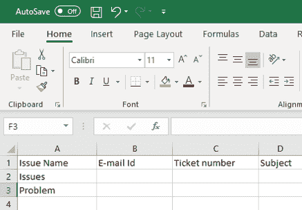第二步:**打开 **UiPath Studio** ，创建一个**空白项目**。提及项目名称、位置和描述。然后点击**创建**。参考下文。

**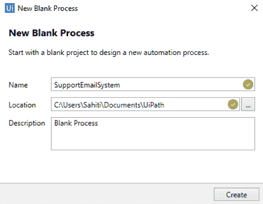第三步:**一旦您的仪表板打开，在**活动窗格**中搜索**流程图活动**，并将其拖动到工作区。我们正在拖动流程图，以确保完全自动化的正确工作流程。

**第四步:**现在，从**活动窗格**中拖动一个**构建数据表**活动。将它与流程图的起点连接起来。

**第 4.1 步:**双击该活动，点击**数据表**选项。然后你必须提到列名。由于 excel 工作表中有四列，我们将在数据表中提到相同的列名。为此，单击编辑列选项并提及详细信息。参见下文。

**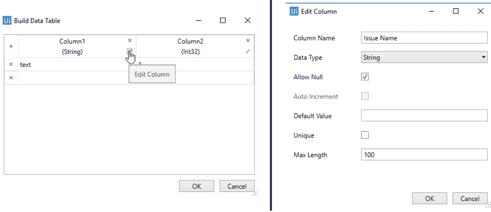第 4.2 步:**填写完详细信息后点击**确定。**这将创建一个数据表。数据表是一个表，UiPath 将使用它来读取 excel 文件中的数据，并将检索到的数据存储在 excel 文件中。参考下文。

**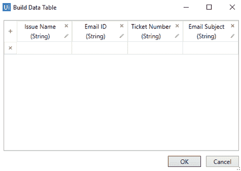步骤 4.3:** 接下来，在数据表活动**的输出部分提到一个变量来存储数据表的输出**。这里我把它称为*支撑台。*参考下文。

**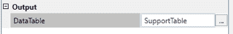第五步:**现在回到**流程图**，从**活动窗格**添加 **Excel 应用范围活动**，执行与 Excel 文件相关的动作。然后将“构建数据表”活动连接到流程图中的这个活动。

**步骤 5.1:** 双击 **Excel 应用范围活动**和**提及** excel 工作表的路径。然后，在该活动的 **Do 部分**中，从活动窗格中拖动**读取范围**活动，并提及**工作表名称和范围。**同样，在**读取范围活动**的**输出部分**中，提及您之前创建的数据表变量的**名称，即*支持表*。参考下文。**

**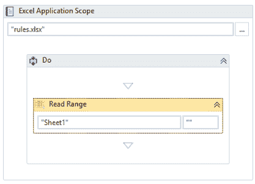第六步:**现在我们的下一步是自动化阅读和发送电子邮件的任务。为此，**返回流程图**并从**活动窗格**中拖动一个**序列**。然后，将 **Excel 应用范围活动**连接到流程图中的该序列，并将该序列重命名为**读取和发送电子邮件。**

**步骤 6.1:** 现在，双击序列，拖动**获取 Outlook 邮件消息活动**。然后转到属性窗格，选择要阅读的邮件的最大数量。在本活动的输出部分，提及将存储所有邮件的输出变量。因此，这个变量的数据类型应该是 List < Mail Message >。这里变量是消息。

**步骤 6.2:** 现在，对于你要阅读的邮件中的每一封邮件，你都要迭代几个动作。为此，拖动每个活动的**，在项目部分提到 mail，在值部分提到 messages。同样，在属性窗格中，转到**类型参数**并提及**system . net . mail . mail message .****

**步骤 6.3:** 在这个活动的主体部分，从活动窗格中拖动**分配活动**。然后，您必须将发件人地址赋给一个变量。为此，使用变量名来存储地址(这里是 address ),并在值部分使用**mail . sender . address . to lower .**

**步骤 6.4:** 现在，再次拖动一个**赋值活动**，将票号赋给一个随机值。为此，请提及为存储票号而创建的变量的变量名。这是通用类型的票号。然后，在 value 部分提到 **New Random()。下一步(1，10000)** 为每封邮件生成一个随机数。

**步骤 6.5:** 接下来，你要再次拖动一个**赋值活动**，将每封邮件的主题赋值给一个变量。为此，在 To 部分和 **mail 中提到 **EmailSubject** 变量名。值部分中的 Subject.ToString** 。参考下文。

**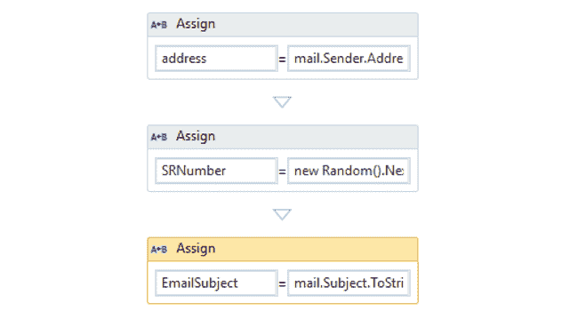第 7 步:**在此之后，下一步是将电子邮件中的主题行与问题名称列进行比较。如果它们匹配，则只发送回复。为此，您必须从活动窗格中为每一行活动拖动一个**。**

**步骤 7.1:** 现在，提及上面创建的数据表名称，即 SupportTable。

**第 7.2 步:**接下来，在这个活动的 Body 部分，你要拖动一个 If 活动，并提及条件:**mail . subject . contains(row(" issue name ")。ToString)。**参考下文。

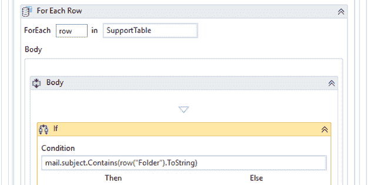

此条件会将循环中每封电子邮件的主题行与 excel 表格中的问题进行比较。

**步骤 7.3:** 现在，在**然后**条件活动中，你要拖动**发送 Outlook 邮件消息活动，**当我们希望条件满足时自动回复邮件。

**第 7.4 步:**

*   在活动提及的“收件人”部分，address.ToString。这将把电子邮件发送给相应的发件人。
*   在主题部分提及文本:“edu reka Support Ticket-"+Ticket number+"–"+mail . Subject。该文本将发送主题为:(edu reka Support Ticket-randomticket number generated-发件人发送的电子邮件的主题)的电子邮件。
*   在活动的正文部分，提及您希望传达的信息。在这里，我发送了以下消息:“您好，”+ vbnewline +“感谢您联系 Edureka 支持实验室”+ vbnewline +vbnewline +“支持工程师将很快与您联系，调查您面临的问题并尽早解决它。”+ vbnewline +"您的支持票是:EDUSR"+ TicketNumber +vbnewline +"我们重视您与我们的关系，愿意全天候为您提供帮助"+ vbnewline +vbnewline +"同时，请阅读新闻句柄以了解最新的 Edureka 更新，网址为 http://www.edureka.co"

参考下文。

**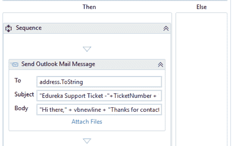步骤 7.5:** 现在，你要把数据存回 excel 文件。为此，在**然后**部分中拖动三个分配活动，并提及以下细节:

*   至段:行(1)值段:地址
*   To section:row(2)Value section:ticket number
*   To section:row(1)Value section:email subject

参考下文。 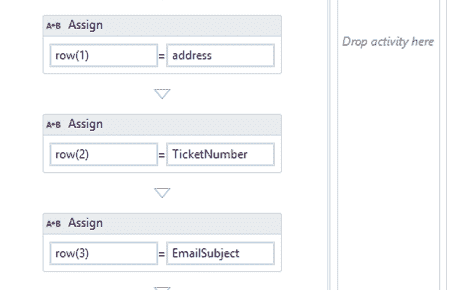

**第 8 步:**现在，因为我们只想存储电子邮件地址、主题行和机票号码，所以我们必须删除一个列。为此，将 **Remove Data Column** 活动拖到流程图中，并将之前创建的序列与它连接起来。参考下文。

**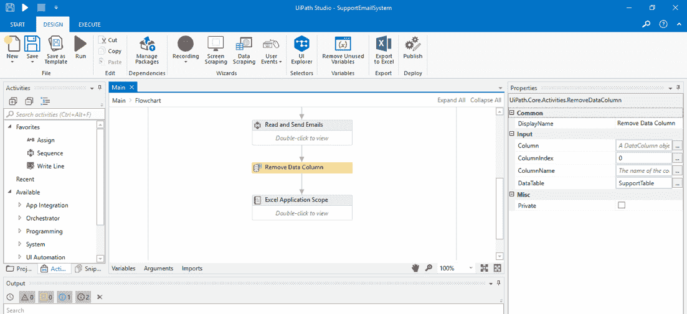步骤 8.1:** 在该活动的**属性窗格中，提及**列索引- > 0** ，因为我们希望删除 issues 列。这里还要提到数据表名称，即 *SupportTable* 。参考上图。**

**第九步:**拖动 **Excel 应用范围活动**，将**移除数据列**流程图连接到该活动。

**步骤 9.1:** 现在，双击 **Excel 应用范围**活动，并提及您希望存储数据的工作簿的路径。

**步骤 9.2:** 在**做**部分的活动中，拖动**写范围活动**并提及**表名、范围**和**数据表名**。参考下文。

**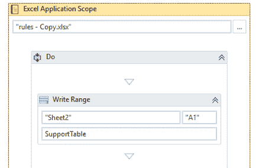第十步:**保存并执行设计好的自动化。

一旦你执行了自动化，你会发现自动回复会被发送到所有的电子邮件中，这些邮件的单词和我们在表格中的单词相匹配。此外，将创建一个新的工作表，其中将存储诸如电子邮件 ID、机票号和主题等详细信息。参见下文。

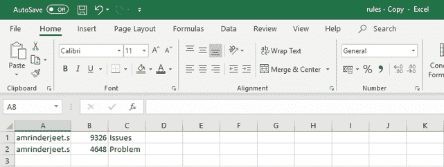所以，伙计们，关于 RPA 项目的这篇文章到此结束。本文中讨论的 RPA 项目应该有助于您开始学习 RPA，它会让您沉迷其中，并推动您实际学习更多关于 RPA 的知识。当您尝试使用 RPA 考虑问题并提供解决方案时，这将非常方便。

*现在您已经了解了 RPA 项目，请查看由 Edureka 提供的使用 UiPath 的 **[RPA 培训](https://www.edureka.co/robotic-process-automation-training)** & **[使用 Automation Anywhere 的 RPA 培训](https://www.edureka.co/automation-anywhere-certification-training)** ，edu reka 是一家值得信赖的在线学习公司，在全球拥有超过 250，000 名满意的学习者。两者，这些认证将帮助你分别在 UiPath 和 Automation Anywhere 获得深入的知识。*

*有问题吗？请在“RPA 项目”的评论部分提到它，我们将会回复您。*