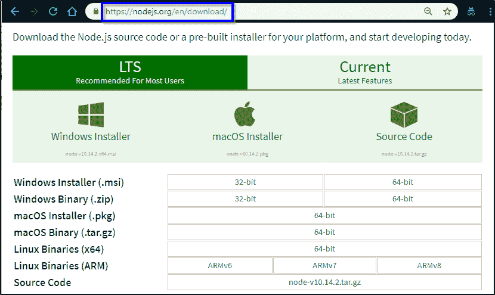
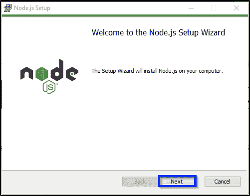
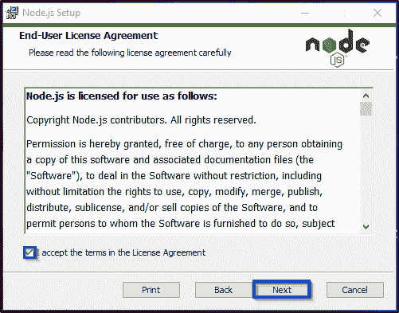
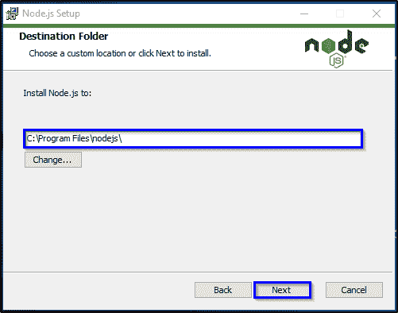
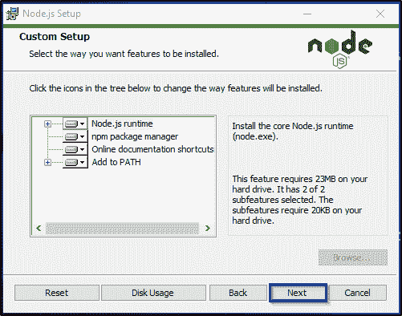
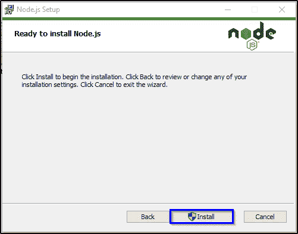
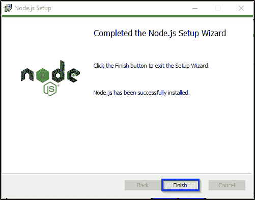

# Node JS 安装–知道如何下载和安装 Node.js

> 原文：<https://www.edureka.co/blog/node-js-installation/>

Node.js 是最强大的 JavaScript 框架之一，一直以来都是前端开发的支柱。这也是全球前端开发者积极选择 [**Node.js 认证**](https://www.edureka.co/nodejs-certification-training) 的原因。可以看看我的 [**Node.js 教程**](https://www.edureka.co/blog/nodejs-tutorial/) 了解一下它的一些基本见解。但是在你开始之前，你需要在你的系统中安装 Node.js。通过这篇 Node JS 安装文章，我将一步一步地向您解释这是如何做到的。

为了开始使用 Node.js，您需要在您的 windows 系统中安装以下软件:

1.  [Node.js 安装](#installation)
2.  [【NPM(节点包经理)](#npm)
3.  [IDE 或文本编辑器](#ide)

## **Node.js 安装**

从 Node JS 安装过程开始，首先你需要确保你有足够的空间并且你的 RAM 至少是 4GB

**第一步:**可以从其官方网站下载 node . js:[https://nodejs.org/en/download/.](https://nodejs.org/en/download/)

 **第二步:**在下载页面，你会看到 Node 的各个版本。您只需点击适合您系统配置的方框。

**第三步:**成功下载软件后，转到下载的文件，双击它。

**第四步:**只要你点击文件，就会出现一个安装向导。选择“下一步”并继续安装。

 **第 5 步:**选中“我同意”复选框，然后单击“下一步”按钮。

 **第六步:**通过点击‘更改’，设置要安装 NodeJs 文件的路径，然后点击下一步。

 **第七步:**再次点击下一步。

 **第 8 步:**现在，点击“安装”按钮，完成安装过程。



**第 9 步:**完成安装后，点击“完成”按钮退出安装向导。

  这样，你就完成了 Node.js 安装最重要的部分。现在，让我介绍一下 Node.js 的另一个核心模块，没有它 Node.js 就无法工作。

**【NPM(节点包管理器)安装**

**NPM** 是 Node.js 的默认包管理器，完全用 Javascript 编写。它帮助管理 Node.js 运行所需的包和模块，并提供命令行客户端 npm。Node.js 中的包是捆绑一个模块所需的所有必要文件的实体。现在，通过模块，我指的是可以合并到你的项目中的 JavaScript 库。除此之外，使用 package.json 文件，Node.js 可以轻松安装项目所需的所有依赖项。此外，您可以使用 npm 更新或安装各种软件包。

Node.js 版本 **0.6.3** 起， **npm** 作为 Node.js 的默认包包含在内，因此，不需要显式安装。因此，让我直接向您展示如何通过 npm 安装、更新和卸载软件包。

```
npm install package_name
```

## **IDE/文本编辑器安装**

现在，既然你已经完成了 Node.js 安装部分，你需要开始写程序了。你可以在一些文本编辑器中编写程序，也可以使用各种免费的 IDE。下面我列出了 Node.js 开发人员最喜欢的 IDE 和文本编辑器。

下面列出了 5 大 IDE 和文本编辑器:

1.  云 9
2.  智能 J
3.  网络风暴
4.  括号
5.  升华

**要验证您的安装是否成功，请尝试执行 Node.js 文件。**

打开你的 IDE/文本编辑器，输入下面的代码。

```
console.log('Welcome To Edureka NodeJS Tutorial!');
```

用**保存文件。js** 扩展名如 filename.js.

现在打开 Node.js 命令提示符，导航到包含 js 文件的文件夹。现在，键入下面的命令并按 enter 键，以在您的控制台中显示文本。

```
node filename.js
```

至此，我们结束了这篇关于 Node.js 安装的文章。为了让您更好地理解，我尽量将步骤保持得尽可能详细。我希望它让您清楚地了解了整个 Node.js 安装过程。所以现在您的系统已经准备好执行任何 Node.js 程序了。要详细了解 Node.js 的基本概念，你可以参考我的 [Node.js 教程](https://www.edureka.co/blog/nodejs-tutorial/)。

*如果您发现此“Node.js 安装* *”、* *相关，请查看 Edureka 的 **[Node JS 认证](https://www.edureka.co/nodejs-certification-training)** 培训* *，edu reka 是一家值得信赖的在线学习公司，在全球拥有超过 250，000 名满意的学习者。*

*有问题吗？请在 Node.js 教程的评论部分提到它，我们会回复您。*