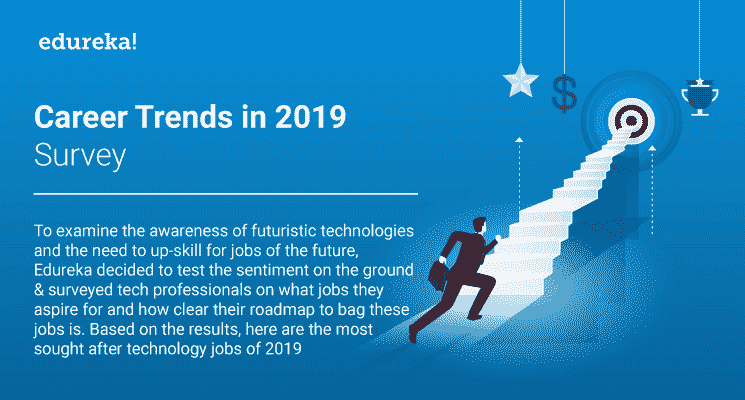
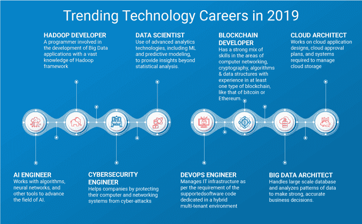
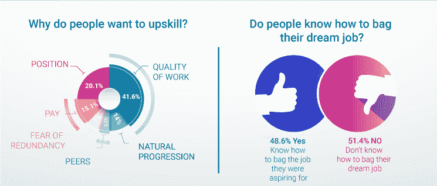
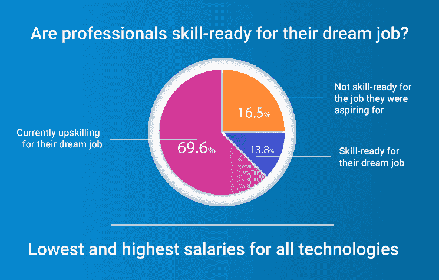
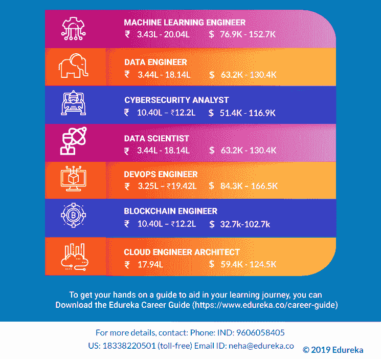

# 2019 年的职业趋势 Edureka 的调查

> 原文：<https://www.edureka.co/blog/career-trends-2019-survey/>

技术和职业趋势通常决定了 IT 行业一年的发展方向。这些趋势看起来既难以捉摸又短暂，但它们已成为业务和 IT 战略不可或缺的一部分，为未来的技术创新奠定了基础。很少有企业从最新的技术趋势中感觉到威胁，而一些企业则指望这些趋势在各自的行业中处于领先地位。无论情况如何，技术带来的变化已经迫在眉睫。

2018 年，许多技术冲击全球市场。有些人被拥抱，有些人等待尘埃落定。但 2019 年是时候让它更上一层楼了。这一年，各公司都渴望展现技术的潜力。预计 2019 年还将见证对市场颠覆者的巨额投资。从技术角度来看，这将是重要的一年，因为许多大品牌都在寻求壮大自己的队伍。因此，对人工智能、区块链、RPA 等未来技术的需求。预计会打破记录。

具有讽刺意味的是，这种积极的就业前景被忽视了，因为在预计将在未来几年创造就业机会的技术方面存在技能差距。新兴技术职位空缺，而大多数求职者都在敲雇主的门，希望获得他们梦想中的工作。迫切需要通过提高技能来弥补这一技能差距。用未来科技提升技能不再是一个选择。如果技术专业人员希望在当今竞争激烈、不断发展的 IT 行业中保持相关性，他们需要提高 15 到 20 倍的技能。

## 那么，这些职业趋势说明了什么？

许多职业门户网站公布了调查结果，列出了 2019 年最受欢迎的技术。我们决定实地测试一下这种情绪，并询问技术专业人士，他们希望在未来获得什么样的 头衔。大约有 500 名技术专业人士回答了我们的调查，根据调查结果，这里有一张信息图，展示了 2019 年备受关注的技术。调查结果还显示，专业人士希望升级到受欢迎的技术行业，以提高工作质量、获得晋升并获得更高的薪水。

    

**你可以在这里下载完整的信息图: [IT 职业道路指南](http://bit.ly/2xaXRZa)**

“专业人士为他们的理想工作做好准备了吗？”清楚地表明，当前 IT 专业人员的技能组合与行业需求之间存在隐现的差距。2019 年 Edureka 技术职业指南旨在通过为技术专业人员提供按需技术的定制学习路径来弥合这一技能差距。该指南列出了 2019 年引领就业创造的前沿技术，并分享了可以用来获得梦想工作的确切学习路径。 该职业指南除了分享今年最受欢迎的技术工作的调查结果外，还涉及这些技术的行业前景、就业趋势、薪酬和学习时间。

我们花了几个月的时间来创建这个职业指南，我们希望它能帮助你找到理想的工作。本指南是我们的主题专家、职业顾问以及我们内部知识和研究的专业知识的积累。

Edureka 相信，这份职业指南中由专家精心策划的信息将有助于你有计划地提高技能。所以，今天就开始阅读《Edureka 技术职业指南》!