# 初学者 JavaScript 教程:完全指南

> 原文：<https://www.edureka.co/blog/javascript-tutorial/>

网络的崛起将 JavaScript 带到了它从未想到的地方。它已经成为当今世界最重要的语言之一。它的建立是为了扩展网络。这篇 **JavaScript 教程**将按以下顺序向您展示这种脚本语言的演变:

*   [JavaScript 的起源](#javascriptorigin)
*   [JavaScript 简介](#introduction)
*   【JavaScript 能做什么？
*   [JavaScript 框架](#javascriptframeworks)
*   [HTML vs CSS vs JavaScript](#htmlvscssvsjavascript)
*   [JavaScript 的优势](#javascriptbenefits)
*   [JavaScript 基础知识](#javascriptfundamentals)
*   [JavaScript 教程:示例](#javascriptexample)

## **JavaScript 的起源**


网景通信公司认为网络需要一种方式来变得更加 T2 动态。他们希望动画、互动和其他形式的小型自动化成为未来**网络**的一部分。目标是寻找扩展网络的方法。这正是 JavaScript 诞生的原因。


**JavaScript** 之父布伦丹 **艾希**与网景通信公司签约，为该浏览器开发一套方案。愿景是创造一些东西:

*   句法上容易掌握
*   动态的，
*   为了减少冗长，
*   加快发展，
*   强大。

Java 被认为不适合消费**摩卡**(JavaScript 的预版本)的受众类型，如编剧、业余爱好者、设计师，因为这种简单的任务需要花费大量的精力和时间。因此，我们的想法是让大型、专业的组件编写人员可以使用 Java，而 Mocha 将用于小型脚本任务。


1995 年 12 月，网景通信和 Sun 完成了交易，Mocha/LiveScript 被重新命名为 **JavaScript** 。它是作为浏览器中小型客户端任务的脚本语言出现的，而 Java 是作为开发丰富的 web 组件的更大、更专业的工具而被推广的。

现在你已经知道了 JavaScript 的起源和历史，让我们继续学习 JavaScript 教程，了解更多关于这种语言的知识。

## **JavaScript 简介**

JavaScript 是一种高级的、解释性的编程语言，用于使网页更具交互性。这是一个非常强大的客户端脚本语言，它让你的网页更加生动，更具互动性。

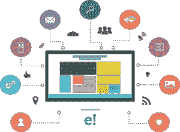

它是一种编程语言，可以帮助你在网页上实现复杂而漂亮的设计。如果你想让你的网页看起来活灵活现，不只是呆呆地看着你，JavaScript 是必须的。

## **JavaScript 的特性:**


*   它是一种脚本语言，与 Java 无关。最初，它被命名为**摩卡**，后来被改为 **LiveScript** ，最后被命名为 **JavaScript** 。

*   JavaScript 是一种基于对象的编程语言，支持多态、封装和继承。

*   你不仅可以在**浏览器**中运行 JavaScript ，也可以在**服务器**和任何有 JavaScript 引擎的设备上运行。

## 【JavaScript 能做什么？


JavaScript 用于创建漂亮的**网页**和**应用**。它主要用于使你的网站看起来有活力，并增加页面的多样性。

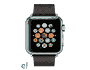

在**智能手表**中也有使用。这方面的一个例子是受欢迎的智能手表制造商 Pebble，它创建了一个名为 Pebble.js 的小型 JavaScript 框架。


JavaScript 也被用来制作**游戏**。很多开发者正在使用 JavaScript 开发小规模的游戏和应用。


像谷歌、脸书、网飞、亚马逊等大多数受欢迎的网站都利用 JavaScript 来建立他们的**网站**。

## **JavaScript 框架**

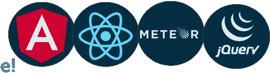

1.  **angular js**–It是谷歌的网络开发框架，为快速应用开发提供了一套现代开发和设计功能。
2.  [**react js**](https://www.edureka.co/blog/what-is-react/)——这是另一个主要由脸书维护的顶级 JavaScript 框架，它位于脸书和 Instagram 的用户界面之后，展示了它在维护这种高流量应用方面的效率。
3.  **meteorojs**——主要用于提供后端开发。在后端使用 JavaScript 来节省时间和积累专业知识是 Meteor 背后的主要思想之一。
4.  [**jQuery**](https://www.edureka.co/blog/jquery-tutorial/)——当你想扩展你的网站，让它更具互动性的时候，可以用这个。像 Google、WordPress 和 IBM 这样的公司都依赖 jQuery。

## **HTML vs CSS vs JavaScript**

如果你熟悉 JavaScript，你会知道 HTML，CSS 和 JavaScript 之间的关系。让我们看一个例子来理解这个类比。

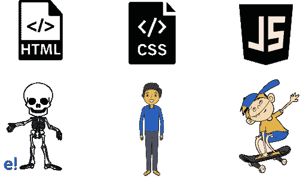

**HTML** (超文本标记语言)更像是 web 的骨架。它用于显示网页。

另一方面， **CSS** 就像我们的衣服。它使网页看起来更好。它使用 CSS(代表级联样式表)来设计样式。

最后， **JavaScript** 被用来给网页添加生命。就像孩子们如何使用滑板一样，网络也在 JavaScript 的帮助下运动。

现在让我们继续我们的 JavaScript 教程，看看这种语言的不同优势。

## **JavaScript 的优势**

许多开发人员更喜欢 JavaScript，因为它有以下好处:

现在，您已经了解了 JavaScript 成为流行语言的不同优势，让我们继续学习 JavaScript 教程，了解基础知识。

## **JavaScript 基础知识**

在本 JavaScript 教程中，我们将介绍以下基础知识:

*   [变量](#variables)
*   [常数](#constants)
*   [数据类型](#datatypes)
*   [物体](#objects)
*   [数组](#arrays)
*   [功能](#functions)
*   [条件语句](#conditionalstatements)
*   [循环](#loops)
*   [开关盒](#switchcase)

### **变量**

充当存储数据的容器的**内存位置**被命名为**变量**。它们是保留的内存位置。

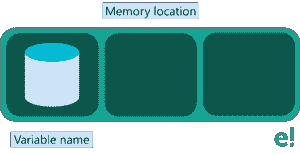

你必须使用' let '关键字来声明一个变量。语法如下:

```

let age;

age = 23;

```

### **常数**

在执行时间内**固定**且不能改变的值称为**常数**。要声明常量，必须使用“const”关键字。

语法如下:

```

Const value;

value = 7;

```

### **数据类型**

您可以将不同类型的**值**分配给一个变量，如数字或字符串。有不同的数据类型，例如:

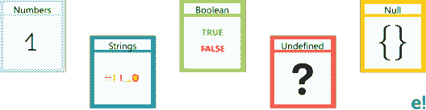

*   数字
*   用线串
*   布尔代数学体系的
*   不明确的
*   空

### **物体**

对象也是变量，但是它们包含许多值，所以不用为每个属性声明不同的变量，你可以声明一个存储所有这些属性的对象

要在 JavaScript 中声明一个**对象**,请使用“ **let** ”关键字，并确保使用花括号，以便所有属性-值对都在花括号内定义。语法如下:

```

let user= {

name: 'Aron',

id: '1234'

};

```

在本例中，用户是具有两个不同属性的对象，即名称和 id。

### **数组**

数组是一个数据结构,它包含一系列元素，这些元素在一个变量中存储多个值。

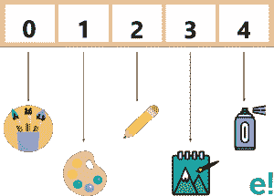

要在 JavaScript 中声明数组，请使用带方括号的' **let** '关键字，并且所有数组元素都必须包含在方括号中。语法如下:

```

let shopping=[];
shopping=['paintBrush','sprayPaint','waterColours','canvas'];

```

### **功能**

功能是一组有组织的、可重用的代码，用于执行单个相关的动作。

要在 JavaScript 中声明函数，请使用' **function** '关键字。语法如下:

```

function sum(a, b) {
return a+b;
}

```

### **条件语句**

条件语句是满足特定条件时执行的一组规则。两种类型的条件语句是:

*   如果
*   否则如果

**条件语句–如果**

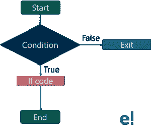

要在 JavaScript 中声明 if 语句，您需要使用' **if** '关键字。语法如下:

```

if(condition) {
statement;
}

```

**条件语句——Else if**

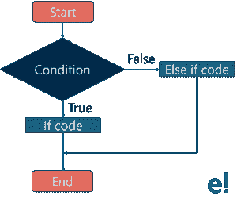

Else 语句用于在相同条件为假的情况下执行一段代码。语法如下:

```

if(condition) {
statement a;
}
else (condition) {
statement b;
}

```

### **循环**

循环用于重复特定的块，直到满足某个结束条件。JavaScript 中有三类循环:

1.  while 循环
2.  do while 循环
3.  for 循环

**While 循环**

当条件为真时，执行循环中的代码。


语法是:

```

while(condition) {
loop code;
}

```

**Do while 循环**

这个循环将首先执行代码，然后检查条件，当条件为真时，重复执行。

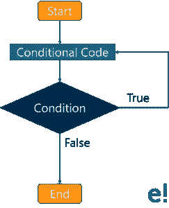

语法如下:

```

do {
loop code;
} while(condition);

```

**为循环**

当给定条件为真时，for 循环重复执行循环代码。它在执行循环体之前测试条件。

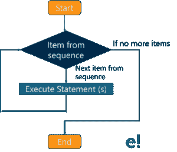

语法是:

```

for(begin; condition; step) {
loop code;
}

```

### **开关盒**

switch 语句用于根据不同的条件执行不同的操作。

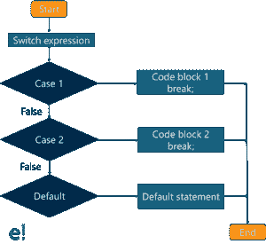

语法是:

```

switch(expression) {
case 1:
code block 1
break;
case 2:
code block 2
break;
default:
code block 3
break;
}

```

在深入研究 JavaScript 之前，这些是您需要了解的一些基础知识。

## **JavaScript 教程:示例**

现在您已经了解了 JavaScript 的基础知识，让我们来看一个例子及其输出。

**数字钟**

```

function showTime(){
var date = new Date();
var h = date.getHours(); // 0 - 23
var m = date.getMinutes(); // 0 - 59
var s = date.getSeconds(); // 0 - 59
var session = "AM";

if(h == 0){
h = 12;
}

if(h > 12){
h = h - 12;
session = "PM";
}

h = (h < 10) ? "0" + h : h;
m = (m < 10) ? "0" + m : m;
s = (s < 10) ? "0" + s : s;

var time = h + ":" + m + ":" + s + " " + session;
document.getElementById("MyClockDisplay").innerText = time;
document.getElementById("MyClockDisplay").textContent = time;

setTimeout(showTime, 1000);

}

showTime();

```

### **输出**

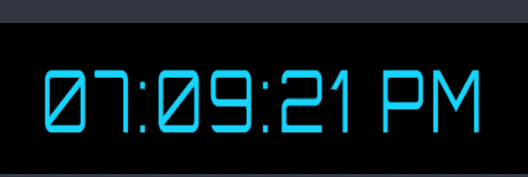

至此，我们已经结束了 JavaScript 教程。我希望你觉得这篇博客内容丰富，并且我希望你已经对 JavaScript 有了基本的了解。

*还有，别忘了看看 Edureka* 的  [全栈 Web Developer Masters Program](https://www.edureka.co/masters-program/full-stack-developer-training)。 *有问题问我们吗？请在“JavaScript 教程”的评论部分提到它，我们会回复您。*

查看我们在**上的视频什么是 JavaScript** 如果你想尽快入门 如果你有任何疑问，别忘了留下评论，也让我们知道你是否希望我们在 JavaScript 上创建更多内容。我们在听！

**JavaScript 是什么？|爱德华卡**


[//www.youtube.com/embed/Ia0FSogTRaw?rel=0&showinfo=0](//www.youtube.com/embed/Ia0FSogTRaw?rel=0&showinfo=0)