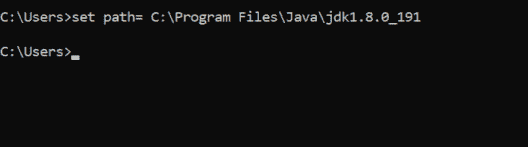
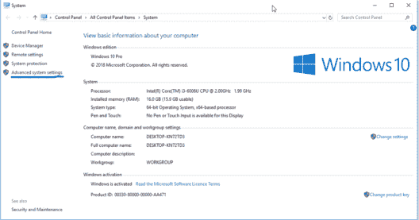
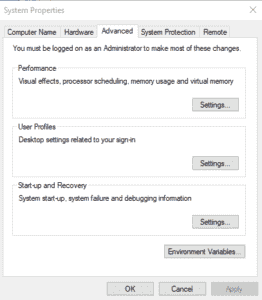
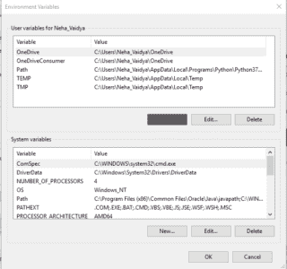
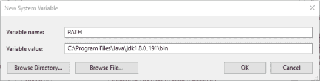

# Java 中如何设置路径？

> 原文：<https://www.edureka.co/blog/how-to-set-path-in-java>

Java 是征服了 IT 世界的最杰出的编程语言之一。为了跟上行业的发展，学习 Java 是很重要的，出于显而易见的原因，第一步是安装 Java[。安装完成后，如果你想毫无障碍地使用 java，你需要设置 java 路径。以下是本博客讨论的内容:](https://www.edureka.co/java-j2ee-soa-training)

*   [为什么要设置 Java 路径？](#why%20do%20you%20set%20a%20java%20path)
*   [如何设置 Java 路径](#how%20to%20set%20a%20java%20path)
    *   [临时路径](#temporary%20path)
    *   [永久路径](#permanent%20path)

## **为什么要设置 Java 路径？**

path 是 [Java 环境](https://www.edureka.co/blog/what-is-java/)中最重要的环境变量，用于定位 JDK 包，这些包用于将 Java 源代码转换成机器可读的二进制格式。

像 javac 和 java 这样的工具可以通过设置路径来使用。当您将文件保存在 java 目录(即安装 java 的目录)中时，没有必要设置路径。但是如果你在目录外保存你的文件，预先设置路径是相当必要的。

## **如何设置 Java 路径？**

有两种方法可以设置路径。

1.  临时路径
2.  永久路径

### **JDK 的临时路径**

设定 JDK 的临时路径非常容易。按照以下步骤设置路径。

1.  打开终端或命令提示符
2.  转到保存 JDK/bin 目录的路径
3.  复制路径
4.  在命令提示符下输入以下命令

这将设定 JDK 的临时路径。

### **JDK 的永久路径**

要在系统上设置 JDK 的永久路径，请按照以下步骤操作。

*   打开系统设置，然后转到高级系统设置。

*   单击选项卡中的环境变量。

*   转到用户变量，然后单击新建。

*   将变量名添加为“path”。
*   复制 JDK bin 目录的路径。

*   单击确定。

恭喜您，您已经成功添加了一个 Java 路径。

既然您已经创建了 java 路径，那么您必须掌握 java 中的所有基本概念，并开始学习成为 Java 开发人员的技能。由于其庞大的概念，掌握高级 java 开发需要大量的实践和指导。为了开始你的学习，你可以报名参加 Edureka 的 [Java 认证](https://www.edureka.co/java-j2ee-training-course)项目，它将帮助你掌握成为 Java 开发人员的所有技能和概念。

有问题要问我们吗？请在这篇“如何在 java 中设置路径”文章的评论部分提到这一点，我们会尽快回复您。