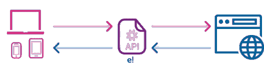
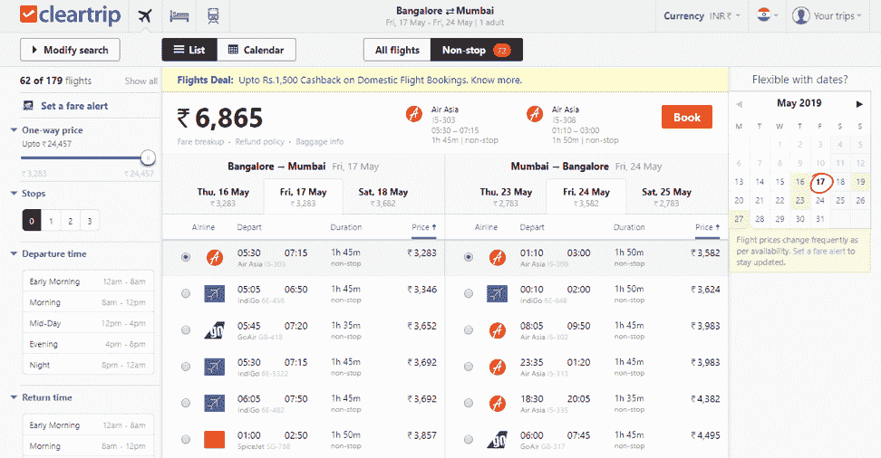
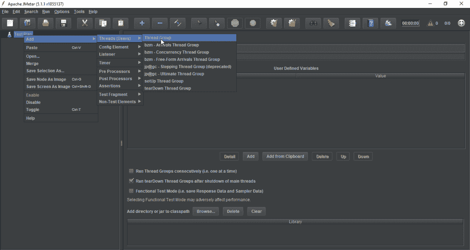
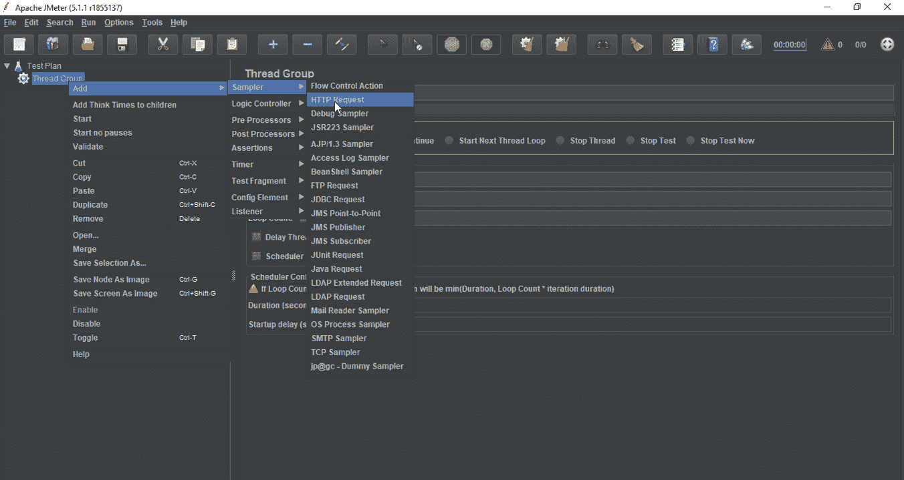
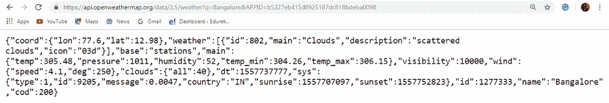
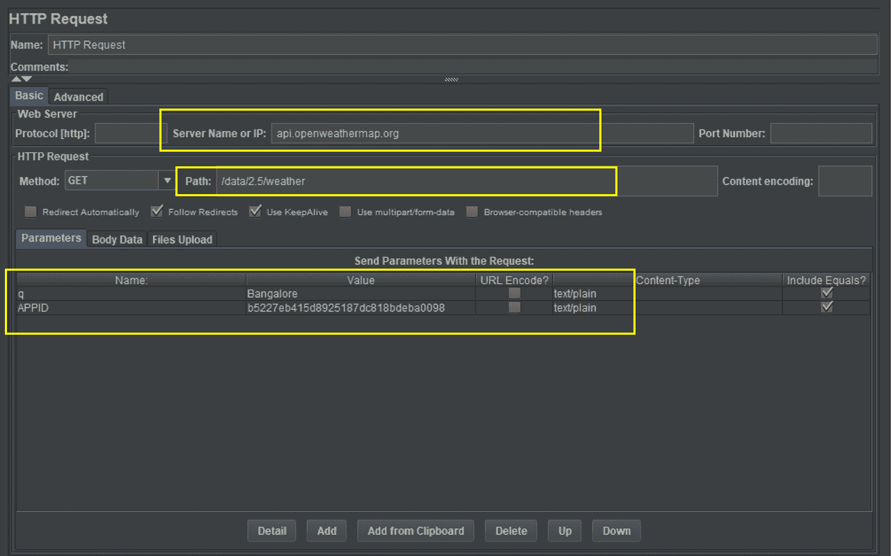
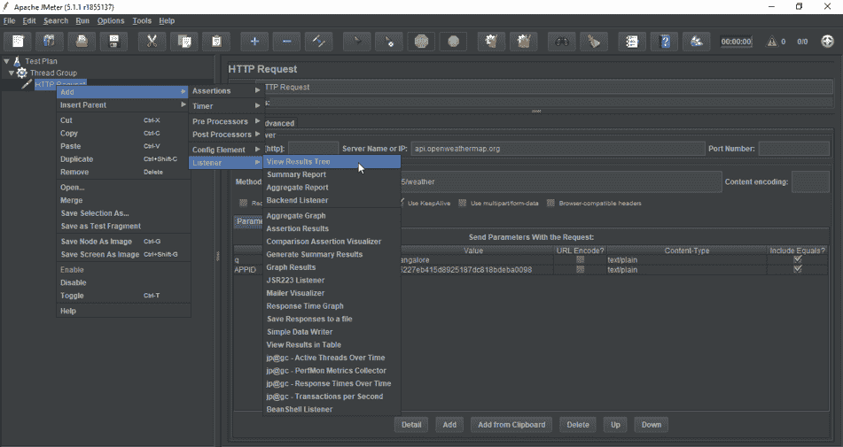
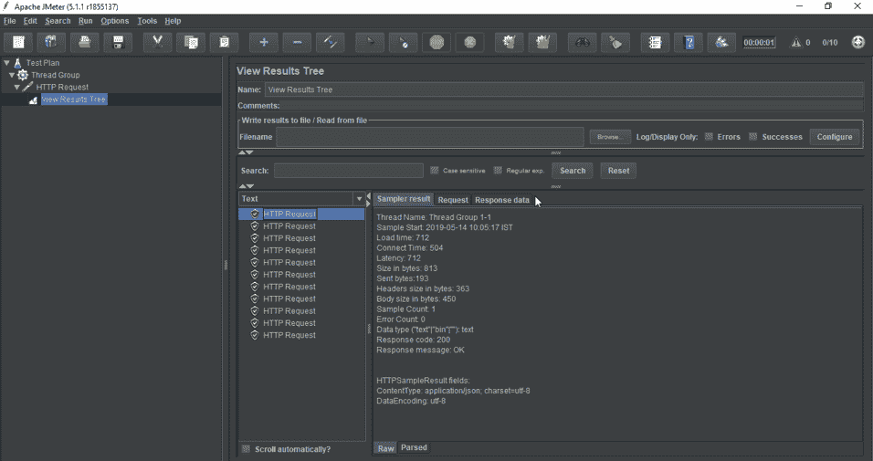

# 什么是 JMeter API 测试，它是如何工作的？

> 原文：<https://www.edureka.co/blog/jmeter-rest-api-testing/>

应用程序编程接口提供了对应用程序的访问，而用户实际上不必与潜在的不同系统进行交互。这篇 **JMeter API [测试](https://www.edureka.co/software-testing-certification-courses)**

*   [API 简介](#apiintroduction)
*   [API 的真实世界示例](#apiexample)
*   [JMeter API 测试:演示](#jmeterapitesting)

## **API 简介**

**应用编程接口** (API)允许一个软件与另一个软件交互。它是一个信使，将请求从一个系统传递到另一个系统，提供需求，并将响应返回给请求系统。

API 充当两个系统之间的信使。例如，当你去餐馆时，服务员充当中间人，从菜单上拿走你点的菜，然后从厨房端上来。这里，服务员是从系统 A(客户)接收请求的 API。然后，去系统 B(厨房)告诉系统 B 系统 A 想要什么。最后，它获取请求的预期响应，并将其传送回系统 a

## **API 的真实世界示例**

在现实世界中使用 API 的一个常见例子是预订机票。有很多网站可以预订机票。但是他们不属于任何特定的航空公司。要预订您的航班，您需要与航空公司的网站互动，以访问航空公司的数据库。这些网站如何与特定的航班数据库进行交互？

通过 API 是可能的。这些航空公司向许多网站提供 API，用于订票和从这些网站获得查询响应。他们推广自己的业务，这反过来又为这些网站公司提供了一定的利润空间。

现在你知道了 API 是如何工作的，让我们继续，看看在 JMeter 中 API 测试是如何完成的。

**JMeter API 测试| edu reka**

[https://www.youtube.com/embed/RrQx_tmUosY?rel=0&showinfo=0](https://www.youtube.com/embed/RrQx_tmUosY?rel=0&showinfo=0)

本视频将为您提供关于客户端和服务器使用 API 进行通信的深入知识。它将提供如何为 web 服务测试 API 的逐步指南。

## **JMeter API 测试:演示**

Apache JMeter 是最流行的性能测试开源软件之一。为了在 JMeter 中执行 API 测试，您必须[下载](https://jmeter.apache.org/download_jmeter.cgi)并在您的系统中安装该工具。如果你对这个工具有任何疑问，你可以查看 [JMeter 教程](https://www.edureka.co/blog/jmeter-tutorial/)和[如何安装 JMeter](https://www.edureka.co/blog/how-to-install-jmeter/) 获取更多知识。

### **JMeter 中执行 API 测试的步骤**

*   首先，你必须启动你的 **JMeter** 并选择**测试计划**。
*   接下来，右击**测试计划**，添加一个**线程组**。

*   然后你要添加 **HTTP 请求**，输入你 API 的**服务器名或者 IP** ，设置路径和参数。右键点击**线程组**，选择**采样器**，添加 **HTTP 请求**。

*   接下来，你可以搜索互联网上免费提供的**REST API**。为那个特定的 API 复制**服务器名**、**路径**和**参数**。

这里，我以班加罗尔的**天气 API** 为例。

*   一旦有了 **API** ，从链接中找出服务器名称、路径和参数。复制 JMeter 测试计划的 **HTTP 请求**中的值。

*   现在，添加一个**监听器**来查看您的测试结果。右键点击 **HTTP 请求**，选择**监听器**，添加**查看结果树**或**查看表**中的结果。

*   最后一步是**运行**你的测试计划。您可以增加**线程**的数量，以增加 API 上的**负载**。**测试结果**将显示 HTTP 请求服务器的**请求**和**响应**。您可以在**响应数据**部分看到准确的天气值。

通过这些步骤，你已经成功完成了你的 **API 测试**。我希望你明白什么是 API，以及如何在 JMeter 中测试你的 API。

*既然你已经知道了如何在 JMeter 中测试 API，那就来看看 Edureka 的 **[性能测试认证](https://www.edureka.co/jmeter-training-performance-testing)课程**吧。本课程让您深入了解工作负载期间的软件行为。在本课程中，您将学习如何检查软件的响应时间和延迟，以及测试软件包是否能够高效扩展。它将帮助您检查强度并分析应用程序在不同负载类型下的整体性能。*

*有问题吗？请在“JMeter API 测试”的评论部分提到它，我们会回复您。*