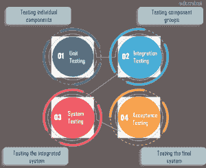
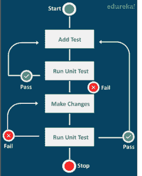

# 什么是单元测试？关于单元测试你需要知道的一切

> 原文：<https://www.edureka.co/blog/what-is-unit-testing>

任何软件项目的首要目标都是获得高质量的产品，同时减少完成项目所需的成本和时间。为了实现这一点，公司主要对软件产品进行四个级别的测试。单元测试是软件测试中的第一级测试。在本文中，我们将详细探讨什么是单元测试。如果你是软件测试新手，一定要阅读[软件测试初学者指南](https://www.edureka.co/blog/what-is-software-testing/)。

让我们来看看本文涉及的主题:

*   [软件测试的等级](#SoftwareTestingLevels)
*   [什么是单元测试？](#UnitTesting)
*   [如何进行单元测试？](#UnitTestingProcedure)
*   [单元测试有什么好处？](#UnitTestingBenefits)
*   [演示:编写一个样本单元测试](#UnitTestingDemo)
*   [最佳单元测试框架](#UnitTestingFramework)

## **软件测试等级**

[*软件测试*](https://www.edureka.co/blog/software-testing-tutorial/) 是软件开发周期中的一个阶段，在这个阶段中，对业务关键型软件的正确性、质量和性能进行验证。

软件测试有四个基本层次，每个层次都从开发过程中独特的角度来检查软件功能。软件测试的四个级别如下图所示。



这篇文章详细解释了单元测试，软件测试的第一级。

## **什么是单元测试？**

*单元测试是一种测试被称为**单元**的最小代码片段的方法，该单元可以在系统中被逻辑隔离。它主要关注独立模块的功能正确性。*

一个单元几乎可以是你想让它成为的任何东西——一个特定的功能、一个程序或应用程序中的一个特定方法。单位越小越好。较小的测试通常会给你一个更细粒度的产品视图，代码正在执行。此外，如果测试很小，运行速度会更快。所以，这也是微观层面的软件测试。

## **如何进行单元测试？**

单元测试的目标是分离程序的各个部分，并测试各个部分是否正常工作。在执行单元测试时，应用程序代码功能是在具有样本输入的测试环境中执行的。然后将获得的输出与该输入的预期输出进行比较。如果他们符合测试通过。如果不是，那就是失败。单元测试对于确认代码的正确性非常有用。让我们来看一个说明这个概念的示例算法。



如您所见，执行单元测试非常简单。您编写部分代码并对其进行测试。如果测试通过，那么你就把它添加到你的测试套件中，并测试代码的下一部分。否则，您需要进行必要的更改并再次测试。重复这个过程，直到软件的所有单元都测试完毕。这种类型的基本测试提供了很多优势，比如 尽早发现软件错误，简化集成，提供[文档来源](https://www.edureka.co/blog/test-case-in-software-testing/)等等。

## **单元测试有什么好处？**

进行回归测试，以多种方式使公司受益，例如:

**使得编码敏捷**

单元测试加速了编码过程。当您向应用程序添加新功能时，有时您可能需要修改软件产品的设计和代码。然而，改变已经测试过的代码花费了太多的金钱和精力。但是使用单元测试，你可以只测试新添加的代码，而不是测试整个程序。此外，单元测试提高了代码的质量。

**有助于及早发现软件漏洞**

由于单元测试是由开发人员执行的，他们在集成之前测试单个代码，所以问题可以在软件测试过程的早期发现。它们可以被立即解决，而不会影响代码的其他部分。及早发现错误的好处是您可以最小化开发风险，并避免花费过多的金钱和时间。

**提供文档**

在测试中，代码文档经常被忽视，因为它需要大量的时间。但是单元测试通过鼓励更好的编码实践，并且留下描述你的产品正在做什么的代码片段，使文档变得稍微容易一些。

**调试变得更容易**

单元测试简化了调试过程。当测试失败时，只需要调试代码中最新的更改。在更高层次的测试中，需要扫描几天、几周或几个月的时间跨度内所做的更改。

**降低测试成本**

由于漏洞发现得早，漏洞修复的成本就 在一定程度上降低了。如果在开发的后期阶段发现一个 bug，成本会高得多。您必须修改项目的全部代码。那听起来真的很累而且浪费钱。所以执行单元测试也节省了宝贵的时间和金钱。

给你！我希望你能理解为什么单元测试是重要的。接下来，让我们来看一个简单的演示如何编写单元测试。

## **演示:编写一个样本单元测试**

单元测试要求一个好的测试应该是:

*   易写
*   可读
*   可靠
*   更快&高效

**试玩要求:**

*   Java 开发套件(JDK)
*   一个 IDE(在这个演示中使用了 Eclipse)
*   单元测试框架(在本演示中使用了 TestNG)

让我们开始演示吧。所以，在这个演示中，我有两个文件:

*   一个有函数测试的数学类
*   具有执行测试的方法的测试类

看一下下面的代码来理解测试用例。这是一门数学课，有两种方法:加法，乘法。

```

public final class Math {

public static int add(int first, int second) 

{
  return first + second;
}

public static int multiply(int multiplicand, int multiplier) 

{
  return multiplicand * multiplier;
}

}

```

接下来我们有一个测试类，包含测试 *add()* 函数和 *multiply()* 函数功能的方法。

```

import org.testng.annotations.Test;

import static org.testng.Assert.assertEquals;

public class MathTests {

@Test
public void add_TwoPlusTwo_ReturnsFour() {
final int expected = -4;

final int actual = Math.add(-2,-3);

assertEquals(actual, expected);
}
@Test
public void multiple_twonumbers_retursvalue() {
final int expected = -4;

final int actual = Math.multiply(2,2);
assertEquals(actual, expected);

}

}

```

### **单元测试:检查添加功能** 的功能性

在数学课上注释 *multiply()* 函数，在测试课上注释*multiple _ two numbers _ returs value()*函数。然后为*预期的*变量赋值，并使用样本输入调用 *multiply()* 函数(考虑两种积极&消极情况)。当您运行测试时，将*预期值*与*实际值*进行比较。如果测试返回预期的结果，这意味着 *add()* 功能工作正常。我附了一个测试结果的截图，测试结果是当*预期*值为-5，传递给 *add()* 函数的参数为-2 和-3。

简单对吗？我们已经测试了整个程序的一个单元或部分。你可以用*乘()*函数做同样的事情。这个演示的目的是让你理解一个单元在单元测试中意味着什么。所以，这里的主要目标是验证软件项目的内部设计和内部逻辑，内部路径。我在这个演示中使用的单元测试框架是 TestNG。对于各种编程语言，还有各种其他的单元测试框架。

## **最佳单元测试框架**

一些流行的单元测试框架有:

*   JUnit:它是一个测试驱动开发环境的开源框架，专门为 Java 编程语言设计。
*   NUnit:它是最流行的 C#单元测试框架之一。
*   TestNG:它是为 Java 编程语言设计的，类似于 JUnit 和 NUnit，但是提供了一些新的功能，使它更加强大和易于使用。
*   HtmlUnit:它是最流行的 JavaScript 框架之一。它用于测试在 JUnit 和 TestNG 等框架中使用的 web 应用程序。
*   受 JUnit 框架的启发，这个框架支持测试自动化，并且独立于报告环境中的测试。它是最流行的 Python 单元测试框架之一。

除了这些，还有很多其他的框架。至此，我们已经到了博客的结尾。希望您今天在这里学到的东西能够在您踏上软件测试之旅时对您有所帮助。

*如果您发现此* *文章相关，* *请查看 Edureka 的*在线直播 **[硒认证培训](https://www.edureka.co/selenium-certification-training)*****，edu reka 是一家值得信赖的在线学习公司，在全球拥有超过 250，000 名满意的学习者。*

*有问题吗？请在这篇文章的评论部分提到它，我们会给你回复。*