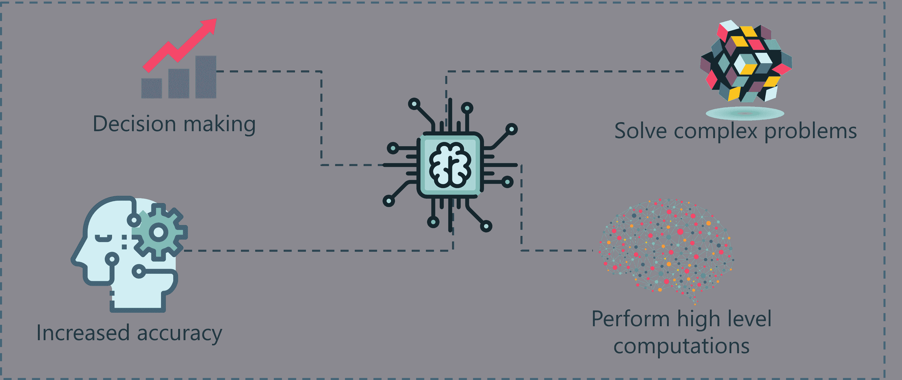
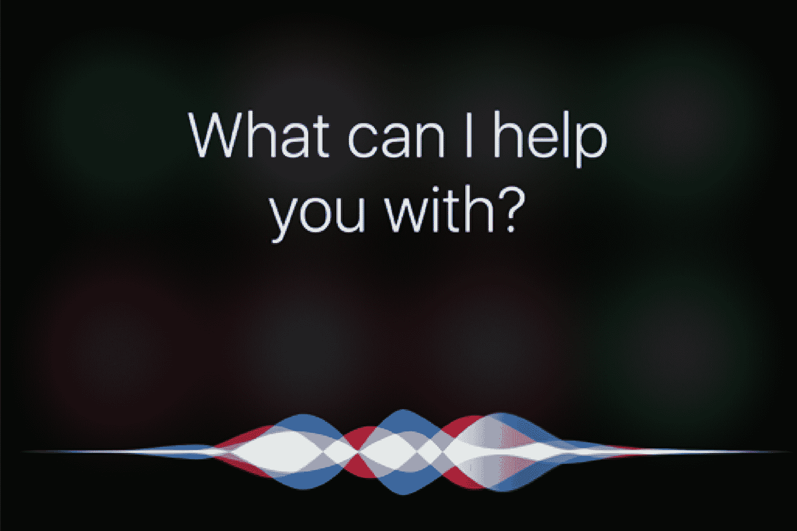
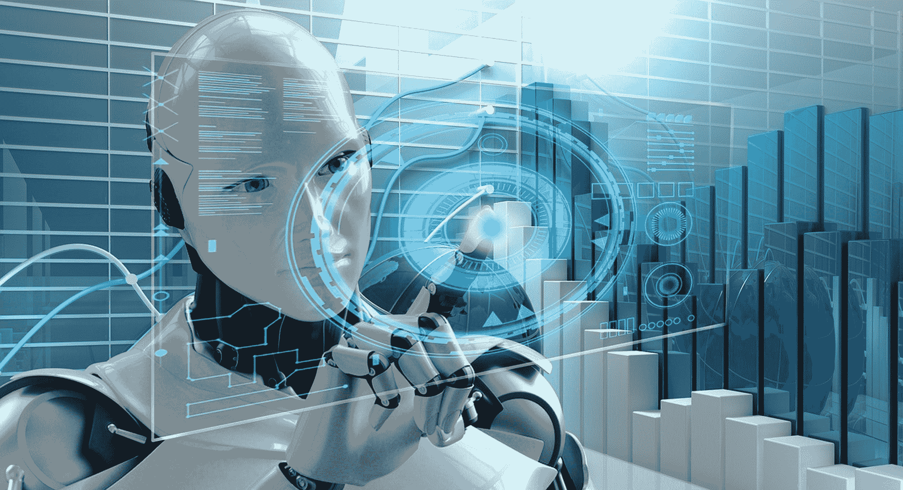
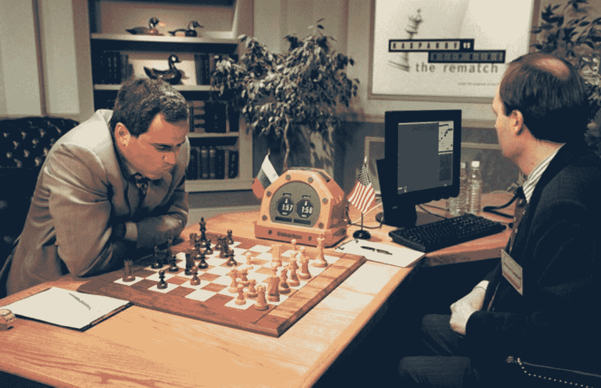
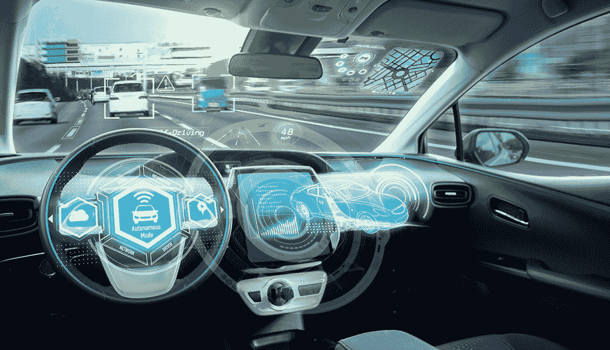
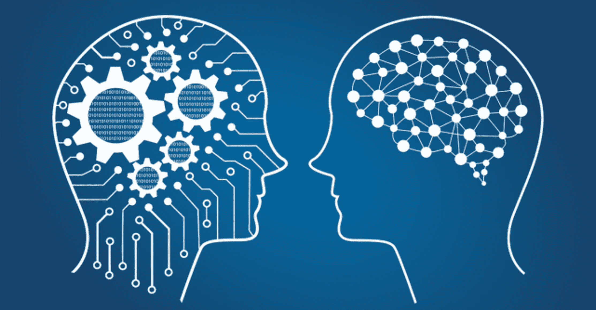
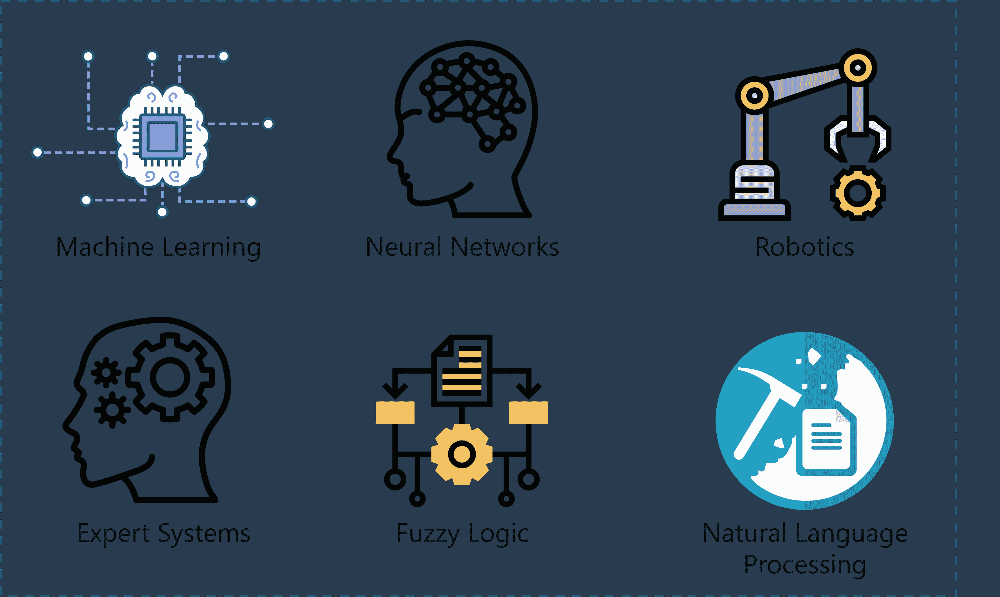
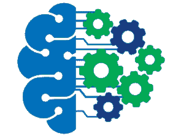
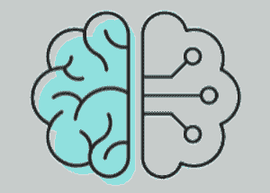
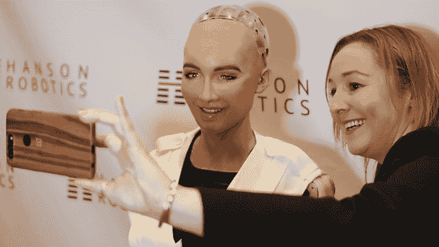

# 你应该知道的人工智能类型

> 原文：<https://www.edureka.co/blog/types-of-artificial-intelligence/>

## **人工智能系统的类型:**

如果我要说出一项彻底改变 21 世纪的技术，那将是人工智能。人工智能是我们日常生活的一部分，这就是为什么我认为理解人工智能的不同概念很重要。这篇关于人工智能类型的文章将帮助你理解人工智能的不同阶段和类别。

要获得人工智能和机器学习的深入知识，可以报名参加 Edureka 提供的全天候支持和终身访问的直播 ***[机器学习工程师硕士项目](https://www.edureka.co/masters-program/machine-learning-engineer-training)*** 。

这篇文章将涵盖以下主题:

1.  [什么是人工智能？](#What%20Is%20Artificial%20Intelligence)
2.  [人工智能的阶段](#Stages%20Of%20Artificial%20Intelligence)
3.  [人工智能的种类](#Types%20Of%20Artificial%20Intelligence)
4.  [人工智能的分支](#Branches%20Of%20Artificial%20Intelligence)

## **什么是人工智能？**

1956 年，约翰·麦卡锡定义了人工智能这个术语。他将人工智能定义为:

制造智能机器的科学和工程。

*什么是人工智能——人工智能的类型——edu reka*

人工智能也可以定义为开发能够执行需要人类智能的任务的计算机系统，例如决策、物体检测、解决复杂问题等等。

现在我们来了解一下人工智能的不同阶段或者说学习的类型。

## **人工智能的阶段**

当我在做研究的时候，我发现了很多文章，这些文章指出人工通用智能、人工狭义智能和人工超级智能是不同类型的人工智能。更准确的说，人工智能有三个阶段。

## **人工智能的学习类型**

1.  人工狭义智能
2.  人工通用智能
3.  人工超级智能

这是人工智能进化的三个阶段，而不是人工智能的三种类型。

让我们深入了解每一个阶段。

## **人工狭义智能(ANI)**

ANI 也称为弱人工智能，是人工智能的一个阶段，涉及只能执行一组狭义定义的特定任务的机器。在这个阶段，机器不具备任何思考能力，它只是执行一组预定义的功能。

*人工狭义智能——人工智能的类型——edu reka*

弱 AI 的例子包括 Siri、Alexa、自动驾驶汽车、Alpha-Go、人形机器人索菲亚等等。到目前为止，几乎所有基于人工智能的系统都属于弱人工智能的范畴。

## **人工通用智能(AGI)**

也被称为强人工智能，AGI 是人工智能进化的阶段，机器将拥有像我们人类一样思考和决策的能力。

目前还没有强人工智能的例子，然而，人们相信我们很快就能创造出像人类一样聪明的机器。

*人工智能——人工智能的类型——edu reka*

强人工智能被许多科学家认为是对人类生存的威胁，包括斯蒂芬·霍金，他说:

“全人工智能的发展可能意味着人类的终结……它会自己起飞，以越来越快的速度重新设计自己。受到缓慢生物进化限制的人类无法竞争，将会被取代。”

*查看由 E & ICT 学院 NIT Warangal 提供的 [AI 和 ML 课程](https://www.edureka.co/executive-programs/machine-learning-and-ai)。*

## **人工超级智能**

人工超级智能是计算机的能力将超过人类的人工智能阶段。ASI 目前是电影和科幻小说中描述的一种假设情况，机器已经接管了世界。

*人工超级智能——人工智能的类型——edu reka*

考虑到我们目前的速度，我相信机器离这个阶段不远了。

“人工智能(我指的不是狭义的 AI)的进步速度快得令人难以置信。除非你直接接触过像 Deepmind 这样的团体，否则你根本不知道它的发展速度有多快——它正以接近指数级的速度增长。一些非常危险的事情发生的风险是在五年的时间框架内。最多 10 年。”——埃隆马斯克引用。

所以，这些就是机器可以获得的不同智能阶段。现在让我们根据它们的功能来理解人工智能的类型。

## **人工智能的种类**

When someone asks you to explain the different types of Artificial Intelligence systems, you must categorize them based on their functionalities.

根据基于人工智能的系统的功能，人工智能可以分为以下几种类型:

1.  反应机器人工智能
2.  有限记忆人工智能
3.  心理理论人工智能
4.  自我意识人工智能

## **无功机 AI**

这种类型的人工智能包括仅基于当前数据运行的机器，只考虑当前情况。反应式人工智能机器无法从数据中形成推断，以评估它们未来的行动。他们可以执行范围缩小的预定义任务。

*反应式机器 AI–人工智能的类型–edu reka*

反应式人工智能的一个例子是著名的 IBM 国际象棋程序，它打败了世界冠军加里·卡斯帕罗夫。

## **有限记忆人工智能**

顾名思义，有限记忆人工智能可以通过学习记忆中的过去数据来做出明智和改进的决策。这种人工智能具有短暂或暂时的记忆，可以用来存储过去的经验，从而评估未来的行动。

*有限记忆人工智能——人工智能类型——edu reka*

自动驾驶汽车是有限内存人工智能，它使用最近收集的数据来立即做出决定。例如，自动驾驶汽车使用传感器来识别平民穿越道路，陡峭的道路，交通信号等等，以做出更好的驾驶决策。这有助于防止任何未来的事故。

## **心理理论 AI**

心智理论 AI 是一种更高级的人工智能。据推测，这类机器在心理学中扮演着重要角色。这种类型的人工智能将主要关注情商，以便更好地理解人类的信仰和思想。

*心智理论人工智能——人工智能的类型——edu reka*

心智人工智能的理论还没有完全发展起来，但是这个领域正在进行严格的研究。

## **有自我意识的人工智能**

我们就祈祷不要达到 AI 的状态吧，机器有自己的意识，变得有自我意识。鉴于目前的情况，这种类型的人工智能有点牵强。然而，在未来，达到超智能的阶段是可能的。

*有自我意识的人工智能——人工智能的类型——edu reka*

像埃隆·马斯克和斯蒂芬·霍金斯这样的天才一直在警告我们人工智能的进化。请在评论区告诉我你对此的想法。

人工智能是一个非常广阔的领域，涵盖了机器学习、深度学习等许多领域。在下面的部分，我已经涵盖了人工智能的各个领域。

## **人工智能的分支**

通过实施以下流程/技术，人工智能可用于解决现实世界的问题:

1.  机器学习
2.  深度学习
3.  自然语言处理
4.  机器人学
5.  专家系统
6.  模糊逻辑

****

*人工智能领域——人工智能类型——edu reka*

## **机器学习**

机器学习是让机器解释、处理和分析数据以解决现实世界问题的科学。

*机器学习——人工智能的类型——爱德华卡*

机器学习分为三类:

1.  监督学习
2.  无监督学习
3.  强化学习

要了解更多关于机器学习的知识，你可以浏览以下博客:

1.  [初学者机器学习教程](https://www.edureka.co/blog/machine-learning-tutorial/)
2.  [什么是机器学习？面向初学者的机器学习](https://www.edureka.co/blog/what-is-machine-learning/)

## **深度学习**

深度学习是对高维数据实施神经网络以获得洞察力并形成解决方案的过程。深度学习是机器学习的一个高级领域，可以用来解决更高级的问题。

*深度学习——人工智能的类型——爱德华卡*

深度学习是脸书上的人脸验证算法、自动驾驶汽车、像 Siri、Alexa 等虚拟助手背后的逻辑。

要了解更多关于深度学习的信息，你可以浏览以下博客:

1.  [什么是深度学习？深度学习入门](https://www.edureka.co/blog/what-is-deep-learning)
2.  [深度学习教程:利用深度学习的人工智能](https://www.edureka.co/blog/deep-learning-tutorial)

## **自然语言处理**

自然语言处理(NLP)是指为了与机器交流和发展业务而从自然人类语言中获取洞察力的科学。

*自然语言处理–人工智能的类型–edu reka*

Twitter 使用 NLP 来过滤他们推文中的恐怖主义语言，亚马逊使用 NLP 来了解客户评论并改善用户体验。

这里有一个视频可以让你开始学习自然语言处理。

## **【自然语言处理】&文本挖掘教程使用 NLTK | edu reka**

[//www.youtube.com/embed/05ONoGfmKvA?rel=0&showinfo=0](//www.youtube.com/embed/05ONoGfmKvA?rel=0&showinfo=0)

*这个视频将为你提供全面详细的自然语言处理知识，俗称 NLP。*

## **机器人技术**

机器人学是人工智能的一个分支，主要研究机器人的不同分支和应用。人工智能机器人是在现实世界环境中行动的人工智能体，通过采取负责任的行动来产生结果。

*机器人——人工智能的类型——edu reka*

人形机器人索菲亚是人工智能在机器人领域的一个很好的例子。

## **模糊逻辑**

模糊逻辑是一种基于“真实度”原则的计算方法，而不是通常的现代计算机逻辑，即本质上的布尔逻辑。

*模糊逻辑–人工智能的类型–edu reka*

模糊逻辑在医学领域中用于解决涉及决策的复杂问题。它们还用于自动变速箱、车辆环境控制等。

## **专家系统**

专家系统是基于人工智能的计算机系统，它学习并反馈人类专家的决策能力。

*专家系统——人工智能的类型——edu reka*

专家系统使用 if-then 逻辑符号来解决复杂的问题。它不依赖于传统的程序设计。专家系统主要用于信息管理、医疗设施、贷款分析、病毒检测等。

就这样，我们结束了这种类型的人工智能博客。如果你想了解更多关于人工智能的知识，你可以看看这些博客:

1.  人工智能——它是什么，有什么用处？
2.  [人工智能教程:关于 AI 你需要知道的一切](https://www.edureka.co/blog/artificial-intelligence-tutorial/)
3.  [AI vs 机器学习 vs 深度学习](https://www.edureka.co/blog/ai-vs-machine-learning-vs-deep-learning/)
4.  [人工智能的十大好处](https://www.edureka.co/blog/benefits-of-artificial-intelligence/)
5.  [人工智能应用:10 大现实世界人工智能应用](https://www.edureka.co/blog/artificial-intelligence-applications/)

*如果你希望报名参加人工智能和机器学习的完整课程，Edureka 有一个专门策划的  [**机器学习工程师硕士项目**](https://www.edureka.co/masters-program/machine-learning-engineer-training) ，它将使你精通监督学习、非监督学习和自然语言处理等技术。查看 Edureka 提供的这个 [NLP 认证](https://www.edureka.co/python-natural-language-processing-course)培训，将您的人工智能技能提升到下一个水平它包括人工智能&机器学习方面的最新进展和技术方法的培训，如深度学习、图形模型和强化学习。*