# 您需要了解的 Hadoop 组件

> 原文：<https://www.edureka.co/blog/every-hadoop-component/>

**Hadoop 组件**在处理大数据方面无与伦比，凭借其出色的功能，它们处于领先地位。在本文中，我们将讨论在**大数据**领域实现这一里程碑时发挥了关键作用的主要 Hadoop 组件。

*   [什么是 Hadoop？](#hadoop)
*   [Hadoop 核心组件](#core)
*   [Hadoop 架构](#architecture)
*   [Hadoop 生态系统](#ecosystem)

## **什么是 Hadoop？**

[**Hadoop**](https://www.edureka.co/blog/hadoop-tutorial/) 可以定义为**软件实用程序**的集合，这些软件实用程序在分布式存储环境中通过具有**软件框架**的计算机网络运行，以便处理 **Hadoop 集群中的**大数据**应用程序。**

让我们看看 Hadoop 的核心组件。

## **Hadoop 核心组件**

Hadoop 的核心组件如下:

*   [**MapReduce**](https://www.edureka.co/blog/mapreduce-tutorial/)
*   [HDFS](https://www.edureka.co/blog/hdfs-tutorial)
*   [**纱**](https://www.edureka.co/blog/hadoop-yarn-tutorial/)
*   **常用工具**

让我们详细讨论每一个问题。

## **Hadoop 架构**

**MapReduce:** 是用 Java 编程语言设计的软件数据处理模型。MapReduce 是两个独立任务的组合，即:

*   **Map:** 它获取数据和集合，然后将其分成块，这样它们就被转换成一种新的格式，这种格式将是键-值对的形式。
*   **化简:**这是将**键/值**对化简为元组的第二部分。

**MapReduce** 流程使我们能够对大数据执行各种操作，如**过滤**和**排序**以及许多类似的操作。

**HDFS** 是 Hadoop 生态系统中的主要存储单元。HDFS 是 Hadoop 快速数据访问和巨大可扩展性背后的原因。

你可以通过伦敦 的 [数据工程培训更好的理解。](https://www.edureka.co/microsoft-azure-data-engineering-certification-course-london)

HDFS 包括以下部件。

*   **命名节点**
*   **数据节点**
*   **二级命名节点**

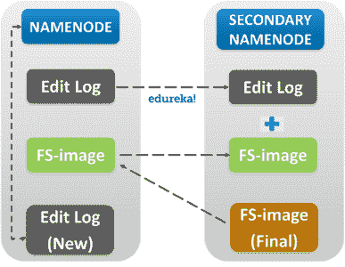

在这个由来自大数据平台的顶级行业专家设计的[大数据课程](https://www.edureka.co/big-data-hadoop-training-certification)中，探索和了解更多关于 HDFS 的信息。

让我们详细讨论每一个问题。

*   **名称节点:**名称节点是 HDFS 的集中片。它被称为*主机*，它被设计用来存储*元数据。* Name Node 负责监控*Slave**Node*的 *Health* *Status* ，并将*任务*分配给 Data Nodes。

*   **数据节点:**数据节点是存储数据的实际单元。它被称为*从节点*，它以*心跳的形式对名称节点的健康状态和任务状态做出响应。*如果数据节点未能响应名称节点，则名称节点认为从节点失效，并将任务重新分配给下一个可用的数据节点。

*   **次名节点:**顾名思义，次名节点不是名节点的备份。它充当名称节点的*缓冲区*。它将名称节点的中间更新 *FS-image* 存储在*编辑日志*中，并在名称节点不活动时将信息更新到*最终* *FS-image* 。

摘要中的下一个是**纱线**。

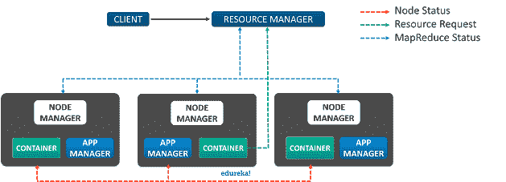

**YARN** 或**另一个资源协商者**是对 **Hadoop** 第二版的更新。它负责**资源管理**和**作业调度**。纱线由以下成分组成:

*   **资源管理器:**它是 Yarn 的核心组件，被认为是*的主人**、**的主人*，负责提供通用灵活的框架来管理 *Hadoop 集群中的计算资源。*

*   **节点管理器:**是*从节点*，服务于*资源* *资源* *管理器。*节点管理器被分配给集群中的所有节点。节点管理器的主要职责是监控容器和应用程序管理器的状态。

*   **App Manager:** 管理容器中的数据处理，向资源管理器请求容器资源。

*   **容器:**容器是进行实际数据处理的地方。

至此，我们完成了 Hadoop 中的核心组件，现在让我们进入 **Hadoop 生态系统中的主要组件:**

你甚至可以通过[数据工程师培训](https://www.edureka.co/microsoft-azure-data-engineering-certification-course)了解大数据的细节。

## **Hadoop 生态系统**

Hadoop 生态系统中的组件分为:

*   [**储存**](#storage)
*   [**通用执行引擎**](#general)
*   [**数据库管理工具**](#database)
*   [**数据抽象引擎**](#abstraction)
*   [**实时数据流**](#realtime)
*   [**图形处理引擎**](#graph)
*   [**机器学习**](#ml)
*   **[集群管理](#cluster)**

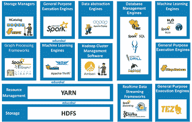

**数据存储**

**Hadoop 分布式文件系统，**它负责**的数据存储。**为 Hadoop 提供分布式数据处理能力。HDFS 是**容错的，可靠的**，最重要的是它是慷慨的**可扩展的。**

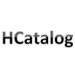

**HCATALOG** 是一个用于 Hadoop 的**表管理**工具。它向用户提供了 **HIVE** 的表格数据存储，用户可以使用 **Pig、MapReduce** 等先进的数据处理工具对数据进行操作。

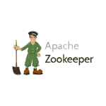 [** Zookeeper **](https://www.edureka.co/community/1106/what-zookeeper-what-the-purpose-zookeeper-hadoop-ecosystem) 被称为集中式开源服务器，负责管理 Hadoop 集群的配置信息、命名约定和同步。

[**Oozie**](https://www.edureka.co/blog/apache-oozie-tutorial/) 是一个在分布式环境中负责管理和调度作业的调度系统。它按顺序运行多个复杂的作业，以完成一项复杂的工作。

现在让我们讨论几个通用执行引擎。第一个是

**通用执行引擎**

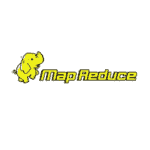

**MapReduce** 是一款基于[**Java**](https://www.edureka.co/blog/java-tutorial/)–**的**并行数据处理工具，旨在处理 Hadoop 中的复杂数据集，以便用户可以执行多种操作，如**过滤、** **映射**等等。MapReduce 用于函数式编程。

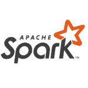

[**Spark**](https://www.youtube.com/watch?v=9mELEARcxJo) 是一个**内存集群计算**框架，具有闪电般的敏捷性。它可以执行实时数据流和 ETL。Spark 还可以用于微批量处理。

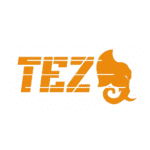

Tez 是一个可扩展的高性能数据处理框架，旨在提供批处理和交互式数据处理。它可以以一个**单个**作业的形式，集体执行一系列 **MapReduce** 作业。这将处理提高到指数级。

现在，让我们进入处理数据库管理系统的 Hadoop 组件。首先，

**数据库管理工具**

[Hive](https://www.youtube.com/watch?v=tKNGB5IZPFE) 是 Apache 软件基金会的一个**数据仓库**项目，它被设计来提供对数据库的 **SQL** 之类的查询。Hive 还用于执行 ETL 操作， **HIVE DDL** 和 **HIVE DML。**

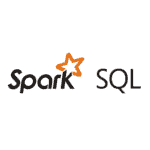

[**Spark SQL**](https://www.edureka.co/blog/dataframes-in-spark/#need-of-dataframe) 是用于结构化数据处理的模块。它充当分布式查询引擎。它为数据帧提供编程抽象，主要用于从 [**RDDs**](https://www.edureka.co/blog/rdd-using-spark/) 、 **Hive** 和 **Parquet** 文件中导入数据。

**Impala** 是一个内存查询处理引擎。它用在[的 **Hadoop 集群中。**](https://www.edureka.co/blog/hadoop-clusters) 它被设计成将自身与 Hive 元存储相集成，并在组件之间共享表信息。

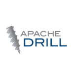

**Apache Drill** 是一个低延迟的分布式查询引擎。它的主要目标是通过单个查询来组合各种数据存储。它能够支持不同种类的 NoSQL 数据库。

HBase 是一个开源的非关系分布式数据库，旨在提供对大量分布式数据的随机访问。像 **Drill 一样，HBase** 也可以通过使用单个查询来组合各种数据存储。

至此，让我们现在来看看处理数据抽象的 Hadoop 组件。

**数据抽象引擎**

[**猪**](https://www.edureka.co/blog/pig-tutorial/) 是一种**高级脚本语言。**它旨在让用户在脚本级别以简单的方式编写复杂的数据转换。pig 可以执行 ETL 操作，也有足够的能力分析巨大的数据集。

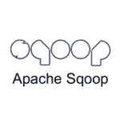

[**Apache Sqoop**](https://www.edureka.co/blog/apache-sqoop-tutorial/) 是一个简单的命令行界面应用程序，用于在网络中的关系数据库之间传输数据。它基本上是一个数据摄取工具。它支持在企业级别导入和导出结构化数据。

现在让我们了解一下实时数据流中的 Hadoop 组件。

**实时数据流工具**

****

**Spark Streaming** 基本上是 Spark API 的扩展。它旨在为实时数据流提供可扩展、高吞吐量和容错的流处理。

[**Kafka**](https://www.edureka.co/blog/apache-kafka-next-generation-distributed-messaging-system) 是一款开源的数据流处理软件，旨在高度敏捷地摄取和移动大量数据。它使用发布、订阅和消费者模型。

是一款开源分布式可靠软件，旨在提供**收集、聚合**和**移动**的大量日志数据。

现在，让我们了解一些基于图形处理的 Hadoop 组件

**图形处理引擎**

Giraph 是一个交互式图形处理框架，它利用 Hadoop MapReduce 实现来处理图形。它主要用于分析社交媒体数据。

**GraphX** 是 Apache Spark 针对图形和图形并行计算的 API。GraphX 在单个系统中统一了 ETL(提取、转换&加载)过程、探索性分析和迭代图计算

让我们把事情变得有趣一点。现在我们将处理机器学习中的 Hadoop 组件。

**机器学习引擎**

**H2O** 是一个完全开源、分布式内存中机器学习 **平台** 具有线性可扩展性。 **H2O 平台** 被超过 R 个& Python 社区使用

Oryx 是一个通用的 lambda 架构层，提供批处理/速度/服务层。它的主要目标是大规模机器学习。

[**Spark MLlib**](https://www.edureka.co/blog/spark-mllib/) 是一个可扩展的机器学习库。它旨在提供 spark 中的机器学习操作。

Avro 是一个面向行的远程过程调用和数据序列化工具。它用于动态打字。Avro 主要用于 RPC。

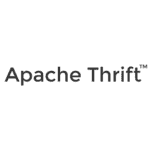

**Thrift** 是一种接口定义语言和二进制通信协议，允许用户在一个简单的定义文件中定义数据类型和服务接口。Thrift 主要用于构建 RPC 客户端和服务器。

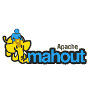

[**Mahout**](https://www.edureka.co/blog/introduction-to-apache-mahout/) 被开发用来实现分布式**机器学习**算法。它能够使用简单的编程模型在整个集群的分布式环境中存储和处理大数据。

最后，让我们了解一下集群管理中使用的 Hadoop 组件。

**集群管理**

 **Ambari** 是一款 Hadoop 集群管理软件，使系统管理员能够管理和监控 Hadoop 集群。

**ZooKeeper** 本质上是一个分布式系统的集中式服务，以一个分层的键值存储来为大型分布式系统提供分布式配置服务、同步服务和命名注册。

本文到此结束，我希望您已经了解了 Hadoop 及其体系结构、核心组件以及其生态系统中的重要 Hadoop 组件。

*现在您已经了解了 Hadoop 的核心组件及其生态系统，请查看 Edureka 在浦那举办的  [**Hadoop 培训**](https://www.edureka.co/big-data-hadoop-training-certification-pune)* *，edu reka 是一家值得信赖的在线学习公司，拥有遍布全球的 250，000 多名满意的学习者。Edureka 的[大数据架构师课程](https://www.edureka.co/masters-program/big-data-architect-training) 使用零售、社交媒体、航空、旅游、金融领域的实时用例，帮助学习者成为 HDFS、Yarn、MapReduce、Pig、Hive、HBase、Oozie、Flume 和 Sqoop 领域的专家。*