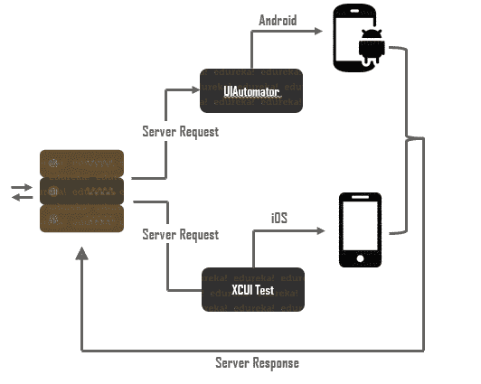

# 什么是 Appium &它是如何工作的？Appium 初学者指南

> 原文：<https://www.edureka.co/blog/what-is-appium/>

移动软件行业是一个混乱的行业。快速推出以及后续维护工作，保持时间表紧张，并保持头脑工作。在这种混乱中，Appium，一个移动应用程序自动化测试工具，提供了以更有效的方式编排这种混乱的机会。这导致了对技术熟练的应用专家需求的虚假增长。在这篇“什么是 Appium”的博客中，我将解释这是如何实现的。

本博客涵盖以下主题:

*   [什么是 Appium？](#what-is-appium)
*   [为什么要选择 Appium？](#why-choose-appium)
*   [它是如何工作的？](#how-does-it-work)
*   [安装附件](#installing-appium)

## **什么是 Appium？| appi um | edu reka简介 **

[https://www.youtube.com/embed/DFq5mntzOQk?rel=0&showinfo=0](https://www.youtube.com/embed/DFq5mntzOQk?rel=0&showinfo=0)

*本期 Edureka“什么是 Appium”视频将向您全面介绍 Appium，这是一款在移动应用程序测试行业被广泛接受的工具。*

## **什么是 Appium？**

 Appium 是一款开源、跨平台的 [ 自动化 ](https://www.edureka.co/blog/mobile-testing-tools/) 测试工具。它用于自动化本地、混合和 web 应用程序的测试用例。该工具主要关注 Android 和 [  iOS 应用 ](https://www.edureka.co/blog/swift-tutorial) 并且仅限于移动应用测试领域。最近，几个更新回来，Appium 还宣布，他们将支持 windows 桌面应用程序的测试。

Appium 由 Sauce Labs 开发和维护。目前，Appium 版本 1.12 正在分发。Appium 最初是作为一个基于命令行的测试服务开始的，可以使用 [node.js](https://www.edureka.co/blog/nodejs-tutorial/) 进行安装。在他们最新发布的名为“Appium Desktop”的版本中，他们发布了一个强大而精致的工具，具有直观的图形用户界面。Appium 桌面带有一个应用元素检查器，你可以在我的 [Appium 教程](https://www.edureka.co/blog/appium-tutorial/)中查看。

## **为什么要选择 Appium？**

如果 Appium 在移动应用程序测试行业的广泛接受度还不足以说服你，也许这几点可以改变你的想法。

**免费开源**——Appium 不仅免费，而且开源。这意味着 Appium 可以根据你的想法无限调整工作。

**真正的跨平台**——app ium 可以测试任何移动应用，无论是原生应用、混合应用，甚至是 web 应用。无论该应用程序只在 iOS 或 Android 上运行，还是同时在两者上运行，Appium 都能满足您的需求。以上，Appium，本身可以安装在 Windows，Mac 和 Linux 上

**无需应用源代码**–自动化测试应用到目前为止需要访问应用代码库和源代码。Appium 通过完全忽略[自动化测试的这个基本方面带来了一些新的东西。](https://www.edureka.co/blog/automation-testing-tutorial/)

**应用程序没有重新安装**–app ium 的理念是测试一个应用程序而不需要重新安装和以任何方式修改它。

**Appium 支持**–app ium 作为一个框架，也受到各种自动化测试工具的支持，只是为了让任何项目的迁移变得轻而易举。 **一个热闹的社区**——一个工具本身是永远不够的。一个萌芽的社区是极其必要的。活跃的社区导致更快的错误报告和更容易的故障排除，这是自动化测试工具成功的关键。

## **它是怎么工作的？**

Appium 是一个简单的 HTTP 服务器，它是用 Javascript T2 编写的。它遵循通用的客户机-服务器体系结构。Appium 服务器处理来自 Appium 客户端的请求，并将它们转发到模拟器/仿真器/真实设备，在那里测试脚本被自动化。测试结果通过 Appium 服务器以服务器响应的形式传递给 Appium 客户端。 要更详细地解释 Appium 到底是如何工作的，请查看我的 [Appium 架构](https://www.edureka.co/blog/appium-architecture/)博客，在那里我将该工具剥离到它的基本元素，并对它们进行更深入的研究。博客会让你更好地理解你在下图中看到的所有片段是如何组合在一起的。

## **安装附件**

围绕 Appium 的安装，人们议论纷纷。由于 Appium 的高度依赖性问题，人们往往认为这是一个令人厌倦和复杂的过程。老实说，这个过程很简单，只需要适当地编排。

以下是安装 Appium 所需的依赖项

*   Node.js
*   [Java](https://www.edureka.co/blog/java-tutorial/)
*   应用服务器
*   Appium 客户端库
*   硒库
*   安卓工作室
*   Xcode

关于安装 Appium 的分步指南，你一定要参考我的 [Appium 安装](https://www.edureka.co/blog/appium-installation/)博客！

“什么是 Appium”博客到此结束。我希望阅读这篇博客有助于你理解 Appium 是一种工具。如果你对移动应用测试感兴趣，请查看 edureka 的 [Appium 认证课程](https://www.edureka.co/appium-training-mobile-automation-testing)。业内专业人士将通过在线直播课程，教您使用 Appium 进行移动应用测试。

如果您对本博客有任何疑问，请在“什么是 Appium”博客的评论区发表评论，我们将尽快回复您！