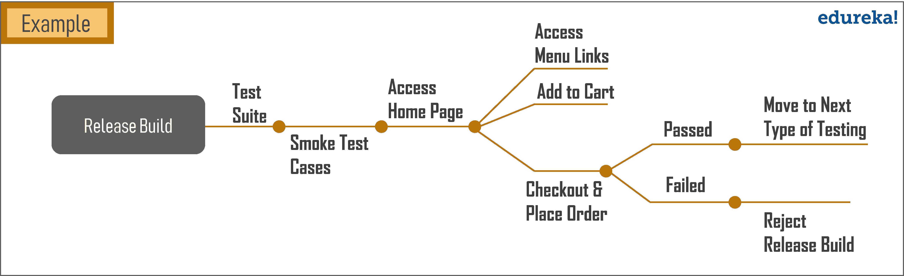

# 什么是烟雾测试？关于烟雾测试你需要知道的一切

> 原文：<https://www.edureka.co/blog/what-is-smoke-testing/>

任何[软件项目](https://www.edureka.co/blog/what-is-software-testing/)的首要目标都是获得高质量的产品，同时减少完成项目所需的成本和时间。因此，每个软件产品在被认为适合投放市场之前都要经过各种[级别的严格软件测试](https://www.edureka.co/blog/types-of-software-testing/#typesoftesting)。在实施关键测试之前，执行初步测试以发现应用程序中的基本和关键问题。这叫做冒烟测试。在本文中，我们将探讨“什么是冒烟测试？”详细地说。

让我们来看看本文涉及的主题:

*   [什么是烟尘测试？](#SmokeTesting)
*   [烟雾测试的起源](#SmokeTestingHistory)
*   [烟雾测试的特点](#SmokeTestingFeatures)
*   [什么时候做烟度测试？](#SmokeTestingTime)
*   [烟度测试有什么好处？](#SmokeTestingBenefits)
*   如何进行烟雾测试？
*   [冒烟测试与健全性测试](#SmokeTestingvsSanityTesting)

## **什么是烟尘测试？**

冒烟测试是一种软件测试，通常在初始软件构建时进行，以确保程序的关键功能绝对正常。

不确定什么是软件版本？软件构建是将源代码转换成可以在任何系统上运行的独立形式的过程。构建不能在环境中正常工作的风险总是存在的。因为配置问题、代码问题、回归问题或环境问题等原因。因此，最初的构建在发送到其他级别的测试之前要经过冒烟测试。冒烟测试的过程针对所有关键功能。如果关键特性不工作，或者主要的错误还没有被修复，没有理由浪费时间做进一步的测试。

**烟源检测**

你想知道为什么“冒烟测试”这个名字吗？自从冒烟测试出现以来，有许多与术语相关的理论。然而，其中只有两个似乎恰当地定义了它的起源:

根据维基百科，术语“冒烟测试”可能起源于管道行业。水管工通常会用烟来检测管道系统的泄漏和裂缝。后来，这个术语被用于电子测试。

另一种理论认为,“烟雾测试”一词源于硬件测试，即首次开机时对设备组件的烟雾进行测试。

今天，冒烟测试的概念在软件开发过程中被广泛使用。嗯，你可能真的找不到任何烟雾，但同样的原理也适用于烟雾测试软件。为了更好地理解这个概念，这个问题是“什么是烟雾测试？”文章进一步列举了烟雾测试的特点。

## **烟雾测试的特点**

下面列出了您应该了解的烟雾测试的主要特征:

*   冒烟测试通常被称为构建验证测试，其中通过测试应用程序的重要功能来验证构建，然后在测试结果中发送给下一级测试基础
*   它是软件开发周期中不可或缺的一部分，通过测试应用程序的重要特性来验证构建
*   烟雾测试可以手动执行，也可以根据测试要求自动执行
*   它适用于不同层次的软件测试，如集成测试、系统测试和验收测试。
*   这是一个非穷举测试，测试用例数量非常有限。通常，烟雾测试是在积极的情景和有效的数据下进行的。整个过程都有记录。

简单地说，你可以把冒烟测试看作是对应用程序构建的正常健康检查。“什么是烟雾测试？”文章，让我们来了解一下与烟雾测试相关的一些重要问题。

## **什么时候做烟度测试？**

每当软件的新功能被开发并与现有版本集成时，通常都会进行冒烟测试 。这确保了所有关键功能是否正常工作。这是由开发人员在开发环境中完成的，以确保在将构建发布到 QA 之前应用程序的正确性。在构建被发送到 QA 环境之后，由 QA 工程师执行 s 莫克测试。每当有新的构建时，QA 团队就确定应用程序中的主要功能来执行冒烟测试。

这实际上也回答了第二个问题，“谁执行烟雾测试？。冒烟测试由开发人员或测试人员执行，或者两者都执行。

## **烟度测试有什么好处？**

冒烟测试基本上是在初始软件构建上执行的表面测试，以确保应用程序的所有关键功能正常工作。这样做有很多好处，如下所示:

*   您可以在测试的早期阶段发现错误和缺陷
*   将集成多个组件时出现的风险降至最低
*   易于执行并提高软件质量
*   为测试人员和开发人员节省大量精力和时间
*   需要数量非常有限的测试用例
*   能够更快地排除新的和回归的错误
*   提供获得更快反馈的优势
*   减少人工干预
*   提高 QA 团队的效率。

冒烟测试的事情是，它获取您的代码，构建它，运行它，并验证一两件事。但是它不会验证你的软件是否 100%功能正确。

## 如何进行烟雾测试？

冒烟测试的执行与任何其他类型的测试一样。以下是对软件进行冒烟测试时可以执行的步骤:

1.  构建由开发团队部署，然后发送到测试团队进行测试
2.  一旦 QA 团队收到构建，根据需求他们设计[测试用例](https://www.edureka.co/blog/test-case-in-software-testing/#TestCase)
3.  许多烟雾测试被组合成一套小型测试服。为了高效和有目的地构建，冒烟测试套件应该包含易于管理的测试数量
4.  自动化可以被证明是有效的&值得在烟雾测试服中使用，所以如果需要的话，自动化烟雾测试。有许多自动化框架可用于烟雾测试
5.  最后，执行测试用例，并清理测试环境以适应下一轮测试。这可能包括停止服务器、删除文件或清空数据库表。

让我们试着用一个实时的例子来解决这个问题。

比方说，你在一家电子商务网站工作。您有几个初始构建，可以发布进行测试。你需要做的第一件事是检查核心功能是否正常工作。因此，您尝试访问该网站，并在购物车中添加一件商品来下订单。这是所有电子商务网站的主要工作流程，对吗？如果这个主要的工作流可以工作，那么您可以说您已经接受测试的构建已经通过了冒烟测试。然后你可以进入下一轮测试。还有另一个术语，称为健全性测试，经常被误解为冒烟测试。

## **冒烟测试与健全性测试**

冒烟测试和健全性测试是两种非常不同的实践。但是人们还是会把它们弄混，因为区别有点微妙。下表列出了冒烟测试和健全性测试之间的主要区别。

| ***特征*** | ***烟雾检测*** | ***神智测试*** |
| ***系统构建*** | 测试在软件产品的初始构建上执行 | 测试在已经通过冒烟测试的构建上完成&轮回归测试 |
| ***试探的动机*** | 为了衡量新创建的构建的稳定性，要面对掉更加严格的测试 | 评估合理性&软件功能的原创性 |
| ***的子集？*** | 是验收测试的子集 | 是回归测试的子集 |
| ***单据*** | 涉及文档和脚本工作 | 不强调任何种类的文档 |
| ***测试覆盖*** | 浅&宽方法包括所有主要功能而不深入 | 缩小范围&深度方法涉及功能和特性的详细测试 |
| *Pe***由？** | 由开发人员或测试人员执行 | 由测试员执行 |

就这样，伙计们！就这样，我们到了本文的结尾。希望到现在为止，你已经对烟雾测试有了基本的了解。总之，冒烟测试提供了一个简单、直接但极其有效的方法来加速查找 bug。开发人员和其他类似人员可以在软件项目中使用冒烟测试，并且可以显著提高代码质量。

*如果你发现这个“什么是烟度测试？”* *文章相关，* *查看*在线直播 **[硒认证培训](https://www.edureka.co/selenium-certification-training)*****edu reka 是一家值得信赖的在线学习公司，在全球拥有超过 250，000 名满意的学习者。*

*有问题吗？请在“什么是烟雾测试”的评论部分提到它。“文章我们会给你回复的。*