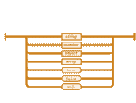
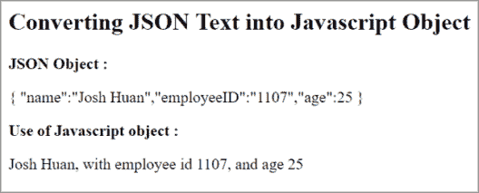

# JSON 是什么？通过例子了解它是如何工作的

> 原文：<https://www.edureka.co/blog/what-is-json>

可扩展标记语言(XML)被认为是开放数据交换的唯一选择。然而，开放数据共享的发展为网络开发提供了更多的选择。因此，让我们按照以下顺序深入了解什么是 JSON 以及它与 JavaScript 有何不同:

*   [JSON 是什么？](#whatisjson)
*   [我们为什么要用 JSON？](#whyusejson)
*   [JSON vs XML](#jsonvsxml)T2
*   [语法规则](#syntax)
*   [JSON 基础知识](#jsonfundamentals)
*   [将 JSON 对象转换为 JS 文本](#jsontojs)

## **JSON 是什么？**

JavaScript 对象符号( [**JSON**](https://www.json.org/) )是一种以有组织的简单方式存储信息的方法。当在浏览器和服务器之间交换数据时，数据必须是文本形式的。你可以将任何一个 **JavaScript 对象**转换成 **JSON** 并发送给服务器。


您还可以将从服务器接收的任何 JSON 转换成 [JavaScript](https://www.edureka.co/blog/javascript-tutorial/) 对象。它有助于以 JavaScript 对象的形式处理数据，不需要复杂的解析和翻译。

现在您已经知道了什么是 JSON，让我们继续向前，看看我们为什么需要使用它，使用 JSON 有什么不同的优势。

## **我们为什么要用 JSON？**

与其他开放数据交换选项相比，JSON 是轻量级的和易于使用的。然而，这并不是您应该将它用于 API 集成的唯一原因。它优于其他选项，因为它具有以下优点:

****

**不太冗长**——与 XML 相比，它有一种更加**简洁的风格**。这使得它更具可读性。 **JSON** 的**轻量级**方法可以在处理复杂系统时做出重大改进。

****

**更快**–XML 软件解析过程比 JSON 慢。这是因为 DOM 操作库需要更多的内存来处理大型 XML 文件。另一方面， **JSON** 使用**更少的数据**，降低了成本，提高了**解析速度**。

****

**易读**——JSON 的结构是**直白**和**易读**。无论使用哪种编程语言，您都可以轻松地映射到域对象。

****

**结构化数据**–JSON 使用一种**地图数据结构**，而 XML 有一种树形结构。键或值对可以限制您的任务，但是您可以获得一个可预测且易于理解的数据模型。

## **JSON vs XML**

**XML 和 JSON** 如今都被广泛使用。它们是用作 数据交换格式的 **，两者都被应用程序用作存储结构化数据的方式。我们来看看两者的区别:**


| **JSON** | **XML** |
| JSON 易于阅读和编写。它还支持**阵列**。JSON 文件比 XML 更容易阅读(T2)。仅支持**文本**和**数字**数据类型 | 与 JSON 相比，XML 没有那么简单。不支持数组。XML 文件更少人阅读。支持多种数据类型，如**文本、数字、图像、图表、图形**等。 |

**JSON 示例-**

```

{"employees":[
{"name":"Lisa", "email":"lisa101@xyz.com"},
{"name":"Neil", "email":"neilps@xyz.com"},
{"name":"Jai", "email":"jai87@xyz.com"}
]}

```

**XML 示例-**

```

<employees>
<employee>
<name>Lisa</name>
<email>lisa101@xyz.com</email>
</employee>
<employee>
<name>Neil</name>
<email>neilps@xyz.com</email>
</employee>
<employee>
<name>Jai</name>
<email>jai87@xyz.com</email>
</employee>
</employees>

```

## **语法规则**

**JSON** 语法是 **JavaScript** 语法的**子集**。该语法源自 JavaScript 对象表示法语法，由以下规则组成:

*   数据被写入**名称**或**值**对中。
*   数据由逗号分隔。
*   **卷毛** **牙套**托住**物体。**
*   **方括号**持有**数组。**

JSON 格式非常类似于 JavaScript 对象。这里，键必须是字符串，用双引号括起来，例如:

```

{ "name":"Susan" }

```

## **JSON 基础知识**

在  **JSON** ，  值  必须是下列数据类型之一:

*   **字符串**
*   **号**
*   **对象(JSON 对象)**
*   **数组**
*   **布尔型**
*   **Null**

### **字符串**

在 **JSON** 中，键必须是字符串，用双引号写:

```

{ "name":"Mary" }

```

在 **JavaScript** 中，键可以是字符串、数字或标识符名称:

```

{ name:"Mary" }

```

### **物体**

JSON 对象用大括号{}括起来。它们以键或值对的形式编写，如下所示:

```

{ "name":"Lisa", "age":23, "car":BMW }

```

### **数组**

JSON 中的数组和 JavaScript 中的数组几乎一样。在 JSON 中，数组值的类型有字符串、数字、对象、数组、布尔值或 null。而在 JavaScript 中，数组值可以是上述所有值，加上任何其他有效的 JavaScript 表达式，包括函数、日期和 undefined。

JSON 中的数组可以是对象属性的值。它被定义为:

```

{
"name":"Lisa",
"age":23,
"cars":[ "Ford", "BMW", "Fiat" ]
}

```

## **将 JSON 对象转换成 JavaSCript 文本**

JSON 通常用于从**网络服务器**读取数据，并在网页上显示数据。这也可以使用字符串作为输入来演示。

让我们举一个例子，看看如何使用函数 **JSON.parse():** 将 JSON 对象转换成 Javascript 文本

```
<html> 
<body> 

<h2>Converting JSON Text into Javascript Object</h2> 
<b>JSON Object :</b> 
<p id="example"></p> 
<b>Use of Javascript object :</b> 
<p id="example1"></p> 

<script> 
var jsonobj ='{ "name":"Josh Huan","employeeID":"1107","age":25 }'; 

// Here we convert JSON to object 
var obj = JSON.parse(jsonobj); 

document.getElementById("example1").innerHTML =  obj.name + ", with employee id " + obj.employeeID + ", and age " + obj.age; 
document.getElementById("example").innerHTML =jsonobj; 
</script> 
</body> 
</html> 

```

它会将对象转换成文本，并给出以下**输出**:



说到这里，我们的文章就到此为止了。我希望你明白什么是 JSON，为什么我们需要使用它。

*既然知道了什么是 JSON，那就来看看 Edureka 的 **[Web 开发认证培训](https://www.edureka.co/complete-web-developer)** 。* *Web 开发认证培训将帮助您学习如何使用 HTML5、CSS3、Twitter Bootstrap 3、jQuery 和 Google APIs 创建令人印象深刻的网站，并将其部署到亚马逊简单存储服务(S3)。*

*有问题吗？请在“什么是 JSON？”的评论部分提及。我们会回复你的。*