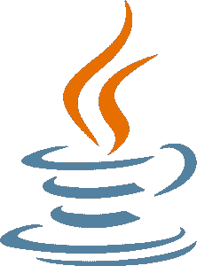

# 2021 年要学的十大编程语言

> 原文：<https://www.edureka.co/blog/top-10-programming-languages/>

随着 ***[【自动化】](https://www.edureka.co/blog/automation-testing-tutorial/)[【人工智能】](https://www.edureka.co/blog/what-is-artificial-intelligence) [【区块链】](https://www.edureka.co/blog/blockchain-tutorial/)*** 等的飞速发展，世界正变得日益智能。在它的核心，某处，是编程语言。事实上，劳工统计预测未来十年编程工作将增长 21%，是所有职业平均水平的 4 倍多。但是试图从编程开始是一件令人畏惧的事情，尤其是对于没有经验的专业人士。所以，如果你不知道从哪里开始，不要担心，因为我们已经为你准备好了。下面这篇文章旨在让你快速浏览一下 2021 年的十大编程语言。

## 【2021 年十大编程语言

1.  **[Python](#python)**
2.  **[JavaScript](#javascript)**
3.  **[Java](#java)**
4.  **[c++](#c++)**
5.  **[戈朗](#golang)**
6.  **c#**
7.  **[SQL](#sql)**
8.  **[镖](#dart)**
9.  **[R](#r)**
10.  **[PHP](#php)**

如果你是一个视觉学习者，你也可以参考我们关于 2021 年 十大编程语言 ***的视频演示！***

## 【2021 年十大编程语言| Edureka

[https://www.youtube.com/embed/Bi3MHIQVgdo?rel=0&controls=0&showinfo=0](https://www.youtube.com/embed/Bi3MHIQVgdo?rel=0&controls=0&showinfo=0)This Edureka video on “Top 10 Programming Languages for 2021” will introduce you to the most trending programming languages in the IT domain which will help your career to flourish in 2021\. It will also talk about the top-notch companies working with these programming languages and the salaries offered by them.

## **1。Python**

Python 是发展最快的通用高级编程语言，强调代码可读性。它的显著特点是

*   开源编程语言
*   广泛的支持模块和社区发展
*   轻松集成网络服务
*   用户友好的数据结构
*   基于图形用户界面的桌面应用

它也是在[数据科学](https://www.edureka.co/blog/what-is-data-science/)、[统计](https://www.edureka.co/blog/math-and-statistics-for-data-science/)、[分析](https://www.edureka.co/blog/big-data-analytics/)、 [ML](https://www.edureka.co/blog/what-is-machine-learning/) 和 [AI](https://www.edureka.co/blog/artificial-intelligence-tutorial/) 领域最受青睐的语言之一，其中 [R](https://www.edureka.co/blog/r-tutorial/) 是其唯一真正的竞争对手。

**需求原因**

| 【2021 年十大编程语言 | **流行框架** | **工资** | **公司招聘** |
| **Python** | 姜戈，烧瓶，金字塔 | 美国和印度₹11,50,000 12 万美元 | 思科、IBM、Mozilla、谷歌、Quora、惠普、Dropbox、高通 |

## ****

## **2。JavaScript**

沿着 [HTML](https://www.edureka.co/blog/what-is-html/) 和 CSS， [Javascript](https://www.edureka.co/blog/what-is-javascript/) 是构建互联网的编程语言。所以，这是件大事。众所周知，javascript 是 web 开发人员的语言，是一种功能丰富的基于对象的脚本语言。以异步事件处理和简洁的语法为特色，它在 web 开发领域得到了广泛的应用。最初是一种简单的客户端脚本语言，现在已经成为 web 开发社区中的一个亮点，它为后端和前端开发提供了多种框架。 

**需求原因**

| 【2021 年十大编程语言 | **流行框架** | **工资** | **公司招聘** |
| **JavaScript** | Node.js，Angular，React.js，Vue，Meteor | 美国和印度₹16,00,000 为 117，000 美元 | 谷歌、脸书、SAP、戴尔、埃森哲 |

## 

## **3。Java**

[Java](https://www.edureka.co/blog/what-is-java/)归甲骨文公司所有，是当今使用的最古老、最常见、最受欢迎的计算机编程语言之一。嗯，想想你最喜欢的一些网络应用和游戏。很有可能 Java 在使它们工作的代码中扮演了重要角色。在 web 开发公司中保持 Java 魅力不变的另一个重要因素是它独立于平台。这有助于开发人员“编写一次，在任何地方工作”(WORA)。Java 无处不在，对优秀开发人员的需求确实很高。

**需求原因**

| 【2021 年十大编程语言 | **流行框架** | **工资** | **公司招聘** |
| **Java** | 弹簧，冬眠，支撑 | 美国和₹11,00,000 为 123，000 美元 | 巴克莱银行，HCL，Capital One |

## ****

## **4。C++**

C++是 C 的续篇，是现代世界最常用编程语言的先驱，也是其他编程语言如 C#、[、Java](https://www.edureka.co/blog/java-tutorial/) 和 [JavaScript](https://www.edureka.co/blog/what-is-javascript/) 的根源。它是一种简单而强大的编程语言，提供了一种结构化的方法。C 和 C++都被认为是高性能语言，广泛用于开发性能至关重要的应用程序。虽然 C++历史悠久，但它的实际应用却是 C++跻身十大编程语言之列的原因。

**需求原因**

| 【2021 年十大编程语言 | **流行框架** | **工资** | **公司招聘** |
| **C++** | MFC，。Net，Qt，KDE，GNOME | 美国和印度₹10,00,000 为 114，000 美元 | 易贝、Spotify、华为、PhonePe、IBM |

## ****

## **5\. GoLang**

由科技巨头谷歌自己开发的[围棋](https://www.edureka.co/blog/golang-tutorial/)是编程平台的最新玩家之一。它是一种开源语言，可以轻松创建简单、安全、高效的软件。它结合了函数式编程和面向对象编程的最佳方面，并具有一套有价值的内置开发工具。

**需求原因**

| 【2021 年十大编程语言 | **流行框架** | **工资** | **公司招聘** |
| **Golang** | 再见，毕戈 | 美国和印度₹15,30,000 17 万美元 | 沃尔玛，跳板，西门子，戴尔 |

## **6。C#**

由微软创造的 C#被认为是. NET 框架中最强大的编程语言之一。它是一种强大、灵活的语言，给你一个全面的编程基础，适用于 Java、Objective-C、 [PHP](https://www.edureka.co/blog/php-tutorial-for-beginners/) 等等。你可以认为 C#是 C++和 Java 语言的混合体，但是 C#的创始人安德斯·海尔斯伯格说，这种语言更像 C++，而不是 Java。

**需求原因**

| 【2021 年十大编程语言 | **流行框架** | **工资** | **公司招聘** |
| **C#** | .NET, Xamarin | 美国和印度₹10,00,000 为 78，000 美元 | 凯捷、SAP 实验室、飞利浦 |

## **7。SQL**

 结构化查询语言，或 [* ** SQL ** *](https://www.edureka.co/blog/sql-server-tutorial) ，是一种用于与数据库交互的专用编程语言。它通过分析和理解由表中的数据字段组成的数据库来工作。许多财富 500 强公司都建立了自己的高性能数据库系统，使用 SQL 查询数据和执行分析。Github 上有超过 260，000 个知识库，当涉及到数据分析领域时，它的流行程度超过了许多新语言。

**需求原因**

| 【2021 年十大编程语言 | **流行框架** | **工资** | **公司招聘** |
| **SQL** | 结构化查询语言 | 美国和₹10,00,000 为 97，000 美元 | 优步，网飞，AirB & B，谷歌，亚马逊 |

## 

## **8。镖**

Dart 由 Google 开发，是一种易于学习、迭代的开源编程语言，用于服务器端和浏览器端编程。虽然大多数框架在不同平台上共享一部分代码，但 Dart 允许您为 Android 和 iOS 编写一个应用程序，并允许不同平台上的移动应用程序之间共享代码。

**需求原因**

| 【2021 年十大编程语言 | **流行框架** | **工资** | **公司招聘** |
| **镖** | 摆动 | 美国和₹13,00,000 为 154，000 美元 | 惠普、摩托罗拉、AirB&B、谷歌、苹果 |

## **9。** **R**

[***R***](https://www.edureka.co/blog/r-tutorial/)由统计学家设计，专门用于统计计算，因而被称为“统计的通用语”。随着技术的进步，公司或研究机构收集的数据变得越来越复杂，许多人选择使用 R 语言来分析数据。这种语言不仅是开源的，而且具有跨平台兼容性，在 GitHub 上有超过 600 万个存储库的社区。

**需求原因**

| 【2021 年十大编程语言 | **流行工作室** | **工资** | **公司招聘** |
| **R** | r 工作室 | 美国和印度₹6,70,000 为 121，000 美元 | 穆适马，谷歌，推特 |

10。PHP

[***PHP***](https://www.edureka.co/blog/how-to-install-php-on-windows/)在我们所知的所有服务器端编程语言的网站中，有 79%使用 PHP。它主要用于开发动态和数据密集型网站和应用程序。长期以来，它一直是网络的基石。PHP 是一种简单、快速且独立于平台的通用编程语言，在 GitHub 上有超过 631，000 个存储库。

**需求原因**

*   在所有已知服务器端编程语言的网站中，有 79.0%使用 PHP
*   PHP 简单、快速且独立于平台
*   GitHub 上有 63.1 万个存储库，并有一个 590 万人的社区来支持它
*   已经公开宣布使用 PHP 的公司包括脸书、雅虎、维基百科
*   PHP 开发的全球平均工资在美国是 102，000 美元&印度₹8,50,000

| 【2021 年十大编程语言 | **流行框架** | **工资** | **公司招聘** |
| **PHP** | CakePHP，Larawell，Symfony，Phalcon | 美国和印度₹8,50,000 102，000 美元 | 脸书，雅虎，维基百科 |

这就是我列出的 2021 年十大编程语言。希望这篇文章对你有用。请继续关注本系列即将发布的文章！您还可以进一步了解 IT 行业中的 ***[十大趋势技术](https://www.edureka.co/blog/top-10-trending-technologies/)*** 和  [***十大高薪职位***](https://www.edureka.co/blog/top-10-highest-paying-jobs/) 。另外，你可以参考 [***十大 IT 认证***](https://www.edureka.co/blog/top-10-certifications) 来明确你想从事的职业。

*有问题吗？请在这篇文章的评论部分提到它，我们会尽快回复你。*

*要深入了解任何 **[DevOps](https://www.edureka.co/devops-certification-training) 、[大数据](https://www.edureka.co/big-data-hadoop-training-certification)、[网络安全](https://www.edureka.co/comptia-security-plus-certification-training)、**和其他趋势技术，您可以报名参加我们的 **[实时在线认证培训计划](https://www.edureka.co/)** ，该计划提供全天候支持和终身访问课程材料的机会。*