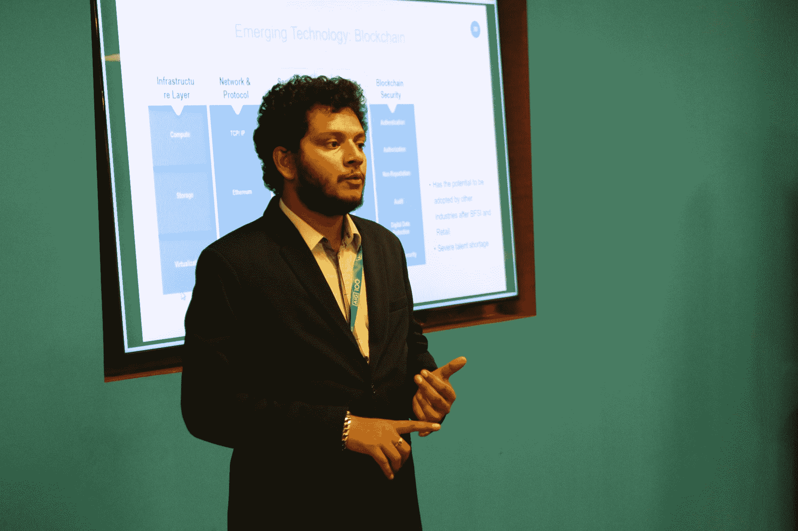
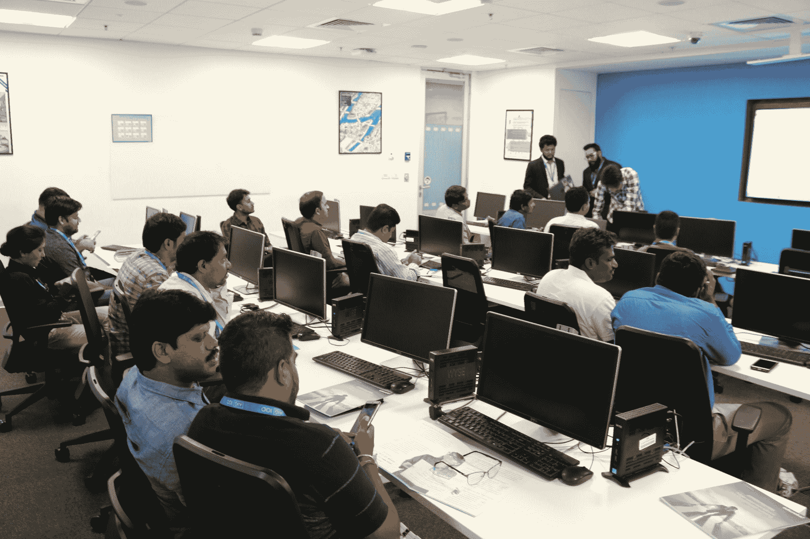
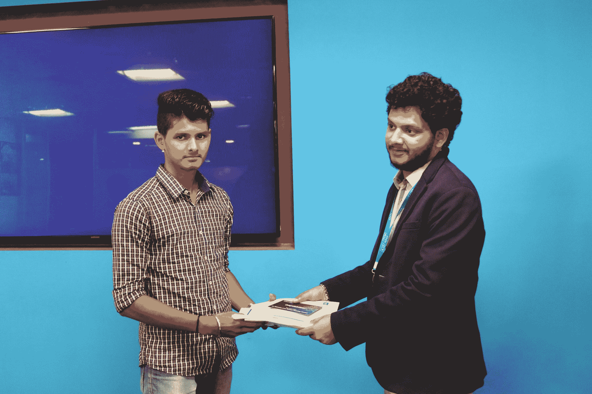
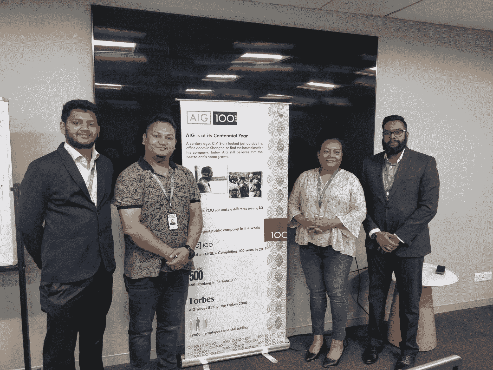

# 2019 年路演 Edureka 视角

> 原文：<https://www.edureka.co/blog/aig-roadshow-2019-edureka-perspective/>

IT 行业处于不断变化的状态，几乎每天都在发展。每隔几天，我们就会看到新技术迎头赶上旧技术。由于这种不断的变化，公司和专业人士很难设定目标并实现它们。为了传播对当今趋势技术及其如何变革行业的认识，Edureka 与技术领域的领先公司之一 AIG 合作，在印度的 IT 中心班加罗尔举办了 2019 年 AIG 路演。

该计划面向来自不同领域、具有不同经验水平的 IT 专业人员。它包括一些关于领先技术的网络研讨会和会议，包括云计算、项目管理、区块链等。在这些会议之后，Edureka 还对专业人员进行了技能评估，以帮助他们衡量他们对特定技术的了解程度。测试还针对当今最热门的技术领域进行:Python、网络安全、人工智能、数据科学、大数据和分析、Web 开发、区块链、亚马逊 Web 服务、DevOps、项目管理、物联网和机器人流程自动化。

测试结束后，我们还向在这些测试中表现出色的专业人士颁发了奖品。以下是此次活动中一些主要项目的快照:

Edureka 专家 Neel 解释了不同的现代技术如何共同创造出一首交响乐

*我们的技术 SME 分享的任务*

*教育专家尼尔给学员颁奖*

*AIG 路演 2019 的整个组织团队*

虽然该计划持续了几个小时，但无数专业人士接受了现代技术教育，了解了他们如何合作，以及提高技能的必要性。看到该计划在班加罗尔的成功，Edureka 和 AIG 再次合作，在德里进行路演。这是 Edureka 和 AIG 的代表在德里展会上的照片:

2019 年美国国际集团路演取得了巨大成功，我们期待举办更多类似的活动。

*您的组织正在寻找企业学习伙伴吗？请拨打 corp@edureka.co**或+91-86606 74718* 联系我们

*对自己的职业道路和如何提升技能有疑问？拨打+91-9606058413* 联系课程顾问

*想了解我们的企业产品吗？* [*点击这里*](https://www.edureka.co/corporate-training) *。*