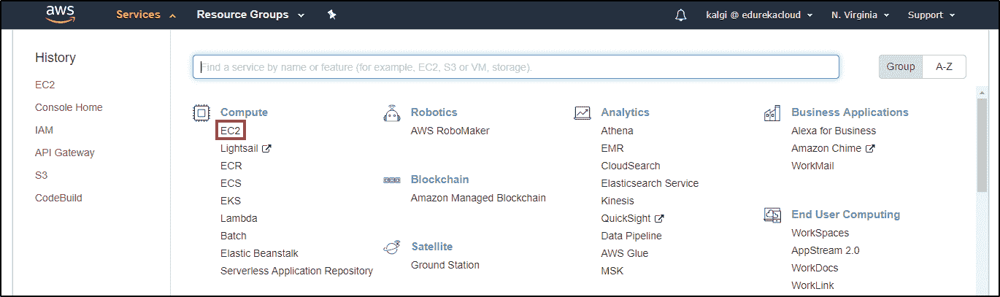
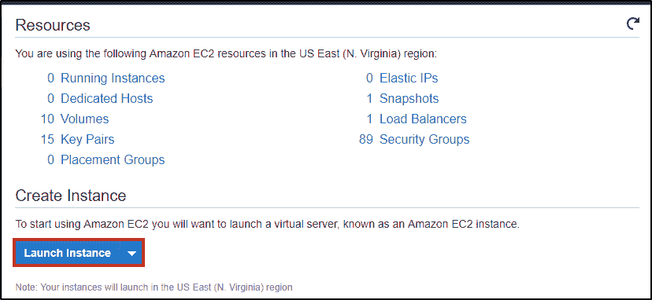
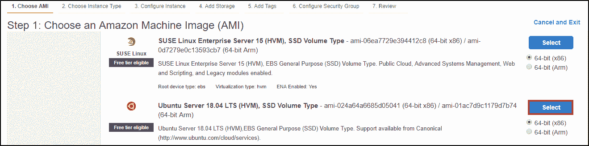
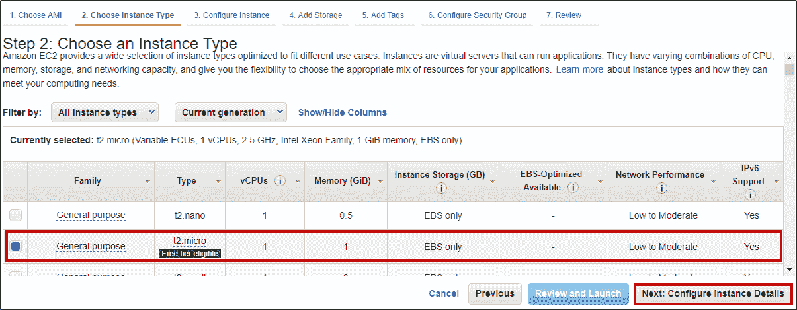
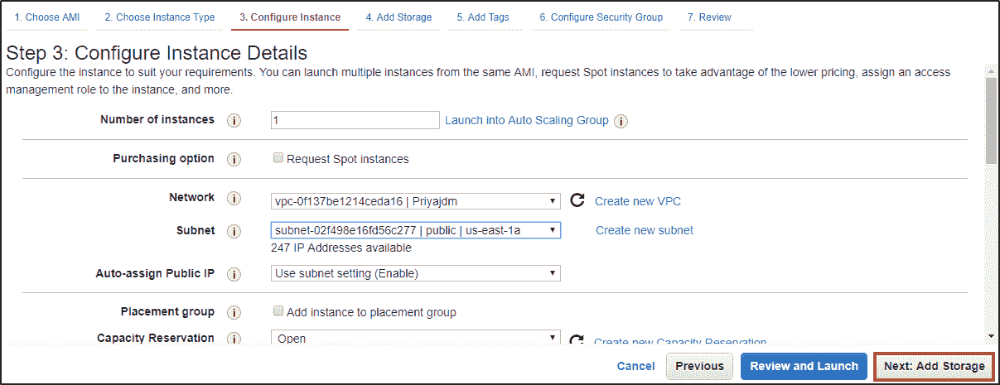
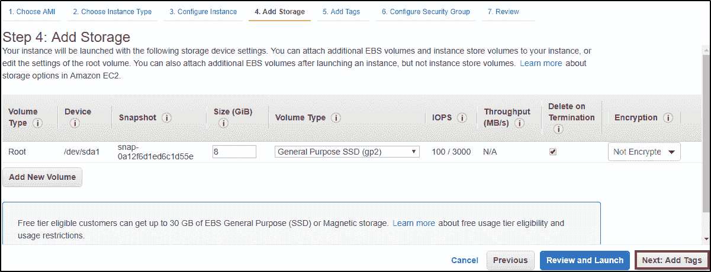
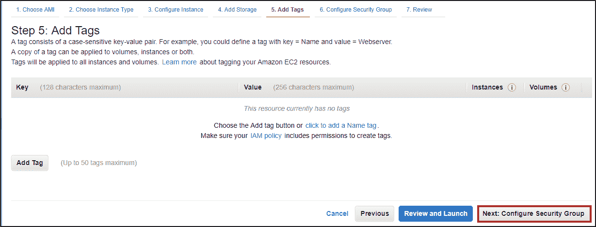
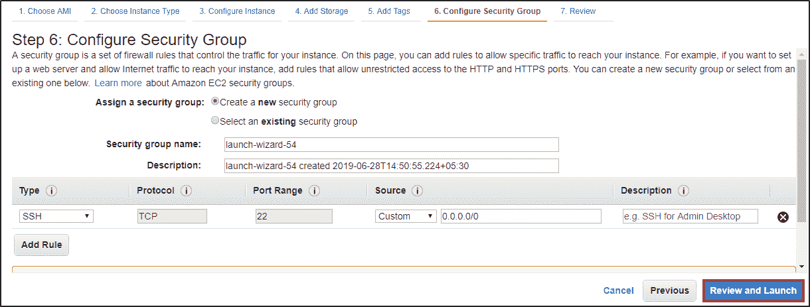
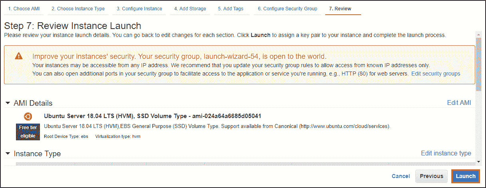
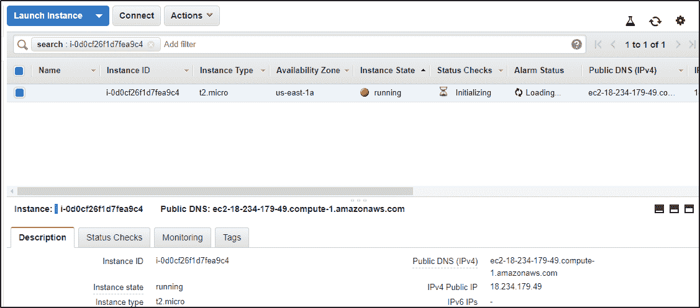

# 关于 AWS 中的实例，您需要知道的一切

> 原文：<https://www.edureka.co/blog/ec2-instances-in-aws/>

AWS 已经成为 Adobe Systems、21 世纪福克斯、亚航、Airbnb 等许多组织的救命稻草。这些组织成功故事背后的最大原因之一是使用 AWS 作为他们的基础设施。亚马逊提供了什么吸引了这么多用户的注意力？有趣的问题，因为他们有很多服务，其中之一是亚马逊弹性云计算(EC2)。这篇关于 AWS 中实例的文章详细解释了 Amazon EC2。要了解 AWS 的所有信息，请参考 [AWS 认证课程](https://www.edureka.co/aws-certification-training)。

本文议程:

*   [AWS 中实例介绍](#IntroductionToInstancesInAWS)
*   [AWS 中实例的类型](#TypesOfInstancesInAWS)
*   [亚马逊 EC2 的特点](#FeaturesofAmazonEC2)
*   [演示:启动一个自由层(t2.micro) EC2 实例](#Demo)

## **AWS 中实例介绍**

在学校，当我刚刚开始学习 Linux 时，我有实验室提供带有 Linux OS 的系统。我敢肯定，我们中没有人真正在自己的笔记本电脑上安装过 Linux，我也没有。每次我必须练习时，我都必须使用学校的实验室。在学习 MySql 或者事实上任何新技术的时候，也发生过类似的情况。

我们希望专注于学习如何使用技术，而不是花时间在“设置”部分。当时我多么希望自己被介绍给亚马逊 EC2。从来不知道在我的个人系统上安装 Linux 操作系统会像启动 EC2 实例一样简单。

开发者面临着一个非常相似的问题。他们宁愿把时间花在开发上，而不是建立开发环境。这时 AWS 中的实例来拯救他们了。如果开发人员需要一个使用 Linux 和 MySql 的环境，他们所要做的就是启动一个实例。老实说，亚马逊几乎为每一个需求都提供了一个机器映像。

AWS 中的实例基本上是虚拟环境。这些虚拟环境与底层基础操作系统相隔离。这是一种按需服务，即用户可以按小时租用虚拟服务器(实例),并在其上部署他们的应用程序。EC2 实例是高度可伸缩的，这意味着您可以根据您的需求动态地扩大或缩小规模。使用 EC2 实例作为您的云计算环境消除了投资硬件和软件依赖性的需要。

## **AWS 中的实例类型**

Amazon 提供了广泛的实例来适应不同的用例。你可以选择最适合你的。让我们来看看不同类型的例子，这将有助于你选择你的完美匹配。

### **通用实例**

这是使用最广泛的实例类型。它主要用于 web 服务器和移动或游戏应用程序的运行部署环境。如果你是一个新手，它是完美的。通用实例包括–A1、M5、M5a、M4、T3、T3a、T2

### **计算优化实例**

当您必须优先考虑原始计算能力(如游戏服务器、科学建模、高性能 web 服务器和媒体代码转换)时，计算优化的实例类型是完美的选择。它们速度更快，但成本更高(成本基于内存、CPU、实例存储、网络和 EBS 带宽)。计算优化实例包括–C5、C5n、C4

你甚至可以通过 [AWS 开发者助理](https://www.edureka.co/aws-developer-certification-training)查看 AWS 开发者的详细信息。

### **内存优化实例**

这些实例非常适合内存敏感型应用，如实时大数据分析、高性能数据库等。内存优化实例包括–R5、R5a、R4、X1e、X1、Z1d、高内存

### **加速计算实例**

加速计算实例使用独立的图形处理单元或现场可编程门阵列进行图形敏感计算。加速计算实例包括–P3、P2、G3、F1

### **存储优化实例**

这些类型的实例为大型数据集提供高顺序读写。当用户需要高 SSD 存储时，会使用这些实例。存储优化实例包括–I3、I3en、D2、H1

让我们进一步看看 AWS 中与宣传相关的实例的特性。

从 [AWS 云迁移](https://www.edureka.co/migrating-to-aws)中了解更多关于 AWS 及其框架的信息。

## **AWS 中实例的特性**

1.  实例由 **Amazon 机器映像(AMI)** 组成，这些是预先配置好的模板，包含了服务器所需的一切，包括操作系统。
2.  配置实例内存、CPU、存储和网络的多个选项，使各种**实例类型**可供您使用。
3.  非常安全的登录，因为它使用**密钥对。**
4.  它提供了一个名为**实例存储卷**的存储卷，用于临时存储实例数据。当实例停止时，这些存储卷将被删除。
5.  使用 **Amazon EBS 卷**为您的数据提供持久存储。
6.  为您的资源提供多个物理位置。这些资源可以是任何东西——实例、Amazon EBS 卷等。这是可能的，因为有**区域**和**可用区**。
7.  它提供了一个防火墙，允许您指定到达您的实例的端口、协议和源 IP 范围。这是使用**安全组**配置的。
8.  默认情况下，您创建的实例具有动态 IP。您可以使用**弹性 IP 地址**为您的实例提供静态 IP。
9.  您可以以**标签**的形式为您的实例提供元数据。
10.  它允许您配置您的网络，以便使用**虚拟专用云(VPC)** 将其与 AWS 云的其余部分隔离开来。

**查看我们在顶级城市的 AWS 认证培训**

| 印度 | 美国 | 其他国家 |
| [在海德拉巴的 AWS 培训](https://www.edureka.co/aws-certification-training-hyderabad) | [亚特兰大 AWS 培训](https://www.edureka.co/aws-certification-training-atlanta) | [AWS 伦敦培训](https://www.edureka.co/aws-certification-training-london) |
| [班加罗尔的 AWS 培训](https://www.edureka.co/aws-certification-training-bangalore) | [波士顿 AWS 培训](https://www.edureka.co/aws-certification-training-boston) | [阿德莱德的 AWS 培训](https://www.edureka.co/aws-certification-training-adelaide) |
| [钦奈的 AWS 培训](https://www.edureka.co/aws-certification-training-chennai) | [纽约市的 AWS 培训](https://www.edureka.co/aws-certification-training-new-york-city) | [新加坡 AWS 培训](https://www.edureka.co/aws-certification-training-singapore) |

## **演示:启动一个自由层(t2.micro) EC2 实例**

转到 AWS 管理控制台并键入 EC2。点击弹出的 EC2 服务。

您将看到 EC2 仪表板。点击**启动实例**来启动它。

然后会提示您选择 AMI。AMI 代表亚马逊机器图像。选择你需要的那个。请确保您的选择，因为这些实例的成本。因此，如果你是一个初学者，最好去免费的一级。

对于这个演示，我选择了 Ubuntu 服务器 18.04。

下一步是选择实例类型。正如我前面提到的，你有不同的选择。对于这个演示，我选择了一个免费的第一层(t2.micro)。

继续并点击 **Next:配置实例细节**。添加您希望创建的实例数量、您想要的网络和子网。我已经从可用的网络和子网中进行了选择，其余的保持原样。

完成实例配置后，继续点击 **Next: Add Storage** 。我用过**8gb 通用 SSD** 。

添加存储后，点击**下一步:添加标签**。标签基本上是对实例的元描述。如果您希望添加，您可以点击左下方的**添加标签**。

添加完标签后，点击**下一步:配置安全组。**点击**添加规则**添加规则。

添加完安全组后，点击**查看并启动**。

查看您的实例详细信息，然后单击**启动**。您将看到如下图所示的启动状态。

单击上图中突出显示的实例 ID。

Yayyy！您的实例处于运行状态。这只是初级阶段。一旦您创建了一个实例，您就可以将这些实例用于其他 AWS 服务，并做许多事情，从运行小型 docker 映像到处理整个组织的部署。

这就把我们带到了 AWS 文章中实例的结尾。我希望这篇博客对你有所帮助。

*如果您希望了解更多关于云计算的知识，并在云计算领域建立自己的事业，请参加我们的[云计算大师课程](https://www.edureka.co/masters-program/cloud-architect-training)，该课程提供有讲师指导的现场培训和真实项目体验。本培训将帮助您深入了解云计算，并帮助您掌握这门学科。*