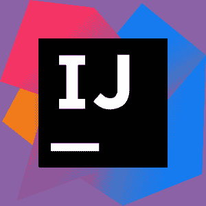
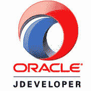

# 十大流行的 Java IDE:为 Java 选择最好的 IDE

> 原文：<https://www.edureka.co/blog/top-10-java-ide/>

Java 是最简单的编程语言之一。这对于开发健壮和安全的桌面应用程序、企业应用程序、移动应用程序和 web 应用程序非常有益。有大量的 ide 可用于处理Java。本文将帮助您选择最佳的 Java IDE。

以下是我将讨论的要点:

*   什么是 IDE？
*   [使用 IDE 的优势](#Advantages_of_using_an_IDE)
*   [十大 Java ide](#Top_10_Java_IDEs)

*   哪个是最好的 Java IDE？

我们开始吧！

## 什么是 IDE？

*集成开发环境(IDE)* 是方便应用程序开发的应用程序。一般来说， *IDE* 是基于图形用户界面(GUI)的工作台。它旨在帮助开发人员利用一个结合了手头所有必需工具的环境来构建软件应用程序。

选择一个好的 *IDE* 基于多种因素，如语言支持、操作系统的需求以及与使用特定 IDE 相关的成本等。

现在，让我们继续，看看使用 IDE 的优势。

**使用 IDE 的优势**

使用 IDE 会让你在编写 [*Java 程序*](https://www.edureka.co/blog/java-programs/) 的时候省下不少力气。一些优势包括:

1.**更少的时间和精力**:一个 *IDE* 的全部目的是让开发过程更快更容易。各种工具和功能可帮助您组织资源、防止错误并提供快捷方式。

2.执行项目或公司标准:仅仅通过在相同的开发环境中工作，一群程序员将会遵循一种标准的做事方式。如果 IDE 提供了预定义的模板，或者代码库在从事同一项目的不同团队成员/团队之间共享，则可以进一步实施标准。

3.项目管理:许多 ide 都有文档工具，这些工具要么可以让开发人员自动输入注释，要么可以让开发人员在不同的领域写注释。

现在，让我们继续前进，了解十大最受欢迎的[*Java*](https://www.edureka.co/blog/what-is-java/)ide。

**十大 Java ide**

首先，我们将了解最流行的 IDE， *Eclipse。*

### **月食**

许多 Java 开发人员会在这个神奇的 IDE 上工作。

Eclipse 是一个新时代，**跨平台**即**开源**和一个免费分发的 IDE可供企业 *[Web 开发使用。1998 年，IBM 软件集团构想了一种能够深入竞争激烈的 IDE 领域并成为领导者的 IDE。这也是 Eclipse 成为 web 开发的最佳 Java IDE 之一的原因。](https://www.edureka.co/masters-program/full-stack-developer-training)*

这是一个专用的 Java IDE ，被列为最佳 Java IDE 之一。流行的集成开发环境有桌面版和云版。Eclipse 的云版本被命名为 **Eclipse Che** ，允许程序员通过网络浏览器开发应用程序。

有趣的是，Eclipse 本身就是最好的 Java 应用程序的例子，因为它大部分是用 *[Java](https://www.edureka.co/blog/top-10-reasons-to-learn-java/)* 编写的。它旨在成为开发现代 web 应用程序的健壮、功能全面、商业质量的平台。

Eclipse IDE 的主要特性

*   提供对 Java 8.0 和 9.0 的支持。
*   帮助您进行代码重构、带有提示验证的编辑、增量编译、交叉引用、代码建议。
*   集成静态代码分析。
*   智能代码完成并提供快速修复。
*   卓越的可用性和性能。
*   支持 Windows/Linux/Mac OS X。
*   对于希望为 Eclipse 开发特定功能的 Java 程序员来说，PDE(插件开发环境)是可用的。
*   为了帮助 Java 开发者加速应用程序开发，Eclipse 展示了强大的图表、建模、报告以及测试工具。

### **智能 J**

 IntelliJ IDEA 也被认为是最好的 Java IDEs 之一。它有两个不同的版本，一个是 Apache 2 许可社区版，另一个是付费的专有终极(商业)版。为了允许开发人员更深入地研究 Java 代码，IntelliJ IDEA 提供了跨语言重构和数据流分析等功能。

#### **IntelliJ 社区版**

Community edition 是一个开源 IDE，面向 JVM( Java 虚拟机)和 Android 开发。它支持 Java、Kotlin、Groovy 和 Scala、Maven、Gradle、SBT、Git、SVN、Mercurial、CVS 和 TFS。

#### **终极版**

终极版旨在用于 web 和企业开发，除了其他版本控制系统之外，还支持 Perforce。它支持 JavaScript 和 TypeScript、Java EE、Spring、GWT、Vaadin、Play、Grails 和其他框架。它还支持数据库工具和 SQL。

### **NetBeans**

NetBeans 是另一个最重要的 Java IDE。NetBeans 是 Java 8 的官方 IDE。它允许应用程序从一组叫做*模块*的模块化软件组件中开发出来。它可以在 Windows、macOS、Linux 和 Solaris 上运行。与其他 ide 非常相似。

#### **特性:**

*   它是一个开源的 IDE，易于安装，可以跨平台运行，并且易于使用。
*   它的适应性扩展到移动使用，使它成为以移动为中心的开发世界中一个流行的 IDE。
*   第三方 Java 开发团队也可以在以后将它扩展为插件。
*   NetBeans 的每个新版本都有一个临时修改的 Java 编辑器。
*   Java 编辑器通过在语法和语义上突出显示 Java 代码，使程序员更容易构建定制的软件应用程序。
*   NetBeans 提供的工具甚至可以帮助开发者进行重构，编写无 bug 代码。

### **JDeveloper**

JDeveloper 是由 Oracle 开发的免费 Java IDE。

#### **特性:**

*   它简化了基于 Java 的应用程序的开发，解决了应用程序生命周期的每一步。T2T4
*   它主要提供了一个集成的开发框架，具有丰富的特性和一些可视化的开发工具。
*   此 Oracle JDeveloper 能够与 Oracle 应用程序开发框架(Oracle ADF)集成，以进一步简化应用程序开发。
*   除了 Java，JDeveloper 还可以用来开发 [*HTML*](https://www.edureka.co/blog/what-is-html/) 、 [*JavaScript*](https://www.edureka.co/blog/what-is-javascript/) 、PHP、SQL、XML 中的应用。
*   它还涵盖了整个开发生命周期:编码、设计、调试、优化、概要分析和部署。

### **MyEclipse**

MyEclipse 有助于创建简单而动态的前端以及强大的后端开发。这两者的结合在当今的企业中至关重要。

它是由一家名为 *Genuitec* 的知名公司创建和维护的，Genuitec 是 Eclipse Foundation 的创始成员。

MyEclipse 可用于各种平台，包括 Windows、Linux 和 Mac，并且还提供了行业领先的特性，例如:

*   包含高级 JavaScript 功能的 Ajax 和 Web 2.0 工具。
*   Hibernate 和 Spring 集成。
*   支持 Maven 配置。
*   Swing GUI 设计支持。
*   高级报告工具。
*   业界领先的 Java 持久性工具等等。

### **蓝色**

它最初是为教育目的而开发的。事实证明，BlueJ 在小规模的软件开发中非常方便。

#### **特性:**

*   它目前被全世界的 Java 程序员广泛使用。
*   有一个交互界面，整洁，易于使用和测试。
*   对于初学者来说，这也是一个很好的 IDE。
*   这个接口使用盒子来表示类。
*   Java 的跨平台 IDE 使程序员能够与它的对象无缝交互。
*   便于检查对象值，调用对象上的方法，将对象作为参数传递。
*   BlueJ 通过提供一系列健壮的特性来加速 Java 应用程序的开发。
*   它带有一个编辑器，允许开发人员可视地扫描代码，帮助创建动态对象，检查它们。
*   此外，你可以直接输入 Java 代码，无需编译。

### **JCreator**

JCreator 是由 *Xinox* 软件创建的 Java IDE。它标榜自己的界面类似于微软的 Visual Studio。 它是一个轻量级的 Java IDE。

#### **特性:**

*   有三种不同的型号可供选择；精简版、专业版和生活专业版。
*   JCreator 的付费版本附带了 Ant 支持、代码向导和调试器。
*   与其他 Java IDEs 相比，JCreator 没有高级特性。此外，通过第三方插件的可扩展性是不可用的。
*   从好的方面来看，它小巧而快速，非常适合刚开始学习 Java 的新手。
*   尽管有其他领先的 Java IDEs，JCreator 完全是用 C++开发的。除此之外，它不需要 JRE 来执行 [*Java 代码*](https://www.edureka.co/blog/30-pattern-programs-in-java/) 。出于这个特殊的原因，开发人员社区提倡 JCreator 比大多数传统的基于 Java 的 ide 更快。

### **DrJava**

DrJava 是另一个轻量级的 Java IDE，主要是为 [*的 Java 初学者*](https://www.edureka.co/blog/java-tutorial/) 设计的。它由 Rice 大学的 JavaPLT 小组积极开发和维护。 它还包括针对更高级用户的强大功能。DrJava 是免费的。尽管它不像其他 Java 开发的大牌那样强大，但 DrJava 有一个非常整洁的界面。

#### **特性:**

*   DrJava 展示了从控制台交互评估 Java 代码以及在同一个控制台中呈现输出的能力。
*   它可以帮助程序员实现一些功能，如转到行和查找/替换。
*   对于 [*高级程序员*](https://www.edureka.co/blog/advanced-java-tutorial) ，它提供了自动补全、自动缩进、括号匹配、注释和语法着色。
*   最重要的是，DrJava 可以通过插件集成到 Eclipse 中。
*   与其他 Java IDEs 不同，DrJava 在不同平台上有一致的外观。这是因为它是使用 Sun Microsystems 的 Swing 工具包设计的。

### **jGRASP**

jGRASP 是最好的轻量级 Java ide 之一。除了为 Java 开发人员提供一个集成的调试器和一个工作台之外，它还允许成功地生成复杂性剖面图和 UML 类图。

#### **特性:**

*   它是专门为提供软件可视化的自动生成而设计的，可以提高任何软件的整体可理解性。
*   轻量级 Java IDE 能够在运行时生成源代码结构的静态可视化以及数据结构的可视化。
*   虽然它是用 Java 实现的，但是 jGRASP 有能力为其他编程语言生成 CSD(控制结构图)。
*   列表包括 ADA、C、C++、Objective-C、 [*Python*](https://www.edureka.co/blog/python-programming-language) 。
*   对于其他语言来说，它也是一个有用的源代码编辑器。免费的 IDE 是可配置的，可以与不同编程语言的大多数商业编译器一起工作。

### **JSource**

JSource 又是一个免费的 Java IDE。这被认为是 Java 开发人员和程序员的一个好选择。

#### **特性:**

*   JSource 可以在通用公共许可证(GNU)版本 2.0 (GPLv2)下获得。
*   它对于创建各种领域的跨平台应用程序非常有用。
*   极其轻便。您可以使用 JSource 运行、编译、编辑和创建 Java 文件。
*   其中一个主要特性是针对多种语言和 Java Swing 组件的*语法突出显示*。
*   在 JSource 的 2.0 版本中，您可以使用 *jEdit* 语法包，此外，您还可以整合其他用于快速开发的开源 Java 工具。
*   许多工具已经过修改，可以使用核心的 JSource 结构。

## 哪个是最好的 Java IDE？

如果给我一个机会在十大最佳 Java IDEs 中选择一个，我会选择 **Eclipse** 或 **IntelliJ IDEA** Ultimate。对于刚刚起步的开发人员，我会推荐 **NetBeans** 而不是 Eclipse。Eclipse 是应用较为广泛的 IDE。它提供了各种选项，并且是用户友好的。

另外，不要忘记轻量级 ide，包括那些为学生使用而设计的 ide。如果你刚刚开始学习 [*Java*](https://www.edureka.co/blog/what-is-java/) ，这些都是值得尝试的，可能是你最好的选择。

这就把我们带到了本文的结尾，在这里我们讨论了正在使用的 10 个最好的 Java IDEs。希望你清楚本教程中与你分享的所有内容。

***确保你尽可能多的练习，恢复你的经验。***

*查看 Edureka 提供的 [**Java 课程**](https://www.edureka.co/java-j2ee-training-course) 培训，edu reka 是一家值得信赖的在线学习公司，在全球拥有超过 250，000 名满意的学习者。我们在这里帮助你的旅程中的每一步，为了成为一个除了这个 java 面试问题，我们提出了一个课程，这是为学生和专业人士谁想要成为一个 Java 开发人员设计的。*

*有问题吗？请在这篇“最佳 Java IDE*”*文章的评论部分提到它，我们会尽快回复您。*