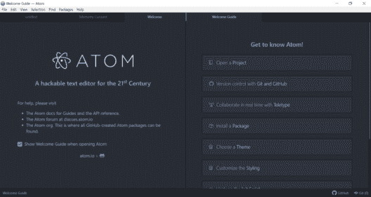
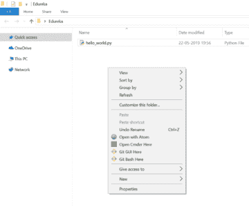
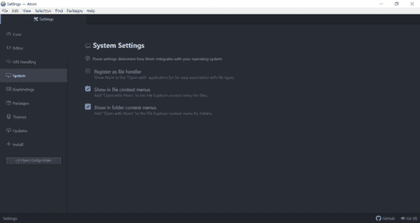
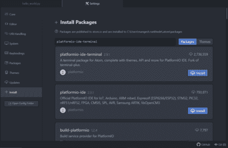
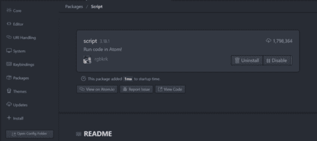
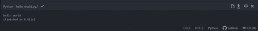
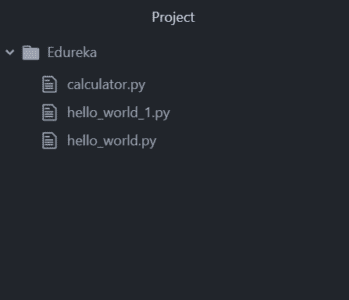
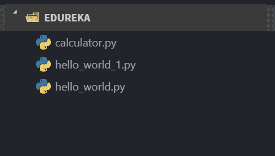
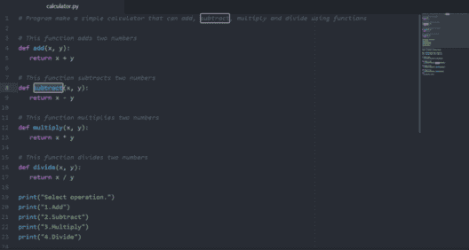
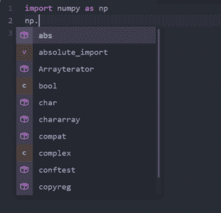

# Atom Python 文本编辑器简介及其配置方法

> 原文：<https://www.edureka.co/blog/atom-python-ide/>

时间不等人，在这个飞速发展的时代，我们总是需要工具来加速我们的工作。软件开发是最主要的任务之一，它需要最丰富的环境，不仅帮助程序员编写代码，还允许软件生产。这是 IDE 的唯一目的，其中最好的是， **Atom** 是免费和开源的。这是一个桌面应用程序，旨在服务于 [Python](https://www.edureka.co/python) 开发者的努力。

在深入探讨之前，让我们快速浏览一下本文将要研究的内容:

*   [我们为什么需要 Atom python？](#whyweneedatom)
*   [什么是 Atom 文本编辑器？](#atom)
*   [下载 Atom Python](#downloadingatom)
*   [执行代码](#executing)
*   [主题化](#theming)
*   [实验](#experimenting)
*   [Python 特定配置](#pythonconfig)

让我们首先弄清楚为什么您实际上需要 python Atom IDE？

### **我们为什么需要 Atom python？**

创建和运行 Python 程序最基本的方法就是用 *创建一个空文件。py* 扩展名，然后使用*python filename . py .*从命令行指向该文件。或者，您可以使用 Python 附带的默认应用程序 [IDLE](https://www.edureka.co/blog/best-ide-for-python/#idle) 来执行您的代码。然而，如果你想提高效率，前两个选项可能不是最好的。你将需要使用更可靠和更有效的东西。这就是原子发挥作用的地方。Atom 没有传统意义上的特性，它创建了添加到其可攻击核心的包。这些包提供了自动完成、代码行和代码高亮等特性。

因此，让我们继续深入探索这个非凡的“软件开发软件”，它就是 Atom。

### **什么是 Atom 文本编辑器？**

Atom 是一个面向多平台的开源文本编辑器，支持 Node.js 中开发的包，并支持 Git 版本控制。大多数包都是免费提供的，由开源社区构建。它由 GitHub 开发和维护，作为桌面应用程序使用 web 技术构建。

Atom 是一个开源的跨平台 IDE。它支持在 Node.js 和 Git 版本控制中开发的包。大多数包都是免费提供的，由开源社区构建。该 IDE 由 GitHub 在电子框架上使用 web 技术开发和维护。

### **下载 Atom**

要下载 Atom python 文本编辑器，请前往[https://atom.io/](https://atom.io/)。 它会自动检测您当前的操作系统并显示相应的安装文件进行下载，点击下载即可。

下载过程完成后，点击运行完成安装，并等待安装完成。 一旦安装，Atom 会自动打开，在默认目录下。在“开始”菜单中也会创建一个快捷方式。

要执行 Python 代码，您需要安装所需的包或插件。

现在让我们看看如何配置 Atom Python 以标准方式打开，以便从我们选择的目录中访问 Atom。您还可以使用上图所示的欢迎指南探索安装主题或软件包等功能。现在，只需关闭欢迎指南并取消选择选项 *打开 Atom* 时显示欢迎指南，这样下次启动 atom 时就不会出现欢迎屏幕。

现在，转到您已经下载了 atom 的目录，右键单击并选择 open with Atom。

如果您在上下文菜单中看不到此选项，可以从程序中启动。进入 *文件- >设置* 或者使用 *Ctrl +逗号(Ctrl +，)* 打开设置。

在设置中，点击系统选项卡并检查以下选项:

1)在文件上下文菜单中显示

2)在文件夹上下文菜单中显示

现在，上下文菜单将显示所需的选项，即*用 Atom* 打开。转到目录，执行与前面描述的相同的操作。

你可以看到左边的树形视图。如果没有看到树形视图，请转到视图并单击切换树形视图或使用快捷键 *(Ctrl+/)* 。在树形视图中，只需双击 [python](https://www.edureka.co/blog/python-programming-language) 文件，就可以看到代码。

### **执行代码**

通常情况下，命令提示符用于运行 [Python 程序](https://www.edureka.co/blog/python-programs/)。但是，在 Atom 中，有一个名为*platformio-ide-terminal*的插件，可用于执行 python 文件，要设置这个插件，请导航到*File->Settings*点击安装选项卡，搜索 platform io-ide-terminal 插件，然后点击安装。

安装完成后，一个终端将被集成到 Atom 中，您将能够在 Atom python 编辑器的左上角看到一个+图标。如果点击它，终端将在当前目录中打开。

您也可以通过点击插件包选项卡来查看插件的详细信息。它将显示所有需要的细节和如何使用插件。

**拆分编辑**

当您在 Atom 中打开了多个文件时，您可以进入 *视图- >窗格- >向右拆分* 将当前文件发送到窗口的右半部分。这将有助于您在同时处理多个文件时提高工作效率。

### **主题化**

主题有两种类型，即 UI 和语法主题。UI 主题用于改变按钮、下拉菜单等的样式，而语法主题用于决定代码如何着色以及语法高亮细节。

要检查所有已安装的主题，导航至 *文件- >设置，* 然后点击主题选项卡，它将显示您想要的结果。如果你想下载新的，去+ Install 标签点击 *Themes* 标签，它在软件包旁边，寻找你需要的主题并安装它。

我个人喜欢默认的主题，但是你可以继续改变两者的主题，并根据你的喜好配置你的编辑器。

#### **格式化**

要更改默认字体，导航至*设置*，然后点击*编辑器*选项卡。在这里，您将能够看到一个选项，使用*字体系列*根据您的喜好来改变字体。

### **实验**

为了增添更多乐趣，您可以尝试以下选项:

#### **行高:**

行高基本上是两行之间的间距。如果你想改变它，导航到*编辑器*选项卡，根据你的喜好改变行高。

#### **滚动到末尾**

如果您正常滚动代码，您将能够滚动到屏幕底部的最后一行。超过它将被锁定。如果您启用了*滚动结束*包，您将能够看到屏幕顶部的底线，在下方给你留白，以便你可以舒适地处理代码。

#### **显示缩进导轨**

没有缩进指南，不会显示任何关于缩进的内容。一旦启用，您将看到垂直线，这将有助于您了解缩进应该出现的位置。

还有许多其他的选择值得期待。您也可以继续尝试其他选项。

现在让我们继续处理一些 Python 特定的配置。

### **特定于 Python 的配置:**

这里有几个非常有用的插件，可以帮助 [Python](https://www.edureka.co/blog/10-reasons-why-you-should-learn-python) 提高生产力。

### **脚本**

脚本包显示一个关于其他包的详细信息的文档，如命令、快捷方式等。如果你不喜欢默认快捷键，你可以通过导航到*查看代码*标签来改变它们，该标签包含一个名为*键映射的文件夹。*导航至该文件夹，打开 *script.cson* ，并根据您的要求进行更新。请注意，我已经把它改成了 *Ctrl-r* ，如下图截图所示。

现在，关闭所有窗口，重新启动 atom。当它重启时，你将能够使用 *ctrl+r* 运行 [Python 脚本](https://www.youtube.com/watch?v=9F6zAuYtuFw)，你可以在底部看到一个输出框。该输出框也可定制如下:

导航到*文件- >设置*点击*主题*标签，你可以在顶部看到样式表。当你点击它时，一个样式表将会打开。粘贴以下代码片段以增加脚本控制台的字体大小。

。脚本-视图。行{

字体大小:30px

}

  脚本控制台

#### **原子文件图标:**

该软件包将在树形视图中的文件前添加图标，如下图所示。

在之前

#### ****

在...之后

#### **小地图和小地图高亮选择:**

打开多行代码的文件，会在窗口右侧显示为一个整体。minimap-highlight-selected 将在小窗口上高亮显示选择为白色补丁的函数或变量，如下图所示。

**Autocomplete-python:**Autocomplete 弹出一个窗口，给出程序员在编码时到达某个特定点时会出现什么的建议。

****

这是 Python 的一个标记，用于发现脚本中的错误并突出显示出来。为此，您需要使用以下命令安装 flake8】

pip 安装薄片 8

完成后，您可以在 Atom 的左下角看到一个小图标，显示遇到的错误列表。

**Python-autopep 8**Python-autopep 8 用于格式化你的代码。可以通过勾选 *保存*选项上的*格式，从 *autopep8 插件设置*中启用。*

这就把我们带到了这篇关于‘Atom Python’的文章的结尾。因此，继续探索所谓的“T3”，一个面向 21 世纪的可破解文本编辑器。我希望你已经明白了所有的事情。

*有问题吗？请在这个“Atom Python IDE”博客的评论部分提到它，我们会尽快回复您。*

*要深入了解 Python 及其各种应用，您可以注册参加实时 **[Python 在线培训](https://www.edureka.co/python-programming-certification-training)** ，该培训提供全天候支持和终身访问。*