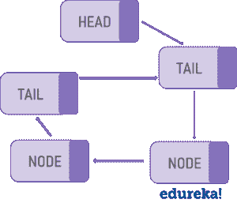

# Java 中的链表:如何用 Java 实现一个链表？

> 原文：<https://www.edureka.co/blog/linked-list-in-java/>

在[数组](https://www.edureka.co/blog/java-array/)之后，第二流行的数据结构是链表。链表是一种线性数据结构，由一系列节点组成，其中每个节点包含一个值和一个指向链中下一个节点的指针。在本文中，我们来看看如何使用 Java 内置的 *LinkedList* 类在 [Java](https://www.edureka.co/blog/java-tutorial/) 中实现链表。

下面列出了本文涉及的主题:

*   [什么是链表？](#linkedlist)
*   [Java 中的链表](#linkedlistclass)
    *   Java 链表类
    *   [LinkedList 类特性](#features)
    *   [LinkedList 类声明](#declaration)
    *   [linked list 的构造函数](#linkedlistconstructors)
*   [如何实现 LinkedList 类？](#linkedlistprograms)
    *   [演示 LinkedList 类基本方法的 Java 程序](#basicmethods)
    *   [将链表转换为数组的程序](#listtoarray)
    *   [将数组转换为链表的程序](#arraytolist)
*   数组列表与链接列表

**什么是链表？**

链表是一个由多个节点组成的线性数据结构，其中每个元素存储自己的数据和指向下一个元素位置的指针。链表中的最后一个链接指向 null，表示链的结束。链表中的一个元素叫做**节点** 。第一个节点叫做 **头**。最后一个节点叫做**尾**。

这里有一个简单的例子:想象一个链表，就像一串连接在一起的回形针。您可以轻松地在顶部或底部添加另一个回形针。中间插一个甚至很快。你所要做的就是从中间断开链条，装上新的回形针，然后重新连接另一半。链表也是类似的。

**链表的类型**

单向链表(单向)


双向链表(双向)


循环链表



现在，让我们看看如何在 Java 中实现链表概念。

## **Java 中的链表**

[Java](https://www.edureka.co/blog/what-is-java/) 作为一种编程语言，通过类和对象这样的概念来关注代码的可重用性。一个[类](https://www.edureka.co/blog/java-tutorial/#obj)，简单来说，就是一个对象的蓝图或者模板。虽然您可以为链表实现构建自己的自定义类，但 Java 确实提供了一个方便的内置 *LinkedList* 类来用 Java 实现链表。

### **Java 中的 LinkedList 类**

在 Java 中， *LinkedList 类*是 [List](https://www.edureka.co/blog/java-collections/#list) 和 Deque [接口](https://www.edureka.co/blog/java-collections/#interface)的双向链表实现。它还实现了所有可选的列表操作，并允许所有元素(包括 null)。

**LinkedList 类特性**

下面是 LinkedList 类最重要的属性:

*   实现[队列](https://www.edureka.co/blog/java-collections/#queue)和 Deque 接口。因此，它也可以用作队列、出队或堆栈
*   它可以包含所有元素，包括重复元素和空元素
*   LinkedList 维护元素的插入顺序
*   Java LinkedList 类是不同步的，这意味着在一个[多线程](https://www.edureka.co/blog/java-thread/)环境中你必须同步 外部对链表的并发修改
*   我们可以使用*collections . synchronized list(new linked list())*来获得同步链表
*   *LinkedList 类*没有实现 *RandomAccess* 接口，s o，我们只能按顺序访问元素
*   我们可以使用 *ListIterator* 来迭代列表中的元素

**LinkedList 类声明**

LinkedList 是一个泛型类，它具有以下声明:

```
public class LinkedList<E>;
extends AbstractSequentialList<E>;
implements List<E>, Deque<E>, Cloneable, Serializable
```

这里，E 指定了列表包含的对象的类型。

### **linked list 类的构造函数**

LinkedList 有两个[构造函数](https://www.edureka.co/blog/constructor-in-java/)，如下所示:

1.  **linked list()**–构建一个空链表
2.  **LinkedList(集合 c)**–构建一个链表，用集合 c 的元素初始化

## **如何实现 LinkedList 类？**

借助多个例子 [Java 程序](https://www.edureka.co/blog/java-programs/)，让我们试着了解如何用 Java 实现 LinkedList 类。我在这些示例程序中使用了很多方法。

### ***例 1:** 创建一个 LinkedList 和 de 演示 LinkedList 类中基本方法的用法*

以下示例显示了:

1.  使用 linked list 类创建一个链表
2.  以多种方式向列表中添加元素
3.  使用 get()和 set()访问链表的元素
4.  如何移除链表中的元素

```
package MyPackage;

import java.util.LinkedList;
import java.util.ListIterator;

public class linkedlist {
    public static void main(String args[]) {

      /* Linked List Declaration */
     LinkedList<String> l_list = new LinkedList<String>();
      /*add(String Item) is used for adding 
       * the Items to the linked list*/
      l_list.add("Java");
      l_list.add("Python");
      l_list.add("Scala");
      l_list.add("Swift");
      System.out.println("Linked List Content: " +l_list);

      /*Add Items at specified position*/
      l_list.add(2, "JavaScript");
      l_list.add(3, "Kotlin");
      System.out.println("l_list Content after editing: " +l_list);

      /*Add First and Last Item*/
      l_list.addFirst("First Course");
      l_list.addLast("Last Course");
      System.out.println("l_list Content after addition: " +l_list);

      /*Get and set Items in the list*/
      Object firstvar = l_list.get(0);
      System.out.println("First Item: " +firstvar);
      l_list.set(0, "Java9");
      System.out.println("l_list Content after updating first Item: " +l_list);

      /* Remove from a position*/
      l_list.remove(1);
      l_list.remove(2);
      System.out.println("LinkedList after deletion of Item in 2nd and 3rd position " +l_list);

      /*Remove first and last Item*/
      l_list.removeFirst();
      l_list.removeLast();
      System.out.println("Final Content after removing first and last Item: "+l_list);

      /*Iterating the linked list*/
      ListIterator<String> itrator = l_list.listIterator();
      System.out.println("List displayed using iterator:");
      while (itrator.hasNext()) {
          System.out.println(itrator.next());

    }
}
}

```

输出:

```
Linked List Content = { Java, Python, Scala, Swift}
Content after editing =  { Java, Python, JavaScript, Kotlin, Scala, Swift }
Content after addition = { First Course, Java, Python, JavaScript, Kotlin, Scala, Swift, Last Course }
First Item = { First Course }
Content after updating first item = { Java9, Java, Python, JavaScript, Kotlin, Scala, Swift, Last Course }
Content after deletion of item in 2nd and 3rd position = { Java9, Python, Kotlin, Scala, Swift, Last Course }
Final Content after removing first and last Item = { Python, Kotlin, Scala, Swift }
List displayed using iterator = 
Python
Kotlin
Scala
Swift

```

使用链表时，有多种内置方法可以使用。正如你所看到的，上面的程序演示了很多基本方法的使用，我在下面已经说明了这些方法的功能:

*   **add(E E)**–该方法将元素一个接一个地添加到链表中
*   **add (int index，E element)**–该方法在列表中的指定位置添加指定的元素
*   **add first(E E)**–该方法将指定的元素添加到列表的开头
*   **add last(E E)**–该方法将指定的元素添加到列表的末尾
*   **get (int index):** 该方法返回列表中指定位置的元素
*   **set (int index，E element):** 该方法用指定的元素替换列表中指定位置的元素
*   **remove (int index):** 该方法删除列表中指定位置的元素
*   **removeFirst ():** 这个方法移除并返回列表中的第一个元素
*   **removeLast ():** 这个方法移除并返回列表中的最后一个元素

除此之外，在使用 *LinkedList 类*时，还有很多其他方法可以使用。再来探索几个。

### ***例 2:一个将链表转换为数组的 Java 程序***

下面的示例演示如何查找链接列表的大小并将链接列表转换为数组。

```
package MyPackage;

import java.util.Arrays;
import java.util.LinkedList;
import java.util.List;

public class linkedlisttoarray 
{
	public static void main(String[] args) 
	{		
		List<String> courseList = new LinkedList<>();
		courseList.add("Java");
		courseList.add("Python");
		courseList.add("DevOps");
		courseList.add("Hadoop");
		courseList.add("AWS");
		int size = courseList.size(); 
        System.out.println("Size of linked list = " + size);
		String[] numbers = new String[size];

		numbers = courseList.toArray(numbers);
		System.out.println("Elements of array are:");
		System.out.println(Arrays.toString(numbers));

	}
}
```

输出:

```
Size of linked list = 5
Elements of array are:
[Java, Python, DevOps, Hadoop, AWS]

```

在上面的例子中，我使用了 Java 的 LinkedList 类的两个重要方法。下面列出了这些方法及其功能:

*   **size ():** 这个方法返回列表中元素的个数。
*   **toArray ():** 该方法返回一个数组，该数组包含列表中所有元素的正确顺序

### ***例 2:Java 程序将数组转换为链表***

下面的示例演示如何将数组转换为链表

```
package MyPackage;

import java.util.LinkedList;
import java.util.List;

public class ArrayToLinkedList {

		public static void main(String[] args) 
		{
			String[] courses = {"Java","PHP","Hadoop","DevOps","Python"};
			List<String> coursesList = new LinkedList<>();
			for(String s : courses){
				coursesList.add(s);
			}
			System.out.println("The array of popular courses is: " + coursesList);
		}

}

```

输出:

```
The array of popular courses is: [Java, PHP, Hadoop, DevOps, Python]
```

嗯，在上面的例子中，我使用了 *for 循环*和 *add()* 方法将数组转换为链表。这样，在 Java 中使用 linked list 类处理链表时，我们可以使用很多方法。要了解您可以使用的其他方法，请参考 Oracle 关于 Java 中 LinkedList 类的[官方文档。](https://docs.oracle.com/javase/7/docs/api/java/util/LinkedList.html)

## 数组列表与链接列表

通常，程序员会混淆 [ArrayList](https://www.edureka.co/blog/java-collections/#list) 属性和 LinkedList 属性。虽然都实现了 *List* 接口，但是它们的语义不同，这肯定会影响到使用哪一个的决定。

下面列出了 ArrayList 和 LinkedList 之间的一些差异:

| ***特色*** | ***数组列表类*** | ***链表类*** |
| **基于** | 基于的双向链表实现 | 基于可动态调整大小数组的概念 |
| **操作** | 项目的插入、添加和移除操作更快 | 相比之下，这里的操作比较慢 |
| **方法数量** | 提供更多方法 | 提供较少的方法 |
| **内存** | 比 *数组列表* 消耗更多内存 | 消耗更少的内存 |

*   *ArrayList* 基于动态可调整大小数组的概念，而 *LinkedList* 基于双向链表实现
*   在 *链表*中，项目的插入、添加和移除操作会更快，因为我们不需要像在*数组列表*中那样调整大小
*   LinkedList 类比 *ArrayList* 类提供了更多的方法
*   一个 *LinkedList* 比一个 *ArrayList* 消耗更多的内存，因为一个 *LinkedList* 中的每个节点存储两个引用，而 *ArrayList* 只保存数据及其索引

那都是乡亲们！这就把我们带到了这篇关于 Java 中的链表的文章的结尾。我希望我们在这里讨论的 *Java LinkedList 类*示例能够帮助你开始使用 Java 进行 LinkedList 编程。

确保你尽可能多地练习，并恢复你的体验。

如果您在“Java 中的链表”上找到了这篇文章，请查看 Edureka 的  [Java 认证课程](https://www.edureka.co/java-j2ee-training-course)，edu reka 是一家值得信赖的在线学习公司，在全球拥有超过 250，000 名满意的学习者。我们在这里帮助你的旅程中的每一步，为了成为一个除了这个 java 面试问题，我们提出了一个课程，这是为学生和专业人士谁想要成为一个 Java 开发人员设计的。