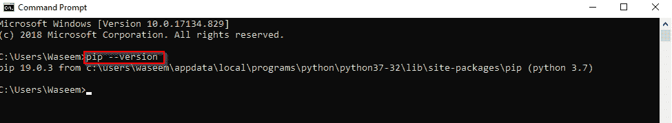
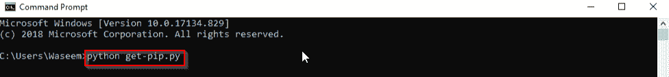
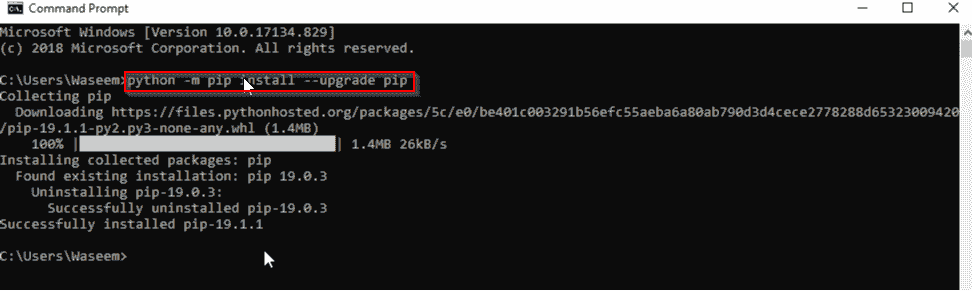
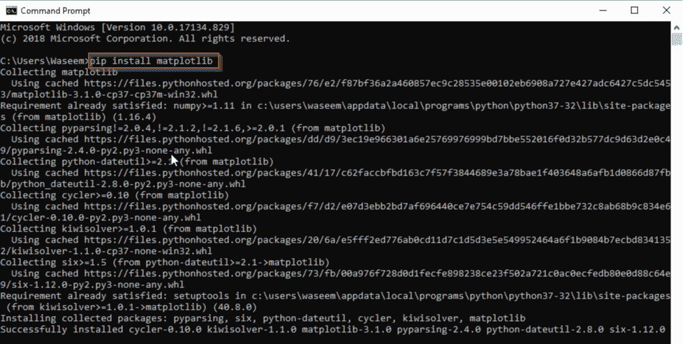
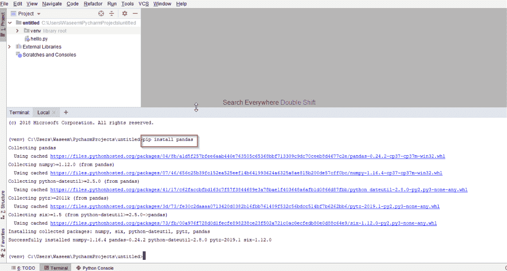

# 如何在 Python 中安装 pip:Python 安装入门

> 原文：<https://www.edureka.co/blog/how-to-install-pip-in-python/>

Python 编程语言最近很受欢迎。凭借它的一系列特性，使用 [python 编程](https://www.edureka.co/data-science-python-certification-course)语言变得非常容易。像 [tensorflow](https://www.edureka.co/blog/tensorflow-tutorial/) 、 [keras](https://www.edureka.co/blog/keras-vs-tensorflow-vs-pytorch/) 这样的库是在 python 上工作时对[人工智能](https://www.edureka.co/blog/artificial-intelligence-with-python/)的前沿补充。要安装所有这些[库](https://www.edureka.co/blog/python-libraries/)，我们需要 pip。在本文中，我们将学习如何在 python 中安装 pip。以下是本博客讨论的主题:

*   [PIP 是什么？](#whatispip)
*   [如何在 Python 中安装 PIP？](#installpip)
*   [安装库](#installalib)

## **PIP 是什么？**

Pip 是所有 python 包和[模块](https://www.edureka.co/blog/python-modules/)的包管理器。我们使用 pip 在 python 中安装不同的包。对于 3.4 以上的版本，已经安装了 pip。它提供了一个简单的方法来设置工作环境。Pip 是“pip 安装包”的递归首字母缩写。

让我们看看如何在我们的系统上安装它。

## **如何在 Python 中安装 PIP？**

如果您安装的 python 版本高于 3.4，则默认情况下已经安装了 pip。要检查版本，请运行以下命令。

要单独安装 pip，请遵循以下步骤。

1.  下载 **get-pip.py**
2.  打开命令提示符
3.  运行以下命令

要升级版本，您可以运行以下命令。

您已经成功地在系统上安装了 pip。

## **安装库**

要使用 pip 安装软件包，请运行以下命令。例如，如果我们想安装 matplotlib，我们将遵循下面的方法。

****

**使用 pip 在 Pycharm 中安装库:**

在这篇博客中，我们学习了 pip，它是用来安装各种 python 包和模块的包管理器。作为最受欢迎的语言之一，Python 在人工智能和深度神经网络领域取得了很大进展，随着需求的增加，与行业的其他部分保持一致变得极其重要。要掌握技能并成为 python 开发专家，请注册 Edureka 的 [python 认证项目](https://www.edureka.co/data-science-python-certification-course)，开始您的学习。

*有什么问题吗？在评论中提到他们，我们会尽快回复你。*