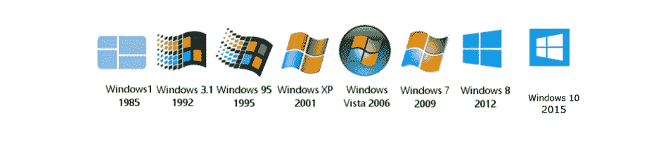
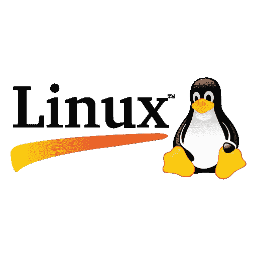
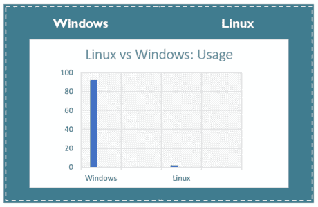
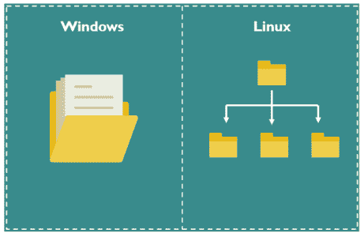
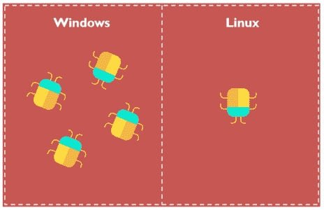
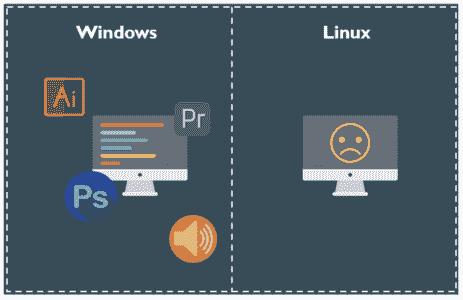
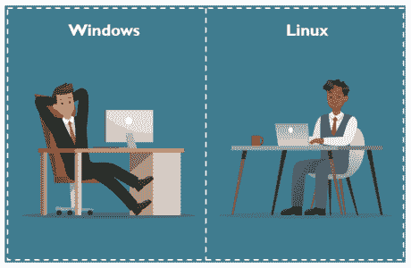
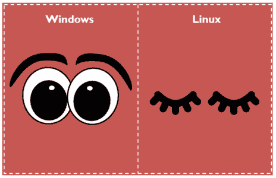
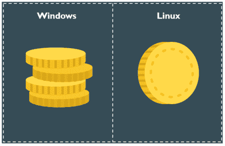

# Linux vs Windows:哪个是你最好的选择？

> 原文：<https://www.edureka.co/blog/linux-vs-windows/>

Linux vs Windows 这是一场由来已久的操作系统之战，它导致了互联网上的战争、分歧和近乎狂热的行为，似乎永远如此。我认为重要的是要强调，这篇文章不会讨论哪个是最好的操作系统，因为不可能得出那个结论。考虑到所述操作系统的巨大差异，这不是比较 [***Linux 和 Unix***](https://www.edureka.co/blog/unix-vs-linux/) 那么简单。因此，希望接下来的是基于不同的、特定的标准对这两种操作系统的公平评价。

以下是我们将通过这个博客讨论的话题。

*   [**什么是 Windows？**](#whatiswindows)

*   [**什么是 Linux？**](#whatislinux)

*   [**Linux vs Windows**](#linuxvswindows)

*   [**分布图**](#distributions)

*   [**哪个是给你的？**](#whichoneisforyou)

*   [**结论**](#conclusion)

## **Linux vs Windows:什么是 Windows？**

Windows 是一个授权的操作系统，它的源代码是不可访问的**。**它是为企业主、其他商业用户甚至没有计算机编程知识的个人设计的。它使用起来简单明了。

Windows 提供的功能包括，

*   多种操作环境
*   对称多重处理
*   客户端-服务器计算
*   集成缓存
*   虚拟内存
*   轻便
*   展开性
*   抢先调度

1985 年，随着微软的成立，第一版 Windows 被称为 Windows 1.0。它基于 MS-DOS 内核。在首次发布之后，新版本的 Windows 很快就推出了。这包括 1987 年的第一次重大更新和同年的 Windows 3.0。

1995 年，也许是迄今为止使用最广泛的版本，Windows 95 诞生了。此时，它运行在基于 16 位 DOS 的内核和 32 位用户空间上，以增强用户体验。

自这个版本以来，Windows 在核心架构方面没有太大变化，尽管已经添加了大量功能来解决现代计算问题。

你可以看一下视频教程，对这个问题有一个更全面的了解。

## Linux vs Windows | Linux 和 Windows 的比较| Edureka

[//www.youtube.com/embed/JZNFLhCkHrY?rel=0&controls=0&showinfo=0](//www.youtube.com/embed/JZNFLhCkHrY?rel=0&controls=0&showinfo=0)

这个关于“Linux 与 Windows”的 Edureka 视频将帮助您理解这两种操作系统之间的基本区别，同时让您对每种操作系统有一个概念。

## **Linux vs Windows:Linux 是什么？**

[***Linux***](https://www.edureka.co/blog/linux-tutorial/) 是基于 Unix 标准的免费开源操作系统，提供编程接口以及用户界面兼容性。它还包含许多独立开发的元素，没有专有代码。

传统的**单片内核**在 Linux 内核中被用于性能目的。它的模块化特性允许大多数驱动程序在运行时动态加载和卸载。

*对 Linux 管理感兴趣？在线查看 [Linux 认证课程](https://www.edureka.co/linux-admin)。*

Linux 是由芬兰学生 Linus Torvalds 创建的，他想创建一个任何人都可以使用的免费操作系统内核。它的推出比 Windows 晚得多，是在 1991 年。尽管它仍然被认为是一个非常简单的操作系统，没有像 Windows 那样的图形界面。从最初发布时只有几行源代码到今天的样子，包含了超过 2330 万行源代码，Linux 确实有了很大的发展。

1992 年，Linux 首次在 GNU 通用公共许可证下发布。

## **Linux vs Windows**

### **用户**

Linux 中有三种类型的用户(普通用户、管理用户(根用户)和服务用户)，而在 Windows 中，有四种类型的用户帐户(管理员、标准用户、孩子用户和来宾用户)。

### **用途**

根据市场调查数据，世界上 92.63%的个人电脑运行 Windows，而只有不到 1%的个人电脑用户使用 Linux。许多用户说，与 Windows 相比，使用 Linux 很难，因此 Linux 对家庭使用的吸引力非常有限。它主要用于服务器应用等严肃的用途。因此，公司服务器运行在 Linux 上，与 GUI 无关。

此外，由于与微软的许可协议，各种 PC 供应商有权将 Windows 操作系统与他们的 PC 捆绑在一起，使 Windows 比 Linux 更受市场欢迎。虽然现在许多 PC 厂商，如戴尔和惠普，已经开始将 Linux 作为预装操作系统，但 Windows 仍然统治着市场。

### **内核**

Linux 使用消耗更多运行空间的单片内核，而 Windows 使用占用更少空间的微内核，但比 Linux 降低了系统运行效率。

### **文件系统**

在微软视窗系统中，文件存储在不同数据驱动器上的目录/文件夹中，如 C: D: E:但是，在 Linux 中，文件是以树形结构排序的，从根目录开始，进一步分支到各种其他子目录。

在 Linux 中，一切都像文件一样对待。目录是文件，文件是文件，外接设备(如打印机、鼠标、键盘)也是文件。

### **安全**

每个 Windows 用户都曾在某个时间点面临过安全和稳定性问题。由于 Windows 是一个广泛使用的操作系统，黑客、垃圾邮件制造者经常将 Windows 作为攻击目标。Windows(消费者版本)最初是为了在没有网络连接的单用户 PC 上易于使用而设计的，并且没有内置的安全功能。微软经常通过其 Windows Update 服务发布安全补丁。这些更新每月发布一次，但关键更新会在更短的时间间隔内或在必要时发布。很多时候，Windows 操作系统的用户会面临*蓝屏死机*。这是由于系统响应失败造成的。最终，用户不得不抛开他/她的挫折感，手动重启 PC。

另一方面，Linux 基于多用户架构，这使得它比像 Windows 这样的单用户操作系统更加稳定。由于 Linux 是由社区驱动的，来自世界各地的开发人员会定期进行监控，因此出现的任何新问题都可以在几个小时内得到解决，必要的补丁也可以随时提供。

### **兼容性**

窗户射击。Windows 分数。这就是 Redmond 提供的 Linux 大获全胜的地方。尽管最近移植到或开发到 Linux 的软件有所改进，但 Windows 仍然是兼容性之王。

Windows 的用户可以肯定，几乎任何软件(甚至是最晦涩、最过时的软件)都可以工作，即使它被开发者抛弃了。Windows 有很好的传统支持。简单明了。

另一方面，Linux 一直在努力解决 Windows 用户认为理所当然的基础问题。

**易用性**

近几年来，Linux 在可用性方面取得了突飞猛进的发展。像 Linux Mint 和 Ubuntu 这样的发行版，甚至已经使它们的安装和设置变得更加简单，让非技术用户可以极其轻松地进行日常活动。

由于市场的扩张，Windows 是许多设备的默认操作系统。购买一台新的笔记本电脑或个人电脑，很有可能会安装 Windows 10。多年来，用户习惯于点击工具栏并打开他们最喜欢的程序，这使得他们很难进行切换。

### **隐私**

如果你是 Linux 用户，你的操作系统不会监视你。拥有 Linux 意味着这个系统是*你的，而且是你一个人的*。你还可以添加一个选项，即大多数 Linux 系统都带有*内置的军用级加密。*作为用户，您可以确信设备失窃不会对您的数据造成任何实际问题。

相反，在过去的几年里，Windows 变得更加广告驱动。用户肯定可以选择退出，但话说回来，谁能帮助聪明的注册表黑客，这显然是雷德蒙计划的一部分。Windows 可以观察用户的行为，提供同步到微软 One-Drive 服务或学习行为以使 Cortana(微软个人助理)更好。老实说，我不喜欢这些工具，因为它们很烦人。不过，有些用户喜欢这些功能。主观意见。

### **源代码**

Linux 是一个开源操作系统，而 Windows 操作系统是商业化的。Linux 可以访问源代码，并根据用户需要修改代码，而 Windows 不能访问源代码。

在 Linux 中，用户可以访问内核的源代码，并根据自己的需要修改代码。它有自己的优势。操作系统中的错误会很快得到修复，但开发者可能会利用操作系统中的任何弱点。

在 windows 中，只有选定的成员才能访问源代码。

### **执照**

大多数发行版中的 Linux 内核(及其附带的 GNU 实用程序和库)都是完全免费和开源的。公司为他们的发行版提供付费支持，但是底层软件仍然可以免费下载和安装。

微软视窗系统每份授权拷贝的价格一般在 99 美元到 199 美元之间。Windows 10 最初是作为免费升级提供的，如果 Windows 7/8/8.1 的用户在 2016 年 7 月 29 日之前升级，但该优惠不再提供。

### **可靠性**

众所周知，Windows 一天比一天慢。一段时间后，当你的系统崩溃或运行缓慢时，你必须重新安装 Windows。

如果你是一个 Linux 用户，你不必为了体验一个更快更流畅的系统而重新安装它。Linux 有助于您的系统长时间平稳运行。更久！事实上。

此外，作为一个 Windows 用户，你必须养成一个习惯，那就是对几乎所有的事情都要重启系统。

刚刚安装的软件–重启！

*卸载软件–重启！*

*获得了 Windows 更新–重新启动！*

系统似乎变慢了，你猜对了——重启！

然而，在 Linux 的情况下，你可以舒适地继续你的工作，你的操作系统不会打扰你。

这可能就是为什么你会发现像脸书和谷歌这样的互联网巨头都运行在 Linux 上。即使是超级计算机也大多运行在 Linux 上。

那么，为什么在工业界 Windows 没有比 Linux 更受欢迎呢？是因为 Linux 远比 Windows OS 可靠。句号。

## **Linux vs Windows:发行版**

## ****

首先，我们需要解决 Linux 平台更令人困惑的一个方面。虽然 Windows 保持了相当标准的版本结构，将更新和版本分成不同的层，但 Linux 要复杂得多。

Linux 内核最初被设计成一个所有人都可以访问的操作系统，今天它支撑着所有的 Linux 操作系统。然而，由于它仍然是开源的，任何人都可以根据自己的目的调整或修改操作系统。结果我们得到了数百个定制的基于 Linux 的操作系统，称为发行版。这使得在它们之间做出选择变得异常困难，这比简单地选择 Windows 7、Windows 8 或 Windows 10 要复杂得多。

但这也带来了一系列的好处。鉴于开源软件的本质，这些发行版在功能和复杂程度上可以有很大的不同，并且许多发行版都在不断发展。选择几乎是势不可挡的。

对于那些刚接触 Linux 的人，我们推荐[***【Ubuntu***](https://www.edureka.co/blog/how-to-install-ubuntu/)作为一个好的起点。它非常用户友好(甚至与 Windows 相比),同时功能丰富，足以满足有经验的技术人员。这是 Linux 拥有的最接近默认发行版的东西——尽管我鼓励每个人探索各种可用的发行版并找到他们最喜欢的。

## Linux 和 Windows:哪个更适合你？

这个看你需要做什么了。

### **多媒体**

Linux 和 Windows 操作系统都有丰富的多媒体应用。但是，对于一些用户来说，在旧版本的 Linux 中设置声音和视频选项可能相对困难。Linux 的一个主要优势是大多数多媒体应用程序都是免费的。在 Windows 的情况下，用户可能不得不支付高昂的价格来获得软件，尽管许多开源/免费版本通常是可用的。

### **游戏**

如果你是一个游戏玩家，需要 100%兼容某个特定的软件，或者想要一个用户友好的系统，那么毫无疑问，Windows 就是赢家。Steam 以及其他客户和选项提供了大量来自 AAA 发行商和小型独立开发商的游戏。Steam for Linux 现在允许你安装 Windows 游戏。但它仍处于测试阶段，并不是所有的 Windows 游戏都适用。这可能会让 Linux 用户感到沮丧，毫无疑问，这种情况在未来会有所改变。

但就目前而言，在 2018 年，许多 Linux 用户因选择 OS 而错过了顶级游戏。显卡厂商也倾向于支持 Windows 平台，而不是 Linux。它们提供及时的更新和新功能，而这些功能并不总是适用于其他操作系统。

### **开源**

如果你是开源软件的拥护者，或者只是厌倦了 Windows 中所有的强制更新和重启，那么 Linux 可能是一个可行的选择。

### **编程**

Linux 支持几乎所有的主流编程语言( *Python、C/C++、Java、Ruby、Perl 等*)。).此外，它还描绘了大量对编程有用的应用程序。

对于开发人员来说，使用 Linux 终端比使用 Window 命令行要好得多。您会发现许多库是为 Linux 开发的。此外，许多程序员指出，他们可以在 Linux 上使用包管理器轻松地做事情。能够在 [***不同的 shell***](https://www.edureka.co/blog/types-of-shells-in-linux/)中编写脚本也是程序员更喜欢使用 Linux OS 的最有说服力的原因之一。

Linux 也引入了对 SSH 的本地支持。这将帮助您快速管理您的服务器。您可以包括像 apt-get [***命令***](https://www.edureka.co/blog/linux-commands/) 这样的东西，这进一步使 Linux 成为程序员更受欢迎的选择。

## **Linux vs Windows:结论**

我希望这篇文章能够让您更加客观地了解这两个系统。我没有讨论比较 Linux 和 Windows 的每一个标准，因为标准太多了。还有一些关于各自体系的老生常谈，对谁都没有好处。我宁愿不理会他们，并建议你也这样做。我使用 Windows 和 Linux 是基于我需要通过双引导或虚拟化来完成的。

那么，Linux vs Windows？这个平台对争论是开放的。你的干草叉准备好了吗？