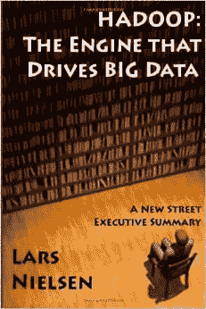
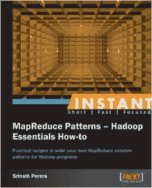
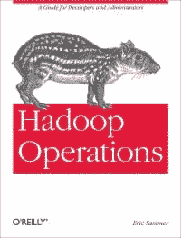

# Apache Hadoop 的 Cloudera 认证管理员(CCAH)

> 原文：<https://www.edureka.co/blog/questions-answers-about-cloudera-certified-administrator-for-hadoop-ccah/>

Cloudera 提供其 Cloudera 发行版的企业版和 express 版，包括 Apache Hadoop。Cloudera 对合格大数据人才的重要性的看法在其认证的元素中熠熠生辉。它为专业人士提供了 cloud era Certified Hadoop Administrator(CCAH)认证，这些专业人士负责为生产或其他企业用途配置、部署、维护和保护 Apache Hadoop 集群。通过这个认证，人们可以期望了解顶级 Apache Hadoop 管理员使用的方法。通过 CCAH 的最好方法是通过 Hadoop 管理员认证。

要了解 CCAH 的概况可以参考这个 **[链接。](https://www.edureka.co/blog/questions-answers-about-cloudera-certified-developer-for-hadoop-ccdh/ "Everything About Cloudera Certified Developer for Apache Hadoop (CCDH)")**

## **CCAH 考试模式为 CCAH & CCAH 升级考试:**

**考试代码:** CCA-500

**问题数量:** 60

**持续时间:** 90 分钟

**及格分数:** 70%

可用语言:英语、日语(即将推出)

**考试费用:**295 美元

考试模式的设置侧重于展示考生在配置、部署、维护和保护 Apache Hadoop 集群以及构成企业数据中心的生态系统项目方面的技术知识、技能和能力。

## **CCAH 升级考试:**

**检查代码:** CCA-505

**问题数量:** 45

**持续时间:** 90 分钟

**及格分数:** 70%

**语言:**英语、日语(即将推出)

**价格:**125 美元

CCAH 和 CDH5 两者的模式保持不变。此外，请注意，Hadoop 生态系统项目不再被视为独立的部分，而是在整个考试中集成在一起。CCA–500 和 CCA–505 在每个部分中共享相同的项目比例。

*我们来看看 CCA–500 的考试模式；*

## **HDFS–17%**

*   HDFS 守护进程的功能
*   Apache Hadoop 集群在数据存储和数据处理方面的正常运行。
*   推动 Apache Hadoop 等系统的计算系统的当前特性。
*   HDFS 设计的主要目标。
*   为给定场景中的 HDFS 联邦确定合适的用例。
*   HDFS 高可用性仲裁集群的组件和守护程序。
*   分析 HDFS 安全(Kerberos)的作用。
*   给定场景的最佳数据序列化选择。
*   文件读写路径。
*   在 Hadoop 文件系统外壳中操作文件的命令。

## **YARN 和 MapReduce 版本 2–17%**

*   将集群从 Hadoop 1.0 升级到 Hadoop 2.0。
*   用所有的 YARN 守护进程部署 MRv2 / YARN。
*   MRv2 的设计策略。
*   YARN 如何处理资源分配。
*   在 YARN 上运行 MapReduce 作业的工作流
*   确定哪些文件必须更改，以及如何将集群从 MRv1 迁移到运行在 YARN 上的 MRv2。

## **Hadoop 集群规划–16%**

*   为 Apache Hadoop 集群选择硬件和操作系统时需要考虑的事项。
*   深入了解操作系统的选择。
*   良好的内核调优和磁盘交换知识。
*   建立适合场景的硬件配置。
*   在给定的场景中，确定群集满足 SLA 所需的生态系统组件。
*   找出工作负载的细节，包括 CPU、内存、存储、磁盘 I/O。
*   了解 Hadoop 中的网络使用情况，并针对给定场景提出网络设计组件。

## **Hadoop 集群安装和管理–25%**

*   在给定的情况下，群集将如何处理磁盘和机器故障。
*   分析日志记录配置及其文件格式。
*   Hadoop 指标和集群健康监控的基础知识。
*   了解集群监控可用工具的功能和用途。
*   在 CDH 5 中安装所有的生态系统组件，如 Impala、Flume、Oozie、Hue、Cloudera Manager、Sqoop、Hive 和 Pig。
*   了解管理 Apache Hadoop 文件系统的可用工具的功能和用途。

## **资源管理-10%**

*   了解每个 Hadoop 调度程序的总体设计方面和目标。
*   了解 FIFO 调度程序如何分配集群资源。
*   确定公平调度器如何在 YARN 下分配集群资源。
*   确定容量计划程序如何分配群集资源。

## **监控和记录-15%**

*   Hadoop 的度量集合的功能和特性。
*   分析 NameNode 和 JobTracker Web 用户界面。
*   监控集群守护进程。
*   识别和监控主节点上的 CPU 使用情况。
*   了解如何监控所有节点上的交换和内存分配。
*   查看和管理 Hadoop 的日志文件。
*   解释日志文件。

***注:**上面提到的题目更多的是关于如何备考的指引。Cloudera 建议考生彻底了解每项考试的目标，并利用这些页面上推荐的资源和培训课程，彻底了解与考试评估的角色相关的知识领域。*

## 模拟测试详细信息

Cloudera 认证实践测试(付费)旨在模拟 CCAH 的考试模式。建议在参加考试之前先参加这个模拟测试，以评估您的准备水平。

以下是您在本模拟测试中应该期待的内容:

*   60 个类似 Cloudera 认证问题的问题。
*   正确/错误答案的详细解释，以理解概念。
*   模拟测试由负责制作 Cloudera 认证考试问题的人员制作。
*   通过智能手机和平板电脑随时随地学习
*   尝试一个免费的实践测试演示，包括来自 CCAH 的 15 个问题。

从这个由大数据平台顶级行业专家设计的大数据培训中，探索和了解更多关于 HDFS、YARN、MapReduce 的知识。你可以在这里查看 **[的模拟考试指引。](https://university.cloudera.com/content/CCA-500-Practice-Test)**

## **Apache Hadoop(CCAH)cloud era 认证管理员其他学习指南**

您准备好学习面向 Apache Hadoop(CCAH)-CCA 500 的 Cloudera 认证管理员课程了吗？这是你可以报名参加考试的地方。

在海德拉巴参加 [Hadoop 管理培训](https://www.edureka.co/hadoop-administration-training-certification-hyderabad)，了解如何在第一时间通过 CCAH 考试。你可以探索更多关于 Cloudera 认证的内容，然后阅读这篇 [**大数据认证**](https://www.edureka.co/blog/top-big-data-certifications) 的博客。

**相关帖子:**

[【关于 Cloudera 的一切】Apache Hadoop (CCDH)认证开发者](https://www.edureka.co/blog/questions-answers-about-cloudera-certified-developer-for-hadoop-ccdh/ "Everything About Cloudera Certified Developer for Apache Hadoop (CCDH)")

[如何成为 Hadoop 管理员](https://www.edureka.co/blog/how-to-become-a-hadoop-administrator/ "How to become a Hadoop Administrator?")

[Hadoop Administration 面试题&答案](https://www.edureka.co/blog/interview-questions/hadoop-administration-interview-questions-and-answers/ "Hadoop Administration Interview Questions and Answers")