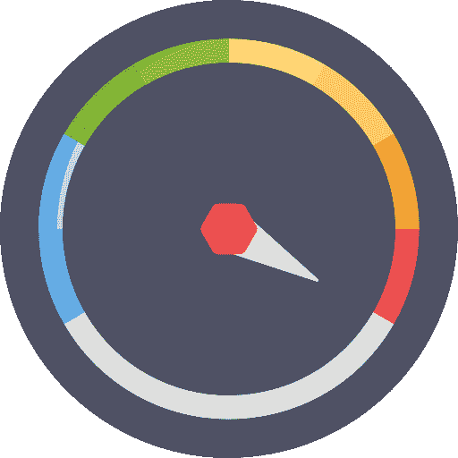
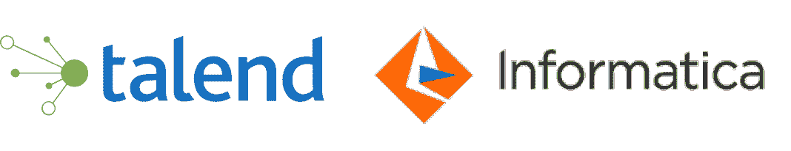

# 大数据工程师需要的技能、工作和薪水

> 原文：<https://www.edureka.co/blog/big-data-engineer-skills/>

我们大多数人都知道谁是数据工程师，但我们对大数据工程师的角色&职责感到困惑。一旦我们开始将这些角色&的职责与适当的技能组合对应起来，并找到最有效和高效的学习途径，这种模糊性就会增加。但是，不要担心，你已经降落在正确的地方。这篇“*大数据工程师技能*”博客将帮助你了解一名数据工程师的不同职责。从现在起，我将把这些职责与适当的技能组合对应起来&将引导你走上 apt 学习之路。

通过 [Hadoop 认证](https://www.edureka.co/big-data-hadoop-training-certification)，更好地理解概念并提升技能。

我们先来了解一下谁是数据工程师。

## **谁是数据工程师？**

简单来说，*数据工程师就是开发、构建、测试&维护大规模处理系统完整架构的人。*

接下来，让我们进一步深入了解数据工程师的工作角色。

## **数据工程师是做什么的？**

数据工程师工作角色中包含的关键任务有:

*   设计、开发、构建、安装、测试和维护完整的数据管理&处理系统。
*   构建高度可扩展的、健壮的&容错系统。
*   负责完整的 ETL(提取、转换&加载)过程。
*   确保架构以满足所有业务需求的方式进行规划。
*   发现各种获取数据的机会，探索使用现有数据的新方法。
*   提出提高数据质量、可靠性的方法&整个系统的效率。
*   通过将各种编程语言&工具集成在一起，创建一个完整的解决方案。
*   创建数据模型以降低系统复杂性，从而提高效率&降低成本。
*   部署灾难恢复技术
*   在现有系统中引入新的数据管理工具&技术，以提高效率。

获得 [Azure 数据工程认证](https://www.edureka.co/microsoft-azure-data-engineering-certification-course)成为数据工程师 si 的最佳途径。接下来，我想解决一个非常普遍的困惑，即数据的区别&大数据工程师。

## **区别数据工程师&大数据工程师**

我们正处于数据革命的时代，数据是 21 世纪的燃料。各种数据源&在过去二十年中，许多技术得到了发展，&其中最主要的是 NoSQL 数据库&大数据框架。

随着数据管理系统中 ***[大数据](https://www.edureka.co/blog/big-data-tutorial)*** 的出现，数据工程师现在要处理&管理大数据，他们的角色已经升级为大数据工程师。由于大数据，整个数据管理系统变得越来越&复杂。因此，现在大数据工程师必须学习多个大数据框架& NoSQL 数据库，以创建、设计&管理处理系统。

在这篇大数据工程师技能博客中，我们了解了大数据工程师的职责。这将有助于我们将数据工程师的职责与所需的技能集对应起来。

## **数据工程师职责**

### **数据摄取**

数据摄取是指从各种来源获取数据&，然后将其摄取到数据湖中。有多种不同格式的数据来源&结构的数据。

数据工程师需要从源中高效提取数据的技能，这可能包括不同的数据接收方法，如批处理&实时提取。还有各种其他的技巧可以使数据获取更有效，比如增量加载、并行加载数据等。

谈到大数据世界，随着数据量开始加速增长，数据接收变得更加复杂，&数据也以不同的格式呈现。数据工程师还需要了解数据挖掘&不同的数据摄取 API 来捕获&注入更多数据到数据湖。成为数据工程师 si 的最佳途径通过在华盛顿接受 [Azure 数据工程培训](https://www.edureka.co/microsoft-azure-data-engineering-certification-course-washington) 。

### **数据转换**

数据总是以 raw 格式存在，不能直接使用。它需要根据用例从一种格式转换成另一种格式，或者从一种结构转换成另一种结构。数据转换可能是一个简单或复杂的过程，取决于各种数据源、数据格式&以及所需的输出。这可能包括不同语言的各种工具&定制脚本，取决于数据的复杂性、结构、格式&容量。

### **性能优化**

构建一个既可扩展又高效的系统&是一项具有挑战性的工作。数据工程师需要了解如何提高单个数据管道的性能&优化整个系统。

同样，当我们处理大数据平台时，性能成为一个主要因素。大数据工程师需要确保从查询执行到通过报告&交互式仪表盘可视化数据的完整流程得到优化。这需要各种概念，如分区、索引、反规范化等。

除此之外，基于行业正在使用的工具&技术，在数据工程师的工作中可以找到各种各样的职责。

总结大数据工程师的职责:

*   设计、创建、建造&维护数据管道
*   聚合&转换来自各种数据源的原始数据，以满足功能性&非功能性业务需求
*   性能优化:自动化流程，优化数据交付&重新设计完整的架构以提高性能。
*   处理、转变&使用大数据框架管理大数据& NoSQL 数据库。
*   构建完整的基础架构来接收、转换&商店数据，以供进一步分析&业务需求。

如果你看一下&比较不同的大数据数据工程师职位描述，你会发现大多数职位描述都基于现代工具&技术，这些技术来自[在钦奈](https://www.edureka.co/big-data-hadoop-training-certification-chennai)的 Hadoop 培训。在这篇大数据工程师技能博客中，让我们来看看让你成为大数据工程师的必备技能。

## **大数据工程师技能:成为大数据工程师所需技能**

*   **大数据框架/基于 Hadoop 的技术:**随着 21 世纪初大数据的兴起，一个新的框架诞生了。那就是 Hadoop！这都要感谢 Doug Cutting，他引入了一个框架，这个框架不仅以分布式方式存储大数据，而且并行处理数据。

在 [Hadoop 生态系统](https://www.edureka.co/blog/hadoop-ecosystem)中有许多工具可以满足来自不同背景的&专业人士的不同需求。

对于一个大数据工程师来说，掌握大数据工具是必须的。你需要掌握的一些工具是:

1.  [**HDFS**](https://www.edureka.co/blog/hdfs-tutorial) (Hadoop 分布式文件系统):顾名思义就是 Hadoop 的存储部分，将数据存储在分布式集群中。作为 Hadoop 的基础，HDFS 知识是开始使用 Hadoop 框架的必备知识。
2.  [**YARN**](https://www.edureka.co/blog/hadoop-yarn-tutorial/) : YARN 通过给不同的应用分配资源和调度作业来进行资源管理。YARN 是在 Hadoop 2.x 中引入的。随着 YARN 的引入，Hadoop 变得更加灵活、高效&可扩展。
3.  [**MapReduce**](https://www.edureka.co/blog/mapreduce-tutorial/):MapReduce 是一种并行处理范式，允许在分布式 Hadoop 存储(即 HDFS)之上并行处理数据。
4.  **[猪](https://www.edureka.co/blog/pig-tutorial/) & [HIVE](https://www.edureka.co/blog/hive-tutorial/)** : Hive 是 HDFS 上面的一个数据仓储工具。Hive 迎合了 SQL 背景的专业人士进行分析。而 Apache Pig 是一种高级脚本语言，用于 Hadoop 之上的数据转换。Hive 通常由数据分析师用于创建报告，而 Pig 由研究人员用于编程。如果您熟悉 SQL，这两种方法都很容易学习。
5.  **[Flume](https://www.edureka.co/blog/apache-flume-tutorial/)&[Sqoop](https://www.edureka.co/blog/apache-sqoop-tutorial/)**:Flume 是一个工具，用于将非结构化数据导入到 HDFS，而 sq OOP 用于将结构化数据从 RDBMS 导入&导出到 HDFS。
6.  **ZooKeeper** : Zookeeper 在 Hadoop 环境下运行的分布式服务之间充当协调者。它有助于配置管理和同步服务。
7.  [**Oozie**](https://www.edureka.co/blog/apache-oozie-tutorial/) : Oozie 是一个调度器，它将多个逻辑任务绑定在一起，帮助完成一个完整的任务。

*   **实时处理框架** ( ***[阿帕奇火花](https://www.edureka.co/blog/spark-tutorial/)*** ):动作敏捷的实时处理是时代的需要。无论是信用卡欺诈检测系统还是推荐系统，它们中的每一个都需要实时处理。对于数据工程师来说，了解实时处理框架非常重要。Apache Spark 是一个分布式实时处理框架。它可以利用 HDFS 轻松地与 Hadoop 集成。可以参考 Edureka 的***[Hadoop](https://www.youtube.com/playlist?list=PL9ooVrP1hQOFrYxqxb0NJCdCABPZNo0pD)***&***[Spark](https://www.youtube.com/playlist?list=PL9ooVrP1hQOGyFc60sExNX1qBWJyV5IMb)***视频，获取全面的知识。

*   **数据库架构**:最突出的数据源之一是数据库。对于一个数据工程师来说，理解数据库设计&像 1 层、2 层、3 层和 n 层这样的数据库架构是至关重要的。数据模型&数据模式也是数据工程师应该具备的关键技能之一。

*   **基于 SQL 的技术(如 [MySQL](https://www.edureka.co/blog/mysql-tutorial/) ):** 结构化查询语言用于结构化、操作&管理数据库中存储的数据。由于数据工程师与关系数据库密切合作，他们需要对 ***[SQL](https://www.youtube.com/watch?v=WmGgxTpGs_8)*** 有很强的驾驭能力。PL/SQL 在业界也有突出的应用。PL/SQL 在 SQL 之上提供了过程化编程特性。

*   **NoSQL 技术公司(如 Cassandra 和 MongoDB):** 随着组织的需求增长到结构化数据之外，因此引入了 NoSQL 数据库。它可以根据应用需求，以快速迭代和敏捷结构存储大量结构化、半结构化&非结构化数据。

一些最常用的数据库是:

[**HBase**](https://www.edureka.co/blog/hbase-tutorial) 是在 HDFS 之上的面向列的 NoSQL 数据库，有利于可扩展的&分布式大数据存储。它适用于基于扫描的优化读取&范围的应用。它提供超出上限的 CP(一致性分区)。

[**Cassandra**](https://www.youtube.com/watch?v=iDhIjrJ7hG0&list=PL9ooVrP1hQOGJ4Yz9vbytkRmLaD6weg8k) 是一个具有增量可伸缩性的高可伸缩数据库。Cassandra 最好的部分是最小化的管理和没有单点故障。它适用于具有快速&随机读取&写入的应用。它提供了超出上限的 AP(可用的&分区)。

[**MongoDB**](https://www.youtube.com/watch?v=CaKoJ9rFo8c) 是一个面向文档的 NoSQL 数据库，它是无模式的，也就是说，你的模式可以随着应用程序的增长而发展。它还为高性能的&复制提供了完整的索引支持，以实现容错。它具有主从架构&提供超出 CAP 的 CP。web 应用程序&半结构化数据处理严格使用它。

*   **[Python](https://www.edureka.co/blog/python-tutorial/)/[R](https://www.edureka.co/blog/r-tutorial/):**各种编程语言都可以服务于同一目的。一种编程语言的知识就足够了，因为味道变了，但逻辑保持不变。如果你是一个初学者，你可以继续使用***[Python](https://www.youtube.com/watch?v=GRN_9YkfN5w&list=PL9ooVrP1hQOHY-BeYrKHDrHKphsJOyRyu)***，因为它简单的语法和良好的社区支持，很容易学习。而***[R](https://www.youtube.com/watch?v=eDrhZb2onWY&list=PL9ooVrP1hQOEIUTpxRf4infBJnquwaTME)***则有一条由统计学家开发的陡峭的学习曲线。r 主要由分析师&数据科学家用来执行数据分析。

*   **ETL/数据仓库解决方案( [Talend](https://www.edureka.co/blog/talend-etl-tool/) ， [Informatica](https://www.edureka.co/blog/informatica-tutorial) ):** 在管理来自异构数据源的大量数据时，数据仓库非常重要，您需要应用 ETL(提取转换负载)。数据仓库用于数据分析&报告，是商业智能非常重要的一部分。对于一个大数据工程师来说，掌握一个数据仓库或者 ETL 工具是非常重要的。掌握一种工具后，学习新工具就变得容易了，因为基本原理保持不变。

***[Informatica](https://www.youtube.com/playlist?list=PL9ooVrP1hQOHQotG5nDJ1LjXiUDIgkeov)***&***[Talend](https://www.youtube.com/playlist?list=PL9ooVrP1hQOGPJgFdMaUeNSktk70k3yJP)***是业界使用的两大知名工具 informatica&Talend Open Studio 是具有 ETL 架构的数据集成工具。Talend 的主要优势是支持大数据框架。我会推荐你从 Talend 开始，因为学完这个之后，任何 DW 工具对你来说都将是小菜一碟。

*   **UNIX、 [Linux](https://www.youtube.com/watch?v=v_1zB2WNN14) 、Solaris 或MS Windows**——全行业各种操作系统都有使用。Unix & Linux 是一些常用的操作系统&大数据工程师需要至少掌握其中一种。

除了对完整数据流&商业模式的理解，成为一名数据工程师背后的一个动机是薪水。

## **大数据工程师岗位&薪水**

根据 indeed,“大数据工程师”的平均工资从 94，944 美元到 126，138 美元不等。而根据 Glassdoor 的数据，美国高级数据工程师的全国平均工资为 181，773 美元。

截至 2019 年 11 月，知名招聘网站上的职位总数为:

*   [【领英(IN)】](https://www.linkedin.com/jobs/data-engineer-jobs/)–2746 个职位
*   [【领英(美国)](https://www.linkedin.com/jobs/search/?country=in&countryCode=in&keywords=data%20engineer&location=United%20States&locationId=us%3A0)–39647 个工作岗位
*   [果然](https://www.indeed.com/q-Data-Engineer-jobs.html)-127091 个就业岗位
*   [【玻璃门(美国)](https://www.glassdoor.com/Job/data-engineer-jobs-SRCH_KO0,13.htm)–143304 个工作岗位

我希望这篇*大数据工程师技能*的博客能够帮助你找到成为大数据工程师所需的正确技能。在下一篇 **[大数据简历](https://www.edureka.co/blog/big-data-engineer-resume/)** 博客中，我们将重点关注如何制作一份有吸引力的大数据工程师简历，让你获得聘用。

Start your Big Data Engineer Journey with Edureka [<button>Learn Now</button>](https://www.edureka.co/masters-program/big-data-architect-training)

如果你愿意提升你的职业&开始你的大数据工程师之旅，就从海得拉巴的[大数据培训开始吧。](https://www.edureka.co/big-data-and-hadoop-training-hyderabad)