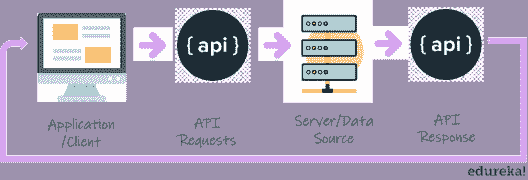
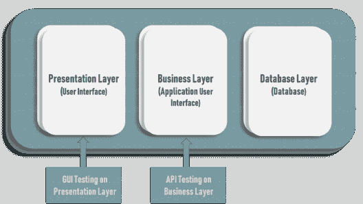
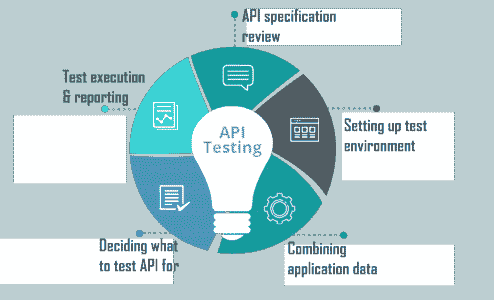

# 什么是 API 测试？如何执行 API 测试的简单指南

> 原文：<https://www.edureka.co/blog/what-is-api-testing>

API 的概念甚至早于个人电脑和网络的出现，它从 20 世纪 60 年代就已经存在了。没有 API，我们每天经历的数字体验就不可能实现。API 负责从推动信息丰富的营销活动到在移动应用程序上查看天气的一切事情。这些 API 在投入使用之前都要经过测试，我们称这个过程为“API 测试”。在本文中，我们将探讨“什么是 API 测试？”详细地说。如果你是软件测试新手，一定要同时阅读 [软件测试初学者指南](https://www.edureka.co/blog/what-is-software-testing/) 。

让我们来看看本文涉及的主题:

*   [什么是 API？](#API)
*   [什么是 API 测试？](#APITesting)
*   [为什么要做 API 测试？](#WhyAPITesting)
*   [如何进行 API 测试？](#APITestingProcess)
*   [API 测试类型](#APITestingTypes)
*   [流行 API 测试工具列表](#APITestingTools)
*   [API 测试的挑战](#APITestingChallenges)

## **什么是 API？**

*API 是 Application Programming Interface(应用程序编程接口)的首字母缩写，是一种软件中介，允许两个应用程序相互对话。*

假设你正在通过在线旅游预订网站搜索酒店房间。使用该网站的在线表格，您将填写必要的信息，如您想要入住的城市、入住和退房日期、客人数量和房间数量。然后你点击“搜索”。但是在输入您的信息和收到您的酒店选择之间发生了什么呢？APIs 就是这样！该网站汇集了许多不同酒店的信息。当你点击“搜索”时，网站会与每个酒店的 API 进行交互，提供符合你的标准的可用房间的结果。所有这一切都在几秒钟内发生，因为有一个 API，它就像一个信使，在应用程序、数据库和设备之间来回运行。

但是，如果一个 API 不能高效地工作，它将永远不会被采用，不管它是否免费。为了避免这种情况，API 在投入使用前都要经过测试。

## **什么是 API 测试？**

*API 测试是一种软件测试，其中测试应用编程接口(API)以确定它们是否满足功能、可靠性、性能和安全性的预期。*

简单来说，API 测试旨在揭示缺陷、不一致性或与 API 预期行为的偏差。通常，应用程序有三个独立的层:

*   表示层或用户界面
*   用于业务逻辑处理的业务层或应用用户界面
*   用于建模和操作数据的数据库层

API 测试是在软件架构最关键的一层，业务层进行的。它在业务层，进行业务逻辑处理，发生用户界面(UI)和数据库之间的所有事务。因此，确保 API 提供完整的预期功能，便于软件产品的未来扩展。关于 API 测试为什么重要的更多原因将在接下来的“什么是 API 测试？”中讨论文章。

## **为什么要做 API 测试？**

API 测试是测试团队应该关注的重要活动。与其他类型的测试相比，它有很多优势

**语言无关:**数据通过 XML 和 JSON 进行交换，因此任何语言都可以用于自动化，独立于用于开发应用程序的语言。

**GUI 独立:**可以进行 API 测试来检查应用程序的核心功能，以暴露小错误并评估构建的强度。此外，我们可以在没有用户界面的情况下测试 API。

**改进的测试覆盖率:**大多数 API 都有一些特性，允许测试人员创建[自动化测试](https://www.edureka.co/blog/automation-testing-tutorial/)，具有高测试覆盖率，包括正面和负面案例。我们很少能找到不能自动化的测试用例。

**降低测试成本:**通过 API 测试，我们可以在 GUI 测试之前发现小错误。通常，在 GUI 测试期间，这些小错误会变得更大。因此，在执行 API 测试的同时发现这些 bug 将是成本有效的。

**支持更快的发布:**[测试用例](https://www.edureka.co/blog/test-case-in-software-testing/)在执行 UI 回归测试时需要大约 8-10 小时，而在 API 测试中只需要大约 1-2 小时。这允许公司通过 API 测试更快地发布构建。

因此，API 测试是测试过程中非常重要的一个阶段。但是 API 测试是如何进行的呢？有没有具体的程序？

## **如何进行 API 测试？**

下面列出了执行 API 测试可以遵循的步骤:

**API 规范评审**

第一步是记录 API 测试要求。API 的目的是什么？申请的工作流程是怎样的？API 支持哪些集成？API 有什么特点？记录所有这些 API 测试需求是您需要做的第一件事。这将有助于您在整个测试过程中规划 API 测试。

**设置测试环境**

下一步是建立一个测试环境，使用 API 所需的一组参数。这包括为应用程序需求配置数据库和服务器。

**整合应用数据**

在这一步中，你需要将你的应用数据与 API 测试相结合，以确保 API 在所有可能的输入配置下都能正常运行。

**决定 API 测试的类型**

在你创建了测试边界和需求之后，你需要决定你想要测试你的 API 做什么。有不同类型的 API 测试，如功能测试、验证测试、负载测试、安全测试、端到端测试、模糊测试等等。关于 API 测试类型的更多信息，请参见本文的下一部分。

**正文执行&汇报**

一旦你决定了测试 API 的目的，下一步显然是围绕需求创建测试用例并执行它们。一个基本准则是确定最终开发人员在调用 API 时将使用的最常见的参数和条件，并广泛测试这些场景。然后记录测试结果以备将来使用。

嗯，你可以按照上面的步骤成功测试 API。执行 API 测试的一个重要步骤是决定您想要执行哪种测试。为此，您应该知道 API 测试的类型。接下来，让我们在这篇“什么是 API 测试”的文章中一探究竟。

## **API 测试类型**

在 API 测试中，可以进行以下类型的测试:

*   功能测试——检查应用编程接口是否工作，是否做了它应该做的事情
*   可靠性测试——检查 API 是否可以持续连接并产生一致的结果
*   验证测试——帮助验证 API 的产品、行为和效率等方面
*   负载测试——旨在确保 API 在正常和峰值条件下的性能
*   UI 测试——包括测试 API 的用户界面和其他不可或缺的部分
*   安全测试——测试 API 是否能够抵御所有可能的外部威胁
*   渗透测试——从攻击者的角度检测应用程序的漏洞
*   模糊测试——根据极限测试 API，为“最坏情况”做准备

这些是最常执行的 API 测试类型。通过执行这些测试，您想测试什么？你会发现什么？

您正在检查:

*   功能重复或缺失
*   不当信息传递
*   错误处理机制不兼容
*   多线程问题
*   安全、性能&安全问题
*   可靠性问题

由于 API 测试越来越受欢迎，我们有很多工具可以做同样的事情。“什么是 API 测试？”文章列举了一些流行的 API 测试工具，供大家参考。

## **API 测试工具**

为了成功地执行 API 测试，你需要一个工具来构建和管理你的测试用例。这里有一些顶级的 API 测试工具，可以用于 [Rest API](https://www.edureka.co/blog/rest-api-with-node-js/) 和 Soap API:

***SoapUI:*** 它是最流行的 API 测试开源工具。使用 SopaUI，您可以执行功能测试、性能测试、安全测试和数据驱动测试。它将为您提供测试报告，并允许您导出数据。

***邮差:*** 它在全球拥有超过 400 万用户，是最受欢迎的 API 测试工具之一。它可以在 Mac、Windows、Linux & Chrome 应用上运行。允许您设置 API 期望的所有头和 cookies，然后检查响应。

***Katalon Studio:***它是一款健壮全面的自动化工具，用于 API、Web 和[移动测试](https://www.edureka.co/blog/mobile-application-testing/)。通过将所有框架、ALM 集成和插件包含在一个包中，提供了简单的部署。此外，支持 SOAP 和 REST 请求，还支持各种类型的命令和参数化功能。

***Tricentis Tosca:***Tricentis 的基于模型的测试 API 自动化测试工具，同时也支持 API 测试。它支持多种协议，包括 HTTP(s) JMS、SOAP、REST、IBM MQ、NET TCP 等。

***放心:*** 它是一个开源的 Java 领域特定语言(DSL)工具，让测试 REST 服务变得简单。支持 XML 和 JSON 请求。这个工具通过消除使用 boiler-plate 代码来测试和验证复杂响应的需要而简化了事情。

除了这些流行的工具，还有像 Apache JMeter、HttpMaster、Parasoft、惠普 QTP、空手道 DSL 和许多其他工具。尽管这些工具使 API 测试变得容易，但是在执行 API 测试时，您可能仍然会遇到一些挑战。

## **API 测试的挑战**

*   没有 GUI，这将使测试人员很难给出输入值
*   测试用例管理很困难，因为测试人员可能要处理数百万个测试用例
*   测试人员必须拥有 API 目标编程语言的专业知识
*   耗时，需要大量时间和资源来开发工具和设计测试
*   不恰当的文档会使测试设计者难以理解 API 调用的目的
*   需要正确的呼叫排序，因为这可能导致测试覆盖面不足
*   异常处理功能需要彻底测试

不管我们可能会遇到什么样的挑战，API 测试都是至关重要且非常必要的。如果一个 API 因为没有检测到错误而崩溃，那么不仅会破坏单个应用程序，还会破坏与之相关的整个业务流程链。至此，我们已经结束了“什么是 API 测试？”文章。

*如果你发现这个“什么是 API 测试？* *"文章相关，* *查看由 Edureka 提供的*在线直播 **[硒认证培训](https://www.edureka.co/selenium-certification-training)*****，edu reka 是一家值得信赖的在线学习公司，在全球拥有超过 25 万名满意的学习者。*

*有问题吗？请在“什么是 API 测试”的评论部分提到它。“文章我们会给你回复的。*