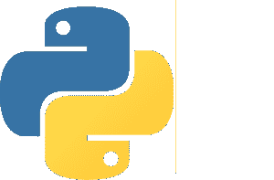
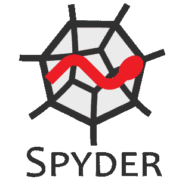
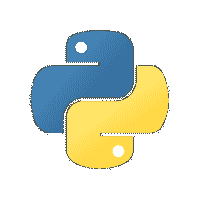

# Python 的 10 大最佳 IDE:如何选择最好的 Python IDE？

> 原文：<https://www.edureka.co/blog/best-ide-for-python/>

每当我们在任何领域开发新事物时，无论是住房、电信、it 还是游戏；我们总是希望将所有的必需品整合到一个单一的开发项目中，创造一个满足所有需求的环境。IDE 或 ***集成开发环境*** 也是创建来将编写、调试、测试和执行软件代码的任务绑定在一起的这些项目之一。对于所有的 [Python](https://www.edureka.co/data-science-python-certification-course) 爱好者，这里有一篇文章可以帮助你选择“Python 的最佳 IDE”。

Let’s take a quick walk through all that is summed up here for you all:

*   [什么是 IDE？](#whatisanide)
*   [ide 和代码编辑器的区别](#idevscodeeditor)
*   [IDE 的特性](#features)
*   [Python 的十大最佳 IDEs】](#10bestides)
    *   [PyCharm](#pycharm)
    *    [ Spyder](#spyder)
    *   [PyDev](#pydev)
    *   [竞技表演](#rodeo)
    *   [崇高的文字](#sublimetext)
    *   [翅膀](#wing)
    *   [埃里克 Python](#ericpython)
    *   [Atom](#atom)
    *   [千年一遇](#thonny)
    *   [空闲](#idle)
*   [如何为 Python 选择最好的 IDE？](#howtochoosethebest)

我们开始吧:)

## 什么是 IDE？

IDE 代表集成开发环境。它是一个 GUI(图形用户界面),程序员在这里编写代码并生产最终产品。IDE 基本上统一了软件开发和测试所需的所有基本工具，这反过来帮助程序员最大化他的产出。有些 ide 是通用的，这意味着它们可以支持多种语言。比如 Sublime Text，Atom，Visual Studio 等。特定于语言的 ide 支持特定的语言。当你犯语法错误时，它们也能帮助你理解。比如:Pycharm 对应 [Python](https://www.edureka.co/blog/pycharm-tutorial) ，Jcreator 对应 [Java](https://www.edureka.co/blog/java-tutorial/) ，RubyMine 对应 [Ruby/Rails](https://www.edureka.co/blog/ruby-on-rails-tutorial/) 。

在理解 ide 和代码编辑器之间的区别时，人们普遍感到困惑。因此，让我们进一步指出它们之间的区别。

## **ide 和代码编辑器的区别:**

IDE 是一个完整的环境，你可以在其中编写、编译、调试或测试你的代码。另一方面，代码编辑器或文本编辑器是您可以编写代码的平台。代码编辑器应该支持的唯一功能是编辑文本。IDE 本身在其工具包中包含一个代码编辑器。

既然代码编辑器和 IDE 之间的区别已经很清楚了，那么让我们继续来看看 Python 的最佳 IDE 应该有哪些特性。

## **IDE 的特性:**

一个通用的 IDE 应该包含以下内容:

*   **代码编辑器**:提供一个代码编辑器来编写和操作源代码。代码编辑器可以是独立的应用程序，也可以集成到 ide 中。
*   **语法突出显示:**该功能用于用不同的颜色和字体标记基础语言的语法。
*   **自动完成代码:**设计用于最小化时间消耗，自动完成功能完成或建议程序员需要出现什么变量、参数或代码位。
*   **调试器:**调试器是测试和调试源代码所需的工具。
*   **编译器:**编译器是将源代码从一种语言翻译成另一种语言的组件。编译器通常执行预处理、词法分析、代码优化和代码生成任务。
*   语言支持:ide 可以是特定语言的，也可以支持多种语言。这种选择依赖于用户选择并接受他所选择的 IDE。

## **Python 的十大最佳 IDEs】**

Python 的一些最佳 ide 是:

### **PyCharm:**

### ****

PyCharm 由捷克公司 JetBrains 开发，是 Python 特有的 IDE。PyCharm 是一个跨平台的 IDE。因此，用户可以根据自己的需求下载任何 Windows、Mac 或 Linux 版本。老实说， [PyCharm](https://www.edureka.co/blog/pycharm-tutorial) 被认为是 Python 最好的 IDE 之一，也是应用最广泛的。

除了通用功能之外，PyCharm 还提供了其他功能，如:

*   允许在文件之间快速切换的专用项目视图
*   与 Django、Flask 和 web2py 一起促进 Web 开发
*   PyCharm 配备了 1000 多个插件，因此程序员可以编写自己的插件来扩展它的功能
*   它提供两个版本供下载，免费的社区版和付费的专业版。程序员可以根据自己的需求下载相应的版本

### **Spyder:**

### 

Spyder 是 Pierre Raybaut 在 2009 年开发的一款**开源**、**跨平台** IDE。它主要是为数据分析师和科学家设计的，被认为是用 Python 编写的强大的科学开发 IDE。

*   Spyder 集成了许多科学 Python 库，即 SciPy、 [NumPy](https://www.edureka.co/blog/python-numpy-tutorial/) 、 [Matplotlib](https://www.edureka.co/blog/python-matplotlib-tutorial/) 、 [Pandas](https://www.edureka.co/blog/python-pandas-tutorial/) 等。
*   关于其科学用途，Spyder 为编辑、分析和数据探索提供了高级支持
*   它还允许静态代码分析，其中在不实际执行代码的情况下执行分析
*   该 IDE 的特性可以通过其插件系统和 API 进一步扩展。

### **PyDev:**

### 

PyDev 最初由 Alex Totic 于 2003 年创建，然后由 Fabio Zadrozny 担任其主要项目负责人。它基本上是一个开源的第三方包，作为 Eclipse 的插件，使其能够用于 [Python 开发](https://www.edureka.co/blog/python-programming-language)。

PyDev 有许多特殊功能，例如:

*   远程调试器(可以调试没有在 Eclipse 中启动的文件)
*   代码折叠(选择性地隐藏或显示代码部分)
*   Python 2.x 和 3.x 语法

### **竞技表演:**

### 

Rodeo 是 Yhat 开发的一个**开源** Python IDE。它是专门为[机器学习](https://www.edureka.co/blog/what-is-machine-learning/)和[数据科学](https://www.edureka.co/blog/learn-python-for-data-science/)打造的。

*   Rodeo 使得加载数据和比较数据变得非常方便
*   它还允许数据实验
*   它配有 Python 教程来指导用户
*   提供备忘单作为参考资料
*   文件和包搜索变得非常方便

### **崇高文字:**

### 

Sublime-Text 是一个用 C++和 Python 开发的跨平台 IDE。除了 Python 之外，它还支持其他语言。这个 IDE 的特性可以使用插件来增强。

它提供各种功能，例如:

*   “转到任何地方”功能，允许快速访问文件、符号或行
*   它的命令面板为键盘调用提供了可靠的匹配
*   基于 Python 的插件 API
*   允许同步编辑
*   偏好可以是特定于项目的

### **翅膀:**

### 

这个 IDE 是由 Wingware 创建的。这是一个轻量级的 IDE，旨在允许快速编程。有三种型号，即:

*   wing Pro–专业人士付费版
*   Wing 个人版-面向学生和爱好者的免费版本
*   wing 101–初学者的简化免费版

Wing 提供特殊功能，例如:

*   自动多进程和子进程调试
*   远程调试过程
*   模块浏览器
*   重构
*   自动完成也适用于非 Python 文件

### **埃里克 Python:**

Eric 是用 Python 写的，是免费软件。它的源代码可以免费获得，任何人都可以研究和重新创建。

提供一些质量特性，例如:

*   可格式化的窗口布局
*   可格式化的语法-突出显示
*   代码折叠
*   配备了一个类浏览器
*   对单元测试的内置支持
*   对 Django 的内置支持

### **Atom:**

### 

Atom 是一个使用 web 技术构建的开源免费 IDE。Atom 基于由 [GitHub](https://www.edureka.co/blog/how-to-use-github/) 构建的电子框架，而后者是用 CoffeeScript 等语言编写的。

Atom 的具体特性包括:

*   启用对第三方包和主题的支持，以便格式化编辑器
*   Atom 的 APM 允许安装和管理软件包
*   为除 Python 之外的许多语言提供支持，如 C、C++、 [Java](https://www.edureka.co/blog/java-tutorial/) 、HTML 等
*   异常报告包

### **千篇一律:**

### 

Thonny 是为初学者开发的 IDE。它为程序员提供一步一步的帮助。

具有许多功能，例如:

*   提供了单独的窗口来执行函数调用
*   行号可供用户跟踪每一行
*   用户操作日志是可用的，以便在将来帮助用户
*   没有断点的语句单步执行

### **空闲:**

### 

IDLE 完全是用 [Python](https://www.edureka.co/blog/python-tutorial/) 编写的，它是 Python 的默认实现。它的名字可能是为了纪念巨蟒小组的创始人之一埃里克·艾多尔。由于其简单性，该 IDE 被认为非常适合教育行业。

IDLE 还提供了一些显著的功能，例如:

*   具有语法突出显示的 python shell 的可用性
*   多窗口文本编辑器
*   程序动画或步进(指一次执行一行代码)
*   断点可用于简化调试
*   谓层叠清晰可见

现在你已经对 Python 的重要 ide 有了一个概念，让我们继续选择最适合你的 ide。

## **如何为 Python 选择最好的 IDE？**

在为 Python 选择最佳 IDE 时，请始终记住以下几点:

*   程序员的专业水平(初学者、专业人员)
*   使用 Python 的行业或部门的类型
*   购买商业版本或坚持免费版本的能力
*   正在开发的软件种类
*   需要与其他语言集成

一旦决定了这些要点，程序员就可以很容易地根据给定的特性在前面讨论的 ide 中进行选择。

至此，您已经完成了这篇关于“Python 的最佳 IDE”的文章。我希望这足以让你明白一切必要的东西。

***Make sure you practice as much as possible and revert your experience.***

*有问题吗？请在“Python 的最佳 IDE”博客的评论部分提到它，我们会尽快回复您。*

*要深入了解 Python 及其各种应用，您可以注册参加实时 **[Python 在线培训](https://www.edureka.co/data-science-python-certification-course)** ，该培训提供全天候支持和终身访问。*