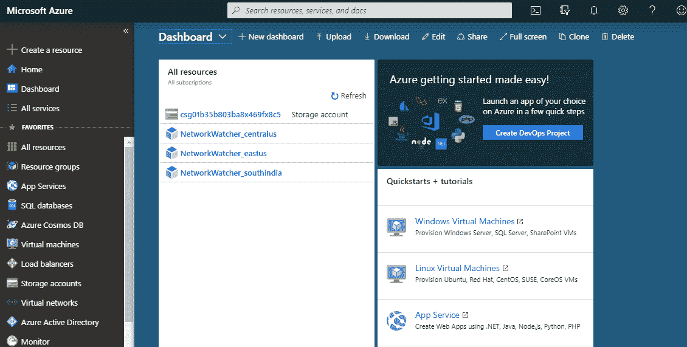
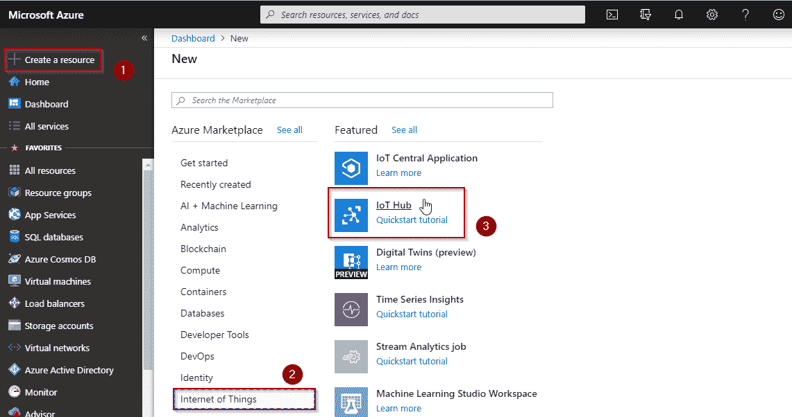

# Azure 物联网:了解如何在 Azure 上创建物联网中心

> 原文：<https://www.edureka.co/blog/azure-iot/>

社会将生物联系在一起，并给它们在一起和联系在一起的感觉。如果我们能把无生命的东西相互连接起来，建立一种有意义的物物交换关系，会怎么样？互联网为你做到了这一点，这个过程被称为[物联网(IoT)](https://www.edureka.co/blog/iot-tutorial/) 。这篇关于 Azure IoT 的文章将帮助你更深入地理解 IoT，并告诉你如何在 Azure 云平台上使用它。

本文将关注以下几点:

*   [IoT 是什么？](#WhatIsIoT?)
*   [什么是 Azure？](#WhatIsAzure?)
*   [蔚蓝物联网](#AzureIoT)
*   [演示:创建 Azure 物联网中心](#Demo:CreatingAnAzureIoTHub)

所以让我们开始吧，

## **IoT 是什么？**

*物联网(IoT)是通过互联网连接的设备网络，可以感知、积累和转移，无需人类的任何干预。*

让我们从这样一个问题开始讨论:是什么让人类感到活着？这是它们感知和相互交流的能力。如果我说我们可以赋予无生命物体这种能力，让它们在没有任何人类干预的情况下感知并相互交流，那会怎么样？那不是很好吗？

嗯，这就是物联网让你做的事情，这在很大程度上形成了同样的基础。

事实上，我们已经从传统的人与人之间的交流发展到现代的社交媒体和互联网，我们看到这些天产生了大量的数据。这意味着人们关注这些数据的时间更少，导致处理和捕获这些数据的准确性更低。如果我们有机器为我们做这件事，并且我们可以专注于跟踪这些数据，会怎么样？这肯定会减少同样的努力和成本。这种方法最终催生了物联网。

那么我们现在知道什么是物联网了吗？让我们进一步了解 Azure 以及 Azure IoT 的意义。

## **什么是 Azure？**

[微软 Azure](https://www.edureka.co/blog/microsoft-azure-tutorial) 是微软的云计算平台。它提供各种云计算服务，这些服务在本质上是高度可扩展和动态的。

那么这些服务有什么特别之处呢？简单来说。与其从零开始构建一个软件，让你管理和配置所有需要的资源，不如把配置资源的工作外包出去，最后以更实惠和优化的价格租用所需的资源，这不是很好吗？

微软 Azure 就是这样工作的，它就像电力消耗，你消耗电力，只为你消耗的电力付费，同时让供应商担心配置和供应。

## **蔚蓝物联网**

现在我们知道什么是物联网，也知道什么是 Azure？摆在面前的问题是为什么要一起使用 Azure IoT，以及是什么使它们成为一个好的组合。Azure 为您提供高效且可扩展的物联网解决方案。它满足了经验丰富的云开发人员或刚刚开始接触物联网的人的需求。Azure 拥有强大的服务和工具来帮助您开发下一代物联网解决方案。

以下是相同的列表:

| ***特征*** | ***要使用的服务*** |
| *为常见物联网场景定制解决方案模板* | *Azure 物联网解决方案加速器* |
| *将智能从云扩展到您的边缘设备* | *Azure 物联网边缘* |
| *连接、监控和控制数十亿物联网资产* | *Azure 物联网中心* |
| *创建物理空间或资产的数字模型* | *蔚蓝数码双胞胎* |
| *实时从时序物联网数据中获得洞察力* | *Azure 时序洞察* |
| *构建和连接高度安全的 MCU 驱动设备* | *天蓝色球体* |
| *To location API 为数据提供地理空间环境* | *蔚蓝地图* |

上面提到的服务触及了几乎所有对使用云平台实施物联网很重要的方面，因此也是 Azure 物联网成为良好健康的物联网选择的主要原因。

## **演示:创建 Azure 物联网中心**

在我们开始之前，首先你可能想了解 Azure 物联网中心，

物联网中心是托管在云中的托管服务，充当物联网应用和其管理的设备之间双向通信的中央消息中心。您可以使用 Azure IoT Hub 来构建物联网解决方案，在数百万个物联网设备和云托管的解决方案后端之间进行可靠和安全的通信。您几乎可以将任何设备连接到物联网中心。

现在，让我们试着创建一个。

第一步:首先，你需要 Azure 免费层帐户。如果没有，请创建一个。

**步骤 2:** 登录后，您将进入如下页面:

**步骤 3:** 点击创建资源，进入物联网，选择物联网中心。

**步骤 4:** 以下窗口将会打开，填写详细信息，您就拥有了一个可以使用的物联网中心

伙计们，这就是了。这就把我们带到了本文的结尾。我希望你喜欢这篇文章。 我们还推出了一套课程，涵盖了通过 Azure 考试所需的所有内容！你可以看一下 [***蔚蓝培训*** **这里**](https://www.edureka.co/microsoft-certified-azure-solution-architect-certification-training) 的课程详情。

此外，如果您希望掌握 Azure 和 DevOps 中的原则，并致力于与商业世界有重大关联的分步任务，行业专业人士开发了 [Azure DevOps 认证](https://www.edureka.co/microsoft-azure-devops-solutions-training) 课程大纲。完成培训课程后，你可以申请全球薪酬最高的跨国公司顶级职位之一。

快乐学习！

*有问题吗？请在这篇 Azure Portal 文章的评论部分提到它，我们将会回复您。*