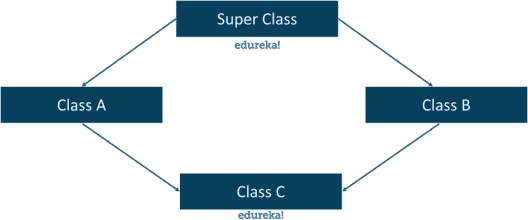
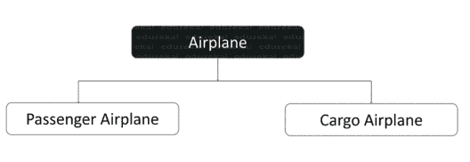
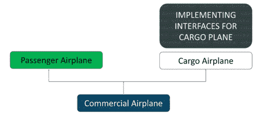
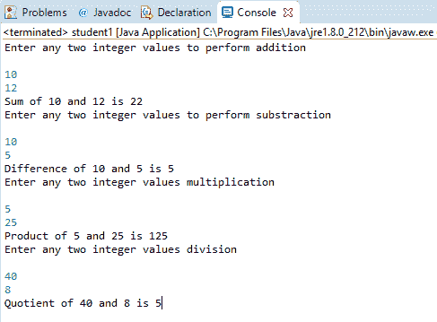

# Java 中的接口是什么，如何实现？

> 原文：<https://www.edureka.co/blog/java-interface/>

[**Java**](https://www.edureka.co/java-j2ee-soa-training?qId=e04df62d8979179230363e5856ccbe99&index_name=prod_courses&objId=44&objPos=1) **接口**是 Java 编程语言中实现抽象的高级层次。Java 接口有助于**降低代码的复杂性**，并简化了**的可读性**。在本文中，我将通过下面的摘要向您解释 Java 接口。

*   [什么是 Java 接口？](#java)
*   为什么我们需要一个界面？
*   [声明 Java 接口:语法](#syntax)
*   [Java 接口示例](#example)
*   [嵌套 Java 接口](#nest)
*   [类和接口的区别](#difference)
*   [优缺点界面](#advantage)
*   [Java 界面上的要点](#key)

## **什么是 Java 接口？**

计算机接口被认为是分隔两个或更多系统的边界。它在系统中的组件之间交换数据，这些组件可以是信号、命令或协议。


Java 抽象通过隐藏写在方法内部的实现逻辑来提供特定方法的功能。类似地，Java 接口也是一个抽象类，它包括方法声明，但不包括它的定义。一个类**实现了一个接口**来继承抽象方法。除了抽象方法，*接口*还可以包括*常量、静态方法、嵌套接口*和*默认方法。*

## ****

类和接口之间的相似性。

接口完全类似于 Java 中的普通类。接口包括抽象方法，这些方法是为实现而设计的。这个过程仅仅等同于继承，这对于类来说是正常的。我们将讨论更多的相似之处。

*   与类一样，一个接口也可以包含任意数量的方法。
*   和类类似，接口也是用一个**写的。java** 扩展文件。
*   令人惊讶的是，接口的字节码会出现在**中。类**文件。
*   一个接口以包的形式显示，它们各自的字节码在一个与包名匹配的目录中。

## 为什么我们需要一个界面？

**Java 不支持** **多重继承，**因此，它不允许类在一个实例中扩展多个类。*子类*不能在一个实例中继承*多个父类*的属性，因为这会导致**菱形问题。**为了克服这个问题，引入了*接口*。让我们通过一个例子来理解这个问题。



假设我们有两架飞机，一架只能载**乘客，**另一架只能载**货物。**现在，我们需要**继承**货机和客机的属性。Java 不会支持这个解决方案，因为它会导致两个平面之间的不确定性。



但是，如果你能让 Java 感觉到它继承了一个平面，而**实现了另一个平面中的**方法，那就有可能了。它就像一架既载客又载货的商用飞机。这个接口就像是制造了一个更大的平面，它可以完成两个任务，而不会干扰彼此的组件，相反，它只是借用了**接口类的方法。**



//A 类代码

```
package multiple;
class A{
     void msg(){System.out.println("Hello");}
}

```

//B 类代码

```
package multiple;
class B{
     void msg(){System.out.println("Welcome");}
}

```

C 类代码

```
package multiple;
class C extends A,B{ // This will not be accepted by Java, It will throw an error and code will not be executed.
public static void main(String args[]){
        C obj=new C();
        obj.msg();
        }
}

```

**输出:**

```
Error. This particular approach throws an exception. Java do not support Multiple inheritances. This error is known as Diamond Problem
```

让我们通过使用一个接口来尝试一个解决方案，*子类*可以在单个实例中访问来自*多个父类*的方法。

//接口代码

```
package MIS;
public interface solution {
public void Hello();
public void Welcome();
}

```

//类别代码

```
package MIS;
public class classA implements solution {
       public void Hello() {
            java.lang.System.out.println("Hello world");
       }
       public void Welcome() {
            java.lang.System.out.println("Welcome to Edureka");
}
public static void main(String[] args) {
       classA Edureka = new classA();
       Edureka.Hello();
       Edureka.Welcome();
       }
}

```

**输出:**

```
Hello World
```

```
Welcome to Edureka
```

## **声明 Java 接口:语法**

```
interface interface_name {
// declare constant fields;
// declare methods();
//&nbsp; default methods;
}

```

让我们看一个 Java 接口的例子

## **Java 接口示例**

让我们创建一个基于 Java 接口的简单计算器。


//接口代码

```
package basicoperations;
public interface maths {
public void add();
public void sub();
public void mul();
public void div();
}

```

//类别代码

```
package basicoperations;
import java.util.Scanner;
public class student1 implements maths {
        @Override
         public void add() {
         Scanner kb = new Scanner(System.in);
         System.out.println("Enter any two integer values to perform addition");
         int a=kb.nextInt();
         int b=kb.nextInt();
         int s=a+b;
         System.out.println("Sum of "+a+" and "+b+" is "+s);
   }
        @Override
         public void sub() {
         Scanner kb = new Scanner(System.in);
         System.out.println("Enter any two integer values to perform substraction");
         int a=kb.nextInt();
         int b=kb.nextInt();
         int s=a-b;
         System.out.println("Difference of "+a+" and "+b+" is "+s);
  }
        @Override
         public void mul() {
         Scanner kb = new Scanner(System.in);
         System.out.println("Enter any two integer values multiplication");
         int a=kb.nextInt();
         int b=kb.nextInt();
         int s=a*b;
         System.out.println("Product of "+a+" and "+b+" is "+s);
  }
        @Override
         public void div() {
         Scanner kb = new Scanner(System.in);
         System.out.println("Enter any two integer values division");
         int a=kb.nextInt();
         int b=kb.nextInt();
         int s=a/b;
         System.out.println("Quotient of "+a+" and "+b+" is "+s);
  }
public static void main(String[] args) {
   student1 Edureka1 = new student1();
   Edureka1.add();
   Edureka1.sub();
   Edureka1.mul();
   Edureka1.div();
   }
}

```

**输出:**

## ****

进一步，我们将学习嵌套 Java 接口。

## **嵌套 Java 接口**

**接口嵌套**是在另一个*现有接口*内部声明一个接口或者在一个*类内部声明一个接口的过程。*嵌套接口也称为*内部接口。*

嵌套接口不能直接访问。因此，实现嵌套是为了通过将名称空间与其相关的*接口*和*类分组来解析名称空间。*通过这个过程，我们可以通过**外部类**或**外部接口**名称后跟一个**点(。)**和**接口名称。**

让我们尝试一些基于**接口嵌套的例子。**首先，让我们尝试将一个 *Java 接口*嵌套在另一个 *Java 接口*中，如下所示:

//接口代码

```
package Nest;
public interface OuterInterface {
     void display();
     interface InnerInterface{
           void InnerMethod();
       }
}

```

//类别代码

```
package Nest;
class NestedInterfaceDemo
implements OuterInterface.InnerInterface{
public void InnerMethod(){
   int n = 10, t1 = 0, t2 = 1;
   System.out.print("First " + n + " terms: ");
         for (int i = 1; i &lt;= n; ++i)
        {
             System.out.print(t1 + " + ");
             int sum = t1 + t2;
             t1 = t2;
             t2 = sum;
        }
        System.out.println("nPrinting from Nested InnerInterface method...!n");
    }
public static void main(String args[]){
       OuterInterface.InnerInterface obj=new NestedInterfaceDemo();
       obj.InnerMethod();
    }
}

```

**输出:**

```
First 10 terms: 0 + 1 + 1 + 2 + 3 + 5 + 8 + 13 + 21 + 34 +
Printing from Nested InnerInterface method...!
```

现在，让我们尝试将一个 *Java 接口*嵌套在一个 **Java 类中。**

//接口代码

```
package Nest2;
public class EdurekaClass {
       interface EdurekaInterface{
              void NestedMethod();
        }
}

```

//类别代码

```
package Nest2;
class NestedInterfaceDemo2 implements EdurekaClass.EdurekaInterface{
public void NestedMethod(){
            String input = "Edureka";
            byte [] strAsByteArray = input.getBytes();
            byte [] result = new byte [strAsByteArray.length];
            for (int i = 0; i&lt;strAsByteArray.length; i++)
                    result[i] = strAsByteArray[strAsByteArray.length-i-1];
                    System.out.println(new String(result));
            }
public static void main(String args[]){
          EdurekaClass.EdurekaInterface obj = new NestedInterfaceDemo2();
          obj.NestedMethod();
     }
}

```

**输出:**

```
akerudE
```

虽然一个接口看起来几乎和一个类相似，但是它们之间还是有一些不同，让我们来讨论一下它们的不同之处。

## **Java 类和 Java 接口的区别**

| **界面** | **类** |
| **支持多重继承** | **不支持多重继承** |
| **没有数据成员** | **包括数据成员** |
| **没有构造函数** | **包括构造函数** |
| **包括不完整成员(签名成员)** | **包括完整(抽象)和不完整成员** |
| **没有访问修饰符** | **包括访问修饰符** |
| **接口没有静态成员** | 这个类的所有成员都是静态的 |

## **Java 接口的优缺点**

**优点:**

*   Java 接口支持**多重继承。**
*   Java 接口使程序员能够打破复杂的编程方法，简化对象之间的依赖关系。
*   Java 接口使得应用程序中的**数据成员**和**方法**松散耦合。

**缺点:**

*   Java 接口的使用降低了应用程序的执行速度。
*   应用程序中的 Java 接口要么被大量重复使用，要么很少使用。

## **Java 界面上的关键点**

*   接口中声明的方法都没有一个提供完整抽象的主体。
*   不可能创建接口的对象。因此，接口的实例化是不可能的。
*   类可以通过使用关键字 implements 来实现接口。让我们通过一个例子来看这一点。

//接口代码

```
package extInterface;
public interface extInterface {
        public void method1();
        public void method2();
}

```

//类别代码

```
package extInterface;
import java.util.Scanner;
class Edureka implements extInterface{
    public void method1(){
         System.out.println("implementation of method1");
         Scanner scanner = new Scanner(System.in);
         System.out.println("Enter number to find square root in Java : ");
         double square = scanner.nextDouble();
         double squareRoot = Math.sqrt(square);
         System.out.printf("Square root of number: %f is : %f %n" , square, squareRoot);
    }
    public void method2(){
               System.out.println("implementation of method2");
        }
public static void main(String arg[]){
               extInterface obj = new Edureka();
               obj.method1();
       }
}

```

**输出:**

```
implementation of method1
Enter number to find square root in Java :
16
Square root of number: 16.0 is : 4.0
```

*   一个类可以在一个实例中实现多个继承。让我们通过下面的代码来了解一下。

//接口 1 代码

```
package ExtendInt;
public interface Interface1 {
       public void armstrong();
}

```

//接口 2 代码

```
package ExtendInt;
public interface Interface2 {
           public void prime();
}
//Class Code
package ExtendInt;
public class Edureka2 implements Interface1,Interface2{
          public void armstrong(){
                 int c=0,a,temp;
                 int n=153;// input 
                 temp=n;
                 while(n&gt;0){
                        a=n%10;
                        n=n/10;
                        c=c+(a*a*a);
                 }
                  if(temp==c)
                          System.out.println("armstrong number");
                  else
                          System.out.println("Not armstrong number");
                          System.out.println("Extending to Interface 1");
          }
          public void prime(){
          int i,m=0,flag=0;
          int n=3;// input 
          m=n/2;
          if(n==0||n==1){
                  System.out.println(n+" is not prime number");
          }
          else{
                  for(i=2;i&lt;=m;i++){
                        if(n%i==0){
                                System.out.println(n+" is not prime number");
                                flag=1;
                                break;
                        }
                  }
                  if(flag==0) { 
                  System.out.println(n+" is prime number"); 
                  }
          }
          System.out.println("Extending to Interface 2");
          }
public static void main(String args[]){
               Interface2 obj = new Edureka2();
               obj.prime();
               Interface1 obj1 = new Edureka2();
               obj1.armstrong();
         }
}

```

**输出:**

```
3 is prime number
Extending to Interface 2
armstrong number
Extending to Interface 1
```

*   Java 接口要求声明的变量在声明时初始化。
*   默认情况下，接口的访问修饰符设置为 public static 和 final。让我们通过一个例子来理解这一点

//接口代码

```
package test;
public interface Try {
       //public int a=10;
       //public static final int a=10;
       //static int a=0;
       //final int a=10;
       //int a=10;
}

```

*   上述所有声明在一个接口中都是真实有效的。
*   Java 接口能够扩展任意数量的接口，但是永远不能实现一个。
*   一个 Java 类可以实现任意数量的接口。
*   Java 类不能实现具有相同方法名和不同返回类型的接口。
*   如果有两个或更多方法具有相同的方法名，并且存在于多个接口中，那么实现一次该方法就足够了。让我们用一个实际的例子来理解这一点。

//接口代码

```
package same;
public interface A {
        public void display();
}
//Interface Code
package same;
public interface B {
        public void display();
}
//Class Code
package same;
class same implements A,B {
           public void display() {
                   System.out.println("displaying data");
           }
     public static void main(String[] args) {
           same print = new same();
           print.display();
     }
}

```

**输出:**

```
Welcome to Edureka E-Learning
```

到此，我们来结束这篇文章。我希望你已经理解了接口的重要性，语法，功能，接口嵌套，Java 接口的要点以及使用它们执行的操作。

*既然您已经了解了 Java 的基础知识，请查看 Edureka 提供的  [**Java 培训**](https://www.edureka.co/java-j2ee-training-course)* *，edu reka 是一家值得信赖的在线学习公司，拥有遍布全球的 250，000 多名满意的学习者。Edureka 的 Java J2EE 和 SOA 培训和认证课程是为想成为 Java 开发人员的学生和专业人士设计的。该课程旨在为您提供 Java 编程的良好开端，并训练您掌握核心和高级 Java 概念以及各种 Java 框架，如 Hibernate & [Spring](https://spring.io/projects/spring-framework) 。*

有问题要问我们吗？在这个“Java 接口”博客的评论部分提到它，我们会尽快回复您。