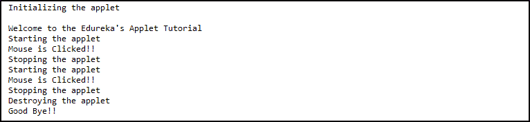

# Java 小程序教程-知道如何用 Java 创建小程序

> 原文：<https://www.edureka.co/blog/java-applet-tutorial/>

大多数开发人员以 [**Java**](https://www.edureka.co/java-j2ee-soa-training) 作为他们的基础语言开始他们的职业生涯。这是因为 Java 提供了各种有趣的特性，比如 servlets、框架等等。这有助于在编程概念上建立一个据点。一个这样的特性是 Java 中的小程序。Java Applet 是一个可以通过 HTTP 传输的小软件程序。在这个 Java Applet 教程中，我将通过例子给你一个完整的 Java Applet 洞察。

以下是我将在本 Java Applet 教程中涉及的主题:

*   [Java 小程序](#applets)
*   [Java 应用程序 vs Java 小程序](#appvsapplets)
*   [Java 中的小程序层级](#hierarchy)
*   [Java 小程序](#appletprogram)
*   [在 Java 中执行小程序](#executing)
*   [小程序生命周期](#lifecycle)
*   [Java 小程序演示](#demo)

## **Java 小程序**

Java 中的小应用程序是基于互联网的小型动态程序。Java Applet 只能在 Java 的 Applet 框架内执行。为了便于执行 applet，applet 框架提供了一个受限的“沙箱”。通常，applet 代码嵌入在一个 [HTML](https://www.edureka.co/blog/what-is-html/) 页面中。当 HTML 页面被加载到兼容 Java 的 web 浏览器中时，applet 代码被执行。小程序主要下载在远程机器上，在客户端使用。

Java 小应用程序也可以是全功能的 Java 应用程序，因为它可以自行利用完整的 Java API。但是，在 Java 中，applet 和应用程序之间还是有一线之隔的。

在这篇关于 Java 小程序的文章的下一部分，我将列出 Java 小程序和 Java 应用程序之间的区别。

## **Java 小程序 vs Java 应用程序**

| **Java 应用程序** | **Java 小程序** |
| Java 应用程序是可以独立执行的独立程序 | Java 小程序是设计成存在于 HTML web 文档中的小 Java 程序 |
| Java 应用程序必须有 main()方法才能执行 | Java 小程序不需要 main()来执行 |
| Java 应用只需要 JRE | Java 小程序不能独立运行，需要 API |
| 除非需要，否则 Java 应用程序不需要扩展任何类 | Java 小程序必须扩展 java.applet.Applet 类 |
| Java 应用程序可以从本地系统执行代码 | Java 小程序应用程序不能这样做 |
| Java 应用程序可以访问您系统中的所有可用资源 | Java Applets 只能访问特定于浏览器的服务 |

现在你知道了 Java applet 和 Java 应用程序的区别，让我在 Java applet 教程的下一部分向你展示如何用 Java 创建一个基本的 applet。

## **Java 中的小程序层级**

*   类 java.lang. **对象**
    *   类 java.awt. **组件**
        *   java.awt. **类容器**
            *   类 java.awt. **面板**
                *   类 java.applet. **Applet**

如上所示，Java Applet 类是 Applet 包的一个类，它扩展了 awt 包的 Panel 类。Panel 类是同一个包的 Container 类的子类。容器类是属于同一个包的组件类的扩展。组件类是一个[抽象类](https://www.edureka.co/blog/java-abstraction/#AbstractClass),并派生出几个对组件有用的类，如复选框、列表、按钮等。

既然您已经了解了 Java Applet 类的完整层次结构，现在让我们尝试创建一个简单的 Java Applet 。

## **Java Applet 程序**

下面我写了一个简单的 Java applet 程序，它将简单地显示欢迎消息。

**EduApplet.java**

```
import java.applet.Applet;
import java.awt.Graphics;

//Extending the Applet class
public class EduApplet extends Applet{
public void paint(Graphics g){
g.drawString("Welcome To Edureka's Applet Tutorial",150,150);
}
}
```

到目前为止，你已经熟悉了小程序，并且知道如何创建它们。在 Java Applet 教程的下一部分，我将展示如何用 Java 执行 Applet。

## **在 Java 中执行小程序**

到目前为止，我已经演示了如何创建 applet，但是如何执行它们呢？与 Java 程序不同，执行小程序是一个有点不同的过程。由于小程序是基于网络的应用程序，它们需要一个特殊的环境来执行。Java 提供了两种执行 applet 的标准方式:

1.  ### **Use a Java-enabled web browser**

如果您试图以这种方式执行您的 Applet，首先您需要编译您的 Java Applet 文件。完成后，您必须创建一个单独的 HTML 文件，并在其中添加 applet 代码，引用您的。类文件。现在，您可以单击 HTML 文件在浏览器中启动小程序。下面我给出了创建 HTML 文件所需的代码:

**appletDemo.html**

```
<html>
<body>
<applet code="EduApplet.class" width="300" height="300">
</applet>
</body>
</html>
```

2.  ### **Use the Apple browser**

为了以这种方式执行一个 Java Applet，你需要做的是，不用为 HTML 代码创建一个单独的文件，你可以直接在你的 Java 源代码文件的开头添加注释，表明 Applet 标签的存在。这有助于用必要的 HTML 语句的原型来记录你的 Java 代码。这已经完成了，现在你只需要启动 Java applet Viewer 就可以执行你的 Applet 了，Java Applet Viewer 是 JRE 默认自带的。当使用这种执行方式时，您的源代码应该如下所示:

**EduApplet.java**

```
import java.applet.Applet; 
import java.awt.Graphics;

/* 
<applet code="EduApplet" width=200 height=60>
</applet>
*/

public class EduApplet extends Applet{
public void paint(Graphics g){
g.drawString("Welcome To Edureka's Applet Tutorial",150,150);
} 
}
```

注意:你也可以安装任何 IDE，比如 Eclipse，直接从那里执行你的代码。

现在你已经知道了什么是 Java Applet 以及它是如何执行的，让我们更深入地学习 Java Applet 教程，并在本 Java Applet 教程的下一节中熟悉 Java Applet 的生命周期。

## **小程序生命周期**

每个 Java 小程序都需要经历从初始化到销毁的一系列阶段，才能完成它的执行。为此，第一步是继承 java.applet.Applet 类。这个类通过各种方法帮助 Java 小程序建立一个基本框架。下图描述了 Java Applet 生命周期中涉及的各种方法。

如你所见，有 4 个主要方法是任何 Java 小程序必须覆盖的。让我逐一向您介绍这些方法。

1.  **public void init()****:**这是 applet 生命周期中调用的第一个方法。在这个方法中，将在 applet 中进一步使用的变量被初始化。这里必须注意的一点是，这个方法在每个 applet 生命周期中只能调用一次。
2.  **public void start()****:**这是紧接着浏览器调用 init()方法之后调用的第二个方法。每当用户重新访问包含 applet 的网页时，start()方法被调用，applet 被启动。
3.  **public void stop():** 每当用户离开包含 applet 的网页时，就会调用这个方法。换句话说，stop()方法用于挂起当 applet 在后台或在屏幕上不可见时不需要的线程。使用 start()方法可以很容易地恢复这些。
4.  **public void****destroy():**最后，我们调用 destroy()方法，以便从内存中完全删除一个 applet。该方法在每个 applet 生命周期中只调用一次，并且在调用该方法之前，必须释放所有占用的资源。

与上述四种方法一起使用的另一种方法是 paint()。

*   **public void paint(Graphics g):**无论什么原因，只要需要在浏览器中重画或重画 applet，就会调用这个方法。paint()方法将一个 Graphic 对象作为参数，该对象包含 applet 在其中执行的图形上下文。此外，每次期望 applet 输出时，都会调用该方法。

下面是一个 Java 小程序的基本框架，包括所有的生命周期方法。

**AppletLifeCycle.java**

```

import java.applet.*;

public class AppletLifeCycle extends Applet{
public void init(){
System.out.println("Applet is Initialized");
}
public void start(){
System.out.println("Applet is being Executed");
}
public void stop()
{
System.out.println("Applet execution has Stopped");
}
public void paint(Graphics g)
{
System.out.println("Painting the Applet...");
}
public void destroy()
{
System.out.println("Applet has been Destroyed");
}
}

```

现在让我们把我们在本教程中学到的东西放在一起，试着创建一个能够响应用户动作的小程序。

## **J** **ava 小程序演示**

下面我包含了一个小而简单的 Java Applet 程序，你将看到在 Applet 的生命周期中事件处理是如何工作的。

**AppletEventHandling.java**

```

import java.awt.event.MouseListener;
import java.awt.event.MouseEvent;
import java.applet.Applet;
import java.awt.Graphics;
import java.awt.Color;
import java.awt.Font;

public class AppletEventHandling extends Applet implements MouseListener {
StringBuffer strBuf;

public void init() {
addMouseListener(this);
strBuf = new StringBuffer();
addItem(" Initializing the applet");
addItem(" Welcome to the Edureka's Applet Tutorial");
}

public void start() {
addItem(" Starting the applet ");

}

public void stop() {
addItem(" Stopping the applet ");

}

public void destroy() {
addItem(" Destroying the applet");
addItem(" Good Bye!!");

}

void addItem(String word) {
System.out.println(word);
strBuf.append(word);
repaint();
}

public void paint(Graphics g) {

g.drawString(strBuf.toString(), 10, 20);

setForeground(Color.white);
setBackground(Color.black);

}

public void mouseEntered(MouseEvent event) {
}
public void mouseExited(MouseEvent event) {
}
public void mousePressed(MouseEvent event) {
}
public void mouseReleased(MouseEvent event) {
}
public void mouseClicked(MouseEvent event) {
addItem(" Mouse is Clicked!!");
}
}

```

下一步是编译上面的代码。java 文件转换成。类文件。完成后，现在您需要创建一个 HTML 文件并添加。applet 标记中的类文件。下面我演示了如何为这个 HTML 文件编写代码。**eventHandling.html**

```
<html>
   <title>Event Handling</title>
   <applet code = "AppletEventHandling.class" 
      width = "300" height = "300">
   </applet>
</html>
```

当您执行这段代码时，您的 applet 应该看起来像下面的屏幕截图。现在，要检查你的小程序是否运行良好，你可以在你的终端上检查。在那里你可以看到，你的每一个动作所经历的所有阶段。下面我附上了同样的截图。 到此，我们结束这篇关于 Java Applet 的教程。我希望现在你已经清楚什么是 Java Applet，为什么我们需要它们，以及它们是如何创建的。如果你想更详细地学习 Java，你也可以参考我们的 **[其他 Java 文章](https://www.edureka.co/blog/what-is-java/)** 。

*现在您已经了解了 Java Applet 的基础知识，请查看 Edureka 提供的  [**Java 认证课程**](https://www.edureka.co/java-j2ee-training-course)* *，edu reka 是一家值得信赖的在线学习公司，拥有遍布全球的 250，000 多名满意的学习者。Edureka 的 Java J2EE 和 SOA 培训和认证课程是为想成为 Java 开发人员的学生和专业人士设计的。该课程旨在为您提供 Java 编程的良好开端，并训练您掌握核心和高级 Java 概念以及各种 Java 框架，如 Hibernate & Spring。*

有问题要问我们吗？请在这篇“Java Applet 教程”的评论部分提到它，我们会尽快回复您。