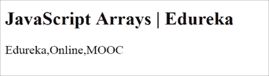
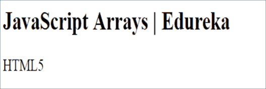
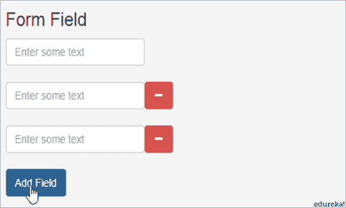
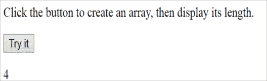
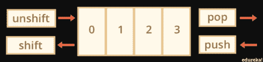

# Unshift JavaScript:知道如何在数组中使用 Unshift()方法

> 原文：<https://www.edureka.co/blog/unshift-javascript-array-method/>

JavaScript (JS)最初是由 Netspace 开发的，目的是满足网站动态元素的需求。它是 [web 开发](https://www.edureka.co/masters-program/full-stack-developer-training)最关键的技术之一。这篇关于 Unshift JavaScript 的文章将提供关于 Unshift()方法的细节，以及如何在 [JavaScript](https://www.edureka.co/blog/javascript-tutorial/) 数组中按以下顺序使用它:

*   [JavaScript 数组](#javascriptarrays)
*   [数组操作的方法](#arraymanipulation)
*   [卸载 JavaScript](#unshiftjavascript)

## ****JavaScript 数组****

使用数组的目的是在声明变量的单个实体中存储多个值。当我们想用单个变量有序地访问元素时，就要用到数组。它包含不同类型的元素。人们可以在一个数组中存储字符串、布尔值和数字。

有两种不同的语法用于声明空数组:

```

let arr = new Array();

let arr = [];

```

一般使用第二种语法，也可以传递值。代码是这样写的:

```

<!DOCTYPE html>
<html>
<body>

<h2>JavaScript Arrays | Edureka</h2>

<p id= "edu"></p>
<script>
var learn = ["Edureka", "Online", "MOOC"];
document.getElementById("edu").innerHTML = learn;
</script>
</body>
</html>

```

**输出:**



数组元素的索引值从 0 开始。在深入研究之前，我们还需要了解数组对象的各种属性，比如构造函数、索引、长度、输入和原型。

*   ****构造函数:**** 返回 JavaScript 实例原型创建的备注。

**语法** :

```

array.constructor

```

**代号:**

```

<html>
<head>
<title>JavaScript Array constructor | Edureka</title>
</head>
<body>
<script type = "text/javascript">
 var edu = new Array( 10, 20, 30 );
document.write("edu.constructor is:" + edu.constructor); 
 </script>
</body>
</html>

```

*   ****输出:**** edu.constructor 为:函数数组(){[原生代码] }

### ****指数** :**

表示元素在数组中的位置，从 0 开始。

**代码:**

```

<!DOCTYPE html>
<html>
<body>

<h2>JavaScript Arrays | Edureka</h2>
<h2>JavaScript Arrays | Edureka</h2>

<p id="edu"></p>

<script>

var technologies = ["HTML5", "CSS3", "JavaScript"];

document.getElementById("edu").innerHTML = technologies[0];

</script>
 </body>
</html>

```

**输出:**

********

*   ****输入** :** 使用正则匹配表达式创建数组时使用该属性。

****

*   **Length:** 返回一个 32 位整数，告诉我们一个数组中元素的个数。

**语法:**

```

array.length

```

**代码:**

```

<html>
<head>
<title>JavaScript Array length | Edureka</title>
</head>
<body>
<script type = "text/javascript">
var edu = new Array( 10, 20, 30 );
document.write("edu.length is : " + edu.length); 
</script>
</body>
<pre></html>

```

**输出:** edu.length 为:3

同样，长度属性可以通过调用 id: 来显示

```

<button onclick="edurekaFunction()">Try it</button>
<script>
function edurekaFunction() {
var techniques = ["push", "pop", "splice", "unshift"];
document.getElementById("edu").innerHTML = techniques.length;
}
</script>

```

**输出:**

********

*   ****Prototype:****Prototype 属性允许我们给任何对象添加方法和属性(数字、布尔、字符串、日期等)。它是一项全球性的财产。

**语法** :

```

object.prototype.name = value

```

**代号** :

```

<html>
<head>
<title>Edureka Objects</title>
<script type = "text/javascript">
function Online(course, platform) {
this.course = course;
this.platform = platform;
}
</script>
</head>
<body>
<script type = "text/javascript">
var myOnline = new Online("R programming", "Edureka");
Online.prototype.price = null;
myOnline.price = 2400;
document.write("Online course is : " + myOnline.course + "<br>");
document.write("Online platform is : " + myOnline.platform + "<br>");
document.write("Online price is : " + myOnline.price + "<br>");
</script>
</body>
</html>

```

**输出**T2:T4

线上课程是:R 编程

线上平台是:Edureka

网上价格为:2400

### **数组操作的方法**

探索数组总是很有趣。现在有很多数组操作的方法，下面提到一些:

| **Sl。否** | **方法&描述** |
| 1. | **concat()–**该方法用于将两个或多个数组值连接在一起 |
| 2. | **every()**–用于验证测试功能。 |
| 3. | **反转()–**位置反转并按一定顺序变化 |
| 4. | **shift()–**从数组中删除开始元素并返回该特定元素。【T2 |
| 5. | **un shift()–**该方法在数组的开头添加一个新元素，并对之前的元素进行 un shift |
| 6. | **push()–**将一个或多个元素添加到数组的末尾，并返回数组的新长度。【T2 |
| 7. | **pop()–**从数组中移除最后一个元素并返回该元素。【T2 |

推送、弹出、移位和非移位之间的区别可以这样来理解:



这张图帮助我们清楚地了解到，每当我们需要在一个数组的开头执行添加和删除操作时，unshift()和 shift()都可以达到这个目的。当我们使用 unshift()时，元素向右移动，当我们使用 shift()时，元素向左移动。

另一方面，当我们需要在数组的尾部执行添加和删除操作时，pop()和 push()可以帮助我们完成。在 push()和 pop()操作的情况下，没有元素被移位，只有添加和移除增加或减少整个数组的索引值的数量。

这就给我们带来了一个好奇的基本问题，为什么我们需要“卸载 JavaScript”？首先，重要的是要知道这意味着什么，我们可以用这个方法做什么。

## ****卸载 JavaScript****

**Unshift()方法**获取值，将它们添加到数组的开头，并返回数组新的修改长度。

因为这是客户端的事情，所以浏览器在这些方法的功能中扮演着重要的角色。在 Internet Explorer 8 和更早版本的情况下，将插入值，但返回值仍未定义。

**语法** :

```

<!DOCTYPE html>
<html>
<body>
Click on the button
<button onclick="edurekaFunction()">Button</button> <!--Defining Onclick Button Function-->
<!--id for reference-->
<script>
var technologies = ["HTML5", "CSS3", "JS", "C++"]; //Declaring the array
document.getElementById("edu").innerHTML = technologies;
function edurekaFunction() {
technologies.unshift("R", "C#"); //using unshift
document.getElementById("edu").innerHTML = technologies; //returning the new modified array
}
</script>
</body>
</html>

```

每当使用“ **unshift()** ”方法进行加法运算时，原始数组元素的索引就会增加 1 倍。

说到这里，我们的文章就到此为止了。我希望你明白 unshift JavaScript 方法在数组中是有效的。

*既然你已经了解了 JavaScript 中的事件冒泡和事件捕获，那就来看看 Edureka 的 **[Web 开发认证培训](https://www.edureka.co/complete-web-developer)** 。* *Web 开发认证培训将帮助您学习如何使用 HTML5、CSS3、Twitter Bootstrap 3、jQuery 和 Google APIs 创建令人印象深刻的网站，并将其部署到亚马逊简单存储服务(S3)。*

*有问题吗？请在“卸载 JavaScript”的评论部分提到它，我们会给你回复。*