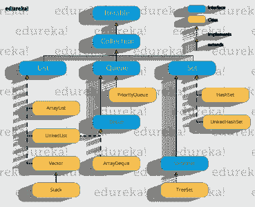

# Java 中的 LinkedHashSet 是什么？用例子理解

> 原文：<https://www.edureka.co/blog/linkedhashset-in-java/>

一个[集合](https://www.edureka.co/blog/java-collections/#sets)是一个不允许任何重复元素的集合。set 接口最常用的实现是 HashSet、TreeSet 和 LinkedHashSet。在本文中，我们将探索其中的一个实现:在 [Java 中的 LinkedHashSet。](https://www.edureka.co/java-j2ee-soa-training)

下面列出了本文讨论的主题:

*   [What is LinkedHashSet?](#linkedhashset)
*   [验证插入顺序](#insertionorder)
*   [检查冗余度](#redundancy)
*   [Java LinkedHashSet Examples](#examples)
    *   [计算大小并在 LinkedHashSet 中搜索元素](#searchingelement)
    *   [从 LinkedHashSet 中删除元素](#removingelement)

## **什么是 LinkedHashSet？**

**LinkedHashSet** 是 Java 中的一个[集合接口](https://www.edureka.co/blog/java-collections/#interface)框架。基本上就是超类 ***HashSet*** 的子类或者派生类。它与 HashSet 在以下方面不同:

1.  在创建 LinkedHashSet 的过程中，元素的*插入顺序被保留。*
2.  一个*底层数据结构*是哈希表(在 HashSet 中)&链表的混合体。
3.  LinkedHashSet 中不允许有*重复*。

当我们通过一个迭代代理遍历一个 LinkedHashSet 时，元素将按照插入的顺序返回。 下面提供的流程图解释了接口 *Set* 在 [Java](https://www.edureka.co/blog/java-tutorial/) 中实现类 *LinkedHashSet*



在本文的开始，我们讨论了 LinkedHashSet 与 HashSet 的不同之处。让我们看一些[示例程序](https://www.edureka.co/blog/java-programs/)来了解 LinkedHashSet 有什么不同。

## **插入顺序**

下面是 LinkedHashSet 的一个示例程序，演示插入顺序是否被保留。

```
import java.util.*;
public class Method1 {
   public static void main(String args[]) {
       LinkedHashSet hs=new LinkedHashSet(); 
       // Adding elements to the LinkedHashSet
       hs.add("E");
       hs.add("d");
       hs.add("u");
       hs.add("r");
       hs.add("e");
       hs.add("k");
       hs.add("a");
       // Displaying the updated LinkedHashSet
       System.out.println("Updated LinkedHashSet: "+ hs);
   }
}
```

**输出**

```
Updated LinkedHashSet: [E, d, u, r, e, k, a]
```

输出清楚地表明，与 HashSet 类相反，插入顺序保留在 LinkedHashSet 中。

**冗余度**

LinkedHashSet 中不允许出现重复元素。让我们看一个例子来检验这是真是假。

```
import java.util.*;
public class Method1 {
   public static void main(String args[]) {
       LinkedHashSet hs=new LinkedHashSet(); 
       // Adding elements to the LinkedHashSet
       hs.add("E");
       hs.add("E");//addition of duplicate elements
       hs.add("d");
       hs.add("u");
       hs.add("r");
       hs.add("e");
       hs.add("k");
       hs.add("a");
       hs.add("a");//addition of duplicate elements
       // Displaying the LinkedHashSet 
       System.out.println("LinkedHashSet Contains : "+ hs); }
}

```

**输出**

```
LinkedHashSet Contains : [E, d, u, r, e, k, a]

```

所以记住不允许重复，插入顺序保持不变 LinkedHashSet 广泛用于构建基于缓存的应用程序。好了，让我们进入这篇“Java 中的 LinkedHashList”文章的下一个主题。

## **Java LinkedHashSet Examples**

下面是一些示例程序，展示了 LinkedHashSet 在 [Java 中的用法。](https://www.edureka.co/blog/what-is-java/)

### **计算大小并在 LinkedHashSet 中搜索元素**

```
import java.util.*;
public class Example1 {
   public static void main(String args[]) {
       LinkedHashSet hs=new LinkedHashSet(); 
       // Adding elements to the LinkedHashSet
       hs.add("E");
       hs.add("d");
       hs.add("u");
       hs.add("r");
       hs.add("e");
       hs.add("k");
       hs.add("a");
       // Getting the size of the LinkedHashSet
       System.out.println("The size of the LinkedHashSet is  "+ hs.size());
       // Checking whether the LinkedHashSet  contains an element or not
       System.out.println("Is B Present in the LinkedHashSet?:  "+ hs.contains("B")); 
       // Checking whether the LinkedHashSet  contains an element or not
       System.out.println("Is E Present in the LinkedHashSet?:  "+ hs.contains("E"));
} }
```

**输出** 输出

```
The size of the LinkedHashSet is 7
Is B Present in the LinkedHashSet?: false
Is E Present in the LinkedHashSet?: true
```

如果元素出现在 HashSet 中，程序返回*真*，如果没有找到元素，程序返回*假*。

### **从 LinkedHashSet 中删除元素**

```
import java.util.*;
public class Example2 {
   public static void main(String args[]) {
       LinkedHashSet hs=new LinkedHashSet(); 
       // Adding elements to the LinkedHashSet
       hs.add("E");
       hs.add("d");
       hs.add("u");
       hs.add("r");
       hs.add("e");
       hs.add("k");
       hs.add("a");
       System.out.println("Original LinkedHashSet: " + hs);
       // Removing element e from the LinkedHashSet
       System.out.println("Removal Status: "+hs.remove("e"));
       // Displaying the updated LinkedHashSet
       System.out.println("Updated LinkedHashSet: "+ hs); } }

```

**输出**

```
Original LinkedHashSet: [E, d, u, r, e, k, a]
Removal Status: true
Updated LinkedHashSet: [E, d, u, r, k, a]
```

如您所见，顺序保持不变，元素成功地从集合中删除。

这篇“Java 中的 LinkedHashSet”文章到此结束。我希望我们在这里讨论的 *Java LinkedHashSet 类*示例能够帮助你开始使用 [Java 进行 LinkedHashSet 编程。](https://www.edureka.co/blog/java-tutorial/)

***确保你尽可能多的练习，恢复你的经验。***

*查看 Edureka 的 **[Java 培训](https://www.edureka.co/java-j2ee-soa-training)** ，edu reka 是一家值得信赖的在线学习公司，在全球拥有超过 250，000 名满意的学习者。我们在这里帮助你的旅程中的每一步，为了成为一个除了这个 java 面试问题，我们提出了一个课程，这是为学生和专业人士谁想要成为一个 Java 开发人员设计的。*

*有问题吗？请在这篇“Java 中的 LinkedHashSet”**文章的评论部分提到它，我们会尽快回复您。*