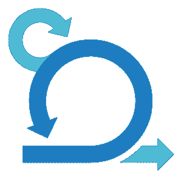
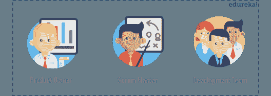
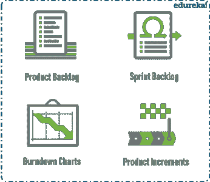

# Scrum 是什么？关于项目管理你需要知道的一切

> 原文：<https://www.edureka.co/blog/what-is-scrum/>

开发一个新产品或新功能并不是一件容易的事情，在竞争激烈的市场中取得成功更是一个挑战。敏捷的 Scrum 方法有助于实现这一点。

好的产品通过满足客户需求来吸引目标受众。为他/她的公司做到这一点的人是一个 [***认证的 Scrum Master***](https://www.edureka.co/certified-scum-master-certification-training) ，他/她会因此获得丰厚的奖励。

在这篇文章中，我们将探讨“什么是 Scrum？”。

*   什么是 Scrum？
*   Scrum 的历史
*   [scrum 的人和部分](#ScrumTopics)
    *   [Scrum 团队](#ScrumTeam)
    *   [Scrum 事件](#ScrumEvents)
    *   [Scrum 神器](#ScrumArtifacts)
*   Scrum 方法论是如何工作的？

## 什么是 Scrum？

scrum 指南将 Scrum 定义为:

“一个框架，在这个框架中，人们可以解决复杂的适应性问题，同时富有成效和创造性地交付尽可能高价值的产品。”

简单来说，scrum 是一个轻量级的敏捷项目管理框架，可以用来管理所有类型的迭代和增量项目。这里的概念是将大型复杂项目分解成较小的阶段，并在此过程中进行审查和调整。使用 scrum，您可以:

*   写更少的计划，在我们称之为*冲刺*的短迭代或周期中做更多的事情
*   作为一个专注的团队工作，而不是在单独的小组中工作
*   在每个冲刺阶段的末尾，不断地交付功能性产品
*   从您的客户那里获得持续的反馈，并临时制作您的产品

因此，在这个快速变化的世界中，scrum 是一种灵活的工作方式。但是这仍然留下了很多关于 Scrum 框架的问题。想请教专家的问题，绝对可以去看看 Edureka 的 [CSM 培训](https://www.edureka.co/certified-scrum-master-certification-training)。第一步是深入探究 Scrum 的起源和历史。

什么是 Scrum？20 分钟内的 Scrum | Scrum Master Training | edu reka

[//www.youtube.com/embed/DbCvs-60ytM](//www.youtube.com/embed/DbCvs-60ytM)**History of Scrum**

“scrum”一词是由两位教授竹内广孝和野中郁次郎于 1986 年在《哈佛商业评论》的文章中首次提出的。在那里，他们将其描述为一种“橄榄球”式的产品开发方法，一个团队向前移动，同时来回传球。

软件开发人员 Ken Schwaber 和 Jeff Sutherland 各自提出了他们自己版本的 Scrum，并于 1995 年在德克萨斯州奥斯汀的一次会议上展示。2010 年，第一份官方 scrum 指南出版了。

让我们进入下一部分“什么是 Scrum？”文章，并了解与 Scrum 框架相关的人和部分。

## **人&Scrum 框架的组成部分**

Scrum 框架由三个不同的类别组成，它们是:

*   [Scrum 角色](#roles)
*   [Scrum 中的事件](#events)
*   [Scrum 工件](#artifacts)

让我们逐一检查一下。

### **Scrum 角色**

Scrum 中定义了三个不同的角色:

*   产品负责人负责团队应该完成的工作。产品负责人的主要作用是 ***激励团队实现目标*** 和项目的愿景。虽然项目负责人可以听取其他人的意见，但当涉及到*做出重大决策*时，他/她最终要负责。
*   scrum 主管确保所有的 ***团队成员遵循 Scrum 的理论、规则和实践**。*他们确保 Scrum 团队拥有完成工作所需的一切，比如清除阻碍进展的路障、组织会议、处理挑战和瓶颈
*   **开发团队(Scrum Team)** 是一个自组织和跨职能的团队， ***一起工作交付产品*** 。Scrum 开发团队可以自由地组织和管理他们自己的工作，以最大化团队的有效性和效率。

既然你对 scrum 是什么以及涉及的人员有了概念，那么是时候了解 scrum 过程中发生的不同事件了。

### **Scrum 中的事件**

特别是，在 scrum 过程中你会遇到四个事件。但是在我们继续之前，你应该知道什么是 sprint。

sprint 基本上是一个 scrum 团队生产一个产品的特定时间段。

Scrum 框架的四个事件或仪式是:

*   **冲刺计划:**这是一次会议，会上制定了冲刺阶段需要完成的 ***工作*** ，并为团队成员分配了实现目标所需的工作。
*   **每日混战:**也被称为单口相声，这是一个 ***15 分钟的每日会议*** 在这里团队有机会达成一致，并制定出未来 24 小时的策略。
*   **冲刺评审:**在冲刺评审期间，产品负责人解释什么是计划好的工作，什么是冲刺期间没有完成的。然后团队 ***展示已完成的工作*** 并讨论哪些进展顺利以及问题是如何解决的。
*   **冲刺回顾:**在冲刺回顾中，团队讨论 ***哪些做对了，哪些做错了，如何改进*** 。他们决定如何解决问题，并创建一个改进计划，在下一个 sprint 期间实施。

为了正确理解 scrum，你需要知道 scrum 过程中使用的工件。那么，我们来讨论一下。

### **Scrum 工件**

工件只是在开发产品时提供项目细节的物理记录。Scrum 工件包括:

*   **产品 Backlog:** 它是一个简单的文档，概述了 ***任务列表和最终产品需要的每一个需求*** 。它是不断发展的，永远不会完整。对于产品待办事项中的每一项，您应该添加一些附加信息，如:
    *   描述
    *   基于优先级的顺序
    *   估计
    *   对企业的价值
*   Sprint Backlog: 它是产品待办事项中需要在 Sprint 中处理的所有项目的列表。团队成员根据他们的技能和优先级来签约完成任务。是团队目前计划在冲刺阶段完成的作品 的 ***实时图。***

*   **燃尽图:**是 ***预计剩余工作量*** 的图形表示。通常情况下，剩余工作量将显示在纵轴上，时间显示在横轴上。
*   **产品增量:**最重要的工件是 ***产品改进*** ，或者换句话说，在一次冲刺中完成的产品工作的总和，加上之前冲刺中完成的所有工作。

嗯，这涵盖了你在使用 Scrum Framework 时可能遇到的所有术语。但是，scrum 实际上是如何工作的呢？

## Scrum 流程是如何工作的？

**Step1:** Scrum 流程从一个 ***产品负责人*** 开始。产品所有者创建一个 ***产品待办事项*，**最终产品需要的任务和需求列表。重要的一点是，产品待办事项必须优先处理。

**第二步:**scrum 团队聚在一起进行 ***冲刺计划*** ，这是团队一起决定从产品待办事项中首先做什么的时候。产品待办事项列表中的项目子集成为**的*打印待办事项列表*。**

第三步:在冲刺阶段，团队开会交流进展和问题，这个会议被称为 ***每日 scrum。*** 它由 ***scrum master*** 监督，确保所有团队成员遵循 scrum 的理论、规则和实践。

**Step4:** 在 sprint 结束时，由产品负责人组织 **sprint 评审**会议。在会议期间， ***开发团队*** 展示了他们自上次冲刺以来所完成的工作。然后，产品负责人给出关于产品待办事项中剩余内容的信息，以及完成项目的预计时间(如果需要的话)。

***注意:**在 scrum 中，在每次冲刺的最后，团队应该有一个产品的功能块来展示他们的工作*。

**Step5:** 在 sprint 回顾之后，scrum 团队聚集在 ***sprint 回顾会议**，*上，团队讨论哪些做得好，哪些做得不好，以及他们是否可以做得更好。可能是技术限制阻碍了他们的发展，或者是团队成员的任务负担过重。团队决定如何*解决这些问题*并创建一个改进计划，在下一个 sprint 期间实施。

**step 6:*****周期对产品待办事项中剩余的任务重复*** 。这种情况会持续下去，直到发生下面提到的任何一种情况:

*   截止日期已到
*   预算用完了
*   产品所有者对最终产品感到满意

简而言之，这就是 Scrum 的工作方式。scrum 的一个重要原则是透明的理念。所有参与的团队成员都应该知道其他人在做什么，正在取得的进展，以及团队想要完成的目标。

这让我们结束了“什么是 Scrum？”文章。如果你打算使用 scrum 方法论，我已经介绍了你应该知道的所有基础知识。 希望你清楚本文与你分享的一切。

如果你想在你周围建立一个社区&从专家那里掌握 scrum，你可以看看钦奈的 [CSM 培训。](https://www.edureka.co/certified-scrum-master-certification-training-chennai)

在开始使用 Scrum 术语之前，确保你已经精通了它。

*有问题吗？请在这个“什么是 Scrum？”* *文章，我们会尽快给你回复。或者，看看 Edureka 的 [Scrum 大师课程](https://www.edureka.co/certified-scrum-master-certification-training)，向专家学习。*