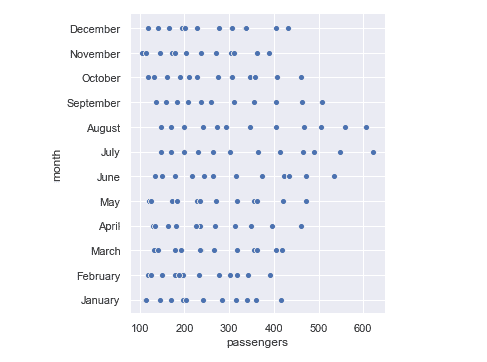
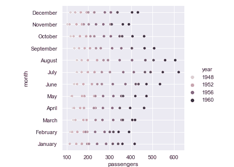
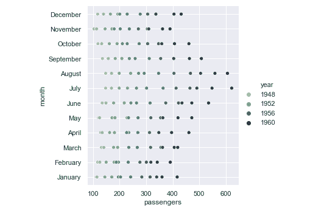
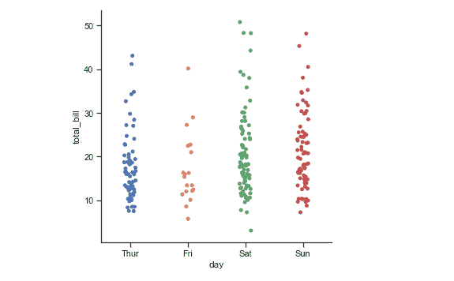
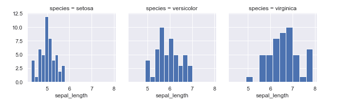
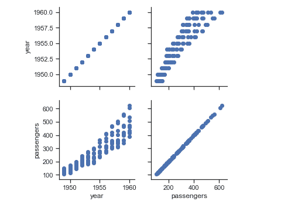
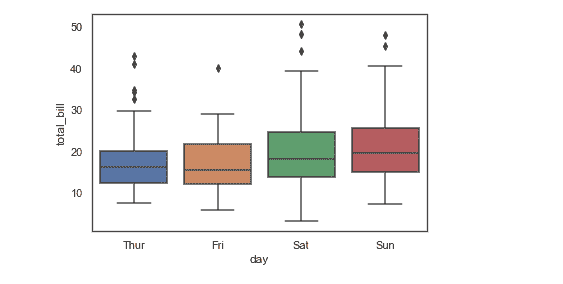
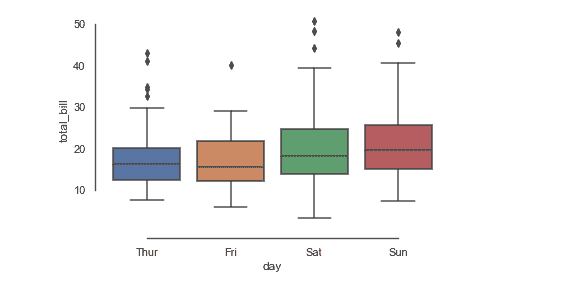

# Python Seaborn 教程:什么是 Seaborn，如何使用？

> 原文：<https://www.edureka.co/blog/python-seaborn-tutorial/>

Python 是许多非常强大的库和框架的仓库。其中， **Seaborn，**是一个占主导地位的**数据可视化**库，为程序员完成 Python 认证提供了又一个理由。在这篇 Python Seaborn 教程中，您将学习使用 Seaborn 进行数据可视化的所有技巧。

在继续之前，让我们浏览一下本文讨论的所有主题:

*   [为什么要用 Seaborn？](#whyuseseaborn)
    *   [python seaborn vs matplot lib](#seabornvsmatplotlib)
*   [如何安装 Seaborn？](#howtoinstall)
*   [安装 Python Seaborn 依赖项](#dependencies)
*   [Seaborn 绘图功能](#functions)
    *   [可视化统计关系](#relationships)
    *   [用分类数据绘图](#categorical)
    *   [可视化数据集的分布](#dataset)
*   [多点网格](#multiplots)
*   [剧情-美学](#aesthetics)
    *   [Python Seaborn 数字美学](#figure)
    *   [Python Seaborn 调色板](#color)

所以，让我们首先从推理出 Python Seaborn 的重要性开始。

## **为什么要用 Python Seaborn？**

如前所述，Python Seaborn 库用于减轻数据可视化的挑战性任务，它基于 [Matplotlib](https://www.edureka.co/blog/python-matplotlib-tutorial/) 。Seaborn 允许通过以下功能创建统计图形:

*   基于数据集的 API 允许在多个[变量](https://www.edureka.co/blog/variables-and-data-types-in-python/)之间进行比较

*   支持多点网格，从而简化复杂的可视化构建

*   可用于比较数据子集的单变量和双变量可视化

*   提供不同的调色板来展示各种各样的图案

*   自动估计和绘制[线性回归](https://www.edureka.co/blog/linear-regression-in-python/)

因此，如果你想知道既然已经有了 Matplotlib，为什么还要使用 Seaborn，这就是答案。

### **python seaborn vs matplot lib:**

*“If Matplotlib “tries to make easy things easy and hard things possible”, seaborn tries to make a well-defined set of hard things easy too” – Michael Waskom (Creator of Seaborn).***Factually, Matplotlib is good but Seaborn is better. There are basically two shortcomings of Matplotlib that Seaborn fixes:

1.  Matplotlib 可以个性化，但很难弄清楚需要什么样的设置才能让情节更有吸引力。另一方面，Seaborn 提供了许多定制主题和高级接口来解决这个问题。

2.  当使用 [Pandas](https://www.edureka.co/blog/python-pandas-tutorial/) 时，Matplotlib 在处理数据帧时表现不佳，而 Seaborn 函数实际上处理的是数据帧。

**如何安装 Seaborn？**

要安装 Python Seaborn 库，可以根据您使用的平台使用以下命令:

*pip 安装 seaborn*

**或**

*康达安装 seaborn*

安装完成后，只需确保安装 seaborn 所依赖的包和库。

## **安装 Python Seaborn 依赖项:**

seaborn 的强制性依赖项包括:

*   [NumPy](https://www.edureka.co/blog/python-numpy-tutorial/)
*   [轨道](https://www.edureka.co/blog/python-numpy-tutorial/)轨道
*   [Matplotlib](https://www.edureka.co/blog/python-matplotlib-tutorial/)
*   熊猫

还有一个推荐的依赖项，即:

*   统计模型

要安装这些库，您可以使用前面为 Seaborn 显示的相同命令以及它们各自的名称。一旦安装，它们可以很容易地导入。Seaborn 允许您使用 **load_dataset()** 函数从 [GIT](https://www.edureka.co/blog/git-tutorial/) 加载任何数据集。也可以使用 get_dataset_names()函数查看所有可用的数据集，如下: **例如:**

```

import seaborn as sns 
sns.get_dataset_names()

```

这将返回所有可用数据集的列表。现在你已经设置好了使用 seaborn 的环境，让我们进一步看看如何在 [Python](https://www.edureka.co/blog/python-programming-language) 中使用它的绘图功能。

## **Seaborn 绘图功能**

### **可视化统计关系:**

了解数据集变量之间的关系以及这些关系如何反过来依赖于其他变量的过程称为统计分析。现在让我们更深入地了解一下为此所需的函数:

#### **relplot():**

这是一个图形级函数，它利用另外两个轴函数来可视化统计关系，这两个轴函数是:

*   散点图()
*   线图()

这些函数可以使用 relplot()的“kind”参数来指定。如果给定了此参数，它将采用默认参数散点图()。在开始编写代码之前，请确保导入所需的库，如下所示:

```

import numpy as np
import pandas as pd
import matplotlib.pyplot as plt
import seaborn as sns
sns.set(style="darkgrid")

```

请注意，样式属性也是可定制的，可以取任何值，如暗格、刻度等，我将在后面的情节美学部分讨论。现在让我们看一个小例子:

**举例:**

```
f = sns.load_dataset("flights")
sns.relplot(x="passengers", y="month", data=f);

```

**输出:**



如您所见，这些点是以二维形式绘制的。但是，您可以使用“色调”语义添加另一个维度。让我们来看一个同样的例子:

**举例:**

```

f = sns.load_dataset("flights")
sns.relplot(x="passengers", y="month", hue="year", data=f);

```

您将看到以下输出:

**输出:**



然而，您可以尝试更多的定制，例如颜色、样式、大小等。让我在下面的例子中展示一下如何改变颜色:

**举例:**

```

sns.set(style="darkgrid")
f = sns.load_dataset("flights")
sns.relplot(x="passengers", y="month", hue="year",palette="ch:r=-.5,l=.75", data=f);

```

**输出:**



#### **线图():**

这个函数允许你为你的数据画一条连续的线。您可以通过如下更改“种类”参数来使用此功能:

**举例:**

```
a=pd.DataFrame({'Day':[1,2,3,4,5,6,7],'Grocery':[30,80,45,23,51,46,76],'Clothes':[13,40,34,23,54,67,98],'Utensils':[12,32,27,56,87,54,34]},index=[1,2,3,4,5,6,7])
g = sns.relplot(x="Day", y="Clothes", kind="line", data=a)
g.fig.autofmt_xdate()

```

**输出:**T3

线形图的默认值是作为 x 的函数的 y。但是，如果您愿意，可以更改它。还有许多选项可供您进一步尝试。

现在让我们看看如何绘制分类数据。

### **用分类数据绘图:**

当我们的主要变量被进一步分成离散的组(分类)时，这种方法就出现了。这可以使用 catplot()函数来实现。

#### **catplot():**

这是一个类似 relplot()的图形级函数。它可以由三个轴级函数族来表征，即:

1.  散点图–包括条带图()、群集图()

2.  分布图–它们是箱线图()、紫线图()、箱线图()

3.  estimate plots–即 pointplot()，barplot()，countplot()

现在让我们举几个例子来说明这一点:

**举例:**

```

import seaborn as sns
import matplotlib.pyplot as plt
sns.set(style="ticks", color_codes=True)
a = sns.load_dataset("tips")
sns.catplot(x="day", y="total_bill", data=a);

```

**输出:**



如你所见，在上面的例子中，我没有设置“kind”参数。因此，它返回的图形是默认的散点图。您可以根据需要指定任何轴级别函数来更改图形。让我们也举一个例子:

**举例:**

```

import seaborn as sns
import matplotlib.pyplot as plt
sns.set(style="ticks", color_codes=True)
a = sns.load_dataset("tips")
sns.catplot(x="day", y="total_bill", kind="violin", data=a);

```

**输出:**T3

以上输出显示了 tips 数据集的 violinplot。现在，让我们尝试找出如何可视化数据集的分布。

### **可视化数据集的分布:**

这基本上涉及到理解单变量或双变量的数据集。在开始之前，只需导入以下内容:

```

import numpy as np
import pandas as pd
import seaborn as sns
import matplotlib.pyplot as plt
from scipy import stats
sns.set(color_codes=True)

```

一旦完成，你可以继续绘制单变量和双变量分布。

**绘制单变量分布:**

要绘制它们，可以使用 distplot()函数，如下所示:

**举例:**

```

a = np.random.normal(loc=5,size=100,scale=2)
sns.distplot(a);

```

**输出:**


正如您在上面的例子中看到的，我们已经为变量 a 绘制了一个图表，它的值是由 normal()函数使用 distplot 生成的。

**绘制二元分布:**

当你有两个随机的独立变量导致一些可能的事件时，这就成了问题。绘制这类图形的最佳函数是 jointplot()。现在让我们使用 jointplot()绘制一个二元图。

**举例:**

```

x=pd.DataFrame({'Day':[1,2,3,4,5,6,7],'Grocery':[30,80,45,23,51,46,76],'Clothes':[13,40,34,23,54,67,98],'Utensils':[12,32,27,56,87,54,34]},index=[1,2,3,4,5,6,7])
y=pd.DataFrame({'Day':[8,9,10,11,12,13,14],'Grocery':[30,80,45,23,51,46,76],'Clothes':[13,40,34,23,54,67,98],'Utensils':[12,32,27,56,87,54,34]},index=[8,9,10,11,12,13,14])
mean, cov = [0, 1], [(1, .5), (.5, 1)]
data = np.random.multivariate_normal(mean, cov, 200)
with sns.axes_style("white"):
sns.jointplot(x=x, y=y, kind="kde", color="b");

```

**输出:**T3

现在您已经理解了 Python Seaborn 中的各种函数，让我们继续构建结构化的多点网格。

## **多点网格:**

Python Seaborn 允许您并排绘制多个网格。这些基本上是使用相同的比例和轴绘制的图或曲线图，以帮助它们之间的比较。反过来，这有助于程序员快速区分这些图，并获得大量信息。

考虑下面的 facetgrid()函数绘制这些图形的例子。

**举例:**

```

sns.set(style="darkgrid")
a = sns.load_dataset("iris")
b = sns.FacetGrid(a, col="species")
b.map(plt.hist, "sepal_length");

```

**输出:**



上面的输出清楚地显示了午餐和晚餐时给出的小费之间的比较。当您有一对要比较的变量时，也可以使用 PairGrid 函数绘图。考虑下面的例子。

**举例:**

```

sns.set(style="ticks")
a = sns.load_dataset("flights")
b = sns.PairGrid(a)
b.map(plt.scatter);

```

**输出:**

正如您所看到的，上面的输出以不同的方式清楚地比较了年份和乘客数量。

Seaborn 还允许关于美学的定制，这将进一步讨论。

## **剧情-美学:**

Python Seaborn 教程的这一部分处理的是如何让我们的情节更加吸引人和令人愉快。

### **蟒蛇皮图-美学:**

我要讨论的第一个函数是 set()。我之前一直在使用这个函数的' style '参数。这个参数主要处理 seaborn 主题。目前，有五种颜色可供选择，分别是深色格子、ticks、白色格子、白色和深色。

考虑下面演示白色主题的例子。

**举例:**

```

import seaborn as sns
import matplotlib.pyplot as plt
sns.set(style="white", color_codes=True)
a = sns.load_dataset("tips")
sns.boxplot(x="day", y="total_bill", data=a);

```

**输出:**



在上面的输出中，您可以注意到主题变成了白色。您也可以使用其他主题进一步探索它们。如果您注意到在前面的输出中，图表中到处都有轴。然而，这也可以使用 despine()函数进行定制。看看下面的例子。

**举例:**

```

import seaborn as sns
import matplotlib.pyplot as plt
sns.set(style="white", color_codes=True)
a = sns.load_dataset("tips")
sns.boxplot(x="day", y="total_bill", data=a);
sns.despine(offset=10, trim=True);

```

**输出:**  注意前面两个输出的区别。然而，你可以自己探索更多的选择。

### **Python Seaborn 调色板:**

颜色基本上是比任何其他特征更接近人眼的特征。Seaborn 允许您使用各种函数来处理颜色，例如 color_palette()、hls_palette()、husl_palette()等。看一看目前在 seaborn 中出现的颜色。

**举例:**

```

import numpy as np
import seaborn as sns
import matplotlib.pyplot as plt
sns.set()

presentcolors = sns.color_palette()
sns.palplot(presentcolors)

```

**输出:**


上图展示了 seaborn 内部的颜色。我已经用 palplot()函数完成了。对于更深层次的变化，可以使用 hls_palette()、husl_palette()等。

这就把我们带到 Python Seaborn 教程的结尾。我希望你已经明白了一切。 ***确保你尽可能多地练习*** 。

*有问题吗？请在这个“Python Seaborn 教程”博客的评论部分提到它，我们会尽快回复您。*

*要深入了解 Python 及其各种应用，您可以注册参加实时 [**Python 在线课程认证**](https://www.edureka.co/python-programming-certification-training) ，该认证提供全天候支持和终身访问。***