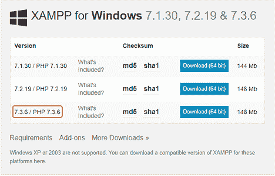
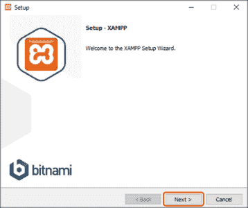
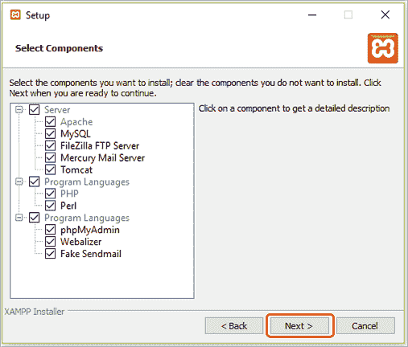
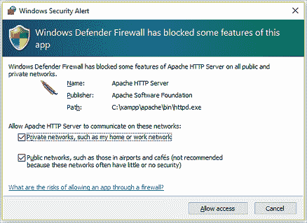
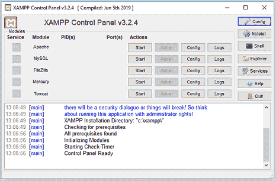

# 如何安装 XAMPP 服务器:终极指南

> 原文：<https://www.edureka.co/blog/install-xampp-server>

如果没有 XAMPP，Web 开发世界就不会是现在这个样子。它是 web 服务器应用程序、数据库、脚本语言的一个捆绑包。那么让我们来看看如何按照以下顺序安装 XAMPP 服务器:

*   [什么是 XAMPP？](#what-is-xampp)
*   [安装 XAMPP 服务器的步骤](#steps)

## 什么是 XAMPP？

*   **X**–跨平台
*   **A**–阿帕奇
*   **M**–Maria db
*   **P**–[PHP](https://www.edureka.co/blog/php-tutorial-for-beginners/)
*   **P**–[Perl](https://www.edureka.co/mastering-perl-scripting-self-paced)

XAMPP 是最好的 Apache 发行版之一，它帮助 web 开发人员创建一个本地 Web 服务器用于测试和部署目的。XAMPP 被设计成安装和运行开发服务器最简单的方式之一。XAMPP 是最完整的包。

## **安装 XAMPP 服务器的步骤**

*   去 [**阿帕奇好友官网**](https://www.apachefriends.org/index.html) 。在这里，您可以选择 Windows、Linux 和 MacOS。

*   为了简单起见，我将它安装在 Windows 系统上。这同样适用于 Linux 和 OS X。接下来，您可以选择**版本**，这取决于您的需求。

*   下载完成后，打开**。exe** 文件。点击 ***下一个*** 。

*   之后，你需要选择你想要安装的**组件**然后点击 ***下一步按钮*** 。

*   你可能会在 Windows 上收到一个安全警告。您可以选择合适的工作，取消不需要的工作。

*   选择你喜欢的语言和中提琴！你完了。您已经成功安装了 XAMPP 服务器。它会打开 ***XAMPP 控制面板，*** 看起来是这样的:

至此，我们结束了这篇关于安装 XAMPP 服务器的文章。我希望这些步骤对您开始 web 开发之旅来说足够清晰。

*成为 Edureka [**认证 PHP & MySQL 专业**](https://www.edureka.co/php-mysql-self-paced) 。一门在线课程，旨在让你成为使用 PHP & MySQL 的专家，并学习使用 PHP & MySQL 创建真实世界的 web 应用程序所需的所有知识。*