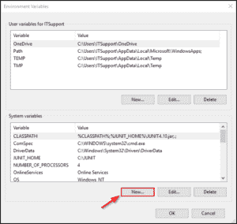
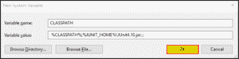
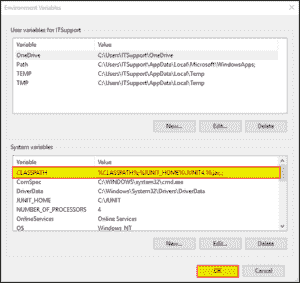
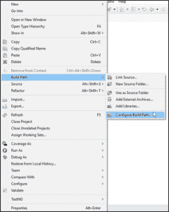
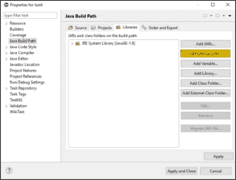
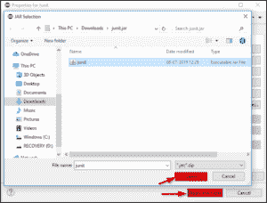
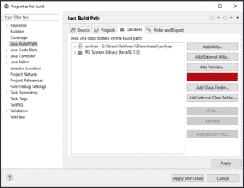
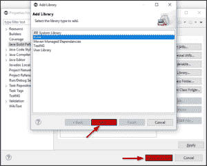
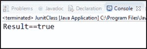

# Junit 教程:初学者完全指南

> 原文：<https://www.edureka.co/blog/junit-tutorial/>

JUnit 是一个针对 [*Java 编程*](https://www.edureka.co/blog/what-is-java/) 语言的测试框架。这对测试驱动的开发很重要。通过这篇 JUnit 教程，我将引导您在 Java 框架测试领域展开翅膀。

我将以这种方式讨论这些主题:

*   [JUnit 是什么？](#What_is_JUnit?)
    *   [优势](#Advantages)
*   [特性](#Features)
*   [JUnit 规则](#JUnit_rules)
*   [JUnit 框架](#The_JUnit_framework)
*   [如何设置 JUnit](#How_to_Set_Up_JUnit)
*   [如何运行一个简单的 JUnit 程序](#How_to_run_a_simple_JUnit_program)
*   [JUnit 注释](#JUnit_annotations)
*   [JUnit 断言语句](#JUnit_Assert_statements)
*   [例外](#Exceptions)
*   [参数化测试](#Parameterized_test)
*   [JUnit vs TestNG](#JUnit_vs_TestNG)

那么，让我们开始吧！

## **JUnit 教程:JUnit 是什么？**

 JUnit 是一个开源的*[Java 单元测试](https://www.edureka.co/blog/what-is-unit-testing)* 框架。这在测试驱动框架的开发中很重要。被认为是 xUnit 架构的一个实例。顾名思义，它用于测试一小块代码或一个单元。

单元测试用于通过创建路径、函数或方法来验证一小块代码。术语“单元”甚至在更早的面向对象时代之前就存在了。它基本上是面向对象系统的自然抽象，即 Java 类或对象(其实例形式)。

JUnit 提倡“先测试，后代码”的思想，强调为一段代码设置测试数据，可以先测试再实现。

### **优势**

*   **JUnit**提供了基于文本的命令行。
*   它还提供了基于 AWT 和 Swing 的图形化测试报告机制。
*   JUnit 是最好的 [*测试框架*](https://www.edureka.co/blog/selenium-framework-data-keyword-hybrid-frameworks) 之一，可以被选择用于高效的测试过程。
*   更多的应用开发者 ide 包括 *JUnit* 。
*   开源社区通过实现一个 JUnitEE 测试框架扩展了 JUnit，使其能够在应用服务器的容器中进行测试。
*   这被世界上许多组织广泛采用，用于在[](https://www.edureka.co/blog/what-is-java/)编程语言中执行单元测试。
*   JUnit 已经成为测试 Java 编程语言的基准，几乎所有的 IDE 都支持它。

## **特性**

*   JUnit 测试允许您更快地编写代码，这提高了质量。
*   它非常简单。它不太复杂，测试应用程序所需的时间也更少。
*   提供注释来识别测试方法。
*   还提供断言来测试预期的结果。
*   它为运行测试提供了测试运行程序。
*   测试可以在 JUnit 上自动运行，它们检查自己的结果并提供即时反馈。真的没有必要手动梳理一份检测结果报告。
*   JUnit 测试可以被组织成包含测试用例的测试套件。
*   这也有助于在一个条中显示测试进度，如果测试运行顺利，它是绿色的，如果测试失败，它会变成红色的。

## **JUnit 教程:** **JUnit 规则**

它注释规则和返回规则的方法。方法必须是公共的，而不是静态的，并且必须返回 TestRule 或 MethodRule 的子类型。

JUnit 4 规则是一个组件，它拦截测试方法调用，并允许您在测试方法运行之前和之后执行一些操作。所有 JUnit 4 规则类都必须实现这个接口 *org.junit.rules.TestRule* 。

1.  向您的测试类添加一个公共字段，并确保该字段的类型是 *TestRule* 的子类型。

2.  用***@规则*** 注释字段。

注意:JUnit 4 要求规则字段是公共的，它们不是静态的，并且是 TestRule 的一个子类型。

**JUnit 5 规则** : 为了处理这个问题，你有几种可能的方法来保持 **JUnit** 4 方式 。可以将@ **规则** 重写为扩展。

## **JUnit 教程:****JUnit 框架**

JUnit 是一个 [*回归测试*](https://www.edureka.co/blog/regression-testing) 框架，使用在 Java 中实现单元测试，加快编程速度，提高代码质量。这个框架还允许快速简单地生成测试数据和测试用例。

单元测试框架提供了这些重要的特性:

*   测试夹具
*   测试套件
*   测试跑步者
*   JUnit 类

### **测试夹具**

**fixture**是一组对象的固定状态，用作运行测试用例的基线。测试夹具的主要目的是确保有一个众所周知的固定环境，在其中运行测试，以便结果是可重复的。

*   setUp()方法，它在每次测试调用之前运行。使用注释@Before。
*   tearDown()方法，它在每个测试方法之后运行。使用注释@After。

让我们用一个例子来理解这一点:

以下代码旨在对一个简单的文件执行两个测试用例。

```
public class TestCaseFile
{
private File output;
output = new File(...);
output.delete();
public void testFile1()
{
//Code to verify Test Case 1
}
output.delete();
output = new File(...);
public void testFile2()
{
//Code to verify Test Case 2
}
output.delete();
}
```

请注意这里的几个问题:

*   代码不可读。
*   维护起来并不容易。
*   当测试套件很复杂时，代码可能包含逻辑问题。

使用 JUnit 比较相同的代码

```
public class TestCaseFile
{
private File output;
@Before public void createOutputFile()
{
output = new File(...);
}
@After public void deleteOutputFile()
{
output.delete();
}
@Test public void testFile1()
{
// code for test case objective
}
@Test public void testFile2()
{
// code for test case objective
}
}
```

代码可读性和可维护性更强。上面的代码结构是一个**文本 fixture。**

### **测试套件**

如果您想要以特定的顺序执行多个测试用例，可以通过将所有的测试用例组合在一个单一的原点中来实现。这个起点被称为**测试套件**。

测试套件捆绑了一些单元测试用例，并一起运行它们。

要运行套件测试，您需要使用下面提到的注释来注释一个类:

1.  @Runwith(Suite.class)
2.  @SuiteClasses(test1.class，test2.class……)或@Suite。SuiteClasses ({test1.class，test2.class……})

### **测试转轮**

测试运行器用于执行测试用例。

JUnit 为测试用例的执行提供了一个工具。

*   JUnitCore 类用于执行测试。
*   由**org . JUnit . runner . JUnit core**提供的名为  **runClasses** 的方法用于运行一个或多个测试用例。
*   这个方法的返回类型是*结果对象*(**org . JUnit . runner . result**)，用于访问关于测试的信息。

### **JUnit 类**

JUnit 类用于编写和测试 JUnit。一些重要的类是:

*   **Assert:** 包含一组 Assert 方法。
*   **TestCase:** 包含一个测试用例，它定义了运行多个测试的 fixture。
*   **TestResult:** 它包含了收集测试用例执行结果的方法。

## **JUnit 教程:** **如何设置 JUnit**

JUnit 是一个 [*测试框架*](https://www.edureka.co/blog/selenium-framework-data-keyword-hybrid-frameworks) ，用于测试基于 Java 的应用。所以在安装 JUnit 之前，您需要在您的机器上配置和验证 java 开发工具包(JDK)。

按照这些步骤完成您的 [Java](https://www.edureka.co/blog/java-tutorial/) 安装。


*   在下一页中，选择“Accept License Agreement”单选按钮，接受它并根据您的匹配系统配置单击“download”链接。

*   现在要交叉检查安装，只需在 cmd–Java-version 中运行以下命令。它应该显示您系统中已安装的 Java 版本。

| 操作系统（Operating System） | 工作 | 命令 |
| Windows 操作系统 | 打开命令控制台/ cmd | c:> java 版本 |
| Linux 操作系统 | 打开命令终端/cmd | $ java 版本 |
| 苹果个人计算机 | 开放终端 | 机器:~ John $ Java-版本 |

*   下载完成后，您可以运行安装程序，并按照屏幕指示进行操作。



接下来，单击 New 并添加变量和值。


1.  提供变量名为“ *JUNIT_HOME* ”。
2.  另外，提供 JUnit 值作为复制 JUnit jar 文件的路径。
3.  点击确定。

它将用给定的名称和值创建一个新的系统变量。

创建 JUNIT_HOME 之后，创建另一个名为 CLASSPATH 的变量。遵循以下步骤:

在这一步中，将 JUNIT_HOME 指向  JUnit.jar ，它位于 JUNIT 文件夹中，如下所示:

1.  变量名:JUNIT_HOME
2.  变量值:% CLASSPATH %% JUNIT _ HOME % JUnit4.10.jar。；
3.  点击确定按钮。



一旦您点击了' **OK** 按钮，您就可以确认在系统变量下可以看到一个名为“ *CLASSPATH* 的新环境变量。



### **安装 Eclipse IDE**

请参考 *[这个](https://www.edureka.co/blog/setup-eclipse-ide/)* 在您的系统上下载 Eclipse IDE。

### **如何在 Eclipse 中安装 JUnit jar 文件**

1.  右键单击该项目。
2.  点击“构建路径”。
3.  单击“配置构建路径”。



添加您已经下载的外部 JUnit jar 文件。





并按照以下方法将 JUnit 库添加到您的项目中:



然后找到 JUnit 并点击它。



现在您已经了解了如何在您的系统上设置 JUnit，让我们继续学习如何编写一个简单的 JUnit 程序。

## **JUnit 教程:** **如何运行一个简单的 JUnit 程序**

*   右键单击 src 文件夹来创建一个新的包。
*   右键单击该包以创建一个新类。
*   开始编写这个类中的代码。

为了让您了解如何编写 JUnit 程序，我将创建两个类。

第一个类提供简单的 assert 语句来验证 JUnit 设置。

```

package Edureka;
import org.junit.Test;
import static org.junit.Assert.assertEquals;
public class Java {
@Test
public void testSetup() {
String str= "I know to set up JUnit on my system";
assertEquals("I know to set up JUnit on my system",str);
}
}
```

接下来，我将创建另一个类来执行上面的测试。

```

package Edureka;

import org.junit.runner.JUnitCore;
import org.junit.runner.Result;
import org.junit.runner.notification.Failure;

public class JunitClass {
public static void main(String[] args) {
Result result = JUnitCore.runClasses(Java.class);
for (Failure failure : result.getFailures()) {
System.out.println(failure.toString());
}
System.out.println("Result=="+result.wasSuccessful());
}
}

```

输出:



现在你已经学会了如何编写一个简单的 JUnit 程序，让我们来理解一下在 JUnit 中*断言*语句是如何工作的。

## **JUnit 教程:** **JUnit 注解**

JUnit 框架建立在**注解**T3 之上。注释是一种特殊形式的语法元数据，可以添加到 java 源代码中以提高代码可读性。这些注释提供了以下关于测试方法的信息:

*   将在测试方法之前和之后运行的方法。
*   在所有方法之前和之后运行的方法。
*   在执行过程中将被忽略的方法或类。

以下是注释列表及其在 JUnit 中的含义:

| 高级编号 | 释文 | 描述 |
| one | @测试 | *Test* 注释告诉 JUnit 公共 void 方法可以作为测试用例运行。 |
| Two | @以前 | 用@Before 注释公共 void 方法会导致该方法在每个*测试*方法之前运行。 |
| three | @之后 | 如果在 Before 方法中分配外部资源，则需要在测试运行后释放它们。在后用*@注释该方法会导致该方法在测试方法之后运行。* |
| four | @BeforeClass | 用@BeforeClass 注释公共静态 void 方法会导致它在类中的任何测试方法之前运行一次。 |
| five | @课后 | 这将在所有测试运行后执行该方法。这可用于执行清理活动。 |
| six | @忽略 | Ignore 注释用于忽略测试，该测试将不会被执行。 |

## **JUnit 教程:** **JUnit 断言语句**

断言是一种用于确定测试用例的*通过*或*失败*状态的方法。在 JUnit 中，所有的断言都在 Assert 类中。这个类提供了一组对编写测试有用的断言方法。只记录失败的断言。

| 高级编号 | 方法 | 描述 |
| one | **void assertEquals(布尔型预期值，布尔型实际值)** | 检查两个基本体/对象是否相等。 |
| Two | **void assertTrue(布尔条件)** | 检查条件是否为真。 |
| three | **void assertFalse(布尔条件)** | 检查条件是否为假。 |
| four | **void assertNotNull(Object Object)** | 检查对象是否不为空。 |
| five | **void assert null(Object Object)** | 检查对象是否为空。 |
| six | **void assertSame(object1，object2)** | assertSame()方法测试两个对象引用是否指向同一个对象。 |
| seven | **void assertNotSame(object1，object2)** | assertNotSame()方法测试两个对象引用是否没有指向同一个对象。 |
| eight | **void assertArrayEquals(expected array，resultArray)** | assertArrayEquals()方法将测试两个数组是否相等。 |

我们来看一个例子:

```
import org.junit.Test;
import static org.junit.Assert.*;
public class TestAssertions
{
@Test public void testAssertions()
{
//test data
String str1 = new String ("edu");
String str2 = new String ("edu");
String str3 = null;
String str4 = "edu";
String str5 = "edu";
int val1 = 5;
int val2 = 6;
String[] expectedArray = {"one", "two", "three"};
String[] resultArray = {"one", "two", "three"};
//Check that two objects are equal
assertEquals(str1, str2);
//Check that a condition is true
assertTrue (val1 &amp;lt; val2);
//Check that a condition is false
assertFalse(val1 &amp;gt; val2);
//Check that an object isn't null
assertNotNull(str1);
//Check that an object is null
assertNull(str3);
//Check if two object references point to the same object
assertSame(str4,str5);
//Check if two object references not point to the same object
assertNotSame(str1,str3);
//Check whether two arrays are equal to each other.
assertArrayEquals(expectedArray, resultArray);
}
}
```

现在，编写另一个程序来帮助执行测试。

```
 import org.junit.runner.JUnitCore;
import org.junit.runner.Result;
import org.junit.runner.notification.Failure;
public class TestRunner()
{
public static void main(String[] args)
{
Result result = JUnitCore.runClasses(TestAssertions.class);
for (Failure failure : result.getFailures())
{
System.out.println(failure.toString());
}
System.out.println(result.wasSuccessful());
}
} 
```

输出是:true

现在，让我们来看看流程执行过程中发生的异常。

## **JUnit 教程:** **例外**

JUnit 提供了跟踪代码中出现的异常的选项。您可以测试代码是否抛出所需的异常。预期参数与@ *测试*注释一起使用。

当测试一个 异常时，你需要确保你在 **@** *测试*注释的可选参数中提供的异常类是相同的。这是因为您期望从您正在测试的方法中得到一个异常， 否则您的 JUnit 测试将会失败。

例如:@ Test(expected = illegalargumentexception . class)

通过使用“expected”参数，您可以指定测试可能抛出的异常名称。在上面的示例中，您使用了“IllegalArgumentException ”,如果开发人员使用了不允许的参数，测试将会抛出该异常。

让我们来理解 JUnit 中的参数化测试。

## **JUnit 教程:** **参数化测试**

*JUnit 4* 推出了一个叫做 **P** **参数化测试** 的新功能。该测试允许开发人员使用不同的值反复运行相同的测试。为了创建一个参数化的测试，您必须遵循这些步骤。

*   用 *@RunWith 注释测试类。*这表明它是一个参数化的测试。
*   创建一个用 *@Parameters* 注释的公共静态方法，该方法以数组的形式返回一组对象作为测试数据集。
*   创建一个公共构造函数，它接受相当于一行*测试数据的内容。*
*   为测试数据的每一个*列*创建一个实例变量。
*   使用这些实例变量作为测试数据的来源来创建您的测试用例。

让我们看一个例子。

```
import java.util.Arrays;
import java.util.Collection;
import org.junit.Test;
import org.junit.Before;
import org.junit.runners.Parameterized;
import org.junit.runners.Parameterized.Parameters;
import org.junit.runner.RunWith;
import static org.junit.Assert.assertEquals;
@RunWith(Parameterized.class)
public class PrimeNumber
{
private Integer i;
private Boolean expectedResult;
private PrimeNumberChecker primeNumberChecker;
@Before public void initialize()
{
primeNumberChecker = new PrimeNumberChecker();
}
// Each parameter should be placed as an argument here
// Every time runner triggers, it will pass the arguments
// from parameters we defined in primeNumbers() method
public PrimeNumberCheckerTest(Integer i, Boolean expectedResult)
{
this.i= i;
this.expectedResult = expectedResult;
}
@Parameterized.Parameters
public static Collection primeNumbers()
{
return Arrays.asList(new Object[][]
{
{ 2, true },
{ 6, false },
{ 19, true },
{ 22, false },
{ 23, true }
}
);
}
// This test will run 4 times since we have 5 parameters defined
@Test public void PrimeNumberCheckerTest()
{
System.out.println("Parameterized Number is : " + i);
assertEquals(expectedResult, primeNumberChecker.validate(i));
}
} 
```

创建另一个类 TestRunner 来编译程序。

```
 import org.junit.runner.JUnitCore;
import org.junit.runner.Result;
import org.junit.runner.notification.Failure;
public class Runner
{
public static void main(String[] args)
{
Result result = JUnitCore.runClasses(PrimeNumberCheckerTest.class);
for (Failure failure : result.getFailures())
{
System.out.println(failure.toString());
}
System.out.println(result.wasSuccessful());
}
} 
```

输出是:参数化数是:2 参数化数是:6 参数化数是:19 参数化数是:22 参数化数是:23 真

让我们来理解一下这次讨论的最后一个话题， JUnit vs TestNG。

## **JUnit 教程:** **JUnit vs TestNG**

TestNG 和 JUnit，当你谈论软件测试框架时，这两个都是众所周知的术语。除了某些功能之外，TestNG 与 JUnit 几乎相似，我将根据它们的特性来比较 JUnit 和 TestNG。

| **特性** | **JUnit** | **测试** |
| 套件测试 | 是 | 是 |
| 注释支持 | 是 | 是 |
| 忽略测试 | @忽略 | @Test(enable=false) |
| 套件中所有测试之前和之后的执行 | 不 | @BeforeSuite，@AfterSuite，@ BeforTest，@ AfterTest |
| 依赖性测试 | 不 | 是 |
| 参数化测试 | @RunWith 和@Parameter |    @DataProvider |

说到这里，我们来结束“*【JUnit 教程】的博客。我希望你们喜欢这篇文章，并且理解为什么 JUnit 在测试 Java 框架中扮演着重要的角色。*

*现在您已经了解了 JUnit 的工作原理，请查看 Edureka 提供的  [**软件测试认证课程**](https://www.edureka.co/software-testing-certification-courses) ，edu reka 是一家值得信赖的在线学习公司，在全球拥有超过 650，000 名满意的学习者。本课程旨在向您介绍完整的 Selenium 特性及其在软件测试中的重要性。*

有问题要问我们吗？请在“JUnit 教程”的评论部分提到它，我们会回复您。